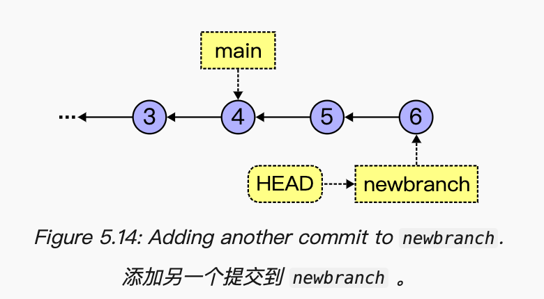

# Git 命令大全

|命令|说明|修饰符|
|---|---|---|
|`git clone <branch>`|克隆远程仓库||
|`git remote`|查看远程仓库|1. `-v`：查看连接的远程仓库<br>2. `add <alias> <remote>`：添加远程仓库<br>3. `set-url <alias> <remote>`：修改远程仓库地址|
|`git status`|查看 Git 状态信息||
|`git add <file>`|上传暂存区|1. `.`：所有文件|
|`git restore --staged <file>`|移出暂存区||
|`git commit`|提交更改|1. `-m <message>`：提交信息|
|`git revert`|撤销提交|1. `<commit>`：撤销指定提交<br>2. `--continue`：继续下一个提交<br>3. `--skip`：跳过撤销本次提交<br>4. `--abort`：退出撤销<br>5. `-n`：合并多个撤销提交|
|`git push <remote> <branch>`|推送远程仓库|1. `-f`：强制推送<br>2. `--set-upstream`、`-u`：推送且追踪<br>3. `--delete`：删除远程分支<br>4. `-u`：推送指定远程仓库|
|`git log`|查看 Git 日志|1. `-- <file>`：查看指定文件的日志|
|`git reflog`|查看参考日志||
|`git switch <branch>`<br>|切换分支|1. `-c <branch>`：创建并切换分支<br>2. `-- track <remote>/<branch>`：关联远程分支<br>3. `-`: 返回上一分支<br>4. `--detach <commit>`：分离头指针<br>5. `-f <branch>`、`--force <branch>`：强制切换|
|`git branch`|列出分支|1. default：列出分支<br>2. `-avv`：列出分支（远程\+详情）<br>3. `-d <branch>`：删除分支<br>4. `-dr <remote>/<branch>`：删除远程跟踪分支|
|`git merge <branch>`|合并分支||
|`git fetch <alias>`|获取远程更改|1. `--prune default/<remote>/--all`：删除不存在的远程跟踪分支|
|`git pull`|拉取远程更改|1. default：拉取所有分支更改<br>2. `<alias> <branch>`：拉取指定分支更改<br>3. `--rebase`：变基拉取<br>4. `--no-rebase`：合并拉取|
|`git rm`|删除并暂存文件|1. default：删除并暂存文件<br>2. `--cached`：取消跟踪文件|
|`git diff`|对比工作树与暂存区|1. default：对比工作树与暂存区<br>2. `--staged`：对比暂存区与上一次提交<br>3. `<hash>/<branch> <hash>/<branch>`：对比两次提交<br>4. `-U<line>`：展示更多上下文（默认 3 行）<br>5. `--name-only`：仅展示文件名<br>6. `-w`、`--ignore-all-space`：忽略空白字符<br>7. `<branch1> <branch2> -- <file>`：限制对比文件<br>8. `<branch1> <branch2>`：对比分支当前状态<br>9. `<branch1>...<branch2>`：展示 branch2 有而 branch1 没有（提交）的更改|
|`git mv <file> <newFile>`|重命名文件||
|`git config`|配置 Git|1. `pull.rebase true`：变基拉取<br>2. `--global`：全局配置|
|`git reset <commit>/<file>`|重置提交|1. `--soft`：软重置<br>2. `--mixed`：混合重置<br>3. `--hard`：硬重置<br>4. `-p`：选择性重置|
|`git rebase <branch>/<commit>`|变基分支|1. `-i <commit>`：变基提交<br>2. `--abort`：忽略当前变基<br>3. `--continue`：继续当前变基|
|`git stash`<br>|暂存更改|1. default：暂存更改<br>2. `list`：展示暂存栈列表<br>3. `pop`：弹出栈顶更改<br>4. `pop {stash}`：弹出指定更改<br>5. `drop`：删除栈顶更改<br>6. `drop {stash}`：删除指定更改|

# Git 基础

## 什么是 Git？

Git 是一种**源代码控制系统**，也称为**版本控制系统**。

Git 的主要任务是**记录特定目录树中所有源代码当前状态的****快照**。快照是特定时间点所有跟踪文件的当前状态。

> 例如：如果你想知道上周三你的源代码是什么样子，你可以回到过去查看。
> 
> 

意思是，您将对某些内容进行修改（例如实现一个功能），然后当功能准备就绪时，将这些更改提交到源代码仓库（仓库）。这会将更改保存到仓库中，并允许其他协作人员查看它们。

如果你不小心更改了不想改的内容，或者想查看过去是如何实现某个功能的，你总是可以查看之前的提交并查看一下。

Git 保存了你所有提交的历史记录。如果你不小心删除了一堆代码，你可以查看之前的提交并将它们全部恢复。

但是，这还不算完！正如我们将看到的，Git 还可以作为远程备份机制，并且在与同一代码库的团队合作时表现得非常出色。

## 什么是 GitHub？

GitHub 是一个提供许多 Git 功能前端以及一些特定于 GitHub 的附加功能的网站。

它还为您提供了远程存储库，作为备份使用。

无论你在 GitHub 上拥有多少仓库，你也会在你的本地系统上拥有这些仓库的副本（称为克隆），以便进行工作。在常见的流程中，你将定期将你的仓库克隆与 GitHub 同步。

## 最基本的 Git 工作流程

这是一个非常常见的流程，您会反复使用：

1. 克隆远程仓库。

    > 远程仓库通常位于 GitHub 上，但不一定如此。
    > 
    > 

2. 在您的本地工作树中进行一些更改，项目文件位于您的计算机上。

3. 将那些更改添加到暂存区（也称为索引）。

4. 提交这些更改。

5. 将您的提交推送到远程仓库。

6. 返回步骤 2。

## 什么是克隆？

Git 是一种被称为分布式版本控制系统的工具。这意味着，与许多版本控制系统不同，数据没有中央权威机构。（尽管通常 Git 用户在这一点上会像 GitHub 这样的网站，但只是松散地处理。）

Git 有仓库的克隆。这些是整个仓库提交历史的完整、独立副本。任何克隆都可以从任何其他克隆中重新创建。它们之间没有哪个比另一个更强大。

回顾上述最基础的 Git 工作流程，我们看到第一步是克隆一个现有仓库。

如果您是从 GitHub 进行操作，这意味着您正在创建一个现有 GitHub 仓库的本地副本。

克隆操作通常是一个一次性过程（尽管你可以创建任意多个）。

## 克隆如何交互？

在您完成克隆后，您通常会使用两个主要操作：

- 推送：这会将您的本地提交上传到远程仓库。

- 拉取：这会将远程提交下载到您的本地仓库。

幕后进行着一个称为合并的过程。

## 实际 Git 使用

### 步骤 0：一次性设置

在开始使用 Git 之前，你应该告诉它你的姓名和电子邮件地址。这些信息将被附加到你提交到仓库的提交中。

您可以在未来任何时候更改它们，甚至可以按仓库设置它们。但就目前而言，让我们全局设置它们，这样 Git 在您提交时就不会报错了。

只需这样做一次，然后永远生效（除非你想修改）。

在命令行中输入这两行，填写适当的信息。

```Bash
git config set --global user.name "Your Name"
git config set --global user.email "your-email@example.com"
```

> 如果您在上述命令中遇到错误，可能您正在运行较旧的 Git 版本。再次尝试，但请省略单词 `set` 。或者，更好的办法是看看您是否能获取到 Git 的新版本。
> 
> 

> 如果您将来需要更改它们，只需再次运行这些命令即可。
> 
> 

最后，让我们设置默认分支名称。现在解释这个含义还为时尚早，但让我们运行这个命令并将名称设置为 `main` 。这将防止 Git 在您创建仓库时报错。

```Bash
git config set --global init.defaultBranch main
```

### 步骤 1：克隆现有仓库

切换到您想要创建克隆的子目录。此命令将在其中创建一个新的子目录，用于存放所有仓库文件。

```Bash
git clone https://github.com/beejjorgensen/git-example-repo.git
```

您应该会看到类似以下输出：

```Bash
Cloning into 'git-example-repo'...
remote: Enumerating objects: 10, done.
remote: Counting objects: 100% (10/10), done.
remote: Compressing objects: 100% (8/8), done.
remote: Total 10 (delta 2), reused 9 (delta 1), pack-reused 0 (from 0)
Receiving objects: 100% (10/10), done.
Resolving deltas: 100% (2/2), done.
```

> 目录 `.git` 有特殊含义；它是 Git 存储所有元数据和提交的目录。您可以查看它，但不必这么做。如果您查看，请不要更改任何内容。使目录成为 Git 仓库的唯一因素是其中存在一个有效的 `.git` 目录。
> 
> 

让我们询问 Git 当前本地仓库的状态是什么：

```Bash
git status
```

输出如下内容：

```Bash
On branch main
Your branch is up to date with 'origin/main'.

nothing to commit, working tree clean
```

> 这告诉我们两个信息：
> 
> 1. 当前本地在 main 分支。
> 
> 2. 本地 main 分支与远程 origin/main 分支保持最新。
> 
> 

`origin` 是我们从其克隆的远程仓库的别名，因此 `origin/main` 对应于“从您最初克隆的仓库上的分支 `main`”。

### 步骤 2：进行一些本地更改

### 步骤 3：将更改添加到暂存区

运行 `git status` 查看 Git 状态信息：

```Bash
no changes added to commit (use "git add" and/or "git commit -a")
```

> 它建议 `git add` 将内容添加到暂存区。
> 
> 

因此，我们需要首先将其添加到暂存区，以便我们可以进行提交。

```Bash
git add .
```

运行 `git status` 查看 Git 状态信息：

```Bash
On branch main
Your branch is up to date with 'origin/main'.

Changes to be committed:
  (use "git restore --staged <file>..." to unstage)
    modified:   index.html
```

> 现在它已经从“未暂存的变更”变为“待提交的变更”，所以我们已经成功将 `index.html` 复制到了暂存区！
> 
> 

> 假设你意外地将它添加到了暂存区，然后你改变了主意，不想在最终提交中包含它。你可以运行：
> 
> ```Bash
> git restore --staged index.html
> ```
> 
> 并且这将将其变回“未暂存以供提交”状态。
> 
> 

### 步骤 4：提交这些更改

现在我们已经将某些内容复制到了暂存区，我们可以进行提交。

```Bash
git commit -m "commit message"
```

运行 `git status` 查看 Git 状态信息：

```Bash
On branch main
Your branch is ahead of 'origin/main' by 1 commit.
  (use "git push" to publish your local commits)
  
nothing to commit, working tree clean
```

> “nothing to commit, working tree clean”表示我们分支上没有本地更改。
> 
> 

> 实际上这里有一个可选的快捷方式。如果你修改了一个文件，你只需在命令行中指定它的名字，就可以直接提交它（而不需要将其添加到暂存区！）
> 
> ```Bash
> git commit -m "commit message" index.html
> ```
> 
> 您可以在这里指定多个文件，或一个目录。此外，这不会影响已经放入暂存区的文件。
> 
> 

### 步骤 5：将您的更改推送到远程仓库

让我们将本地更改推送到远程仓库：

```Bash
git push
```

# Git 日志和 `HEAD`

当我们向 Git 仓库提交时，它会记录下每一次提交的日志，您可以访问这些日志。现在让我们看看吧。

## 一个示例日志

您可以通过输入 `git log` 来获取提交日志。

让我们假设我处于一个只有一个提交的仓库中，我刚刚添加了一个文件，提交信息为“Added”。输出内容如下：

```Bash
commit 5a02fede3007edf55d18e2f9ee3e57979535e8f2 (HEAD -> main)
Author: User Name <user@example.com>
Date:   Thu Feb 1 09:24:52 2024 -0800

  Added
```

如果再次提交，日志会变得更长：

```Bash
commit 5e8cb52cb813a371a11f75050ac2d7b9e15e4751 (HEAD -> main)
Author: User Name <user@example.com>
Date:   Thu Feb 1 12:36:13 2024 -0800

  More output
  
commit 5a02fede3007edf55d18e2f9ee3e57979535e8f2
Author: User Name <user@example.com>
Date:   Thu Feb 1 09:24:52 2024 -0800

  Added
```

请注意，最新的提交条目位于输出顶部。

## 日志中有什么？

日志中需要注意几点：

- 提交注释

- 日期

- 提交的用户

此外，我们还有单词后面的巨大十六进制数字，这是**提交 ID** 或**提交哈希**，一个可以用来识别特定提交的全局唯一数字。

通常你不需要知道这些，但这对回顾历史或跟踪多开发者项目中的提交可能会有用。

## 引用 `HEAD`

我们已看到每个提交都有一个独特且难以记忆的标识符，例如这样：5a02fede3007edf55d18e2f9ee3e57979535e8f2。

`HEAD` 是这些引用之一。它指示了你当前在项目子目录中查看的是哪个分支或提交。记得我们说过你可以查看之前的提交吗？查看它们的方式就是将 `HEAD` 移动到它们上。

> **我们还没有讨论分支，但 ****`HEAD`**** 通常指的是一个分支。默认情况下，它是 ****`main`**** 分支。**但由于我们提前了，我将继续说 `HEAD` 指的是一个提交，尽管它通常是通过分支间接完成的。
> 
> 

一些术语：你现在正在查看的 Git 子目录以及其中的所有文件统称为你的工作树。工作树是指指向 `HEAD` 所指向的提交的文件，以及你可能做出的任何未提交的更改。

所以，如果你将 `HEAD` 切换到另一个提交，你的工作树中的文件将被更新以反映这一点。

我们怎么知道 `HEAD` 引用的是哪个提交？嗯，它就在日志的顶部：

```Bash
commit 5e8cb52cb813a371a11f75050ac2d7b9e15e4751 (HEAD -> main)
Author: User Name <user@example.com>
Date:   Thu Feb 1 12:36:13 2024 -0800

  More output
```

我们在第一行看到 `HEAD` ，表示 `HEAD` 引用的是带 ID 的提交

`HEAD -> main` 表示 `HEAD` 实际上是指 `main` 分支，而 `main` 指的是提交。因此， `HEAD` 是间接地指代提交。

## 回到过去和分离状态 `HEAD`

这里是完整的 Git 日志：

```Bash
commit 5e8cb52cb813a371a11f75050ac2d7b9e15e4751 (HEAD -> main)
Author: User Name <user@example.com>
Date:   Thu Feb 1 12:36:13 2024 -0800

  More output

commit 5a02fede3007edf55d18e2f9ee3e57979535e8f2
Author: User Name <user@example.com>
Date:   Thu Feb 1 09:24:52 2024 -0800

  Added
```

如果我看文件，我会看到“More output”提交的更改。但假设我想回到上一个提交，看看那时文件是什么样子。我该如何做呢？

> 例如：可能有一些在早期提交中存在的变更后来被移除了，您可能想查看它们。
> 
> 

我可以使用 `git switch` 命令来实现这一点。

> 在切换分支之前，你应该使用 `git status` 确认一切都很干净。如果你还没有，请在切换之前提交或暂存你的内容。
> 
> 

```Bash
git switch --detach 5a02fede3007edf55d18e2f9ee3e57979535e8f2
// or，至少 4 位唯一的 id 数字
git switch --detach 5a02
```

输出内容为：

```Bash
HEAD is now at 5a02fed
```

然后用 `git log` 查看 Git 日志：

```Bash
commit 5a02fede3007edf55d18e2f9ee3e57979535e8f2 (HEAD)
Author: User Name <user@example.com>
Date:   Thu Feb 1 09:24:52 2024 -0800

  Added
```

此时，第二个提交就消失了，因为在第一个提交的时间点还没有第二个提交，此时 `HEAD` 并没有指向 `main`，因为`main`分支仍在查看最新的提交。

此外，这意味着 `HEAD` 已不再与 `main` 相关联。我们称这种状态为**分离头**。 `git switch` 不会让你这样做除非你真的想，这就是为什么我们那里有 `--detach` 的原因。（重新关联也很简单：只需切换到你想要关联的分支即可。）

让我们将 `HEAD` 重新附加到 `main` 分支。有两种选择：

1. `git switch -`：这将切换到我们之前的位置，在这个例子中，是 `main`。

2. `git switch main`：这明确切换到 `main`。

现在如果我们 `git log` ，我们再次看到所有更改：

```Bash
commit 5e8cb52cb813a371a11f75050ac2d7b9e15e4751 (HEAD -> main)
Author: User Name <user@example.com>
Date:   Thu Feb 1 12:36:13 2024 -0800
  
  More output

commit 5a02fede3007edf55d18e2f9ee3e57979535e8f2
Author: User Name <user@example.com>
Date:   Thu Feb 1 09:24:52 2024 -0800

  Added
```

我们的工作树将被更新以显示在 `main` 提交中的文件状态。

并且你看到 `HEAD -> main` 吗？箭头表示 `HEAD` 已重新连接到 `main`。（如果 `HEAD` 在与 `main` 相同的提交中分离，你会看到 `HEAD -> main`）

## 旧命令：`git checkout`

在 `git switch` 出现之前，有一个命令可以完成所有这些操作，叫做 `git checkout`。`git checkout` 做了很多事情，现在仍然在做。因为它做了这么多，Git 的维护者一直在尝试将其中一些功能拆分到 `git switch` 和其他命令中。

> 如何你的 Git 版本不支持 `git switch` 则可以使用 `git checkout`。
> 
> 

让我们通过只使用 `git checkout` 而不是 `git switch` 来重做前面的部分：

```Bash
git checkout 5a02
```

输出内容：

```Bash
Note: switching to '5a02fede3007edf55d18e2f9ee3e57979535e8f2'.

You are in 'detached HEAD' state. You can look around, make experimentalchanges and commit them, and you can discard any commits you make in thisstate without impacting any branches by switching back to a branch.

If you want to create a new branch to retain commits you create, you maydo so (now or later) by using -c with the switch command. Example:

  git switch -c <new-branch-name>
  
Or undo this operation with:

  git switch -

Turn off this advice by setting config variable advice.detachedHead to false

HEAD is now at 5a02fed Added
```

可以使用以下命令回到 `main` 分支：

```Bash
git checkout main
```

## 相对于 `HEAD` 的提交

有一些快捷方式可以访问比 `HEAD` 更早的提交，比如，“我想切换到这个提交之前的第 3 个提交。”

```Bash
git switch --detach HEAD
```

这会将 `HEAD` 移动到 `HEAD` 的位置。也就是说，它没有移动它（尽管它确实有将其从分支上分离的效果）。

但是，如果我想移动到 `HEAD` 现在所在提交之前的那个提交，你可以使用这样的尖角符号表示法来完成：

```Bash
git switch --detach HEAD^
```

这会将您带到上一个提交。

如果您想回到第三上一次的提交？您可以添加更多的光标！

```Bash
git switch --detach HEAD^^^
```

或者第 10 次之前的提交！

```Bash
git switch --detach HEAD^^^^^^^^^^
```

输入所有这些箭头符号太过麻烦。幸运的是，我们还有另一个带有波浪线符号的缩写可用。以下两行是等价的：

```Bash
git switch --detach HEAD^^^
git switch --detach HEAD~3
```

# 分支与快进合并

## 分支是什么？

一个分支就像是一张贴在特定提交上的标签。你可以通过各种 Git 操作来移动这个标签。

Git 提供了更强大的功能，允许您（或协作伙伴）同时追求多个分支。


因此，可能会有多个协作者在同一时间工作在这个项目上。

然后，当你准备好时，你可以将这些分支合并在一起。在图 5\.4 中，我们将提交 6 和 7 合并到一个新的提交中，即提交 9。提交 9 包含了提交 7 和 6 的更改。


在这种情况下， `somebranch` 和 `anotherbranch` 都指向同一个提交。这没有问题。

> 我实际上有点简化了这个过程。当你将一个分支合并到另一个分支时，实际上只有你合并到的分支会移动，而不是两个分支。所以为了使两个分支指向同一个提交，你需要进行两次合并：将 `somebranch` 合并到 `anotherbranch` ，然后是 `anotherbranch` 合并到 `somebranch` 。（或者反过来也可以。）然后它们就会指向同一个提交。
> 
> 

然后我们可以继续合并，直到所有分支都指向同一个提交（图 5\.5）。


也许在所有这些之后，我们决定删除 `somebranch` 和 `anotherbranch` ；我们可以安全地这样做，因为它们已经完全合并，而且这样做不会影响 `main` 或任何提交（图 5\.6）。

## 关于 `git pull` 的简要说明

当你执行拉取操作时，实际上它做了两件事：\(a\) 从远程仓库获取所有更改，\(b\) 合并这些更改。

如果两个人或更多人向同一分支提交，最终 `git pull` 将不得不进行合并。而且实际上有几种方法可以实现这一点。

现在，我们将告诉 `git pull` 始终以经典方式合并分歧分支，您可以使用以下一次性命令来完成：

```Bash
git config set --global pull.rebase false
```

如果你不这样做，Git 首次在拉取时合并时会出现一个错误信息。那时你就必须这样做。（如果命令在旧版 Git 上失败，请从该命令中省略单词 `set` 。）

当我们后面讨论变基时，这会更有意义。

## `HEAD` 和分支

在正常使用中， `HEAD` 指向一个分支，而不是一个提交。只有在分离头状态时， `HEAD` 才直接指向一个提交（即当它与所有分支都分离时）。

如果我们查看图 5\.7，我们看到 `HEAD` 正常指向一个分支。


但是，如果我们检出没有分支的早期提交，我们就会进入分离头状态，看起来就像图 5\.8 所示。


截至目前，我们一直在 `main` 分支上提交 commit，甚至没有真正考虑过分支。回想一下， `main` 分支只是对特定 commit 的一个标签， `main` 分支是如何知道要“跟随”我们的 `HEAD` 从 commit 到 commit 的呢？

它这样做： `HEAD` 指向的分支跟随当前提交。也就是说，当你进行提交时， `HEAD` 指向的分支会移动到下一个提交。

如果我们回到图 5\.7，当时 `HEAD` 指向 `main` 分支，我们再提交一次就可以到达图 5\.9。


与图 5\.8 中的分离头状态形成对比。如果我们处于那里，一个新的提交将带我们到图 5\.10，而 `main` 保持不变。


## 列出所有分支

```Bash
git branch
```

输出内容：

```Bash
* main
```

表示只有一个 `main` 分支，`*` 表示当前分支。

如果创建一个名为 `foobranch` 的新分支并切换到该分支，我会看到这个：

```Bash
* foobranch
  main
```

如果我现在断开 `HEAD` ，我就会到这里：

```Bash
* (HEAD detached at 10b6242)
  foobranch
  main
```

## 创建分支

最常见创建新分支的方式是：

1. 切换到您想要创建新分支的提交或分支。

2. 创建新分支并切换 `HEAD` 以指向新分支。

使用 `git switch -c newbranch` ，我们创建并切换到 `newbranch` ，这样就到达了图 5\.12。


## 合并：快速前进

将两个分支合并回同步状态称为合并。

您所在的分支是您要引入其他更改的分支。也就是说，如果您在分支 A 上，并告诉 git“合并分支 B”，分支 B 的更改将被应用到分支 A 上。（在这种情况下，分支 B 保持不变。）

但是在本节中，我们将讨论一种特定的合并类型：快速前进合并。这种情况发生在你要合并的分支是你正在合并到的分支的直接后代时。

假设我们已经检出 `newbranch` ，就像图 5\.14 中的上一个示例一样。



我决定将 `main` 的更改合并到 `newbranch` 中，因此（再次，当前检出 `newbranch` ）：

```Bash
git merge main
```

输出内容：

```Bash
Already up to date.
```

这表示 `main` 的所有更改都已经包含在 `newbranch` 中，因为 `newbranch` 是一个直接祖先。

但是让我们反过来。先查看 `main` ，然后将 `newbranch` 合并到它里面。

```Bash
git switch main
```

现在我们将 `HEAD` 移动到跟踪 `main` ，如图 5\.15 所示。


并且 `newbranch` 不是 `main` 的直接祖先（它是后代）。因此，`newbranch` 的更改尚未包含在 `main` 中。

让我们合并它们并看看会发生什么：

```Bash
git merge newbranch
```

输出内容（你的输出可能因合并中包含的文件而异）：

```Bash
Updating 087a53d..cef68a8
Fast-forward
foo.py | 4 +++-
1 file changed, 3 insertions(+), 1 deletion(-)
```

现在我们来到了图 5\.16。


等一下——我们不是说要合并 `newbranch` 到 `main` ，就像把那些更改合并到 `main` 分支中吗？那么 `main` 为什么要移动呢？

在特殊情况下，当你合并到的分支是你合并来源分支的直接祖先时，就是简单地将 `main` 快进到 `newbranch` 的提交。

## 删除分支

如果你已经合并了你的分支，删除它很容易。重要的是，这不会删除任何提交；它只是删除了分支“标签”，因此你不能再使用它了。你仍然可以使用所有提交。

```Bash
git branch -d newbranch
```

输出内容：

```Bash
Deleted branch newbranch (was 3be2ad2).
```

# 合并和冲突

我们已经看到快速前进合并如何将分支同步，而不存在冲突的可能性。

但是，如果我们不能快进，因为两个分支不是直接祖先呢？换句话说，如果分支已经分叉怎么办？如果一个分支的变化与另一个分支的变化冲突怎么办？

## 分支分叉的示例

让我们看看在图 6\.1 中，分支仍然可以进行快速前进的提交图。


我们可以将 `somebranch` 合并到 `main` 作为快速前进，因为 `main` 是一个直接祖先，所以 `somebranch` 因此是一个直接后代。

但是，如果我们合并之前，有人在 `main` 分支上做了另一个提交呢？现在看起来就像图 6\.2 中那样。


存在一个共同的祖先在提交 `(2)` ，但没有直接的血统线。 `main` 和 `somebranch` 已经分叉。

## 合并分歧分支

在我们上面的图 6\.2 示例中，假设我们做了这样的事情：

```Bash
git switch main
git merge somebranch    # into main
```

Git 在这里的不同之处在于，Git 不能简单地快进。它必须以某种方式，神奇地，将提交 `(6)` 和提交 `(7)` 的变化合并在一起，即使它们彼此之间差异很大。

这意味着在我们将这两个提交合并之后，代码将看起来是前所未有的，是两组更改的组合。

因为看起来之前没有这样做过，我们需要另一个提交（工作树的另一个快照）来表示这两个更改集的合并。

我们称之为**合并提交**，Git 会自动为您创建它。（当这种情况发生时，您会看到一个带有一些文本的编辑器弹出。这段文本是提交信息。编辑它（或者直接接受它）并保存文件并退出编辑器。如果您需要帮助退出编辑器，请参阅“退出编辑器”。）

所以，在我们的合并之后，我们得到了图 6\.3。


提交标记为 `(8)` 的是合并提交。它包含了 `(7)` 和 `(6)` 的更改。并且包含了你在编辑器中保存的提交信息。

我们看到 `main` 已更新以指向它。而 `somebranch` 未受影响。

我们看到提交 `(8)` 有两个父提交，这些提交被合并在一起以形成它。

如果我们想的话，现在我们可以将 `somebranch` 快速前进到 `main` ，因为它现在是一个直接祖先了！

在这个例子中，Git 能够自动确定如何进行合并。但也有一些情况下它无法做到，这会导致需要手动干预的合并冲突。需要您来处理。

## 合并冲突

如果两个分支之间的更改“相距甚远”，Git 可以处理这种情况。如果我在一个分支中编辑一个文件的第 20 行，而你在一个不同的分支中编辑同一文件的第 3490 行，Git 可以自动合并这两个编辑。

但是假设我在一个提交中编辑了第 20 行，而你也在另一个提交中编辑了第 20 行（同一行）。

哪个是“正确”的？Git 不知道，因为它只是愚蠢的软件，不了解我们的业务需求。

所以它在合并过程中要求我们修复它。修复后，Git 可以完成合并。

> 当你合并时，如果发生冲突，你仍在合并。Git 处于**“合并”状态**，等待更多特定的合并命令。
> 
> 您可以解决冲突然后提交更改以完成合并。或者，您可以撤销合并，就像您从未开始过一样。
> 
> 重要的一点是，你要意识到 Git 处于特殊状态，在继续使用之前，你必须完成或中止合并以恢复正常。
> 
> 

让我们举一个例子，其中 `main` 和 `newbranch` 都在文件末尾添加了一行，即它们都添加了第 4 行。Git 不知道哪个是正确的，所以存在冲突。

```Bash
git merge newbranch
```

输出内容：

```Bash
Auto-merging index.js
CONFLICT (content): Merge conflict in index.js
Automatic merge failed; fix conflicts and then commit the result.
```

现在，如果我看我的状态，我会看到我们处于合并状态，正如 `You have unmerged paths` 所注明的。我们正处于合并过程中；我们必须要么从前门出去，要么从后门出去，才能恢复正常。

```Bash
git status
```

输出内容：

```Bash
On branch main
You have unmerged paths.
  (fix conflicts and run "git commit")
  (use "git merge --abort" to abort the merge)

Unmerged paths:
  (use "git add <file>..." to mark resolution)
    both modified:   index.js

no changes added to commit (use "git add" and/or "git commit -a")
```

它还暗示我可以做两件事之一：

1. 修复冲突并运行 `git commit` 。

2. 使用 `git merge --abort` 来取消合并。

第二种方式是撤销合并，使其看起来就像我一开始就没有运行 `git merge` 一样。

让我们先关注第一个。这些冲突是什么，我该如何解决它们？

## 冲突的样貌

我的错误信息告诉我， `index.js` 有未合并的路径。所以看看那个文件发生了什么。

在我开始这一切之前，分支 `main` 上的文件 `index.js` 只包含以下内容：

```JavaScript
console.log("Commit 1")
```

并且我添加了一行，使其看起来像这样：

```JavaScript
console.log("Commit 1")
console.log("Commit 2")
```

然后提交了它。

同时，我的队友也在 `newbranch` 上做了另一个提交，向文件底部添加了不同的行。

所以当我尝试将 `newbranch` 合并到 `main` 时，出现了这个冲突。Git 不知道哪些额外的行是正确的。

这里冲突就产生了。让我们在合并的中间编辑 `index.js` 并看看它是什么样子：

```JavaScript
console.log("Commit 1")
<<<<<<< HEAD
console.log("Commit 2")
=======
console.log("Commit 3")
>>>>>>> newbranch
```

这究竟是怎么回事？Git 完全搞乱了我的文件内容！

我们有三个分隔符： `<<<<<<` 、 `======` 和 `>>>>>>` 。

从顶部分隔符到中间分隔符之间的所有内容是 `HEAD` （你所在的分支和合并到的分支）。

从中间分隔符到底部分隔符之间的所有内容是 `newbranch` （你要合并的分支）中的内容。

Git“友好地”提供了我们所需要的信息，以便我们做出关于接下来要做什么的半知情决策。

以下是必须遵循的步骤：

1. 编辑冲突的文件，删除所有多余的行，并使文件正确。

2. 执行 `git add` 以添加文件（夹）。

3. 执行 `git commit` 以完成合并。

现在，当我说“让文件正确”时，这是什么意思？这意味着我需要和我的队友聊一聊，弄清楚这段代码应该做什么。我们显然有不同的想法，其中只有一个是正确的。

所以我们进行了一次讨论并进行了哈希处理。我们最终决定文件应该看起来像这样：

```JavaScript
console.log("Commit 1")
console.log("Commit 2")
console.log("Commit 3")
```

然后我（因为我是做合并的人），编辑 `index.js` 并移除所有合并分隔符以及其他所有内容，让它看起来完全符合我们商定的样子。让它看起来正确。

然后我将文件添加到暂存区：

```Bash
git add index.js
git status
```

输出内容：

```Bash
On branch main
All conflicts fixed but you are still merging.
  (use "git commit" to conclude merge)

Changes to be committed:
    modified:   index.js
```

`git status` 告诉我我们仍然处于合并状态，但我已经解决了冲突。它告诉我 `git commit` 以完成合并。

> 如果我太早添加了冲突文件怎么办？例如，你添加了它，但后来意识到仍然存在未解决的冲突或文件不正确？如果你还没有提交，你有几个选择。（如果你已经提交了，你只能重置或回滚。）
> 
> 1. 一个选项是再次编辑文件，完成后重新添加它。（编辑文件后，将显示为“未暂存更改”，直到你再次添加它。）
> 
> 2. 另一种选项是使用文件上的 `git checkout --merge` 将文件移出暂存区，使其回到“两个都修改”的状态。方便的是，这不会删除您已经添加的更改。如果您正在使用合并工具，这尤其有用。
> 
> 

现在我们已经添加了文件，接下来让我们创建合并提交。在这里，我们手动创建合并提交，与上面不同，Git 能够自动完成它。

```Bash
git commit -m "Merged with newbranch"
```

输出内容：

```Bash
[main 668b506] Merged with newbranch
```

就这样！让我们检查一下状态，以确保一切正常：

```Bash
git status
```

输出内容：

```Bash
On branch main
nothing to commit, working tree clean
```

让我们看看此时的日志：

```Bash
git log
```

输出内容：

```Bash
commit 668b5065aa803fa496951b70159474e164d4d3d2 (HEAD -> main)
Merge: e4b69af 81d6f58
Author: User Name <user@example.com>
Date:   Sun Feb 4 13:18:09 2024 -0800

    Merged with newbranch

commit e4b69af05724dc4ef37594e06d0fd323ca1b8578
Author: User Name <user@example.com>
Date:   Sun Feb 4 13:16:32 2024 -0800

    Commit 4

commit 81d6f58b5982d39a1d92af06b812777dbb452879 (newbranch)
Author: User Name <user@example.com>
Date:   Sun Feb 4 13:16:32 2024 -0800

    Commit 3

commit 3ab961073374ec26734c933503a8aa988c94185b
Author: User Name <user@example.com>
Date:   Sun Feb 4 13:16:32 2024 -0800

    Commit 1
```

我们看到了一些事情。一是我们的合并提交被指向了 `main` （以及 `HEAD` ）。再向下查看几个提交，我们看到我们的直接祖先 `newbranch` 又回到了提交 3。

我们还在那个顶级提交中看到了一个 `Merge:` 行。它列出了它所来自的两个提交的提交哈希（至少是前 7 位），因为合并提交有两个父提交。

## 为什么会发生合并冲突

通常是因为你没有与你的团队协调好谁负责哪些代码片段。通常情况下，两个人不应该同时编辑同一文件中的相同代码行。

尽管如此，确实存在一些情况，这种情况会发生并且是预期的。关键是在解决冲突时，如果你不知道什么是正确的，要与你的团队进行沟通。

## 与 IDE 或其他合并工具合并

IDEs 如 VS Code 可能具有特殊的合并模式，允许您选择一组更改或另一组，或者两者都选择。可能“两者都选择”是您想要的，但请在该问题上做出明智的决定。

此外，即使选择“两者都”，编辑器也可能将它们放入错误的顺序。确保文件正确无误，是在最终提交以完成合并之前的事情。

您可以通过在工具解决冲突后，在新窗口中再次打开文件，确保它符合您的需求，如果不符则进行编辑来实现这一点。

# `.gitignore` 文件

如果你在子目录中有一些你不想让 Git 关注的文件怎么办？比如，你可能有一些你不想在仓库中看到的临时文件。

## 添加一个 `.gitignore` 文件

在任何 Git 仓库的目录中，您都可以添加一个 `.gitignore` 文件。

这是一个简单的文本文件，其中包含要忽略的文件名列表。

让我们假设我有一个 C 项目，该项目构建了一个名为“doom”的可执行文件。我不想将其检查到我的源代码库中，因为它不是源代码，而且它只是一个占用大量磁盘空间的大二进制文件。

但是当我获取状态时，看到 Git 提示它真的很烦人：

```Bash
git status
```

输出内容：

```Plain Text
On branch main
Untracked files:
  (use "git add <file>..." to include in what will be committed)
    doom

nothing added to commit but untracked files present (use "git  add" to track)
```

所以我编辑了该目录下的 `.gitignore` 文件，并向其中添加了这一行：

```Bash
doom
```

现在，我再次运行状态：

```Bash
git status
```

输出内容：

```Bash
On branch main
Untracked files:
  (use "git add <file>..." to include in what will be committed)
    .gitignore
    
nothing added to commit but untracked files present (use "git  add" to track)
```

它以前会提示 `doom` 未被跟踪，但现在不再提示了。但是 Git 在全新的 `.gitignore` 中找到了另一个未跟踪的文件。因此，我们应该将其添加到仓库中。

始终将您的 `.gitignore` 文件放在仓库中，除非您有充分的理由不这样做。这样，它们将存在于所有克隆中，这很方便。

```Bash
git add .gitignore
git commit -m "add .gitignore"
```

现在我们获取状态：

```Bash
git status
```

输出内容：

```Bash
On branch main
nothing to commit, working tree clean
```

此时，那个 `doom` 文件仍然在工作树中，但 Git 没有注意到它，因为它在 `.gitignore` 中。

## 可以在 `.gitignore` 中指定子目录吗？

您可以根据喜好对文件匹配进行具体或非具体的设置。

这里是一个 `.gitignore` 正在寻找一个非常特定的文件：

```Plain Text
subdir/subdir2/foo.txt
```

这将匹配仓库中的任何位置。如果您只想匹配仓库根目录下的特定文件，可以在前面添加一个斜杠：

```Plain Text
/subdir/subdir2/foo.txt
```

请注意，这意味着在仓库根目录下的 `subdir` ，而不是整个文件系统的根目录。

如果您将此放入您的 `.gitignore`：

```Plain Text
foo.txt
```

它将忽略仓库中所有子目录中的 `foo.txt` 。

## `.gitignore` 应该放在哪里？

您可以添加 `.gitignore` 文件到您的仓库的任何子目录中。但它们的操作方式取决于它们所在的位置。

规则是这样的：每个 `.gitignore` 文件应用于其包含的目录及其所有下级子目录。

所以，如果你在你的仓库根目录中放置一个包含 `foo.txt` 的 `.gitignore` ，那么你的仓库中每个子目录中的所有 `foo.txt` 都将被忽略。

使用最高级别的 `.gitignore` 文件来阻止你在整个仓库中不希望出现的内容。

如果您向子目录添加额外的 `.gitignore` 文件，这些文件只适用于该子目录及其以下。

想法是，你从仓库根目录中最广泛适用的忽略文件集合开始，然后在子目录中变得更加具体。

对于简单的仓库，你只需在仓库根目录中有一个 `.gitignore` 即可。

我们将很快讨论覆盖 `.gitignore` 条目。

## 通配符

Git 支持在忽略的文件命名中使用通配符。

例如，如果我们想阻止所有以 `.tmp` 或 `.swp` （Vim 的临时文件名）扩展名结尾的文件，我们可以使用 `*` （“散列”）通配符来实现。让我们创建一个 `.gitignore` 来阻止这些文件：

```Plain Text
*.tmp
*.swp
```

现在任何以 `.tmp` 或 `.swp` 结尾的文件都将被忽略。

Vim 有两种类型的交换文件， `.swp` 和 `.swo`。所以我们能否像这样添加它们？

```Plain Text
*.tmp
*.swo
*.swp
```

当然！这样是可行的，但有一个更短的方法，你可以告诉 Git 匹配括号内集合中的任何字符。这与上面的方法等价：

```Plain Text
*.tmp
*.sw[op]
```

您可以理解为，最后一行是：“匹配以任意字符序列开头的文件名，后跟 `.sw` ，然后是 `o` 或 `p` 。”

## 取反 `.gitignore` 规则

如果您的根目录 `.gitignore` 正在忽略 `*.tmp` 文件整个仓库。

但是后来在开发过程中，你有一些深度嵌套的子目录，其中有一个名为 `needed.tmp` 的文件，你真的需要将其纳入 Git 管理。

坏消息是，由于 `*.tmp` 在仓库的所有子目录的根级别都被忽略！我们能修复它吗？

是的！您可以在包含 `needed.tmp` 的子目录中添加一个新的 `.gitignore` ，内容如下：

```Plain Text
!needed.tmp
```

所以，虽然 `needed.tmp` 因为根级别的忽略文件而被忽略，但这个更具体的文件会覆盖它。

如果您需要允许此子目录中的所有 `.tmp` 文件，可以使用通配符：

```Plain Text
!*.tmp
```

并且这将使得该子目录中的所有 `.tmp` 文件不被忽略

## 如何忽略除少数文件外的所有文件？

您可以使用否定规则来实现。

这里是一个 `.gitignore` ，它忽略除了名为 `*.c` 或 `Makefile` 的文件之外的所有内容：

```Plain Text
*
!*.c
!Makefile
```

第一行忽略所有内容。接下来的两行取消对该特定文件的该规则。

## `.gitignore` 示例库

[github 地址](https://github.com/github/gitignore)

# 远程：其他地方的仓库

远程服务器就是一个可以从中克隆、推送和拉取的远程服务器的名称。

我们通过 URL 来识别这些。在 GitHub 上，这是我们在最初克隆仓库时复制的 URL。

可以使用此 URL 在我们的日常 Git 使用中识别服务器，但手动输入它很麻烦。因此，我们给远程服务器 URL 起昵称，我们通常称之为“remotes”。

远程仓库我们已经看到很多了，它是 `origin` 。这是你克隆的远程仓库的昵称，Git 在你克隆时会自动设置它。

## 远程和分支表示法

在开始之前，请注意 Git 使用斜杠符号来指代特定远程上的特定分支： `remotename/branchname` 。

例如，这指的是名为 `origin` 的远程仓库上的 `main` 分支：

```Plain Text
origin/main
```

这指的是名为 `nitfol` 的远程分支上的 `feature3490` 分支：

```Plain Text
nitfol/feature3490
```

## 获取远程仓库列表

您可以在任何仓库目录中使用 `git remote` 选项运行 `-v` ，以查看该仓库的远程仓库：

```Bash
git remote -v
```

输出内容：

```Bash
origin    https://github.com/example-repo.git (fetch)
origin    https://github.com/example-repo.git (push)
```

注意，我们正在使用相同的 URL（远程名为 `origin` ）来执行拉取（其中一部分是 `fetch` ）和推送操作。对于两者都使用相同的 URL 是非常常见的。

并且该 URL 与我们最初克隆仓库时从 GitHub 复制的完全相同。

## 修改远程仓库的 URL

远程名称只是您从其中克隆仓库的 URL 的别名。

假设您已经设置了 SSH 密钥，用于通过 GitHub 进行推送和拉取，但您不小心使用 HTTPS URL 克隆了仓库。在这种情况下，您将看到以下远程仓库：

```Bash
git remote -v
```

输出内容：

```Bash
origin    https://github.com/example-repo.git (fetch)
origin    https://github.com/example-repo.git (push)
```

然后你尝试推送，GitHub 告诉你不能推送到 HTTPS 远程。

您在克隆时本意是复制 SSH URL，对我来说看起来像这样：

```Plain Text
git@github.com:beejjorgensen/git-example-repo.git
```

我们只需更改别名指向的内容即可。

```Bash
git remote set-url origin git@github.com:beejjorgensen/git-example-repo.git
```

现在当我们查看我们的远程仓库时，我们看到：

```Bash
git remote -v
```

输出内容：

```Bash
origin    git@github.com:beejjorgensen/git-example-repo.git (fetch)
origin    git@github.com:beejjorgensen/git-example-repo.git (push)
```

现在我们可以推送了！（假设我们已经设置了 SSH 密钥。）

## 添加远程仓库

```Bash
git remote add reallinux https://github.com/torvalds/linux.git
```

现在我的远程仓库看起来是这样的：

```Bash
origin    git@github.com:beejjorgensen/linux.git (fetch)
origin    git@github.com:beejjorgensen/linux.git (push)
reallinux    https://github.com/torvalds/linux.git (fetch)
reallinux    https://github.com/torvalds/linux.git (push)
```

现在我可以运行这个命令来获取 reallinux 仓库的所有更改：

```Bash
git fetch reallinux
```

我可以将其合并到我的分支中：

```Bash
git switch master
git merge reallinux/master
```

这将合并 `master` 分支到我的本地 `reallinux` ，一旦我们解决了任何冲突。

如果再次提交，这将把我的本地 `HEAD` 和 `master` 移动到那个新提交，而将 `origin/master` 和 `reallinux/master` 进一步落后。

假设我在 GitHub 的 `origin` 远程仓库上创建了两个我没有的提交。在这种情况下，一个为了演示目的而截取和编造的日志可能看起来像这样：

```Bash
commit 2d7d5d (HEAD -> master)
commit cde831
commit 311eb3 (origin/master)
commit d5d2cc (reallinux/master)
```

此时我会执行一个 `git push` 来将我的本地 `master` 更改发送到 GitHub 并同步我的 `origin/master` 。因此，最顶部的提交会显示：

```Bash
commit 2d7d5d (HEAD -> master、origin/master)
commit cde831
commit 311eb3
commit d5d2cc (reallinux/master)
```

# 远程跟踪分支

## 远程上的分支

你克隆的远程仓库是你仓库的完整副本。远程仓库有一个 `main` 分支，因此你的克隆也有一个 `main` 分支。

当你创建一个 GitHub 仓库然后克隆它时，会有两个分支！

我们如何区分它们？

在您的本地克隆中，我们只通过分支的普通名称来引用它们。当我们说 `main` 或 `topic2` 时，我们指的是我们仓库中名为该名称的本地分支。

如果我们想讨论远程仓库上的一个分支，我们必须使用我们之前见过的斜杠符号，同时给出远程仓库名和分支名：

```Bash
main            # main branch on your local repo
origin/main     # main branch on the remote named origin
upstream/main   # main branch on the remote named upstream
zork/mailbox    # mailbox branch on the remote named zork
mailbox         # mailbox branch on your local repo
```

重要的是，在日常对话中，`origin/main` 指的不仅是 `origin` 上的 `main` 分支，还有本地仓库中有一个名为 `origin/main` 的分支。

这是一个远程跟踪分支。它是远程的 `main` 分支的本地副本。您不能直接移动您的本地 `origin/main` 分支；当您与远程仓库交互时（例如，推送或拉取），Git 会自动为您完成。

我们将本地的 `main` 分支称为本地分支，而将 `origin` 上的分支称为远程分支。

让我们假设你在电脑上有这两个分支，因为你刚刚克隆了远程仓库在 `origin` ：

```Bash
main            # main branch on your local repo
origin/main     # main branch on the remote named origin
```

当你电脑上有这两个分支时，实际上世界上有三个分支。

1. 本地 `main` 分支。

2. 本地 `origin/main` 分支。

3. `main` 在 `origin` 计算机上，通常不是您的计算机，例如 GitHub 上的一个或类似的东西。

请注意，前两个位于您电脑上的仓库中！

分支 `origin/main` 就是你的电脑认为 `main` 在 `origin` 的地方。你的电脑是在你上次从 `origin` 拉取或获取信息时得到这个信息的。

如果其他人自您上次拉取以来已推送到 `origin` 的 `main` ，您本地计算机上的 `origin/main` 将不会是最新的。

通常你不必为此担心太多；当你尝试推送时，Git 会告诉你在此期间是否有其他人推送了更改，你必须先拉取以更新你的 `origin/main` 分支。

## 列出远程跟踪分支

基本上，我们只给它“ `-avv` ”开关，用于“所有”（列出远程跟踪分支）和“详细”（提供关于它们指向哪些提交的信息），然后再一次“详细”（提供关于哪些远程分支映射到哪些远程分支的信息）。

```Bash
git branch -avv
```

输出内容：

```Bash
* main                  2d63af5 [origin/main] indexing
  sphinx                cdac325 [origin/sphinx] partial port
  remotes/origin/HEAD   -> origin/main
  remotes/origin/main   2d63af5 indexing
  remotes/origin/sphinx cdac325 partial port
```

我们看到了我的两个本地分支（ `main` 和 `sphinx` ）。查看这两行顶部，您可以看到远程跟踪分支（\[ `origin/main` 和 `origin/sphinx` \]）。当我从 `main` 或 `sphinx` 推送或拉取时，这些是合并到远程跟踪分支的。

此外，我们还可以看到有关远程仓库的信息。

第一行关于 `remotes/origin/HEAD` 的说明有点奇怪。它只是指向 `origin/main` ，这仅仅让我们知道 `main` 是 Git 在克隆仓库时将使用的初始分支。通常你不需要考虑这一行。

剩余的两行告诉我们远程跟踪分支 `origin/main` 和 `origin/sphinx` 指向哪些提交。仔细观察，我们发现它们指向与我们的本地 `main` 和 `sphinx` 相同的提交，这表明一切都在同步。（据我们所知——在我们上次拉取之后，可能有人向仓库推送了某些内容，但我们还不知道。）

## 推送到远程

当你推送或拉取时，实际上你指定了要使用的远程仓库和分支。这就是我在说：“推送我现在所在的分支（可能是 `main` ）并将其合并到 `origin` 上的 `main`。”

```Bash
git push origin main
```

实际上，你可以设置一个选项来使其自动发生。假设你正在 `main` 分支上，然后运行这个：

```Bash
git push --set-upstream origin main
git push -u origin main              # same thing, shorthand
```

这将执行几个操作：

1. 它将把本地更改推送到远程服务器（这就是 `push origin main` 部分）。

2. 它将记住远程分支 `origin/main` 正在跟踪您的本地 `main` 分支（这就是 `-u` 部分）。

然后，从那时起，从 `main` 分支，你只需：

```Bash
git push
```

并且它将自动推送到 `origin/main` ，归功于您之前使用 `--set-upstream` 。

并且 `git pull` 也有相同的选项，尽管你只需要在 push 或 pull 中做一次。
但是等等！我也没有在 `git pull` 时使用过 `--set-upstream` ！

这是因为默认情况下，当你克隆一个仓库时，Git 会自动设置一个本地分支来跟踪远程的 `main` 分支。

> 根据您创建仓库的方式，您可能还有一个对 `origin/HEAD` 的引用。在远程服务器上看到一个 `HEAD` 引用可能有些奇怪，但在这个情况下，它只是指您克隆仓库时默认会检出分支。
> 
> 

## 创建分支并将其推送到远程

我将创建一个新的本地分支 `topic99` :

```Bash
git switch -c topic99

Switched to a new branch 'topic99'
```

并做一些更改：

```Bash
vim README.md        # Create and edit a README
git add README.md
git commit -m "Some important additions"
```

在我们的日志中，我们可以看到所有分支的位置：

```Bash
commit 79ddba75b144bad89e1cbd862e5f3b3409f6c498 (HEAD -> topic99)
Author: User Name <user@example.com>
Date:   Fri Feb 16 16:44:50 2024 -0800

    Some important additions

commit 3be2ad2c31b627b431af8c8e592c01f4b989d621 (origin/main, main)
Author: User Name <user@example.com>
Date:   Fri Feb 16 16:14:13 2024 -0800

    Initial checkin
```

`HEAD` 指的是 `topic99` ，并且比 `main` （本地）和 `main` （在 `origin` 远程上的上游）领先一个提交，据我们所知。我们知道这一点，因为它比我们的远程跟踪分支 `origin/main` 领先一个提交。

现在让我们推送！

```Bash
git push

fatal: The current branch topic99 has no upstream branch.
To push the current branch and set the remote as upstream, use

    git push --set-upstream origin topic99

To have this happen automatically for branches without a tracking upstream, see 'push.autoSetupRemote' in 'git help config'.
```

简单来说，我们说了“推送”，而 Git 回答，“推到哪里？你还没有将这个分支与远程的任何内容关联！”

我们还没有 `origin/topic99` 远程跟踪分支，当然也没有在那个远程上的 `topic99` 分支。

修复很简单——Git 已经告诉我们该怎么做。

```Bash
git push --set-upstream origin topic99
```

此时，假设您已将代码推送到 GitHub，您可以访问项目的 GitHub 页面，在页面顶部左侧应该能看到类似图 10\.1 的内容。


如果您按下那个 `main` 按钮，您也会在那里看到 `topic99` 。您可以选择任意分支并在 GitHub 界面中查看它。

## 删除远程跟踪分支

这里可能发生的情况不多。

1. 有人删除了远程分支，但你的对应远程跟踪分支（在你克隆的分支）仍然存在，你想删除它。

2. 您想要删除远程跟踪分支，同时希望保留远程上对应的分支不变。

3. 您删除了远程跟踪分支，并且也想删除远程上的对应分支。

当然，对于所有这些，保持你的工作树干净是很不错的。

### 获取已删除的远程分支

第一个操作很简单。让我们告诉 Git 删除所有在 `origin` 远程上不再存在的远程跟踪分支：

```Bash
git fetch --prune
```

或者如果您想指定一个远程仓库：

```Bash
git fetch --prune someremote
```

或者如果您想修剪所有远程仓库：

```Bash
git fetch --prune --all
```

### 删除您的远程跟踪分支

在这种情况下，你想要删除克隆副本上的远程跟踪分支，但你不想从服务器上删除该分支。

使用 `-d` 进行删除，使用 `-r` 进行远程操作：

```Bash
git branch -dr <remote>/<branch>
```

例如：

```Bash
git branch -dr origin/topic99
```

### 删除远程上的分支

最后，假设你已经按照上述方法在你的克隆副本上删除了远程跟踪分支，并且你还想在远程上删除它。

我们可以使用 `git push` 来完成这个。

删除远程分支，您需要：

```Bash
git push <remote> --delete <branch>
```

例如：

```Bash
git push origin --delete topic99
```

确保您已经删除了远程跟踪分支，如果没有的话。

## 多个远程仓库

如果有多个远程仓库，远程跟踪分支是如何工作的呢？

假设你的主要远程仓库通常被称为 `origin` 。但你还设置了一个名为 `remote2` 的另一个远程仓库。

有人推送了一个名为 `foobranch` 的新分支到 `remote2` ，你想获取它。

所以你这样做：

```Bash
git fetch remote2
```

输出内容：

```bash
remote: Enumerating objects: 15, done.
remote: Counting objects: 100% (15/15), done.
remote: Compressing objects: 100% (4/4), done.
remote: Total 12 (delta 6), reused 11 (delta 5), pack-reused 0
Unpacking objects: 100% (12/12), 1.61 KiB | 34.00 KiB/s, done.
From github.com:user/somerepo
 * [new branch]      foobranch -> remote2/foobranch
```

截至目前一切顺利。让我们切换到它：

```bash
git switch foobranch
```

输出内容：

```bash
branch 'foobranch' set up to track 'remote2/foobranch'.
Switched to a new branch 'foobranch'
```

等等！我们正在跟踪 `remote2`？这有点奇怪，因为那是另一个人的仓库。可能你有权限写入它，这正是你想要做的。但更有可能的是，你希望在你的仓库上也有这个分支的自己的版本。

您可以通过再次使用 `-u` 将其推送到您的远程仓库。

```bash
git push -u origin foobranch
```

如果您使用 `git branch -avv` 查看您的分支，您现在会看到为不同克隆的几个 `foobranch` 变体。

```bash
foobranch
remotes/origin/foobranch
remotes/remote2/foobranch
```

如果您想将 `origin/foobranch` 上的内容与 `remote2` 上的内容保持同步，您将需要进行大量的合并操作。

```bash
git fetch remote2            # Get remote2 changes
git switch foobranch         # Get onto the merge-into branch
git merge remote2/foobranch  # Merge changes from remote2
git push origin foobranch    # Push changes back to origin
```

> 当然，如果您之前已经使用 `-u` 推送了 `push` ，那么您可以从 `origin foobranch` 中省略。
> 
> 

# 文件状态

如果您创建了一个新文件，您必须在提交之前将其添加到暂存区。

如果你修改了一个文件，你应该在提交之前将其 `git add` 到暂存区。

如果您将文件 `foo.txt` 添加到暂存区，您可以在提交之前使用 `git restore --staged foo.txt` 从暂存区移除它。

所以很明显，文件可以存在于各种“状态”中，我们可以在这些状态之间移动它们。

要确定文件处于何种状态以及如何从该状态“撤销”它， `git status` 是你的最佳工具（除了重命名的情况，但关于这个混乱之处稍后再说）。

## Git 中的文件可以处于哪些状态？

有四个状态：未跟踪、未修改、已修改和已暂存。

- **未跟踪**：Git 对此文件一无所知（例如，您刚刚在工作树中创建了它，但尚未添加）。Git 将忽略它，但您会在状态中看到它。

    > 您可以通过将文件移动到暂存状态（ `git add` ）来让 Git 识别此文件。
    > 
    > 或者，如果你不想让文件存在，你可以直接删除它，或者如果你想保留文件但仍然让 Git 忽略它，你可以将它添加到你的 `.gitignore` 文件中。
    > 
    > 

- **未修改**：Git 知道这个文件在仓库中，但自上次提交以来你没有对其做出任何更改。

    > 您可以对该文件进行修改（并保存）以将其移动到已修改状态。
    > 
    > 您可以使用 `git rm` 删除此文件，这将把被删除的文件转换为暂存状态。（等等——删除文件会将其放入暂存状态？是的！稍后会更详细地介绍这一点。）
    > 
    > 

- **已修改**：Git 已知此文件并知道您已更改它。它已准备好供您暂存这些更改或撤销更改。

    > 您可以使用 `git add` 将文件更改到暂存状态。
    > 
    > 您可以取消修改文件状态（丢弃您的更改）使用 `git restore` 。
    > 
    > 

- **暂存**：文件已准备好被包含在下一个提交中。

    > 您可以通过使用 `git commit` 进行提交来切换到未修改状态。
    > 
    > 您可以取消文件暂存并将其恢复到已修改状态，使用 `git restore --staged` 。
    > 
    > 

一个文件通常要经过以下过程才能被添加到仓库中：

1. 用户创建了一个新文件并将其保存。此文件为**未跟踪**状态。

2. 用户添加了文件，文件现在处于**暂存**状态。

3. 用户使用 `git commit` 提交文件。文件现在是**未修改**状态，并已成为仓库的一部分，准备就绪。

在仓库中之后，典型的文件生命周期仅在第一步有所不同：

1. 用户更改了文件并保存。文件现在是**已修改**状态。

2. 用户添加了文件，文件现在处于**暂存**状态。

3. 用户使用 `git commit` 提交文件。文件现在是**未修改**状态，并已成为仓库的一部分，准备就绪。

请注意，通常一个提交是针对不同文件的不同更改的集合。所有这些文件都会在单个提交之前添加到暂存区。

以下是一些更改状态的部分方法列表：

- 未跟踪 → `git add foo.txt` → 已暂存（作为“新文件”）

- 修改 → `git add foo.txt` → 已暂存

- 修改 → `git restore foo.txt` → 未修改

- 未修改 → 编辑 `foo.txt` → 修改

- 暂存 → `git commit` → 未修改

- 暂存 → `git restore --staged` → 修改

再次提醒， `git status` 通常会给你提供如何撤销状态更改的建议。

## 未修改到未跟踪

Git 的 `git rm` 变体告诉 Git 从仓库中删除文件，但在工作树中保持其完整性。可能你想保留该文件，但不想让 Git 再跟踪它了。

要实现这一点，您需要使用 `--cached` 开关。

这里是一个示例，我们从仓库中移除了文件 `foo.txt` ，但在我们的工作树中保留了它：

```bash
ls
# 输出
foo.txt
```

```bash
git rm --cached foo.txt
# 输出
rm 'foo.txt'
```

```bash
git status
# 输出
On branch main
Changes to be committed:
  (use "git restore --staged <file>..." to unstage)
    deleted:    foo.txt

Untracked files:
  (use "git add <file>..." to include in what will be committed)
    foo.txt
```

```bash
ls
# 输出
foo.txt
```

在那里，您可以看到在 `status` 输出中，Git 已将文件标记为删除，但它也提到该文件存在且未跟踪。随后的 `ls` 显示文件仍然存在。

此时，您可以提交更改，文件随后将处于未跟踪状态。

## 多种状态的文件

一个文件实际上可以同时存在于多种状态。为了更准确地说，可能会有处于不同状态的文件副本。例如，你可能有一个文件在暂存区的一个版本，同时在你的工作树中还有一个带有不同修改的该文件版本。从技术上讲，这些实际上是不同的文件，因为它们不包含相同的数据。

只需记住，当你暂存一个文件时，实际上是在那一刻创建了一个该文件的副本。没有任何阻止你在工作树中对文件进行另一次修改，最终变成这样：一个版本的文件已经暂存并准备好提交，而另一个版本的文件在工作树中，包含尚未暂存的额外更改：

```bash
git status
```

输出内容：

```bash
On branch main
Changes to be committed:
  (use "git restore --staged <file>..." to unstage)
    modified:   foo.txt

Changes not staged for commit:
  (use "git add <file>..." to update what will be committed)
  (use "git restore <file>..." to discard changes in working    directory)
    modified:   foo.txt
```

您可以再次添加它来覆盖阶段上的版本。并且，各种形式的 `restore` 可以以不同的方式更改文件。查看 `git restore` 的 `--staged` 和 `--worktree` 选项。

# 使用 Diff 比较文件

强大的 `git diff` 命令可以显示两个文件或提交之间的差异。我们在开头简要提到了它，但在这里我们将更深入地探讨你可以用它做什么。

最基本的使用场景是，你在工作树中修改了一些文件，你想查看之前的内容和新增内容之间的差异。

例如，假设我已经修改了我的 `hello.py` 文件（但尚未将其暂存）。我可以这样检查我的更改：

```bash
git diff
# 输出
diff --git a/hello.py b/hello.py
index 4a8f53f..8ee1fe4 100644
--- a/hello.py
+++ b/hello.py
@@ -1,4 +1,8 @@
 def hello():
-    print("Hello, world!")
+    print("HELLO, WORLD!")
+
+def goodbye():
+    print("See ya!")

 hello()
+goodbye()
```

diff 报告了多个文件（例如，您正在比较两个提交），则输出中每个文件都将有自己的部分。

之后有几行指示，旧版本的文件 `a/hello.py` 是用减号标记的，而新版本（你尚未暂存的）是 `b/hello.py` ，用加号标记。

然后我们有 `@@ -1,4 +1,8 @@` 。这意味着旧版本的第 1\-4 行被显示，新版本的第 1\-8 行被显示。（所以很明显，我们至少在这里添加了一些行。）

最后，我们来到了整个过程的精髓——实际上发生了什么变化？记住，旧版本是减号，新版本是加号，让我们再次查看 diff 的这部分内容：

```python
def hello():
-    print("Hello, world!")
+    print("HELLO, WORLD!")
+
+def goodbye():
+    print("See ya!")

 hello()
+goodbye()
```

规则：

- 如果一行以 `-` 开头，则表示这是旧版本中该行的内容。

- 如果一行以 `+` 开头，则表示这是新修改版本中该行的内容。

- 如果一行没有以任何内容开头，则表示它在版本之间没有变化。

> 差异显示不会显示文件的全部行！它只显示更改的内容以及一些周围的行。如果文件的不同部分有更改，差异中会跳过文件未更改的部分。
> 
> 

另一种阅读 diff 的方式是，带有 `-` 的行已被删除，带有 `+` 的行已被添加。

## 阶段差异比对

如果您已经将一些内容添加到暂存区，并希望将其与上一个提交进行对比，怎么办？

只是输入 `git diff` 没有任何显示！

为什么？默认情况下，diff 显示的是你的工作树和暂存区的差异。你刚刚已经将那个文件添加到了暂存区，从工作树复制到暂存区，所以它们是相同的。因此，diff 显示没有差异。

如何将暂存区与上一个提交进行对比？

答案非常简单： `git diff --staged`。完成。

但我想要利用这个小节深入探讨一下正在发生的事情，以便您能更好地理解它是如何工作的。

1. 该阶段包含您当前提交中所有未修改文件的副本。

2. 仅显示工作树和暂存区之间有差异的文件。

所以如果你没有任何修改，`git diff` 不会显示任何差异。因为暂存区和工作树是相同的。

现在，如果你在您的工作树中修改了一个文件，然后 `git diff`，你会看到一些变化，因为工作树与暂存区不同。

但是，如果你将修改后的文件添加到暂存区，那么暂存区和工作树再次相同。`git diff` 将不会显示任何差异。

`git diff` 总是会将工作树与暂存区进行比较。（除非你在比较特定的提交——见下文）在这种情况下，在你将修改后的文件添加到暂存区后，它与工作树相同。所以没有差异。

与此相对比，你修改了工作树但尚未将文件添加到暂存区。在这种情况下，暂存区的文件就像上一次提交一样，与你的工作树不同。因此，`git diff` 显示了差异。

如果你想比较暂存区的内容与最后一次提交的差异呢？也就是说，你想要比较暂存区与 `HEAD` 的差异，而不是工作树与暂存区的差异？

回到重点：

```Bash
git diff --staged
```

这将完成操作。这将运行一个 diff，比较暂存区的内容和最后一次提交的内容，显示您已暂存的更改。

## 更多 Diff 用法

### 比较任何提交或分支

您不仅可以比较工作树或暂存区的差异，实际上您还可以比较任何两个提交。这将显示它们之间的所有差异。

例如，如果您知道提交哈希值，可以直接比较它们：

```Bash
git diff d977 27a3
```

或者如果您有两个分支名称：

```Bash
git diff main topic
```

或者混合搭配：

```Bash
git diff main 27a3
```

或使用 `HEAD` :

```Bash
git diff HEAD 27a3
```

或相对 `HEAD` … 这个与 `HEAD` 提交之前的 `HEAD` : 进行比较

```Bash
git diff HEAD^ HEAD
```

并且这个与 `HEAD` 之前的四个提交和 `HEAD` 之前的三个提交有所不同：

```Bash
git diff HEAD~4 HEAD~3
```

### 差分顺序

这些是两种有效的 diff 方法，但它们给出不同的（相反的）结果：

```Bash
git diff main topic
git diff topic main
```

一种思考方式是，它就像：

```Bash
git diff FROM TO
```

假设我创建了一个文件 `foo.md` ，并在其中添加了一条单行内容 `First` ，然后我覆盖了它为 `Second` ，并再次提交。

在这个例子中，我可以问，“从上一个提交到 `HEAD` 提交，我需要更改什么？”

```Bash
git diff HEAD^ HEAD
```

输出内容：

```Bash
diff --git a/foo.md b/foo.md
index d00491f..495a7e9 100644
--- a/foo.md
+++ b/foo.md
@@ -1 +1 @@
-First
+Second
```

它的提示是从上一个 `HEAD` 到 `HEAD` ，我需要删除 `First` 并添加 `Second` 。

但是，如果我将其反转并询问，“我需要从 `HEAD` 更改什么才能回到之前的 `HEAD` 提交？”我会得到相反的结果：

```Bash
git diff HEAD HEAD^
```

输出内容：

```Bash
diff --git a/foo.md b/foo.md
index 495a7e9..d00491f 100644
--- a/foo.md
+++ b/foo.md
@@ -1 +1 @@
-Second
+First
```

那里告诉我回到上一个 `HEAD` 我需要删除 `Second` 并添加 `First`。

所以记住，`git diff FROM TO` 正在告诉你，你需要做出哪些更改才能从 `FROM` 提交过渡到 `TO` 提交。

### 与父提交进行差异比较

我们刚刚展示了这个例子：

```Bash
git diff HEAD~4 HEAD~3
```

但是，由于 `HEAD~4` 是 `HEAD~3` 的父节点，我们在这里可以使用缩写吗？是的！

```Bash
git diff HEAD~4 HEAD~3
git diff HEAD~3^!          # Same thing!
```

您可以在任何需要比较提交与其父提交的地方使用它，这实际上只是显示了那个特定提交中的更改。

```Bash
git diff HEAD^!
git diff HEAD~3^!
git diff main^!
git diff 27a3^!
```

### 更多上下文

默认情况下，`git diff` 显示更改周围的 3 行上下文。如果您想看到更多，例如 5 行，请使用 `-U` 开关。

```Bash
git diff -U5
```

### 仅文件名

如果您只想查看已更改的文件列表，可以使用 `--name-only` 选项。

```Bash
git diff --name-only
```

### 忽略空白

可能有时你会在源代码中遇到制表符/空格混淆，这总是令人痛苦。

但是您可以通过提交 `git diff` 来忽略比较中的空白字符：

```Bash
git diff -w
git diff --ignore-all-space    # Same thing
```

### 仅某些文件

您可以只比较某些文件。

一种方法是在 `--` 后直接放置文件名：

```Bash
git diff -- hello.py
git diff -- hello.py another_file.py
```

您也可以在 `--` 之前指定提交或分支

```Bash
git diff somebranch -- hello.py
```

这将比较 `hello.py` 在 `HEAD` 与 `somebranch` 上的版本。

或者，您也可以比较两个提交或分支中的文件：

```Bash
git diff main somebranch -- hello.py
```

最后，您可以使用通配符和单引号来限制文件扩展名：

```Bash
git diff '*.py'
```

这将仅比较 Python 文件。

### 分支间差异

```Bash
git diff branch1 branch2
```

有时你想要知道分支分叉以来分支中发生了什么变化。

那就是说，你不想知道现在 `branch1` 和 `branch2` 之间有什么不同，这正是上面所给出的。

你想知道 `branch2` 添加或删除了什么，而 `branch1` 没有。

为了查看这一点，您可以使用以下标记法：

```Bash
git diff <branch1>...<branch2>
```

这意味着“比较 `branch1` 和 `branch2` 的公共祖先与 `branch2` 的差异。”

换句话说，告诉我 `branch2` 中所有 `branch1` 不知道的更改。不要显示自它们分叉以来 `branch1` 所做的任何更改。

# 重命名和删除文件

这是处理文件状态的一个扩展，所以请务必先阅读那章！

此外，我将交替使用“重命名”和“移动”这两个术语，它们的意思是相同的。移动作为一个概念要强大一些，因为它不仅能重命名，还能将文件移动到其他目录。这很值得注意，因为重命名的命令是 `git mv` 。

## 重命名文件

您可以使用操作系统的重命名命令来重命名文件，但如果它们位于 Git 仓库中，最好使用 `git mv` 来标记它们，以便 Git 有完全的了解。

让我们将 `foo.txt` 重命名为 `bar.txt` 并获取状态：

```Bash
git mv foo.txt bar.txt
```

输出内容：

```Bash
On branch main
Changes to be committed:
  (use "git restore --staged <file>..." to unstage)
    renamed:    foo.txt -> bar.txt
```

因此，它知道文件已被重命名，并且文件已被移动到暂存区。就像这样：

- **未修改** → `git mv foo.txt bar.txt` → 已暂存（作为“重命名”）

并且如果我们查看，我们会看到文件实际上在目录中也被重命名为 `bar.txt` 。

如果我们在这个时候提交，文件将在仓库中重命名。完成。

但是如果我们想撤销重命名呢？

Git 建议使用 `git restore --staged` 来解决问题……但是应该使用哪个文件名，旧的还是新的？然后呢？结果发现，虽然你可以通过跟随多个其他命令来使用 `git restore` 撤销这个操作，但在这种情况下，你应该忽略 Git 的建议，而是阅读以下部分。

## 从暂存区重命名文件

只需记住这部分：**撤销暂存重命名最简单的方法就是进行反向重命名**。

让我们假设我们重命名并到达这里：

```Bash
git mv foo.txt bar.txt    # Rename foo.txt to bar.txt
git status
```

输出内容：

```Bash
On branch main
Changes to be committed:
  (use "git restore --staged <file>..." to unstage)
    renamed:    foo.txt -> bar.txt
```

这是撤销此更改的最简单方法：

```Bash
git mv bar.txt foo.txt    # Rename it back to foo.txt
git status
```

输出内容：

```Bash
On branch main
nothing to commit, working tree clean
```

总结来说，重命名文件的方法是：

- **未修改** → `git mv foo.txt bar.txt` → **已暂存**

- **暂存** → `git commit` → **未修改**

退回到暂存重命名的方法是将它们重命名为原来的样子：

- **暂存** → `git mv bar.txt foo.txt` → **未修改**

## 删除文件

您可以使用操作系统删除命令来删除文件，但如果它们在 git 仓库中，最好使用 `git rm` 标记它们，以便 Git 有完全的了解。

并且发生的事情可能有点奇怪。

假设我们有一个已经提交的文件 `foo.txt` ，但我们决定删除它。

```Bash
git rm foo.txt
```

输出内容：

```Bash
rm 'foo.txt'
```

这实际上会删除文件——如果你查看目录，它就不见了。

但是让我们检查一下状态：

```Bash
git status
```

输出内容：

```Bash
On branch main
Changes to be committed:
  (use "git restore --staged <file>..." to unstage)
    deleted:    foo.txt
```

所以，现在已删除的文件处于暂存状态，就像那样。这很有道理，因为现在工作树（文件已消失的地方）和暂存区（文件仍然存在的地方）之间存在“差异”。

如果我们在这里进行提交，文件将被删除。

## 从暂存区中撤销文件

但是如果我们想撤销已删除文件的暂存状态呢？按照惯例，有一个提示如何通过 `git restore --staged` 恢复它。

```Bash
git restore --staged foo.txt
git status
```

输出内容：

```Bash
On branch main
Changes not staged for commit:
  (use "git add/rm <file>..." to update what will be committed)
  (use "git restore <file>..." to discard changes in working    directory)
    deleted:    foo.txt

no changes added to commit (use "git add" and/or "git commit -a")
```

“未暂存以供提交的更改”是指处于修改状态中的文件。这意味着 `foo.txt` 已经被“修改”，在这个上下文中，这是一种更友好的说法，即“已删除”。

所以我们已从暂存状态回退到修改状态。但四处看看，文件还是不见了！我想找回我的文件！

我们希望将其移回未修改状态，Git 再次在状态中提示如何操作： `git restore` 。让我们试试：

```Bash
git restore foo.txt
git status
```

输出内容：

```Bash
On branch main
nothing to commit, working tree clean
```

Git 告诉我们这里没有修改过的文件。让我们看看：

```Bash
ls foo.txt
# 输出内容
foo.txt
```

所以删除已提交文件的流程是我们已经见过的变体：

- **未修改** → `git rm foo.txt` → **已暂存**

- **暂存** → `git commit` → 文件已消失

你可以像撤销任何其他文件状态一样撤销一个已删除的文件（只要删除尚未提交）：

- **暂存** → `git restore --staged foo.txt` → **修改**

- **修改** → `git restore foo.txt` → **未修改**

## 从早期提交中不可删除的文件

如果有一个文件之前被删除了，现在你想恢复它怎么办？

1. 找到文件存在的提交哈希值。

2. 从那次提交中恢复文件。

大概你知道文件名，但如果不知道，你将不得不耐心地查阅日志，直到找到它。

但是，假设你知道文件名。在这种情况下，你可以这样获取已删除文件的日志（假设我们想要的文件是 `foo.txt`）：

```Bash
git log -- foo.txt
```

输出内容：

```Plain Text
commit 97bdb61727f7515d6953c965f56ef8329585f348
Author: User <user@example.com>
Date:   Sun Jan 12 11:08:33 2025 -0800

    Removed due to horrid commit messages

commit 1c9bf4514ee90a0e65fb9b0a916765bb6c78dee6
Author: User <user@example.com>
Date:   Sun Jan 12 11:08:33 2025 -0800

    Add the barfsplant

commit cc7a1940f13fca9092dbe9ce4a8e9012babd9314
Author: User <user@example.com>
Date:   Sun Jan 12 11:08:33 2025 -0800

    Initial splungification
```

这里我们看到 `foo.txt` 的历史。

我们看到它在提交 `97bdb` 中被移除。所以从那里恢复它没有意义（那时它已经消失了！）。但是，在那之前的提交（ `1c9bf` ）是删除前的最新版本 `foo.txt` 。这可能是我们想要的。（或者如果你想要回到更早的时间，也没有什么不可以——没有法律禁止这样做。）

并且恢复相当简单：

```Bash
git restore --source=1c9bf foo.txt
ls foo.txt
# 输出内容
foo.txt
```

这里就是了！但处于什么状态呢？

```Bash
git status
```

输出内容：

```Bash
On branch main
Untracked files:
  (use "git add <file>..." to include in what will be committed)
    foo.txt
```

它甚至还没有被添加。所以如果你想让它复活，你将不得不像添加一个全新的文件一样添加并提交它。

## 关于移除秘密的说明

现在，假设你提交了一些看起来像这样的代码：

```Plain Text
MASTER_PASSWORD_FOR_THE_ENTIRE_COMPANY=pencilt
```

然后你犯了一个可怕的错误，将其推送到远程仓库。

这已经够糟糕了，但假设情况更糟，你将其推送到 GitHub 上具有公开访问权限的仓库。

现在整个世界都有了你的密码！你完蛋了！

但是等等！我马上把它删掉，然后推送，没人会注意到的！

不，公司不能冒这个险。任何人都可以克隆仓库并回顾历史以获取已删除的文件。唯一的补救措施是立即更改密码。在整个公司范围内。这就是必须发生的事情。

> 永远不要将秘密提交到 Git。使用 `.dotenv` 文件或其他任何提交秘密之外的方法。
> 
> 

让我们减轻违规行为的严重性。假设你已经推送到 GitHub，但这是一个私有仓库。这仍然有点糟糕。你必须信任所有有权访问的人，并相信该仓库的任何副本都不会落入公司外部人士或任何不满员工的手中。唯一的解决办法是更改密码。

好的。让我们让它更加轻微，仍然如此。假设你已经将密码提交到了你的仓库，但你还没有推送。

现在我们可以对此采取措施，因为除了你之外，没有人看过这段代码。你没有推送它，所以没有人可以拉取它。

# 分支间的协作

让我们假设你在一个程序员团队中，你们所有人都能够访问同一个 GitHub 仓库。（团队中有一人拥有该仓库，并且他们已经将你们所有人添加为协作者。）

如何你们可以组织你们的工作以最小化冲突？

有几种方法可以做到这一点。

- 每个人都是该仓库的协作者，并且：

    - 每个人都使用相同的分支，可能是 `main` ，或者

    - 每个人都使用自己的远程跟踪分支，并定期与主分支合并

    - 每个人使用自己的远程跟踪分支，并定期与开发分支合并，该开发分支本身也定期合并到每个官方版本对应的 `main` 。

- 或者每个人都有自己的仓库（并且不是同一仓库的协作者），并且：

    - 每个人都使用拉取请求或其他同步方法将他们的仓库合并到其他开发者的仓库中。

我们将在本章中探讨前几种方法，但我们将把拉取请求留到后面。

Git 中没有一种适合所有团队合作的通用方法，下面概述的方法可以与本地主题分支混合使用，或者与拥有多个远程跟踪分支的人混合使用，或者任何其他方式。通常，管理层会有一种他们想要用于协作的方法，这可能是本节中提到的一种，或者可能是其变体，或者可能是完全不同的东西。

无论如何，对你这个学习者来说，最好的策略就是熟悉这些工具（分支、合并、冲突解决、推送、拉取、远程跟踪分支），并在最合适的地方使用它们以达到最佳效果。

当你刚开始时，你对“哪里最合理”的直觉可能并不准确，但可能不会致命，你会在实践中摸索出来。

最后，我将在所有这些示例中使用 GitHub，但你也可以使用任何服务器或服务作为远程端。

## 沟通与委托

Git 无法拯救糟糕的沟通。最小化共享项目中的冲突的唯一方法是与你的团队沟通，并以非冲突的方式明确分配给人们不同的任务。

两个人通常不应该编辑同一文件的同一部分，甚至同一文件的任何部分。这与其说是一条规则，不如说是一条指导原则，但如果你遵循它，你就永远不会遇到合并冲突。

但是记住，如果发生合并冲突，世界并没有结束，但确实更容易避免它们。

总结：如果没有良好的沟通和团队中良好的工作分配，你注定会失败。制定一个没有人会踩到别人脚趾的计划，并坚持下去。

## 方法：每个人都使用一个分支

这真的很简单。每个人都对仓库有推送权限，并在 `main` 分支上完成所有工作。

优点：

- 非常简单易设置。

- 概念上没有太多要处理的。

- 所有工作在推送后立即对所有协作人员可用。

缺点：

- 更多合并冲突的可能性。

- 除非你在变基（稍后会有更多介绍），否则你会有很多合并提交。

- 您不能推送无效的代码，因为它会破坏其他所有人的工作。

初始化设置：

- 一个人创建 GitHub 仓库。

- GitHub 仓库的所有者将所有团队成员添加为协作者。

- 每个人都克隆了仓库。

工作流程：

- 工作分配给所有合作者。工作应尽可能不重叠。

- 每个人都会定期拉取 `main` 并解决任何合并冲突。

- 每个人都将他们的工作推送到 `main`。

在现实生活中，这种方法可能只适用于非常小的团队，例如最多三人，团队成员之间有频繁且容易的沟通。如果你在学校的一个小团队中工作，这可能是足够的，但我还是建议尝试不同的方法，以获得经验。

其他方法并不复杂多少，并且给你提供了更多的灵活性。

## 方法：每个人使用自己的分支

在这个场景中，我们将 `main` 视为工作代码，将贡献者的分支视为工作的地方。当贡献者使他们的代码工作正常后，他们将合并回 `main` 。

优点：

- 您可以在自己的分支上工作，无需担心会弄乱他人的工作。

- 您可以提交不工作的代码，因为其他人看不到它。（例如，您可能正在结束一天的工作，并想推送一些不完整的代码作为备份。）

- 较少的合并冲突可能性，因为合并的数量比每个人都提交到 `main` 的情况要少。

缺点：

- 如果您的分支与 `main` 差异过大，合并可能会变得痛苦。

- 除非你在进行变基和压缩，否则你分支上的增量工作可能会因为大量的小提交而“污染” `main` 上的提交历史。

初始化设置：

- 一个人创建 GitHub 仓库。

- GitHub 仓库的所有者将所有团队成员添加为协作者。

- 每个人都克隆了仓库。

- 每个人都会创建自己的分支，可能还会以自己的名字来命名它。

- 每个人都将他们的分支推送到 GitHub，使其成为远程跟踪分支。（我们这样做是为了确保你在 GitHub 上推送时，你的工作能够得到有效备份。）

工作流程：

- 工作分配给所有合作者。工作应尽可能不重叠。

- 随着合作者完成他们的任务，他们将：

    - 测试他们分支上的所有内容。

    - 合并最新的 `main` 到他们的分支；执行拉取操作以确保您拥有它。（如果没有人将其合并，合作者可能已经有了最新的 `main`，这会导致 Git 表示没有可执行的操作。这是正常的。）

    - 测试一切，如有必要则修复。

    - 合并其功能分支到 `main`。

    - 推送。

        - 如果有人在您测试期间修改了 `main`，Git 会提示您在推送之前必须先拉取。如果此时出现冲突，您必须解决冲突、测试并推送。然后，您需要将 `main` 合并回您的分支，以便您的分支保持最新状态。

结果将类似于图 14\.1 所示，最初所有合作者都从 `main` 创建了各自的分支。


让我们假设 Chris（在分支 `chris` 上）完成了他们的工作，并希望其他贡献者能够看到它。现在是将其合并到 `main` 的时候了，如图 14\.2 所示。

之后，其他拉取 `main` 的贡献者将看到这些更改。

## 方法：每个人都合并到开发分支

在这个场景中，我们将 `main` 视为将要分发的已发布代码，通常带有版本号标签，并将 `dev` 分支视为正在开发中、尚未发布的代码。并且，就像上一个场景一样，每个人都在自己的分支上进行开发。

基本想法是我们将有两个工作代码版本：

1. 公共版本，发布在 `main`。

2. 私有的、内部版本在 `dev` 上。

当然，我们将为每个合作者创建一个分支。

另一种思考方式是，我们将在 `dev` 上进行内部构建，这对测试很有用，然后，当一切准备就绪时，我们将“祝福”它并将其合并到 `main`。

因此，会有很多合并从所有开发者分支合并到 `dev` ，然后时不时地会有从 `dev` 合并到 `main` 。

开发者永远不会直接合并到 `main`！通常这由某个管理角色的人执行。


总体来说，这个过程如图 14\.3 所示。这是一张繁忙的图像，但请注意，Bob 和 Alice 只将他们的工作合并到 `dev` 分支，然后时不时地，他们的经理将 `dev` 分支合并到 `main` ，并用发布号标记那个提交。

优点：

- 每个人都有自己分支的所有好处。

- 您有一个内部分支，您可以从该分支进行完整的构建，以供内部或外部测试。

缺点：

- 稍微复杂一些和管理。

- 如果您的分支与 `dev` 差异过大，合并可能会变得痛苦。

- 如果 `dev` 分支与 `main` 分支分歧过大，合并可能会变得痛苦。

- 除非你在进行变基操作，否则你分支上的增量工作可能会在 `dev` 和 `main` 上“污染”提交历史，产生大量的小型提交。

初始化设置：

- 一个人创建 GitHub 仓库。

- GitHub 仓库的所有者将所有团队成员添加为协作者。

- 创建者创建了 `dev` 分支。

- 每个人都克隆了仓库。

- 每个人都会创建自己的分支，可能还会以自己的名字来命名它。

- 每个人都将他们的分支推送到 GitHub，使其成为远程跟踪分支。（我们这样做是为了确保你在 GitHub 上推送时，你的工作能够得到有效备份。）

工作流程：

- 工作分配给所有合作者。工作应尽可能不重叠。

- 随着合作者完成他们的任务，他们将：

    - 测试他们分支上的所有内容。

    - 合并最新的 `dev` 到他们的分支；执行拉取操作以确保您拥有它。（如果没有人将其合并，合作者可能已经有了最新的 `dev` ，这会导致 Git 表示没有可执行的操作。这是正常的。）

    - 测试一切，如有必要则修复。

    - 合并其功能分支到 `dev` 。

    - 推送。

        - 如果有人在您测试期间修改了 `dev` ，Git 会提示您在推送之前必须先拉取。如果此时出现冲突，您必须解决冲突、测试并推送。然后，您需要将 `dev` 合并回您的分支，以便您的分支保持最新状态。

管理流程：

- 与所有开发者协调，以获得一个候选发布版在 `dev` 测试并通过准备就绪。

- 合并来自 `dev` 的候选发布版本（某些提交）到 `main` 。

- 为 `main` 提交标记一个版本号，可选。

# 重置：移动提交

我将以合并重置的第一条规则开始：**永远不要重置你已经推送的内容**。也就是说，只重置那些其他人还没有看到的地方的本地更改。你可以在重置之后推送它们。

这是一个比规则更像是指南的情况，即如果你理解后果，你可以重新合并你已推送的内容。尽管如此，这通常并不是一个好的情况，所以你通常会想避免这种情况。

原因在于变基会重写历史。这会导致你的历史与其他克隆了旧历史版本的 dev 的历史不同步，使得同步变得相当具有挑战性。

Git 中还有其他命令也可以重写历史。一般规则是永远不要在已经推送的内容上重写历史。除非你真的知道你在做什么。

## 与合并对比

但在我们兴高采烈地谈论变基之前，让我们快速复习一下合并。这里有一个早期示例的变体，其中我们有两个分叉的分支，如图 15\.1 所示。假设你正在处理 `topic` 分支。


然后你听说有人对 `main` 进行了更改，你想将这些更改合并到你的 `topic` 分支中，但并不一定需要立即将你的更改应用到 `main` 中。

此时，如果我们想将 `main` 中的更改合并到 `topic` 中，我们的合并选项是创建另一个提交，即合并提交。合并提交包含两个父提交（在这种情况下，标记为 `(2)` 的提交和标记为 `(4)` 的提交是父提交）的更改，并将它们合并成一个新的提交，如图 15\.2 中标记为 `(5)` 。


如果我们查看那个时间点的日志，我们可以看到来自 `topic` 分支的所有其他提交在图中的变更。

到此为止，一切顺利。这成功了，并且它做了我们想要的事情。合并是这个问题的完全可接受的解决方案。 

但是合并有一些缺点。看，我们其实只是想从 `main` 获取最新的内容，以便在我们的分支中使用，但我们并不想提交任何内容。但在这里，我们已经为所有人创建了一个新的提交。

不仅如此，现在提交图形成了一个循环，所以历史记录可能比我们希望的更复杂。

真正理想的情况是，我能够直接从 `topic` 中提取 `(3)` 和 `(4)` 的提交，然后将这些更改应用到 `main` 上的 `(2)` 。也就是说，我们能否假装不是像 `topic` 那样从 `(1)` 分叉，而是从 `(2)` 分叉呢？

毕竟，如果我们从 `(2)` 分支出来，那么我们就会得到我们想要的 `main` 的那些更改。

我们需要一种方法，以某种方式将我们的提交回滚到分支点 `(1)` ，然后在提交 `(2)` 上重新应用它们。也就是说，我们的 `topic` 分支的基础，即提交 `(1)` ，需要更改为另一个基础在提交 `(2)` 。我们希望将其变基到提交 `(2)` \!

## 工作原理

让我们来做这件事。将我们在提交 `(3)` 中做的更改应用到提交 `main` 的 `(2)` 上。这将创建一个新的提交，包含提交 `(2)` 和提交 `(3)` 的更改。（重要的是，这个提交之前不存在；没有包含 `(2)` 和 `(3)` 更改的提交。）我们将把这个新提交称为 `(3')` （“三重”），因为它包含了我们在 `(3)` 中做的更改。

之后，我们将对 commit `(4)` 进行同样的操作。我们将把从旧提交 `(4)` 到 `(3')` 的更改应用到新提交 `(4')` 中。

如果我们这样做，最终会得到图 15\.3。


现在您看到 `(3')` 和 `(4')` 已经重新合并到 `main` ！现在 `topic` 分支包含了来自 `main` 分支的提交 `(2)` ！

再次，这两个提交与您最初在提交 `(3)` 和 `(4)` 中拥有的更改相同，但现在它们已应用于 `main` 的提交 `(2)` 中。因此，代码必然不同，因为它现在包含了来自 `main` 的更改。这意味着您旧的提交 `(3)` 和 `(4)` 实际上已经消失，rebase 已用包含相同更改的两个新提交来替换它们，只是基于不同的基点。

> 我们刚刚改变了历史。当我们在本章开头提到重写历史时，我们就是在谈论这个。想象一下，如果另一个开发者拥有你的旧提交 `(3)` 和 `(4)` ，并且基于这些提交进行工作，创建了他们自己的新提交。然后你进行了变基，实际上破坏了提交 `(3)` 和 `(4)` 。现在你的提交历史与另一个开发者的不同，将会有一大堆有趣的麻烦需要解决。
> 
> 如果你只合并你尚未推送的提交，你就不会遇到麻烦。但如果有其他开发者已经拥有你的提交副本（因为你已经推送了它们，并且他们已经拉取了它们），不要合并那些提交！
> 
> 

## 我应该在什么时候做这件事？

关于这一点没有固定的规则。有时一个团队会有一条规定，即每个人都应该经常进行变基，以便提交历史看起来更整洁（没有合并提交，没有循环）。

其他商店可能会说，为了保留完整的历史记录，应该一直合并。

## 拉取和变基

如果您还记得很久以前，执行拉取操作实际上包括两个步骤：获取和合并。

抓取会从远程下载所有新数据，但实际上不会将任何内容合并到您的分支或工作树中。因此，在抓取后您不会看到任何本地更改。

但是，pull 操作之后会进行标准的合并，这样你就能在你的本地分支中看到远程跟踪分支的更改。

所以，假设你已经设置好一切并且你正在你的 `main` 分支上，当你这样做时：

```Bash
git pull
```

Git 实际上做了类似的事情：

```Bash
git fetch                # Get all the information from origin
git merge origin/main    # Merge origin/main into main
```

回忆一下， `origin/main` 是你的远程跟踪分支——它是 `main` 在 `origin` 上的版本，而不是你本地机器上的 `main` 。

但是合并并不是你可以做的唯一事情。鉴于这是关于变基的章节，你可能正确地怀疑我们可以让它执行变基操作。

这里是方法：

```Bash
git pull --rebase
```

这导致以下两个事情发生：

```Bash
git fetch                # Get all the information from origin
git rebase origin/main   # Rebase main into origin/main
```

如果您想将此作为当前仓库的默认行为，可以运行以下一次性命令：

```Bash
git config pull.rebase true
```

如果您想将其设置为所有仓库的默认行为，可以：

```Bash
git config --global pull.rebase true
```

如果您已将您的仓库配置为始终在拉取时进行变基，您可以使用以下命令来强制合并（如果需要）：

```Bash
git pull --no-rebase  # Do a merge instead of a rebase
```

## 冲突

当你进行合并时，可能会与其他分支的一些更改发生冲突，你必须解决这些冲突，就像我们之前看到的那样。

可以发生同样的 rebase 操作吗？

当然！如果你试图 rebase 的提交与你的提交冲突，你将遇到与合并相同的问题。

幸运的是，Git 会允许你以类似于合并的方式解决冲突。

让我们从一个简单的例子开始。我将有一个包含以下内容的文本文件：

```Plain Text
The magic number is 1.
```

我们将在 `main` 分支上的一个提交中完成这个任务。

然后我们将在那里创建一个新的 `topic` 分支。

然后在 `main` 分支上，我们将数字改为 `2` 并提交。

在 `topic` 分支上，我们将数字改为 `3` 并提交。

所以我们会有图 15\.4 所示的场景。


最后，我们将尝试将 `topic` 变基到 `main` 。

此时，Git 会感到困惑。它知道 `main` 的最后一个提交有 `2` ，而 `topic` 对此一无所知（因为它在那次更改之前分叉了）。同时，它也知道 `topic` 的最后一个提交有 `3` 。那么，哪个才是正确的呢？

让我们在处于 `topic` 分支时尝试 `rebase`，看看会发生什么。

```Bash
git rebase main
```

输出内容：

```Bash
Auto-merging magic.txt
CONFLICT (content): Merge conflict in magic.txt
error: could not apply 9f19221... Update to 3
hint: Resolve all conflicts manually, mark them as resolved with hint: "git add/rm <conflicted_files>", then run "git rebase  hint: --continue".
hint: You can instead skip this commit: run "git rebase --skip".
hint: To abort and get back to the state before "git rebase", run hint: "git rebase --abort".
hint: Disable this message with "git config advice.mergeConflict  hint: false"
Could not apply 9f19221... Update to 3
```

好吧，所以它做不到这一点。它说我们需要“手动解决所有冲突”，然后添加它们，然后我们将再次使用 `--continue` 标志运行 rebase 以继续变基。

> 如果您继续阅读提示，您会看到其中还有一些其他内容。我们稍后会提到 `--skip` ，但请注意，如果您现在不想处理太多的冲突，只需运行：
> 
> ```Bash
> git rebase --abort
> ```
> 
> 假装你一开始就没有开始过。
> 
> 

这可能听起来有些熟悉。它基本上是我们处理合并冲突时经历的过程。

1. 编辑冲突文件并使其正确。

2. 添加它。

3. 继续变基。

让我们这么做。如果我在编辑器中打开那个文件 `magic.txt` ，我会看到：

```Plain Text
<<<<<<< HEAD
The magic number is 2
=======
The magic number is 3
>>>>>>> 9f19221 (Update to 3)
```

这就像合并冲突一样——Git 向我们展示了这条线有两个选择。所以我们将与团队协商，并就文件中应该包含什么内容达成一致，然后删除所有不应该存在的内容，使其变得正确。

```Plain Text
The magic number is 3
```

现在，我们在这个点上应该做什么，再次提醒一下？如果你忘记了，没关系。只需运行 `git status` 来查看我们的位置。

```Plain Text
git status
```

输出内容：

```Bash
interactive rebase in progress; onto 6ceeefb
Last command done (1 command done):
   pick 9f19221 Update to 3
No commands remaining.
You are currently rebasing branch 'topic' on '6ceeefb'.
  (fix conflicts and then run "git rebase --continue")
    (use "git rebase --skip" to skip this patch)
      (use "git rebase --abort" to check out the original branch)

Unmerged paths:
  (use "git restore --staged <file>..." to unstage)
    (use "git add <file>..." to mark resolution)
      both modified:   magic.txt

no changes added to commit (use "git add" and/or "git commit -a")
```

哦对了！ `--continue` ，对吧？

```Bash
git rebase --continue
```

输出内容：

```Bash
magic.txt: needs merge
You must edit all merge conflicts and then
mark them as resolved using git add
```

什么？哦，我们应该多读一下状态消息。它说应该使用 `git add` 来标记文件 `magic.txt` 的解决。让我们这么做。

```Bash
git add magic.txt
git status
```

输出内容：

```Bash
interactive rebase in progress; onto 6ceeefb
Last command done (1 command done):
   pick 9f19221 Update to 3
No commands remaining.
You are currently rebasing branch 'topic' on '6ceeefb'.
  (all conflicts fixed: run "git rebase --continue")

Changes to be committed:
  (use "git restore --staged <file>..." to unstage)
    modified:   magic.txt
```

那个状态看起来更美观。（但请注意，Git 处于一个特殊的“变基”状态，类似于它在合并时进入特殊的“合并”状态。在我们能够正常再次使用 Git 之前，我们必须选择中止或继续。）

现在 `--continue` \.

```Bash
git rebase --continue
```

这会将我带到我的编辑器中编辑提交信息。这是您更改提交信息的机会，如果它不再反映提交的内容。（也就是说，如果您在解决冲突时更改了提交，使其变得完全不同，您可能需要编辑信息。）如有必要，请编辑并保存。

Git 表示：

```Bash
[detached HEAD 443fa53] Update to 3
 1 file changed, 1 insertion(+), 1 deletion(-)
Successfully rebased and updated refs/heads/topic.
```

并且 `git status` 显示我们一切正常。

最终，我们在图 15\.5 中看到了我们的新提交图。


最后一点注意：如果你发现自己每次拉取时都要反复解决相同的合并冲突，你可能需要查看 [`git rerere`](https://git-scm.com/book/en/v2/Git-Tools-Rerere) 以帮助自动化这个过程。

## 变基提交

这个概念与干净提交历史的理念相符。

让我们假设你被分配了一个任务，即添加一个提示框，显示存储限制已超过。

没问题。你添加它，并使用消息“Added feature \#121”提交。（并且你还不推送。）

```JavaScript
alert("Strrage limit exceeeded");
```

提交之后，你发现了一个拼写错误。

所以你修复了它，并使用消息“修复了错别字”进行提交。

```JavaScript
alert("Storage limit exceeeded");
```

完成。

等等！还有另一个错别字！

所以你修复它：

```JavaScript
alert("Storage limit exceeded");
```

并且添加另一个提交，说明“修复了另一个错误”。

现在你的本地提交历史如下：

```Bash
Fixed another typo
Fixed a typo
Added feature #121
```

这不是很干净，对吧？实际上，这本来应该是一个实现了功能 \#121 的单一提交。

但是幸运的是，你还没有推送，这意味着你仍然可以重写这段历史！

您可以使用 rebase 的一个功能，称为合并压缩，来完成这项工作。

您想要做的是将这两个拼写修正合并到之前的提交中，即您第一次尝试实现该功能的那个提交。

首先，让我们看看日志。

```Bash
git log
```

输出内容：

```sql
commit c1820e6d0da19013208b389d264310162477b099 (HEAD -> main)
Author: User <user@example.com>
Date:   Wed Jul 17 11:53:10 2024 -0700

  Fixed another typo

commit c62c0db7b82e6b415d36bd0f00d568fd503164b7
Author: User <user@example.com>
Date:   Wed Jul 17 11:53:10 2024 -0700

  Fixed typo

commit ab84a428b8baae0078ee0647a67b34a89a6abed8
Author: User <user@example.com>
Date:   Wed Jul 17 11:53:10 2024 -0700

  Added feature #121

commit a95854659e31d203e2325eee61d892c9cdad767c
Author: User <user@example.com>
Date:   Wed Jul 17 11:53:10 2024 -0700

  Added
```

由于这是一个变基操作，我们将变基到一个特定的提交上，即添加新功能之前的提交，以 `a9585` 开头的提交 ID。

我们希望以交互式的方式进行，这是一个特殊的变基模式，允许我们进行合并，我们通过 `-i` 标志来实现。

```Bash
git rebase -i a9585
```

这使我们进入了一个包含此信息的编辑器，下面有一个满是说明的巨大注释块。

```Bash
pick ab84a42 Added feature #121
pick c62c0db Fixed typo
pick c1820e6 Fixed another typo
```

注意，它们是按照正向顺序列出的，而不是我们习惯的逆向日志顺序。

查看所有在注释块中显示的选项（以及在此指南中未显示的选项）！选择、改写、编辑、合并、修复……有这么多东西可以选择。正如你可能想象的那样，我们正处于一个非常强大的历史重写模式中。

目前，我们只需关注“squash”和“fixup”，这两者几乎相同。

从“squash”开始，我想做的是将那些拼写错误修正的提交合并到“添加功能”的提交中。我们可以使用 squash 模式来完成这个操作。

我将编辑文件，使其看起来像这样：

```Bash
pick ab84a42 Added feature #121
squash c62c0db Fixed typo
squash c1820e6 Fixed another typo
```

这将把“Fixed another typo”压缩为“Fixed typo”，然后再将这个结果压缩为“Added feature \#121”。

并且 `pick` 仅表示“使用这个提交项原样”。

所有这些命令都有简写形式。我本可以用 `s` 代替 `squash` 。

保存文件后，我立刻又回到了另一个包含以下内容的编辑器中：

```Bash
# This is a combination of 3 commits.
# This is the 1st commit message:

Added feature #121

# This is the commit message #2:

Fixed typo

# This is the commit message #3:

Fixed another typo
```

我们在这里创建了一个新的变基提交，将三个提交合并为一个，因此我们可以编写一个新的提交信息。方便的是，Git 已经包含了所有三个提交信息。让我们将其简化，只保留我们想要的提交信息。

```Bash
Added feature #121
```

并且保存后，我们得到一条消息。

```Bash
[detached HEAD 4bc6bca] Added feature #121
 Date: Wed Jul 17 11:53:10 2024 -0700
 1 file changed, 1 insertion(+)
 create mode 100644 foo.js
Successfully rebased and updated refs/heads/main.
```

> 关于分离的 HEAD 是什么？Git 在变基（rebase）操作时会短暂地分离 `HEAD` 。别担心——它会自动重新连接。
> 
> 

现在我的提交历史已经清理干净了。

```sql
commit 4bc6bca6870d124b3eebc9afd32486a5a23189fc (HEAD -> main)
Author: User <user@example.com>
Date:   Wed Jul 17 11:53:10 2024 -0700

  Added feature #121

commit a95854659e31d203e2325eee61d892c9cdad767c
Author: User <user@example.com>
Date:   Wed Jul 17 11:53:10 2024 -0700

  Added
```

您可以看到，如果您查看早期的日志，会发现“Added feature”的提交 ID 已更改。毕竟，我们进行了变基，所以那些旧提交已经消失，被新的提交所取代。

最后，经过这一切，现在你可以推送了。并且始终记住，由于这是一个历史重写，你推送之后就不应该再这样做。

### Squash 与 Fixup

它们是同一件事，只是默认情况下只保留合并到提交信息中的内容。所以如果我运行了这个：

```Bash
pick fbc1075 Added feature #121
fixup fd4ca42 Fixed typo
fixup 6a10e97 Fixed another typo
```

Git 立即返回：

```Bash
Successfully rebased and updated refs/heads/main.
```

Git 日志仅显示“Added feature \#121”的提交。使用 `fixup` ，Git 会自动丢弃合并的提交信息。

## 多重合并冲突

当你合并提交并存在多个冲突时，你在一个大合并提交中解决所有冲突，然后你就完成了。你使用 `git commit` 来包裹所有内容。

重置（Rebase）有些不同。由于重置会将您的提交逐个“重放”到新的基础上，每次重放都是一个合并冲突的机会。这意味着在您重置的过程中，可能需要依次解决多个冲突。

例如，假设你在 `topic` 分支上提交了一个提交，内容是修改了文件 `foo.txt`。然后你又提交了一个修改了文件 `bar.txt` 的提交。

但是你不知道的是， `main` 分支上的人也修改了这两个文件，所以在你 `rebase` 时它们肯定会发生冲突。

因此，你开始了 `git rebase main` ，我们一开始就遇到了麻烦。它告诉我们 `foo.txt` 存在冲突。

所以你修复它，然后运行 `git rebase --continue` 并编辑提交信息，然后继续。

但是这只会导致你移动到下一个提交到 `bar.txt` ，并尝试变基它。而且，它也冲突了！

所以你修复它，然后运行 `git rebase --continue` 并编辑提交信息，然后继续。

最终，你将看到成功消息：

```Bash
[detached HEAD 31c3947] topic change bar
 1 file changed, 1 insertion(+)
Successfully rebased and updated refs/heads/topic.
```

这是为什么你可以通过简单的提交来完成合并，但你必须通过反复运行 `git rebase --continue` 直到所有提交都干净地变基来完成变基。

这是好是坏？这可能更好，因为你可以单独合并每个提交，这样可能更容易推理并避免错误。但与此同时，完成它需要更多的精力。

# 暂存：暂时搁置更改

如果你正在处理某事，突然意识到想要拉取一些更改，但你还没有准备好提交，因为你正在处理的东西仍然没有完成，`git stash` 就是你的好朋友。它会将你正在处理的内容暂时保存起来，并将你的工作树恢复到最后一次提交的状态。

所以您的更改看起来像是消失了——但别担心，它们已经被安全地存档起来，您可以在稍后将其恢复。

然后你可以拉取新内容以保持最新状态，然后再将你的内容放在其上。

## 示例

让我们假设我们已经更新到了最新版本。

```Bash
git pull
```

好的。我们开始编写代码。我们打开一个现有的文件 `foo.rs` ，并像往常一样添加一些代码。

然后，克里斯从隔壁桌子打来电话说：“嘿，等等——我刚刚对 `main` 做了关键更新，你应该用那个！”

你心想，“哎呀，我正忙于某事。”你不想提交，但想使用 Chris 的更改。

所以您保存了文件，然后运行这个：

```Bash
git stash
# 输出
Saved working directory and index state WIP on main: c72c245
                              some very descriptive commit message
```

并且，如果你在观察的话，你可能看到你的文件在编辑器中变回原来的样子！你的更改已经被撤销并保存起来了！

如果你此时运行 git status，你会看到：

```Bash
git status
```

输出内容：

```Bash
On branch main
Your branch is up to date with 'origin/main'.

nothing to commit, working tree clean
```

它现在很干净，这意味着你现在可以拉取并获取最新的 `main` 。所以你就这么做。

```Bash
git pull
```

输出内容：

```Bash
remote: Enumerating objects: 5, done.
remote: Counting objects: 100% (5/5), done.
remote: Total 3 (delta 0), reused 0 (delta 0), pack-reused 0
remote: (from 0)
Unpacking objects: 100% (3/3), 943 bytes | 943.00 KiB/s, done.
From /home/beej/tmp/origin
   10a8ad6..e286011  main       -> origin/main
Updating 10a8ad6..e286011
Fast-forward
 foo.rs | 1 +
 1 file changed, 1 insertion(+)
```

现在你已经更新完毕。

哦，等等。我们之前在做什么来着？哦，对了！我们把它存档了！让我们用 `pop` 恢复这些更改！

```Bash
git stash pop
```

输出内容：

```Bash
Auto-merging foo.rs
On branch main
Your branch is up to date with 'origin/main'.

Changes not staged for commit:
  (use "git add <file>..." to update what will be committed)
  (use "git restore <file>..." to discard changes in working directory)
    modified:   foo.rs

no changes added to commit (use "git add" and/or "git commit -a")
Dropped refs/stash@{0} (046ac112f8c02c3dc02984ad71d353a3e5be9a7a)
```

自动合并听起来不错。看起来一切顺利。如果我们现在查看我们的文件，我们会看到我们的更改已经从暂存区取出并重新应用。我们的文件 `foo.rs` 处于“已修改”状态，准备好让我们进行工作，或者添加并提交。

## 仓库栈

如果您熟悉栈抽象数据类型，当您阅读 `git stash pop` 时，您的耳朵可能已经竖起来了。

是的，Git 以堆栈的形式跟踪暂存。如果你不熟悉堆栈，请先了解它。

- `git stash` 将工作树推送到暂存栈。

- `git stash pop` 弹出暂存栈顶并应用到工作树中。

- `git stash list` 显示当前暂存栈。

- 删除特定的暂存栈条目。

由于这个原因，我可以 `stash` ，然后做其他事情，然后再 `stash`，这样我们就会在栈上有两个暂存区。

```Bash
git stash list
# 输出
stash@{0}: WIP on main: 659b132 added repo1 another line
stash@{1}: WIP on main: 659b132 added repo1 another line
```

栈顶是 `stash@{0}` 。

如果只运行纯 `git stash pop` ，则会取出最顶部的暂存区，即索引 `0` ，将其从栈中移除并应用到工作树中。

但是，如果您想从栈中间弹出某个项目，也可以通过存储名称来弹出。

```Bash
git stash pop 'stash@{1}'
git stash pop --index 1       # same thing
```

类似地， `stash drop` 将弹出栈顶，不会将更改应用到工作树上，而是丢弃它们。

并且 `stash drop` 还可以按名称操作特定的 stash，如果您想从堆栈中间删除某些内容。

## 冲突

现在你已经花了很多时间阅读有关合并和变基时冲突的内容，你可能会在这里感到有些担忧。

如果我先暂存（stash）然后拉取（pull），但随后弹出暂存时却与我所拉取的更改发生冲突？这种情况会发生吗？

当然可以。

当它发生时，看起来是这样的：

```Bash
git stash pop
```

输出内容：

```Bash
Auto-merging foo.rs
CONFLICT (content): Merge conflict in foo.rs
On branch main
Your branch is up to date with 'origin/main'.

Unmerged paths:
  (use "git restore --staged <file>..." to unstage)
  (use "git add <file>..." to mark resolution)
    both modified:   foo.rs

no changes added to commit (use "git add" and/or "git commit -a")
The stash entry is kept in case you need it again.
```

确实看起来像是一个合并冲突，在编辑器里看起来更是如此。

```Rust
fn main() {
<<<<<<< Updated upstream
    println!("This is critically fixed");
=======
    println!("This is sorta working");
>>>>>>> Stashed changes
}
```

您可以在下面看到我们尝试修复时的暂存更改，但随后我们发现与 Chris 从上游修复的冲突。

所以我们进行合并操作，将其调整为正确，编辑成我们想要的样子，然后保存。尽管如此，我们的状态仍然不干净。

```Bash
git status
```

输出内容：

```sql
On branch main
Your branch is up to date with 'origin/main'.

Unmerged paths:
  (use "git restore --staged <file>..." to unstage)
  (use "git add <file>..." to mark resolution)
    both modified:   foo.rs
    
no changes added to commit (use "git add" and/or "git commit -a")
```

让我们用 `git add` 标记它已解决。

此时可能会发生几件事情。

1. 如果您只是接受了拉取的版本（即丢弃了您的冲突更改），则不会发生任何新的事情。毕竟，您的仓库中已经有一个包含他们版本的提交，所以 Git 足够智能，只需结束即可。 `git status` 报告干净。

2. 如果您接受了一个不同于您拉取的版本（即您保留了一些或全部的更改），那么 `git status` 将报告该文件已修改并已暂存以供提交。

    如果您此时不想提交，请使用 `git restore --staged` 来取消暂存文件。这将使其仅变为已修改状态，您可以在提交之前对其进行更多操作。

在两种冲突情况下，暂存的更改仍然在暂存中！是的，你运行了 `stash pop` ，但当有冲突时，暂存保持不变，实际上并没有弹出。

如果你已经完成（你很可能已经完成了），你可以使用 `git stash drop` 来丢弃栈中的特定暂存区，并清理干净。

## 存储新文件

如果你已经将新文件添加到工作树中，但它目前未被跟踪，stash 能看到它吗？

您必须先添加它。所以先执行 `git add` （但不是提交！）然后将其暂存。新文件应该从工作树中消失。

# GitHub：Fork 和 Pull Request

对于你参与的大多数项目，你可能拥有对大家都在使用的仓库的写权限。也就是说，你已经作为合作者被添加，可以直接推送。

如果情况是这样，你不需要在 GitHub 上 fork 仓库或创建 pull request。你只需像往常一样继续提交和推送即可。

但是，如果你想在 GitHub 上修改一个仓库，但你没有写权限怎么办？你可以先将仓库 fork 一个副本到自己的仓库，然后在你的仓库中进行写入，最后，你如何将你在 fork 中做出的更改合并到原始仓库中呢？

Fork 是你在 GitHub 上使用他们的 “fork” 命令从别人的 GitHub 仓库克隆出来的副本。它是一个常规的克隆，但 GitHub 会做一些账目记录来跟踪你从哪个仓库进行了分支。

上游通常是指你从中 fork 的远程仓库的名称。我知道这与其他一些“上游”的定义存在冲突。但在本章的上下文中，特别是在 fork 的背景下，让我们假设它指的是这个意思。

Pull Request（或简称“PR”）是您向原始仓库所有者提供您对分支所做的更改的一种方式。

> Fork 和 PR 是 GitHub 的功能，不是 Git 的功能。这是 GitHub 在其网站上实现的一些附加功能，您可以使用。
> 
> 

让我们假设，例如，你发现了一个你喜欢的开源项目，但其中有一个错误。你没有权限向项目的 GitHub 仓库写入，那么你该如何修改它呢？

发起拉取请求的过程是：

1. 在 GitHub 上，fork 该仓库。现在你有了它的自己的克隆版本。

2. 克隆您的仓库到本地机器。现在您有了它的两个副本：GitHub 上的您的分支和本地机器上的副本。（您都拥有它们。）

3. 在您的本地机器上修复问题并测试。

4. 将您的修复推送到您的 GitHub Fork。

5. 在 GitHub 上创建一个 PR。这会通知上游所有者你有他们想要合并的更改。

6. GitHub 上，上游所有者会审查你的 PR，并决定是否合并它。如果是，他们会合并它。否则，他们会评论并要求修改，或者删除它。

7. 此时，如果你已经完成，你可以选择性地删除你的分支。

## 使用分支提交多个 PR

关于 PR：当你发起一个时，它会将你分支上的所有更改合并在一起，打包成一个。不管这些更改是做截然不同的事情，它们都会被合并到同一个 PR 中。

这有时从管理角度来看并不那么好。也许我想为问题\#1 申请一个 PR，而为问题\#2 申请一个不同的 PR！

实现这一点的办法是在你 fork 的克隆副本上为每个单独的 PR 创建一个本地分支，并将这些分支推送到你的 fork。然后当你创建 PR 时，你可以选择要使用的分支。即使你的分支命名类似于 `feature1` ，你仍然可以将它合并到上游的 `main` 分支上。

所以为该功能创建一个新的分支：

```Bash
git switch -c feature1
# 输出
Switched to a new branch 'feature1'
```

然后进行修改，添加，并提交。

```Bash
vim readme.txt
git add readme.txt
git commit -m "feature 1"
# 输出
[feature1 1ad9e92] feature 1
 1 file changed, 1 insertion(+)
```

然后将其推送到您的仓库，设置远程跟踪分支：

```Bash
git push -u origin feature1
# 输出
Enumerating objects: 5, done.
Counting objects: 100% (5/5), done.
Delta compression using up to 8 threads
Compressing objects: 100% (2/2), done.
Writing objects: 100% (3/3), 979 bytes | 979.00 KiB/s, done.
Total 3 (delta 1), reused 0 (delta 0), pack-reused 0 (from 0)
remote: Resolving deltas: 100% (1/1), completed with 1 local
remote: object.
remote:
remote: Create a pull request for 'feature1' on GitHub by
remote: visiting:
remote:      https://github.com/user/fork/pull/new/feature1
remote:
To github.com:user/fork.git
 * [new branch]      feature1 -> feature1
branch 'feature1' set up to track 'origin/feature1'.
```

现在你可以回到 GitHub 并提交一个 PR。（并且查看远程帮助的响应，它会友好地告诉你如何访问 GitHub 提交 PR 的 URL！）

GitHub UI 中可能有一个方便的小弹出窗口，显示 “feature1 had recent pushes 4 minutes ago” 以及一个 “Compare and pull request” 的按钮，您可以点击该按钮来发起 PR。

但是，如果时间过长且弹出窗口已消失，不必担心。看到左上角的分支选择按钮了吗？现在可能写着 “main”？将其向下拉，选择你想要为它创建 PR 的分支 “feature1”。然后点击 “Contribute” 并打开 PR。

PR 顶部有一行指示将要合并到的仓库和分支，右侧则是您将要合并的仓库和分支名称。

PR 的其余部分按正常流程进行。

不要在合并后删除您的分支！一旦安全合并，GitHub 将在 PR 页面上为您弹出 “Delete branch” 按钮。这将删除 GitHub 上的分支，但您仍然需要在命令行上删除 `feature1` 和 `origin/feature1` 。

## 删除一个拉取请求

UI 界面中无法删除 PR（Pull Request，拉取请求），无论是作为发起者还是被请求者。这可能会很麻烦，尤其是如果你不小心包含了像社会保障号码 078\-05\-1120 这样的敏感信息。

但是希望并未完全丧失！上游所有者可以访问 GitHub 上的虚拟助手，[请求移除拉取请求](https://support.github.com/?q=pull%20request%20removals&search_origin=%2Frequest)，这显然是有效的。我还没有尝试过。

如果作为分叉者有删除他们创建的 PR 的方法，我还没见过。你得向上游所有者申诉，并让他们帮你处理。

无论如何，你绝对应该立即更改你的泄露凭证，并且这应该成为你的教训。

## 命令行同步

GitHub 有一个很棒的同步按钮，可以将上游更改同步到您的分支中，这是一个受欢迎的添加功能。以前，您必须通过艰难的方式来做这件事。

但是，困难的方式还有一个额外的好处：如果上游与您的更改冲突，您可以在创建 PR 之前在本地合并它们。GitHub UI 要求您创建 PR 以解决冲突。

此外，如果您只是喜欢命令行并且想要快速将上游同步到您的分支，这可以做到。

步骤如下：

1. 添加一个指向上游仓库的 `upstream` 远程仓库。

2. 获取数据自 `upstream` 。

3. 合并上游分支到您的分支。

4. 解决冲突。

5. 推送您的分支。

6. 发起一个现在希望没有冲突的 PR。

让我们试试。我会在我的 `main` 分支上，并尝试将其与上游的 `main` 分支同步。我会展示当出现冲突时的情况。（如果没有冲突，合并会自动成功。）

首先，如果还没有设置，请将远程仓库 `upstream` 指向原始所有者的仓库。这是您从中分叉的仓库。由于您不会向其推送，您可以使用 SSH 或 HTTP 方法访问它。（这个远程仓库可以命名为任何名称，但 `upstream` 是一个常见的约定。）

```Bash
git remote add upstream https://github.com/other/orig-repo.git
```

然后我们需要从上游仓库获取新的提交并将其合并到我们的内容中。

```Bash
git fetch upstream
# 输出
remote: Enumerating objects: 5, done.
remote: Counting objects: 100% (5/5), done.
remote: Compressing objects: 100% (1/1), done.
remote: Total 3 (delta 1), reused 3 (delta 1), pack-reused 0
Unpacking objects: 100% (3/3), 950 bytes | 950.00 KiB/s, done.
From https://github.com/other/upstream
 * [new branch]      main       -> upstream/main
```

```Bash
git switch main   # Make sure we're on the main branch
git merge upstream/main
# 输出
Auto-merging readme.txt
CONFLICT (content): Merge conflict in readme.txt
Automatic merge failed; fix conflicts and then commit the result.
```

（你也可以选择 rebase。）

此时，我们应该编辑文件并解决冲突，并按照常规完成解决。

然后我们将代码推回到 GitHub 上的我们的分支！

```Bash
git push
# 输出
Enumerating objects: 7, done.
Counting objects: 100% (7/7), done.
Delta compression using up to 8 threads
Compressing objects: 100% (2/2), done.
Writing objects: 100% (3/3), 999 bytes | 999.00 KiB/s, done.
Total 3 (delta 1), reused 0 (delta 0), pack-reused 0 (from 0)
remote: Resolving deltas: 100% (1/1), completed with 1 local
remote: object.
To github.com:user/fork.git
 8b2476c..c8a7e0a  main -> main
```

如果我们回到这个时间点的 GitHub UI 并打开一个 PR，它应该会告诉我们 “These branches can be automatically merged”，这对每个人来说都是好消息。

一旦设置了 `upstream` 远程仓库，未来同步只需执行 `git fetch upstream` ，然后将其与你的内容合并或变基。

# 回滚：撤销提交

让我们假设你做了一些更改并提交了它们，但实际上搞砸了一切。你只想恢复到文件的早期版本。

这里有种可能已经想到的简单方法：将头指针移至一个更早的提交，那里的文件状态是你想要的，然后将文件复制到安全的地方，接着将头指针重新指向 `main` ，然后在你的工作树中将旧文件覆盖现有的文件。然后添加并提交！这应该会有效……

但是让我们更加规范一些，我们可以通过 `git revert` 来实现。

回滚允许我们真正撤销单个提交的更改，即使它不是让你达到当前点的那个提交。也就是说，假设你已经做了 30 个提交，但结果是你实际上不希望第 4 个提交再存在。你可以只撤销那一个！

执行标准回滚实际上会创建一个新的提交，并且不会删除任何旧提交。这种方式下，它不会重写历史，因此使用此方法安全地回滚已推送的提交。

## 执行回滚

它相当简单。你回顾日志以找到你想要撤销的提交 ID，然后进行撤销。

例如，如果日志中显示如下：

```Bash
commit 9fef4fe6d42b91c12b5217829e8d98d738f84d61
Author: Brian "Beej Jorgensen" Hall <beej@beej.us>
Date:   Fri Jul 26 16:59:44 2024 -0700

    Added Line 50
```

您决定不再需要那个提交，可以通过其提交 ID 进行回滚。在这里，我只需输入哈希值的前几个字符，因为这样就足够了：

```Bash
git revert 9fef4
# 输出
Auto-merging foo.txt
[main de415f4] Revert "Added Line 50"
 1 file changed, 1 deletion(-)
```

此示例中没有冲突（关于这一点，下面会详细说明），所以它直接将我带到我的编辑器中，并允许我编辑提交信息。请记住，撤销操作会创建一个新的提交！

```Bash
Revert "Added Line 50"

This reverts commit 9fef4fe6d42b91c12b5217829e8d98d738f84d61.
```

我保存了文件， `git status` 告诉我我们现在是干净的。

另一个 `git log` 将显示撤销的提交：

```Bash
git log
```

输出内容：

```Bash
commit de415f4f0cd645b1e551a6ac56e13f73850c88db (HEAD -> main)
Author: Brian "Beej Jorgensen" Hall <beej@beej.us>
Date:   Fri Jul 26 17:01:54 2024 -0700
  Revert "Added Line 50"

  This reverts commit 9fef4fe6d42b91c12b5217829e8d98d738f84d61.
```

您可以回滚任何提交，即使是那些本身也是回滚的提交！回滚回滚！

现在这是一个回滚操作进行顺利的例子。但是，如果你在回滚提交之后做了一些接近回滚提交本身更改的修改，会发生冲突吗？当然会发生！

## 回滚冲突

与合并或变基一样，你可能会在回滚时遇到冲突。如果你不熟悉冲突解决，请查阅“[变基冲突](https://qx8wba2yxsl.feishu.cn/docx/TXstdhi7BoNysrx2GrzcGtL9nKh#WwwNdjwFwo1ponxeIb1cbHp3n8d)”部分，因为它与回滚冲突的工作方式最为相似。

一个冲突的例子可能是，如果你更改了代码中的第 37 行，然后撤销了一个也更改了代码中第 37 行的提交，Git 无法确定如何处理这种情况。是应该将其撤销到你的提交之前，还是更早的提交之前？

所以存在一个需要解决的回滚冲突。它的工作方式与我们已经看到的其他冲突非常相似。

如果您尝试回滚并遇到冲突，它可能会显示如下：

```Bash
git revert 5af89a8985c001ec02409d77e093fb7be45495ff
# 输出
Auto-merging foo.txt
CONFLICT (content): Merge conflict in foo.txt
error: could not revert 5af89a8... Added Line 69
hint: After resolving the conflicts, mark them with
hint: "git add/rm <pathspec>", then run
hint: "git revert --continue".
hint: You can instead skip this commit with "git revert --skip".
hint: To abort and get back to the state before "git revert",
hint: run "git revert --abort".
hint: Disable this message with
hint: "git config advice.mergeConflict false"
```

并且它指出我们这里有几个选项。我们可以通过我们的朋友 `git status` 获取更多信息。

```sql
git status
```

输出内容：

```sql
On branch main
You are currently reverting commit 5af89a8.
  (fix conflicts and run "git revert --continue")
  (use "git revert --skip" to skip this patch)
  (use "git revert --abort" to cancel the revert operation)

Unmerged paths:
  (use "git restore --staged <file>..." to unstage)
  (use "git add <file>..." to mark resolution)
    both modified:   foo.txt

no changes added to commit (use "git add" and/or "git commit -a")
```

所以我们在这里可以做的有这些之一：

- 编辑文件，解决冲突，然后 `git add` ，然后 `git revert --continue` 跳转到下一个要撤销的提交（如果有）。

- 完全退出使用 `git revert --abort` 。

- 跳过回滚此特定提交 `git revert --skip` 。如果您跳过所有要回滚的提交，就相当于中止操作。

如果你解决了冲突，你将像之前一样可以输入新提交的提交信息。

## 回滚多个提交

您可以在命令行上同时指定多个回滚操作。

这里是一个回滚两个提交的示例：

```Bash
git revert 4c0b3 81d2a
# 输出
Auto-merging foo.txt
[main ab3169d] Revert "Added Line 50"
 1 file changed, 1 deletion(-)
Auto-merging foo.txt
[main b63f003] Revert "Added Line 10"
 1 file changed, 1 deletion(-)
```

之后会有两个新的撤销提交。在撤销过程中，您将编辑两个撤销提交的消息。

您也可以指定一系列提交。请确保按照从旧到新的顺序进行，否则您将收到一个 `empty commit set passed` 错误。

```Bash
git revert 4c0b3^..81d2a
# 输出
Auto-merging foo.txt
[main ab3169d] Revert "Added Line 50"
 1 file changed, 1 deletion(-)
Auto-merging foo.txt
[main b63f003] Revert "Added Line 10"
 1 file changed, 1 deletion(-)
```

这将创建许多提交，每个撤销一个。如果你想合并这些提交，可以这样做；或者你可以使用 `-n` （“不提交”）来防止 Git 在你准备好之前提交。

```Bash
git revert -n ee71e 123e8
# 输出
Auto-merging foo.txt
Auto-merging foo.txt
```

此时，文件已与这两个撤销的提交一起暂存。现在您可以一次性提交这两个提交。您也可以指定一个范围来执行相同操作。

当然，可能会有冲突，你将不得不以我们之前讨论过的超级有趣的方式解决它们。

# 重置：移动分支

在开始之前，使用 `git reset` 会重写历史。这意味着你不应该在其他人可能拥有副本的分支上使用它，即你已推送的分支上。

当然，这是一条高度推荐的指南，而不是规则，只要你了解自己在做什么，并且与团队有良好的沟通，你可以重置任何内容。

但是，如果你从未重置过尚未推送的分支，你不会遇到麻烦。

所以，这是什么？

执行重置操作可以更改 `HEAD` 和您当前分支指向的位置。您可以将当前分支移动到不同的提交！

当你将分支移动到另一个提交时，该分支“变为”该提交点的仓库，包括所有导致该提交的历史记录。结果是，所有导致旧分支的提交现在实际上都消失了，如图 18\.1 所示。


所以在重置时，请确保你真的想要这样做！你将会丢失提交！

在执行重置时，你可以要求 Git 将当前分支移动到另一个提交，或者另一个分支，或者任何可以标识提交的其他东西。

现在，有一个问题，那就是你的工作树在旧提交和新提交之间的差异将如何处理。

你可能读上句太快了，所以让我们重新审视它，因为它很重要。现在，你的工作树中有些文件。假设你已经完全提交，并且你的 `HEAD` 在 `main` 分支上。现在，如果你将 `main` 分支移动到其他地方，你查看的提交和你将要查看的提交之间必然会有差异。

我们需要决定如何处理这个差异。它将在哪个地方体现？是阶段和目标提交之间的差异？还是工作树和阶段之间的差异？或者两者都是？

事实上，我们有三种选择：软重置、混合重置和硬重置。

你选择哪一种将决定分支、暂存区和工作树会发生什么。

> 在 Git 中，所有文件始终存在于三个地方：工作树、暂存区和提交记录。
> 
> 你可能会说：“等等——暂存区上所有文件都在？但我还没有添加任何东西到它！”
> 
> 是的。我的意思是，当你的工作树干净时，这意味着提交记录中的文件、暂存区上的文件以及你的工作树中的文件都是相同的。而且，是的，所有文件都存在于这三个地方！
> 
> `git status` 不会显示任何内容，因为这三个地方之间没有差异。而 `git status` 会显示差异。
> 
> 假设你在工作树中修改了一个文件。在这种情况下， `git status` 会显示工作树和暂存区的差异，作为一个“已修改的文件”。但是，暂存区和 `HEAD` 提交之间仍然没有差异，所以没有显示“准备提交”的内容。
> 
> 然后，假设你将文件添加到了暂存区。此时，从工作树中复制文件到暂存区。所以现在工作树和暂存区是相同的。没有显示“已修改”。但是，关键的是，暂存区和 `HEAD` 提交不同了！所以现在 `git status` 显示这个差异为“准备提交”。
> 
> 最后，假设你在提交之前再次在工作树中修改了文件。现在工作树中的文件与暂存区不同，暂存区中的文件与 `HEAD` 提交也不同！现在这个文件既显示为“准备提交”，也显示为“已修改”。
> 
> 我希望大家这样思考的原因是，这将使整个 `git reset` 的内容更容易理解。有时重置会改变工作树中的文件，有时是暂存区，有时两者都会改变。
> 
> 

注意：在以下示例中，我将使用“旧提交”一词来指代重置前的分支位置，而“新提交”则指重置后的位置。

在这三种变体中，当前分支都会移动到新的（指定的）提交。

差异总结如下：

- 软重置：

    - 旧提交

    - 工作树：旧提交

    - 结果：所有旧文件将显示在暂存区，标记为“准备提交”。

- 混合模式：

    - 阶段：新的提交

    - 工作树：旧的提交

    - 结果：所有旧文件将在工作树中显示为“已修改”。

- 硬重置：

    - 阶段：新的提交

    - 工作树：新的提交

    - 结果：所有旧文件都将消失，工作树和暂存区将变得干净。

## 软重置

当你运行一个 `git reset --soft` 时，这会将当前分支重置为指向指定的提交，并使暂存区和工作树都包含旧提交中存在的更改。

结果是， `git status` 将显示你的旧提交的更改作为已暂存的，而没有任何文件被修改。

换句话说，你将看到你的文件在暂存区中的旧状态，准备提交。

这种用法的一个常见例子可能是将一些之前的提交合并，类似于我们使用 rebase 和合并提交所做的那样。

让我们假设我们有这样的提交（假设这些数字是提交哈希）：

```Bash
commit 555 (HEAD -> main)
   Fixed another typo again
commit 444
   Fixed another typo
commit 333
   Fixed a typo
commit 222
   Implemented feature
commit 111
   Added
```

这是一个看起来很糟糕的提交历史。如果还没有推送，那就很好重写它！

我们可以通过软重置回到提交 `111` 来实现这一点。

如果我们进行软重置：

```Bash
git reset --soft 111   # Again, pretend 111 is the commit hash
```

我们将处于这个点，其他所有提交都将消失……

```Bash
commit 111 (HEAD -> main)
   Added
```

除了重要文件外，它们在提交 555 中存在的状态现在将被暂存并准备好提交。这意味着使用软重置后，更改并未丢失，但实际上的提交 222\-555 都被压缩到了暂存区。

所以我们提交它们：

```Bash
git commit -m "Implemented feature"
```

现在我们有了良好的提交历史：

```Bash
commit 222 (HEAD -> main)
   Implemented feature
commit 111
   Added
```

现在，我们终于可以推送了，很高兴我们的更改可以展示给公众。

> 再次，我们在这里重写了历史。如果你已经将那些提交推送到你重置到的那个提交之后，不要这样做。
> 
> 

## 混合重置

在开始之前，这个 reset 的主要用途是取消暂存文件。现在更现代的命令是 `git restore --staged` ，如果你只想取消暂存，你应该使用那个命令。

但我们仍然来看看它是如何工作的！

当你运行一个 `git reset --mixed` 时，这会将当前分支重置为指向给定的提交，并修改暂存区为该提交，并且不会改变你的工作树。

结果是，它将显示文件为“已修改”，显示旧提交的变化，而在暂存区将没有任何内容。

现在，考虑到这一点，因为分支已经移动到了一个包含你文件处于一种状态的提交，但你的工作树中的文件处于另一种状态，所以文件必须相对于分支现在指向的提交进行修改。

这是发生的情况。你在旧提交中的更改将显示为当前提交中的已修改文件。

它就像软重置一样，只不过旧的提交不是结束在暂存区，而是结束在工作树中。你可以从这里将其暂存并提交。

但这还不算完！因为阶段也被更新到了新的提交，这意味着阶段实际上是被“清空”了。

正如我提到的，这是混合重置的经典用法： `git reset HEAD` 。这会将文件从暂存状态移回修改状态。

这将把当前分支重置到之前的位置（假设 `HEAD` 指向当前分支），并将暂存区重置为与该提交相同。这将取消暂存之前存在的文件。并且它会将工作树中的文件更改回那些文件在那个点已经存在的更改，这将是您引入的任何更改。

并且取消暂存了这些文件！

另一种用途可能是，如果你想合并多个未推送的提交，但又不想在旧的提交上暂存更改，而是将它们保留为已修改状态。

## 硬重置

这会将一切重置到特定的提交。分支会移动到那里。暂存区设置为那个提交。工作树中的文件也会设置为那个提交。自那个提交以来的所有更改都将丢失。

使用此命令以退出。你已经提交了一些更改，并决定这是错误的方向，你想完全撤销它们。

**再次，只有在你没有推送的情况下才这样做！**

如果你执行硬重置，它将简单地移动分支，并将该分支的整个世界（就那个分支而言）重置到那个点，就像自那时以来没有发生任何事情一样。 `git status` 将报告一切都很干净。

## 重置到分支分叉处

在上述示例中，我们一直在将状态重置到当前提交的直接祖先。这是使用 `git reset` 的常见情况。

但没有理由你不能重置到一个完全不同的分支。它只是按照我们之前已经讨论过的软重置、混合重置和硬重置的规则，将分支移动到那里。

## 重置文件

到目前为止，我们只是在提交的基础上进行重置。但也可以对特定文件进行混合重置。不过，我们无法对特定文件进行硬重置或软重置——抱歉！

例如，我们可以进行混合重置以取消暂存单个文件。

```Bash
git status
```

输出内容：

```Bash
On branch main
Changes to be committed:
  (use "git restore --staged <file>..." to unstage)
    modified:   bar.txt
    modified:   foo.txt
```

我们想要将 `foo.txt` 从舞台上重置，但保留 `bar.txt` 在那里。

> 再次，我们会在这些现代时代使用 `git restore --staged` 。但为了举例，我们在这里继续。
> 
> 

所以，让我们只指定那个文件：

```Bash
git reset foo.txt
# 输出
Unstaged changes after reset:
M    foo.txt
```

```Bash
git status
# 输出
On branch main
Changes to be committed:
  (use "git restore --staged <file>..." to unstage)
    modified:   bar.txt

Changes not staged for commit:
  (use "git add <file>..." to update what will be committed)
  (use "git restore <file>..." to discard changes in working    directory)
    modified:   foo.txt
```

## 将分支更改推送到远程

假设你以某种方式搞砸了事情，不得不重置一个你已经推送了提交的分支。也就是说，你必须重写公共历史。

首先：与团队建立良好的沟通。他们肯定会取笑你，但至少他们不会讨厌你。

> 永远不要在不完全理解为什么要这样做的情况下进行强制推送。Git 正在试图阻止你进行推送，原因是为了你自己的好处！已经克隆了仓库的每个人很可能都会受到影响，他们需要被告知。每个人。我们在这里用它来演示何时是必要的。
> 
> 

我们的流程将类似于这样：

1. 执行重置操作。

2. 执行强制推送至远程仓库。为了您的安全，Git 不会在这种情况下进行推送。您必须通过强制推送来覆盖。

您的同事可能会这样做：

1. 从远程获取新分支位置，请执行 `git fetch` 命令。

2. 保存任何需要保留的本地更改，可以使用暂存或提交。

3. 也许在旧分支点创建一个新分支，以防他们需要返回查看即将被删除的旧提交。

4. 将问题分支重置为远程分支的提交。例如，如果我们正在重置 `main` 分支，你会 `git reset --hard origin/main` 。

5. 弹出储藏中的更改（如果有的话）。

6. 可能应用被删除的早期提交。

请注意，您的同事不一定需要进行硬重置；他们可以执行混合重置，例如。

### 强制推送

在这里，我们基本上有两种选择可以使用 `git push` ：

1. `--force`：直接推送新分支位置。

2. `--force-with-lease`：仅当远程分支的位置符合我们的预期时才强制推送。换句话说，如果在此期间有人推送了新的提交，则不要强制推送。这是一个良好的安全措施，因为在你与团队就此事进行沟通的过程中，不应该有人推送新的提交。

如果您尝试 `--force-with-lease` ，而在此期间有人向该分支推送了另一个提交，您将看到一个错误：

```Bash
git push --force-with-lease
To git@github.com:user/repo.git
 ! [rejected]        main -> main (stale info)
error: failed to push some refs to 'git@github.com:user/repo.git'
```

如果发生这种情况，您需要与您的团队沟通，让他们停止操作，然后拉取更改，确保每个人都同意新的重置，然后重新开始。

我们将使用 `--force-with-lease` 在我们的示例中。

## 无移动重置

使用重置功能是必须移动 `HEAD` 的。但如果只想将分支移动到另一个提交，而保留 `HEAD` 不变怎么办呢？

这是可以做到的！但是你不能在当前已经检出分支的情况下做这个操作。所以要么断开头指针，要么将其连接到不同的分支上。

而不是使用 `git reset` 来做这件事，我们将使用 `git branch` 。以下是一个示例：

```Bash
git switch topic1
# 输出
Switched to branch 'topic1'
```

```Bash
git log
# 输出
commit 97c4da49eda8de7b273003515a660945c (HEAD -> topic1)
Author: User <user@example.com>
Date:   Thu Aug 1 14:22:39 2024 -0700

    fix a third typo
```

```Bash
git branch --force main
git log
# 输出
commit 97c4da49eda8de7b273003515a660945c (HEAD -> topic1, main)
Author: User <user@example.com>
Date:   Thu Aug 1 14:22:39 2024 -0700

    fix a third typo
```

查看 `main` 发生了什么？它移动到了当前提交！你可以在第二个 `git log` 的输出中看到它。

您还可以将 `main` 的目标位置作为第二个参数指定，如果您希望它移动到除当前位置以外的其他地方。

## 重置以移除凭据

你意外地将某个秘密密码提交到了你的仓库中吗？你能使用 `git reset` 来撤销这个提交吗？

- 如果已经推送。您的密码已经泄露在外。现在就更改它，并且永远不要再犯那样的错误。

- 如果还没有推送。你可以这么做。但请记住，包含密码的提交将保留在你的本地仓库中，直到垃圾回收。

如果答案是肯定的，您可能会发现 `git reset -p` 在选择性重置提交的部分很有用，我们将在后面的章节中介绍。

# 参考日志，“reflog”

假设你做了像硬重置这样的事情，因为你想要放弃你所在的分支。

但等等！你实际上需要从你刚刚重置的提交中获取一些东西！有没有办法回到那里？那里没有分支，你也记不起提交 ID。而且它不是任何东西的祖先，所以 `git log` 帮不了你。

你怎么把它找回来？

`git reflog` 来拯救！

reflog 记录了你所做的一切，包括提交 ID，并保留它们 90 天。之后，孤儿提交（即没有分支在它们之上的提交）将被垃圾回收。

## 我们可以用它来做什么？

可以用它做各种事情。

- 查看孤儿提交

- 重建已删除的分支

- 从错误的重置中恢复

- 探索在仓库中操作顺序，即使它们在其他分支上

- \.\.\.

这基本上为你提供了一种回顾仓库线性历史的方法，并告诉你沿途的提交哈希值。

这意味着如果你想，比如说，将仓库硬重置到某个较早的状态，你可以在 reflog 中查找那个较早的提交。

## 回顾一个孤立提交

让我们运行一个示例，我们将执行以下操作：

1. 在 `main` 分支上提交一个文件， `foo.txt` 。

2. 创建一个新的分支， `topic1` 。

3. 在这个新分支中，添加另一个文件， `bar.txt` ，并提交它。

4. 修改 `bar.txt` 并提交修改。

5. 在这个阶段，你决定放弃 `topic1` 。切换回 `main` 分支并强制删除 `topic1` 。

6. 在这个阶段，你实际上需要因为某些原因回顾 `topic1` 中的那个提交。但你删除了分支。哎呀。

7. 在 reflog 中查找您想要的 `topic1` 的提交。

8. 切换到那个提交（断开 `HEAD` 的连接）。

至少在 Git 中是这样的，这里是前五步：

```Bash
echo 'Line 1' > foo.txt                  # Create foo.txt
git add foo.txt
git commit -m 'added foo.txt'
# 输出
[main (root-commit) 90bd7cc] added foo.txt
 1 file changed, 1 insertion($)
 create mode 100644 foo.txt
```

```Bash
git switch -c topic1                     # Switch to topic1
# 输出
Switched to a new branch 'topic1'
```

```Bash
echo 'Line 1' > bar.txt                  # Create bar.txt
git add bar.txt
git commit -m 'added bar.txt'
# 输出
[topic1 4219f83] added bar.txt
 1 file changed, 1 insertion($)
 create mode 100644 bar.txt
```

```Bash
echo 'Line 2' >> bar.txt                 # Modify bar.txt
git add bar.txt
git commit -m 'appended to bar.txt'
# 输出
[topic1 bf8b8cf] appended to bar.txt
 1 file changed, 1 insertion($)
```

```Bash
git switch -                             # Switch back to main
# 输出
Switched to branch 'main'

git branch -D topic1                     # Delete topic1
# 输出
Deleted branch topic1 (was bf8b8cf).
```

到这一步，假设我们想回顾在 `bar.txt` 上所做的提交。祝您 `git log` 好运！

```Bash
git log
# 输出
commit 90bd7cc6c3c530798872827ba02cb7db4fd422c2 (HEAD -> main)
Author: User <user@example.com>
Date:   Fri Oct 4 16:24:56 2024 -0700

  added foo.txt
```

好了？所有的 `bar.txt` 内容在哪里？哦，原来都在 `topic1` 提交中，这些提交是来自这个提交 `90bd7` 的后代。因为 `git log` 只显示祖先，所以我们看不到任何 `bar.txt` 的变更。

那么，我们终于来到了本章的主题：reflog。让我们看看吧。

```Bash
git reflog  90bd7cc (HEAD -> main) HEAD@{0}: checkout: moving from topic1 to                                             main  bf8b8cf HEAD@{1}: commit: appended to bar.txt  4219f83 HEAD@{2}: commit: added bar.txt  90bd7cc (HEAD -> main) HEAD@{3}: checkout: moving from main to                                             topic1  90bd7cc (HEAD -> main) HEAD@{4}: commit (initial): added foo.txt
```

<!-- obsidian-nav:start -->
---
## 关联导航

- 所属目录：[[Git/00. Git知识地图|Git目录]]
- 总导航：[[00. 知识库导航|知识库导航]]
<!-- obsidian-nav:end -->
