# React 原理

# **JSX**

## **JSX 的三大问题错误**

1. JSX 的本质是什么，它和 JS 之间到底是什么关系？

2. 为什么要用 JSX？不用会有什么后果？

3. JSX 背后的功能模块是什么，这个功能模块都做了哪些事情？

## **JSX 的本质：JavaScript 的语法扩展**

JSX 是 JavaScript 的一种**语法扩展**，它和模板语言很接近，但是它充分具备 JavaScript 的能力。

### **JSX 语法是如何在 JavaScript 中生效的：认识 Babel**

Facebook 公司给 JSX 的定位是 JavaScript 的 **“扩展”**。

直接决定了浏览器并不会像天然支持 JavaScript 一样地支持 JSX。

JSX会被编译为 `React.createElement()`，`React.createElement()` 将返回一个叫作 “React Element” 的 JS 对象。

#### **什么是 Babel？**

Babel 是一个工具链，主要用于将 ECMAScript2015\+ 版本的代码转换为向后兼容的 JavaScript 语法，以便能够运行在当前和旧版本的浏览器或其他环境中。

例如：

```JavaScript
var name = "Guy Fieri";
var place = "Flavortown";

`Hello ${name}, ready for ${place}?`;
```

会被转化为：

```JavaScript
var name = "Guy Fieri";
var place = "Flavortown";

"Hello ".concate(name, ", ready for ").concat(place, "?");
```

## **React 选用 JSX 语法的动机**

既然 JSX 等价于一次 `React.createElement` 调用，那么 React 官方为什么不直接引导我们用 `React.createElement` 来创建元素呢？

JSX 语法糖允许前端开发者，使用我们最为熟悉的类 HTML 标签语法来创建虚拟 DOM，在**降低学习成本**的同时，也**提升了研发效率与研发体验**。

## **JSX 是如何映射为 DOM 的：起底 createElement 源码**

```JavaScript
/**
 * React 的创建元素方法
 * @param {String} type - 用于标识节点的类型，可以是类似 h1、div 这样的标准 HTML 标签字符串，也可以是 react 组件类型或 react fragment 类型
 * @param {Object} config - 组件所有的属性都会以键值对的形式存储在 config 对象中
 * @param {Object} children - 记录组件标签之间嵌套的内容
 */
export function createElement(type, config, children) {
  // propName 变量用于储存后面需要用到的元素属性
  let propName;
  // props 变量用于储存元素属性的键值对集合
  const props = {};
  // key、ref、self、source 均为 React 元素的属性，此处不必深究
  let key = null;
  let ref = null;
  let self = null;
  let source = null;

  // config 对象中存储的是元素的属性
  if (config != null) {
    // 进来之后做的第一件事，是依次对 ref、key、self 和 source 属性赋值
    if (hasValidRef(config)) {
      ref = config.ref;
    }
    // 此处将 key 值字符串化
    if (hasValidKey(config)) {
      key = '' + config.key;
    }
    self = config.__self === undefined ? null : config.__self;
    source = config.__source === undefined ? null : config.source;
    // 接着就是要把 config 里面的属性都一个一个挪到 props 这个之前声明好的对象里面
    for (propName in config) {
      if (
        // 筛选出可以提进 props 对象里的属性
        hasOwnProperty.call(config, propName) &&
        !RESERVED_PROPS.hasOwnProperty(propName)
      ) {
        props[propName] = config[propName];
      }
    }
  }
  // childrenLength 指的是当前元素的子元素的个数，减去的2是 type 和 config 两个参数占用的长度
  const childrenLength = arguments.length - 2;
  // 如果抛去 type 和 config，就只剩下一个参数，一般意味着文本节点出现了
  if (childrenLength === 1) {
    // 直接把这个参数的值赋给 props.children
    props.children = children;
    // 处理嵌套多个子元素的情况
  } else if (childrenLength > 1) {
    // 声明一个子元素数组
    const childArray = Array(childrenLength);
    // 把子元素推进数组里
    for (let i = 0; i < childrenLength; i++) {
      childArray[i] = arguments[i + 2];
    }
    // 最后把这个数组赋值给 props.children
    props.children = childArray;
  }
  // 处理 defaultProps
  if (type && type.defaultProps) {
    const defaultProps = type.defaultProps;
    for (propName in defaultProps) {
      if (props[propName] === undefined) {
        props[propName] = defaultProps[propName];
      }
    }
  }

  // 最后返回一个调用 ReactElement 执行方法，并传入刚才处理过的参数
  return ReactElement(
    type,
    key,
    ref,
    self,
    source,
    ReactCurrentOwner.current,
    props,
  )
}
```

示例：

```HTML
<ul className="list">
  <li key="1">1</li>
  <li key="2">2</li>
</ul>
```

会被转化为：

```JavaScript
React.createElement(
  "ul",
  // 传入属性键值对
  {
    className: "list"
  },
  // 从第三个入参开始往后，传入的参数都是 children
  React.createElement(
    "li",
    {
      key: "1"
    },
    "1"
  ),
  React.createElement(
    "li",
    {
      key: "2"
    },
    "2"
  )
);
```

### **React\.createElement 函数体拆解**


`React.createElement` 的每一个步骤几乎都是在格式化数据，它就像是开发者和 `ReactElement` 调用之间的一个**转换器**、**数据处理层**，可以从开发者处接收相对简单的参数，然后将这些参数按照 `ReactElement` 的预期做一层格式化，最终通过调用 `ReactElement` 来实现元素的创建，`React.createElement` 实际上只是个**参数中介**，关注点应该落在 `ReactElement` 上。


### **初识虚拟 DOM**

```JavaScript
const ReactElement = function (type, key, ref, self, source, owner, props) {
  const element = {
    // REACT_ELEMENT_TYPE 是一个常量，用来标识该对象是一个 ReactElement
    $$typeof: REACT_ELEMENT_TYPE,

    // 内置属性赋值
    type: type,
    key: key,
    ref: ref,
    props: props,

    // 记录创造该元素的组件
    owner: owner,
  }

  if (__DEV_) {
    // 这里是一些针对 DEV_ 环境下的处理，对于大家理解主要逻辑意义不大，此处我直接省略掉，以免混淆视听
  }

  return element;
}
```

`ReactElement` 其实只做了一件事情，那就是**创建**，说得更精确一点，就是**组装**，`ReactElement` 把传入的参数按照一定的规范，组装进了 element 对象里面，并把它返回给了 `React.createElement`，最终 `React.createElement` 又把它交回到了开发者手中。

示例：

```JavaScript
const AppJSX = (
  <div className="App">
    <h1 className="title">I am the title</h1>
    <p className="content">I am the content</p>
  </div>
)
console.log(AppJSX)
```

输出：


这个 ReactElement 对象实例，本质上是以 JavaScript 对象形式存在的对 DOM 的描述，也就是老生常谈的虚拟 DOM，既然是虚拟 DOM，那就意味着和渲染页面上的真实 DOM 之间还有一些距离，这个距离就是大家喜闻乐见的 `ReactDOM.render` 函数来填补的，在每一个 React 项目的入口文件当中，都少不了对 `React.render` 函数的调用。

### **React\.render**

```JavaScript
ReactDOM.render(
  // 需要染的元素 (ReactElement)
  element,
  // 元素挂载的目标容器 (一个真实 DOM)
  container,
  // 回调函数，可选参数，可以用来处理渲染结束后的逻辑
  [callback]
)
```

示例：

```HTML
<body>
  <div id="root"></div>
</body>
```

```JavaScript
const rootElement = document.getElementById("root");
ReactDOM.render(<App />, rootElement);
```

输出：

```HTML
<div id="root">
  <div class="App">
    <h1 class="title">I am the title</h1>
    <p class="content">I am the content</p>
  </div>
</div>
```

## **完整流程**


# **生命周期**

## **虚拟 DOM：核心算法的基石**

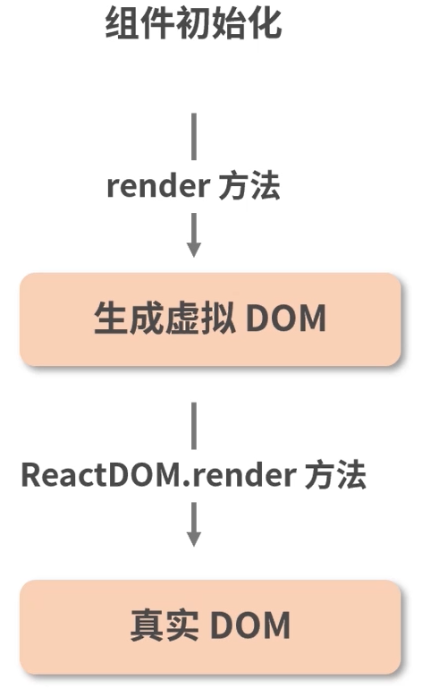

## **组件化：工程化思想在框架中的落地**

组件化是 React 团队在研发效能方面所做的一个重要的努力。

几乎所有的可见/不可见的内容都可以被抽离为各种各样的组件，每个组件既是 **”封闭“** 的，也是 **”开放“** 的。

- **”封闭“**针对 **”渲染工作流“** 来说的

- 在组件自身的渲染工作流中，每个组件都只处理它内部的渲染逻辑。

- **”开放“**针对**组件间通信**来说的

- React 允许开发者基于 ”单向数据流“ 的原则，完成组件间的通信，而组件之间的通信又将改变通信双方/某一方内部的数据，进而对渲染结果构成影响。

## **生命周期方法的本质：组件的 ”灵魂“ 与 ”躯干“**

**”渲染工作流“** 指的是从**组件数据改变**到**组件实际更新**发生的过程。

- **组件渲染的 render** 可以理解为组件的 **”灵魂“**

- **render 之外的生命周期方法**可以理解为是组件的 **”躯干“**

## **拆解 React 生命周期：从 React 15 说起**

### **认识 React 15 的生命周期**

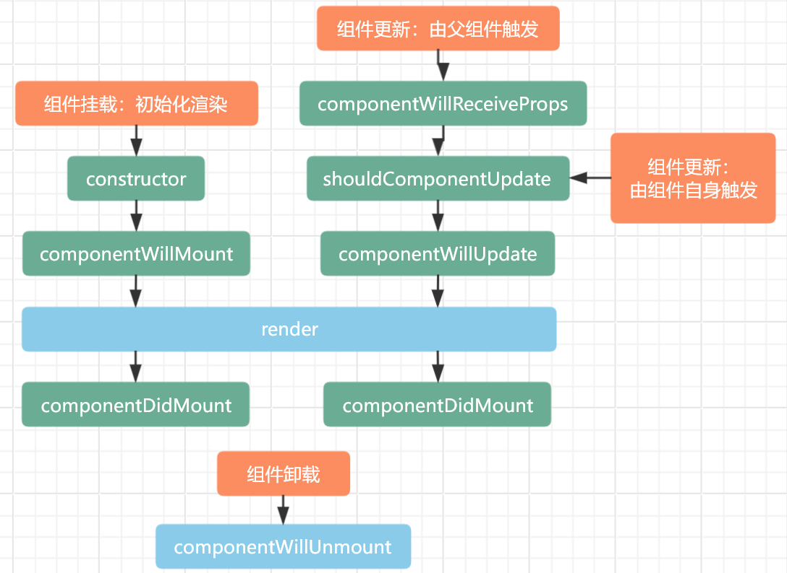

#### **组件挂载：初始化渲染**

1. constructor：初始化组件

2. componentWillMount：组件将要挂载

3. render：组件渲染

4. componentDidMount：组件已经挂载

> componentDidMount 时组件已经挂载，可以在此生命周期中去操作真实 DOM。
> 
> 

#### **组件更新：由父组件触发**

1. componentWillReceiveProps：组件将要接收 Props

2. shouldComponentUpdate：组件是否应该更新

3. componentWillUpdate：组件将要更新

4. render：组件渲染

5. componentDidUpdate：组件已经更新

> componentWillReceiveProps 的触发条件有两个：
> 
> 1. 父组件传入的 props 发生了更改
> 
> 2. 父组件重新渲染了
> 
> 使用方法：
> 
> ```JavaScript
> /**
>  * @param {Object} nextProps - 新的 Props
>  */
> componentWillReceiveProps(nextProps) { }
> ```
> 
> 

#### **组件更新：由组件自身触发**

1. shouldComponentUpdate：组件是否应该更新

2. componentWillUpdate：组件将要更新

3. render：组件渲染

4. componentDidUpdate：组件已经更新

> shouldComponentUpdate 使用方法：
> 
> ```JavaScript
> /**
>  * @param {Object} nextProps - 新接收的 Props
>  * @param {Object} nextState - 新的 State
>  * @return {Boolean} shouldReRender - 是否应该重新渲染（默认为 true）
>  */
> shouldComponentUpdate(nextProps, nextState) { }
> ```
> 
> 

> render 在执行过程中并不会去操作真实 DOM，它的职能是**把需要渲染的内容返回出来**，真实的渲染操作是由 `React.render` 实现的。
> 
> 

#### **组件卸载**

1. componentWillUnmount：组件将要卸载

> componentWillUnmount 的触发条件有两个：
> 
> 1. 组件在父组件中被移除了
> 
> 2. 组件中设置了 key 属性，父组件在 render 的过程中，发现 key 值和上一次不一致
> 
> 

### **进化的生命周期方法：React 16 生命周期工作流详解**

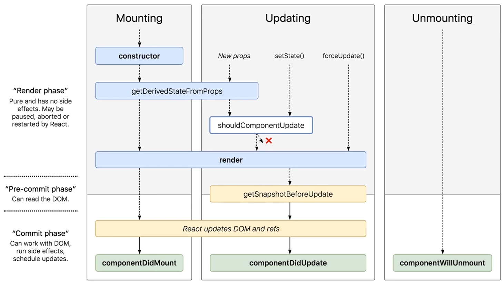

#### **组件挂载：初始化渲染**

1. constructor：初始化组件

2. getDerivedStateFromProps：从 Props 获取派生状态

3. render：组件渲染

4. componentDidMount：组件已经挂载

> 废弃了 componentWillMount，新增了 getDerivedStateFromProps。
> 
> 注：React 16 对 render 方法也进行了一些改进。React 16 之前，render 方法必须返回单个元素，而 React 16 允许我们返回元素数组和字符串。
> 
> 为什么要废弃 componentWillMount？
> 
> 因为 componentWillMount 的存在不仅 ”鸡肋“ 而且危险，因此它并不值得被 ”代替“，它就应该被废弃。
> 
> getDerivedStateFromProps 不是 componentWillMount 的替代品。
> 
> getDerivedStateFromProps 有且仅有一个用途：**使用 props 来派生/更新 state**。
> 
> getDerivedStateFromProps 的三个重点：
> 
> 1. getDerivedStateFromProps 是一个静态方法，静态方法不依赖组件实例而存在，因此无法访问 this，若访问则会报错
> 
> 2. 接收两个参数 props 和 statae，分别为父组件传递的 props，组件自身的 state
> 
> 3. getDerivedStateFromProps 需要一个对象格式的返回值，如果没有则会警告，之所以不可或缺是因为，React 需要用这个返回值来更新组件的 state，且这种更新并非是覆盖式的更新，会与原有属性共存
> 
> getDerivedStateFromProps 使用方法：
> 
> ```JavaScript
> /**
>  * @param {Object} props - 父组件的 Props
>  * @param {Object} state - 组件自身的 State
>  */
> getDerivedStateFromProps(props, state) { }
> ```
> 
> 

#### **组件更新**

1. getDerivedStateFromProps：从 Props 获取派生状态

2. shouldComponentUpdate：组件将要更新

3. render：组件渲染

4. getSnapshotBeforeUpdate：在组件修改前获取快照

5. componentDidUpdate：组件已经更新

> 废弃了 componentWillReceiveProps，新增了 getDerivedStateFromProps、getSnapshotBeforeUpdate。
> 
> 为什么要用 getDerivedStateFromProps 代替 componentWillReceiveProps？
> 
> - getDerivedStateFromProps 是作为一个试图**代替 componentWillReceiveProps** 的 API 而出现的
> 
> - getDerivedStateFromProps **不能完全和 componentWillReceiveProps 画等号**
> 
> React 16 在强制推行 “只用 getDerivedStateFromProps 来完成 props 到 state 的映射” 这一最佳实践，旨在确保生命周期函数的行为更加可控、可预测，从根源上帮开发者避免不合理的编程方式，避免生命周期的滥用，同时也是在为新的 Fiber 架构铺路。
> 
> getSnapshotBeforeUpdate 使用方法：
> 
> ```JavaScript
> /**
>  * @param {Object} prevProps - 更新前的 Props
>  * @param {Object} prevState - 更新前的 State
>  */
> getSnapshotBeforeUpdate(prevProps, prevState) { }
> ```
> 
> getSnapshotBeforeUpdate 的返回值会作为第三个参数给到 componentDidUpdate，它的执行时机是在 render 方法之后，真实 DOM 更新之前，同时获取到更新前的真实 DOM 和更新前后的 state\&props 信息。
> 
> 

> componentDidUpdate 使用方法：
> 
> ```JavaScript
> /**
>  * @param {Object} prevProps - 更新前的 Props
>  * @param {Object} prevState - 更新前的 State
>  * @param {ant} valueFromSnapshot - getSnapshotBeforeUpdate 的返回值
>  */
> componentDidUpdate(prevProps, prevState, valueFromSnapshot) { }
> ```
> 
> 

#### **组件卸载**

1. componentWillUnmount：组件将要卸载

## **透过现象看本质：React 16 缘何两次求变？**

Fiber 是 React 16 对 React 核心算法的一次重写。

Fiber 会使原本同步的渲染过程变成异步的。

在 React 16 之前，每当我们触发一次组件的更新，React 都会构建一个新的虚拟 DOM 树，通过与上一次的虚拟 DOM 树进行比对，实现对 DOM 的定向更新，这个过程是一个递归的过程。

同步渲染的递归调用栈是非常深的，只有最底层的调用返回了整个渲染过程，才会开始逐层返回，这个漫长且不可打断的更新过程，将会带来用户体验层面的巨大风险，同步渲染一旦开始，便会牢牢抓住主线程不放，直到递归彻底完成，在这个过程当中，浏览器没有办法处理任何渲染之外的事情，会进入一种无法处理用户交互的状态，因此，若渲染时间稍微长一点，页面就会面临**卡顿**，甚至**卡死**的风险，而 React 16 引入的 Fiber 架构恰好可以解决这个问题。

Fiber 会将一个大的更新任务拆解为许多个小任务，每当执行完一个小任务的时候，渲染线程都会把主线程交回去，看看有没有优先级更高的工作要处理，确保不会出现其他任务被饿死的情况，进而避免同步渲染带来的卡顿，在这个过程当中，渲染线程不再一去不复返，而是**可以被打断**的，这就是所谓的**异步渲染**。

## **换个角度看生命周期工作流**

Fiber 架构的重要特征就是可以被打断的异步渲染模式，根据 ”能否被打断“ 这一标准，React 16 的生命周期被划分为了 render 和 commit 两个阶段，commit 阶段又被细分为了 pre\-commit 和 commit。

- render 阶段：纯净且没有副作用，可能会被 React 暂停终止或重新启动

- pre\-commit 阶段：可以读取 DOM

- commit 阶段：可以使用 DOM 运行副作用安排更新

总的来说：

- render 阶段在执行过程中允许被打断

    > 因为 render 阶段还未涉及视图的更新，用户是无感的
    > 
    > 

- commit 阶段则重视同步执行的

    > 因为 commit 阶段会导致视图更新，用户可以察觉
    > 
    > 

## **细说生命周期 ”废旧立新“ 背后的思考**

> 由于 render 阶段是允许暂停、终止和重启的，这就导致 render 阶段的生命周期都是有可能被重复执行的。
> 
> React 16 废弃的生命周期：
> 
> - componentWillMount
> 
> - componentWillUpdate
> 
> - componentWillReceiveProps
> 
> 为什么要废弃这三个生命周期？
> 
> 因为它们都有个共同的特点：都处于 render 阶段，都可能重复被执行。
> 
> 而且由于这些生命周期长期被滥用，他们在重复执行的过程中，都存在着不可小觑的风险。
> 
> 

# **React 组件之间的数据流**

## **基于 Props 的单向数据流**

组件，从概念上类似于 JavaScript 函数。它接受任意的入参（即：”props“），并返回用于描述页面展示内容的 React 元素。

单向数据流：当前组件的 state 以 props 的形式流动时，只能流向组件树中比自己层级更低的组件。

### **父\-子组件通信**

React 的数据流是单向的，父组件可以直接将 `this.props` 传入子组件，实现父\-子间的通信。

### **子\-父组件通信**

父组件传递给子组件的是一个绑定了自身上下文的函数，那么子组件在调用该函数时，就可以将想要交给父组件的数据以函数入参的形式给出去。

### **兄弟组件通信**

结合父\-子组件通信、子\-父组件通信。

### **为什么不推荐用 props 解决其他场景的需求**

层层传递的优点是非常简单，用已有知识就能解决。

问题是会浪费很多代码，非常繁琐。

## **利用 ”发布\-订阅“ 模式驱动数据流**

优点：监听事件的位置和触发事件的位置是不受限的

### **发布\-订阅模式 API 设计思路**

1. `on()`：负责注册事件的监听器，指定事件触发时的回调函数

2. `emit()`：负责触发事件，可以通过传参使其在触发的时候携带数据

3. `off()`：负责监听器的删除

### **手写一个发布\-订阅模式**

#### **问题一：事件和监听函数的对应关系如何处理？**

```JavaScript
constructor() {
  // eventMap 用来存储事件和监听函数之间的关系
  this.eventMap = {};
}
```

#### **问题二：如何实现订阅？**

```JavaScript
// type 这里就代表事件的名称
on(type, handler) {
  // handler 必须是一个函数，如果不是直接报错
  if (!(handler instanceof Function)) {
    throw new Error("请传入一个函数")
  }
  // 判断 type 事件对应的队列是否存在
  if (!this.eventMap[type]) {
    // 若不存在，新建该队列
    this.eventMap[type] = []
  }
  // 若存在，直接往队列里推入 handler
  this.eventMap[type].push(handler)
}
```

#### **问题三：如何实现发布？**

```JavaScript
// 触发时是可以携带数据的，params 就是数据的载体
emit(type, params) {
  // 假设该事件是有订阅的 (对应的事件队列存在)
  if (this.eventMap[type]) {
    // 将事件队列里的 handler 依次执行出队
    this.eventMap[type].forEach((handler, index) => {
      // 注意别忘了读取 params
      handler(params)
    });
  }
}
```

#### **问题四：如何实现取消订阅？**

```JavaScript
off(type, handler) {
  if (this.eventMap[type]) {
    this.eventMap[type].splice(this.eventMap[type].indexOf(handler) >>> 0, 1);
  }
}
```

#### **完整实现**

```JavaScript
class myEventEmitter {
  constructor() {
    // eventMap 用来存储事件和监听函数之间的关系
    this.eventMap = {};
  }

  // type 这里就代表事件的名称
  on(type, handler) {
    // handler 必须是一个函数，如果不是直接报错
    if (!(handler instanceof Function)) {
      throw new Error("请传入一个函数")
    }
    // 判断 type 事件对应的队列是否存在
    if (!this.eventMap[type]) {
      // 若不存在，新建该队列
      this.eventMap[type] = []
    }
    // 若存在，直接往队列里推入 handler
    this.eventMap[type].push(handler)
  }

  // 触发时是可以携带数据的，params 就是数据的载体
  emit(type, params) {
    // 假设该事件是有订阅的 (对应的事件队列存在)
    if (this.eventMap[type]) {
      // 将事件队列里的 handler 依次执行出队
      this.eventMap[type].forEach((handler, index) => {
        // 注意别忘了读取 params
        handler(params)
      });
    }
  }

  off(type, handler) {
    if (this.eventMap[type]) {
      this.eventMap[type].splice(this.eventMap[type].indexOf(handler) >>> 0, 1);
    }
  }
}
```

## **使用 Context API 维护全局状态**

Context API 是 React 官方提供的一种组件树全局通信的方式。

在 React 16\.3 之前，Context API 由于存在种种局限性，并不被 React 官方提倡使用，开发者更多的是把它作为一个概念来探讨，而从 16\.3\.0 开始，React 对 Context API 进行了改进，新的 Context API 具备更强的可用性。

#### **三要素**

1. `React.createContext`：创建 Context 对象

    ```JavaScript
    const AppContext = React.createContext(defaultValue);
    
    const { Provider, Consumer } = AppContext;
    ```

2. Provider：数据的提供者

    ```JavaScript
    <Provider value={ title: this.state.title, content: this.state.content }>
      <Title></Title>
      <Content></Content>
    </Provider>
    ```

3. Consumer：数据的消费者

    ```JavaScript
    <Consumer>
      { value => <div>{ value.title }</div> }
    </Consumer>
    ```

#### **旧 API 存在什么问题**

1. 代码不够优雅

    > 很难迅速辨别出谁是 Provider、谁是 Consumer
    > 
    > 

2. 无法保证数据在生产者和消费者之间的及时同步

    > 如果组件提供的一个 Context 发生了变化，而中间父组件的 shouldComponentUpdate 返回 false，那么使用到该值的后代组件不会进行更新。使用了 Context 的组件则完全失控，所以基本上没有办法能够可靠的更新 Context。
    > 
    > 

#### **新 API 解决了什么问题**

即便组件的 shouldComponentUpdate 返回 false，它仍然可以 “穿透” 组件继续向后代组件进行传播，进而确保了数据生产者和数据消费者之间数据的一致性。

## **状态管理仓库：Redux**

### **什么是 Redux？**

Redux 是 JavaScript 状态容器，它提供可预测的状态管理。

### **Redux 是如何帮助 React 管理数据的？**

- store 是一个单一的数据源，而且是只读的

- action 是对变化的描述

- reducer 负责对变化进行分发和处理


在 Redux 的整个工作过程中，数据流是**严格单向**的。

Redux 通过提供一个统一的状态容器，使得数据能够自由而有序地在任意组件之间穿梭。

实例：

```JavaScript
// store.js

//引入 redux
import { createStore } from 'redux'

// 基于 reducer 创建 store
const store = createStore(
  reducer,
  initial_state,
  applyMiddleware(middlewarel, middleware2, ...)
)
  
const reducer = (state, action) => {
  // 此处是各种样的 state 处理逻辑
  return new_state
}

const action = {
  type: "ADD_ITEM",
  payload: '<li>text</li>'
}

// 使用 dispatch 派发 action，action 会进入到 reducer 里触发对应的更新
store.dispatch(action);
```


# **Hooks**

## **Hooks 设计动机初探**

Hooks 是 React 团队在真刀真枪的 React 组件开发实践中，逐渐认知到的一个改进点，背后涉及对**类组件**和**函数组件**两种组件形式的思考和侧重。

### **何为类组件**

所谓类组件就是基于 ES6 class 的写法，通过继承 `React.Component` 得来的 React 组件。

示例：

```JavaScript
class DemoClass extends React.Component {
  // 初始化类组件的 state
  state = {
    text: ""
  }
  // 编写生命周期方法 didMount
  componentDidMount() {
    // 省略业务逻辑
  }

  // 编写自定义的实例方法
  changeText = (newText) => {
    // 更新 state
    this.setState({
      text: newText
    });
  }

  // 编写生命周期方法 render
  render() {
    return (
      <div className="demoClass">
        <p>{this.state.text}</p>
        <button onClick={this.changeText}>点我修改</button>
      </div>
    );
  }
}
```

### **何为函数组件/无状态组件**

函数组件是以函数的形态存在的组件。

### **函数组件与类组件的对比：无关 “优劣”，只谈 “不同“**

1. **是否需要继承 class**

    - 类组件需要

    - 函数组件不需要

2. **是否存在生命周期**

    - 类组件存在

    - 函数组件不存在

3. **是否存在 this**

    - 类组件存在

    - 函数组件不存在

4. **是否存在 state**

    - 类组件存在

    - 函数组件不存在

## **重新类组件：包裹在面向对象思想下的 ”重装战舰“**

**类组件**是面向对象编程思想的一种表征。

常用操作包括：

1. **封装**：将一类属性和方法，”聚拢“ 到一个 Class 里去

2. **继承**：新的 Class 可以通过继承现有 Class，实现对某一类属性和方法的复用

React 类组件提供了多少东西，你就需要学多少东西 “大而全” 的背后，是不可忽视的**学习成本**。

对于解决许多问题来说，编写一个类组件实在是一个过于**复杂**的姿势，复杂的姿势必然带来高昂的**理解成本**。

开发者编写的逻辑在封装后是和组件粘在一起的，这就使得类组件内部的逻辑**难以实现拆分和复用**。

## **深入理解函数组件：呼应 React 设计思想的 “轻巧快艇”**

示例：

```JavaScript
function DemoFunction(props) {
  const { text } = props
  return (
    <div className="demoFunction">
      <p>{`function 组件所接收到的来自外界的文本内容是: [${text}]`}</p>
    </div >
  );
}
```

函数组件很好的解决了类组件的缺点，包括：较大的学习成本、难以理解、难以实现拆分和复用等问题。

类组件和函数组件之间，纵有千差万别，但最不能够被我们忽视掉的，是心智模式层面的差异。

类组件是面向对象的，而函数组件是面向过程的，因此函数组件才更加符合 React 的核心思想。

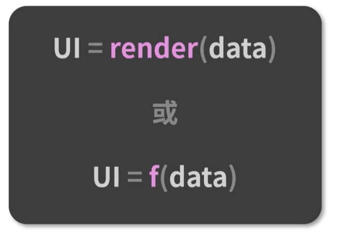

React 组件本身的定位就是函数，一个吃进数据、吐出 UI 的函数。

React 的主要工作就是，把声明式的代码转换为命令式的 DOM 操作，把数据层面的描述映射到用户可见的 UI 变化中去。

函数组件会捕获 render 内部的状态，这是两类组件最大的不同。

> 由于 React 的单向数据流，因此 props 本身是不可变的，但是 this\.props 却是可变的。
> 
> 

示例：类组件

```JavaScript
class ProfilePage extends React.Component {
  showMessage = () => {
    alert('Followed' + this.props.user);
  }

  handleClick = () => {
    setTimeout(this.showMessage, 3000);
  }

  render() {
    return <button onClick={this.handleClick}>Follow</button>;
  }
}
```

上述示例中，如果点击了按钮后，在 3s 内切换到了另一个用户，则 `this.props.user` 会显示新用户的信息，这很明显于我们想要的效果不符。

但如果我们改用函数组件来实现则会按照我们想要的效果展示。

```JavaScript
function ProfilePage(props) {
  const showMessage = () => {
    alert('Followed' + props.user);
  }

  const handleClick = () => {
    setTimeout(showMessage, 3000);
  }

  return (
    <button onClick={handleClick}>Follow</button>
  )
}
```

因此，函数组件真正地把数据和渲染绑定到了一起。

函数组件是一个更加匹配其设计理念、也更有利于逻辑拆分与重用的组件表达形式。

## **Hooks 的本质：一套能够使函数组件更强大、更灵活的 “钩子“**

函数组件比起类组件 “少” 了很多东西，给函数组件的使用带来了非常多的局限性。

如果说函数组件是一台轻巧的快艇，那么 React\-Hooks 就是一个内容丰富的零部件箱，允许你自由地选择和使用你需要的那些能力。

## **从核心 API 看 Hooks 的基本形态**

### **`useState()`****：为函数组件引入状态**

早期的函数组件相比于类组件，其一大劣势是缺乏定义和维护 state 的能力，`useState` 正是这样一个能够为函数组件引入状态的 API。

`useState` 返回的是一个数组，数组的第一个元素对应的是我们想要的那个 **state 变量**，第二个元素对应的是**能够修改这个变量的 API**。

示例：

```JavaScript
const [state, setState] = useState(initialState);
```

调用 `React.useState` 的时候，实际上是给这个组件关联了一个状态。

### **`useEffect()`****：允许函数组件执行副作用操作**

`useEffect` 则在一定程度上弥补了生命周期的缺席。

`useEffect` 能够为函数组件引入副作用，过去我们习惯放在 `componentDidMount`、`componentDidUpdate`，`componentWillUnmount` 三个生命周期里来做的事，现在可以放在 `useEffect` 里来做。

示例：

```JavaScript
useEffect(callback, []);
```

- 传入回调函数，不传依赖数组：**每一次渲染后都执行的副作用**

    ```JavaScript
    useEffect(() => {});
    ```

- 传入回调函数，且这个函数的返回值不是一个函数，同时传入一个空数组：**仅在挂载阶段执行一次的副作用**

    ```JavaScript
    useEffect(() => {}, []);
    ```

- 传入回调函数，且这个函数的返回值是一个函数，同时不传第二个参数：每一次染都触发，且卸载阶段也会被触发的副作用

    ```JavaScript
    useEffect(() => {
      // useEffect 回调函数的返回的函数被称为 ”清除函数“
      return () => {}
    });
    ```

- 传入回调函数，且这个函数的返回值是一个函数，同时传入一个空数组：**仅在挂载阶段和卸载阶段执行的副作用**

    ```JavaScript
    useEffect(() => {
      return () => {}
    }, []);
    ```

- 传入回调函数，同时传入一个非空的数组：根据一定的依赖条件来触发的副作用

    ```JavaScript
    useEffect(() => {}, [num1]);
    ```

## **Why React\-Hooks：Hooks 是如何帮助我们升级工作模式的？**

1. 告别难以理解的 Class

2. 解决业务逻辑难以拆分的问题

3. 使状态逻辑复用变得简单可行

4. 函数组件从设计思想上来看更加契合 React 的理念

### **告别难以理解的 Class：把握 Class 的两大 ”痛点“**

1. **this 的指向问题**

    示例：

    ```JavaScript
    class Example extends React.Component {
      state = {
        name: '修言',
        age: '99'
      }
    
      changeAge() {
        // 这里会报错，因为普通函数可以保存 this，因此这里的 this 实际指向的是函数本身，而非组件本身
        // 解决办法：1、bind 2、箭头函数
        // 本质上都是在用实践层面的约束来解决设计层面的问题
        this.setState({
          age: '100'
        });
      }
    
      render() {
        return <button onClick={this.changeAge}>{this.state.name}的年龄是{this.state.age}</button >
      }
    }
    ```

2. **生命周期**

    - 学习成本

    - 不合理的逻辑规划方式

### **Hooks 如何实现更好的逻辑拆分**

Hooks 按照逻辑上的关联拆分进不同的函数组件里。

Hooks 能够帮助我们实现业务逻辑的聚合，避免复杂的组件和冗余的代码。

类组件复用状态逻辑，靠的是 **HOC**（高阶组件）和 **Render Props** 这些组件设计模式，但这些设计模式并非万能，它们在实现逻辑复用的同时，也破坏着组件的结构，其中一个最常见的问题就是 “嵌套地狱” 现象。

Hooks 可以视作是 React 为解决状态逻辑复用这个问题所提供的一个原生途径，现在我们可以通过自定义 Hook，达到既不破坏组件结构、又能够实现逻辑复用的效果。

## **保持清醒：Hooks 并非万能**

1. Hooks 暂时还不能完全地为函数组件补齐类组件的能力

    > 例如：getSnapshotBeforeUpdate
    > 
    > 

2. “轻量” 几乎是函数组件的基因，这可能会使它不能够很好地消化 “复杂”

    > 函数组件给了我们一定程度的自由，却也对开发者的水平提出了更高的要求
    > 
    > 

3. Hooks 在使用层面有着严格的规则约束

    > 例如：只能在函数组件的顶层使用
    > 
    > 

## **Hooks 的使用原则**

- 只在 React 函数中调用 Hook

- 不要在循环、条件或嵌套函数中调用 Hook

    > 要确保 Hooks 在每次渲染时都保持同样的执行顺序
    > 
    > 

### **从源码调用流程看原理：Hooks 的正常运作，在底层依赖于顺序链表**

#### **useState**

##### **初次渲染**

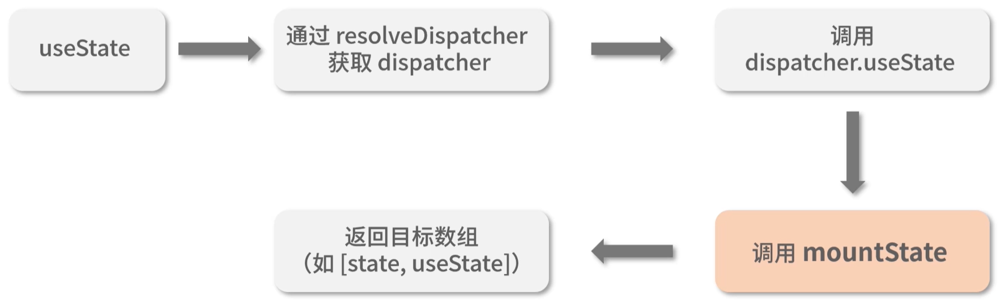

mountState 做的事情：构建链表并渲染。

```JavaScript
// 进入 mounState 逻辑
function mountState(initialState) {
  // 将新的 hook 对象追加进链表尾部
  var hook = mountWorklnProgressHook();

  // initialState 可以是一个回调，若是回调，则取回调执行后的值
  if (typeof initialState === 'function') {
    // $FlowFixMe: Flow doesn't like mixed types
    initialState = initialState();
  }

  // 创建当前 hook 对象的更新队列，这一步主要是为了能够依序保留 dispatch
  const queue = hook.queue = {
    last: null,
    dispatch: null,
    lastRenderedReducer: basicStateReducer,
    lastRenderedState: initialState,
  }

  // 将 initialState 作为一个“记忆值”存下来
  hook.memoizedState = hook.baseState = initialState;

  // dispatch 是由上下文中一个叫 dispatchAction 的方法创建的，这里不必纠结这个方法具体做了什么
  var dispatch = queue.dispatch = dispatchAction.bind(null, currentlyRenderingFiber$1, queue);
  // 返回目标数组，dispatch 其实就是示例中常常见到的 setXXX 这个函数
  return [hook.memoizedState, dispatch];
}
```

```JavaScript
function mountWorkInProgressHook() {
  // 注意，单个 hook 是以对象的形式存在的
  var hook = {
    memoizedState: null,
    baseState: null,
    baseQueue: null,
    queue: null,
    next: null,
  }

  if (worklnProgressHook === null) {
    // 这行代码每个 React 版本不太一样，但做的都是同一件事：将 hook 作为链表的头节点处理
    firstWorkInProgressHook = worklnProgressHook = hook;
  } else {
    // 若链表不为空，则将 hook 追加到链表尾部
    workInProgressHook = worklnProgressHook.next = hook;
  }

  // 返回当前的 hook
  return worklnProgressHook;
}
```

##### **更新渲染**

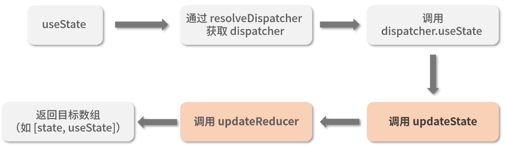

updateState 做的事情：按顺序去遍历之前构建好的链表，取出对应的数据信息进行渲染。

### **Hooks 的渲染机制**

Hooks 的渲染是通过 “依次遍历” 来定位每个 Hook 内容的。如果前后两次读到的链表在顺序上出现差异，那么渲染的结果自然是不可控的。

Hooks 的本质是链表。

# **虚拟 DOM**

虚拟 DOM（Virtual DOM）本质上是 JS 和 DOM 之间的一个映射缓存，在形态上表现为一个能够描述 DOM 结构及其属性信息的 JS 对象。

1. 虚拟 DOM 是 JS 对象

2. 虚拟 DOM 是对真实 DOM 的描述

## **虚拟 DOM 的两个 “大问题“**

- **挂载阶段**：React 将结合 JSX 的描述，构建出虚拟 DOM 树，然后通过 `ReactDOM.render` 实现虚拟 DOM 到真实 DOM 的映射（触发染流水线）

- **更新阶段**：页面的变化会先作用于虚拟 DOM，虚拟 DOM 将在 JS 层借助算法先对比出具体有哪些真实 DOM 需要被改变，然后再将这些改变作用于真实 DOM。

## **历史长河中的 DOM 操作解决方案**

### **原生 JS 支配下的 “人肉 DOM” 期**

前端页面 **“展示”** 的属性远远强于其 **“交互”** 的属性，这就导致 JS 的定位只能是 “辅助”。

前端工程师们会花费大量的时间去实现静态的 DOM，待一切结束后，再补充少量 JS。

### **解放生产力的先导阶段：jQuery 时期**

大量 DOM 操作需求带来的前端开发工作量的激增，jQuery 首先解决的就是 “API 不好使” 这个问题。

将 DOM API 封装为了相对简单和优雅的形式，同时一口气做掉了跨浏览器的兼容工作，并且提供了链式 API 调用、插件扩展等一系列能力用于进一步解放生产力。

### **民智初启：早期模板引擎方案**

jQuery 并不能从根本上解决 DOM 操作量过大情况下前端侧的压力。

> 类似：手持吸尘器，虽然可以帮助我们更加方便快速地清洁某一处的灰尘，要想清洁多个位置的灰尘，你仍然需要拿着它四处奔走。还是避免不了跑断腿的结局。
> 
> 

#### **模板引擎方案，正是 “扫地机器人” 的雏形**

模板引擎更倾向于点对点解决烦琐 DOM 操作的问题，它在能力和定位上既不能够、也不打算替换 jQuery，两者是和谐共存的。因此这里不存在 “模板引擎时期”，只有 “模板引擎方案”。

```JavaScript
<table>
  
  <tr>
    <td></td>
    <td></td>
  </tr>
  
</table>
```

模板引擎主要做了四件事：

1. 读取 HTML模板并解析它，分离出其中的 JS 信息

2. 将解析出的内容拼接成字符串，动态生成 JS 代码

3. 运行动态生成的 JS 代码，吐出 “目标 HTML”

4. 将 “目标 HTML” 赋值给 innerHTML，触发染流水线，完成真实 DOM 的渲染

使用模板引擎方案来渲染数据需要关注的仅仅是**数据和数据变化本身**，而无需关心 DOM 层面上的变化。

模板引擎实际的应用场景，基本局限在 **“实现高效的字符串拼接”** 这一个点上，因此不能指望它去做太复杂的事情，最不能接受的是它在性能上的表现不尽如人意。

### **虚拟 DOM**


虚拟 DOM 的 GitHub 仓库：[https://github\.com/Matt\-Esch/virtual\-dom](https://github.com/Matt-Esch/virtual-dom)

虚拟 DOM 是前端开发们，为了追求更好的研发体验和研发效率，而创造出来的高阶产物。

虚拟 DOM 的性能不在性能，而在**研发效率、体验**和**跨平台问题**。

- **“差量更新”**：通过 patch 函数来实现

- **“批量更新”**：在通用虚拟 DOM 库里是由 batch 函数来处理的，batch 的作用是缓冲每次生成的补丁集

**diff** 指的是对比出两棵虚拟 DOM 树之间差异的过程，不同的框架对 diff 过程有着不同的实现思路。

## **栈调和（Reconciliation）过程与 Diff 算法**

VirtualDOM 是一种编程概念。在这个概念里，Ul 以一种理想化的，或者说 “虚拟的” 表现形式被保存于内存中，并通过如 ReactDOM 等类库使之与 “真实的” DOM 同步。这一过程叫作**协调**（调和）。

**调和过程并不能和 Diff 划等号**

- 调和是 **“使一致”** 的过程

- Diff 是 **“找不同”** 的过程

Reconciler（调和器）的源码位于 `src/renderers/shared/stack/reconciler` 这个路径，调和器所做的工作包括**组件的挂载、卸载、更新等过程**。

Diff 其实就是更新的过程，所以**调和是包含 Diff 的**。

### **Diff 策略的设计思想**

- 若两个组件属于同一个类型，它们将拥有相同的 DOM 树形结构

- 处于同一层级的一组子节点，可用通过设置 key 作为唯一标识，从而维持各个节点在不同渲染过程中的稳定性

- DOM 节点之间的跨层级操作并不多，同层级操作是主流

### **把握三个 “要点”，图解 Diff 逻辑**

#### **Diff 逻辑的拆分与解读**

1. Diff 算法性能突破的关键点在于 “分层对比“

2. 类型一致的节点才有继续 Diff 的必要性

3. key 属性的设置，可以帮我们尽可能重用同一层级内的节点

#### **改变时间复杂度量级的决定性思路：分层对比**

由于 “DOM 节点之间的跨层级操作并不多，同层级操作是主流”，Diff 过程**只针对相同层级的节点作对比**。

#### **减少递归的 “一刀切” 策略：类型的一致性决定递归的必要性**

”若两个组件属于同一个类型，那么它们将拥有相同的 DOM 树形结构“。

本着抓 “主要矛盾” 的基本原则，React 认为，**只有同类型的组件，才有进一步对比的必要性**。

#### **重用节点的好帮手：key 属性帮 React “记住” 节点**

”key 属性能够帮助维持节点的稳定性“

key 是用来帮助 React 识别哪些内容被更改、添加或者删除，key 需要写在用数组渲染出来的元素内部，并且需要赋予其一个稳定的值。稳定在这里很重要，因为如果 key 值发生了变更，React 则会触发 UI 的重染。这是一个非常有用的特性。

## **异步的动机和原理——批量更新的艺术**

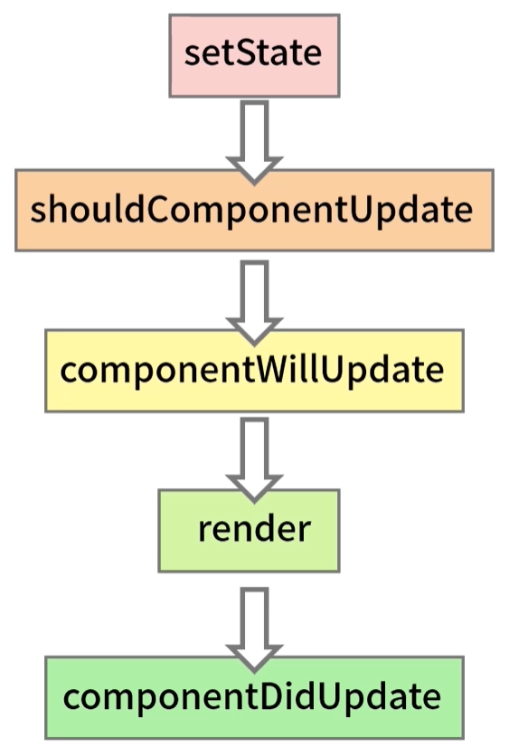

### **批量更新**

每来一个 setState，就把它塞进一个队列里 “攒起来”，等时机成熟，再把 “攒起来” 的 state 结果做合并，最后只针对最新的 state 值走一次更新流程。

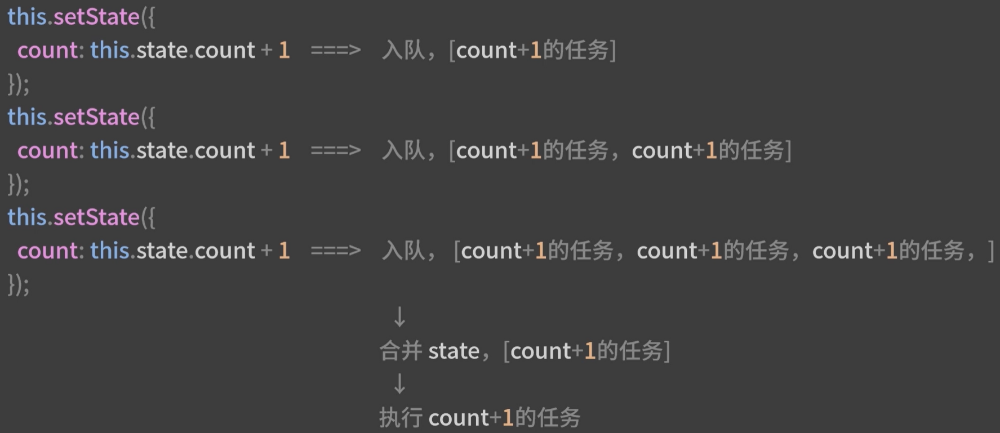

### **解读 setState 工作流**

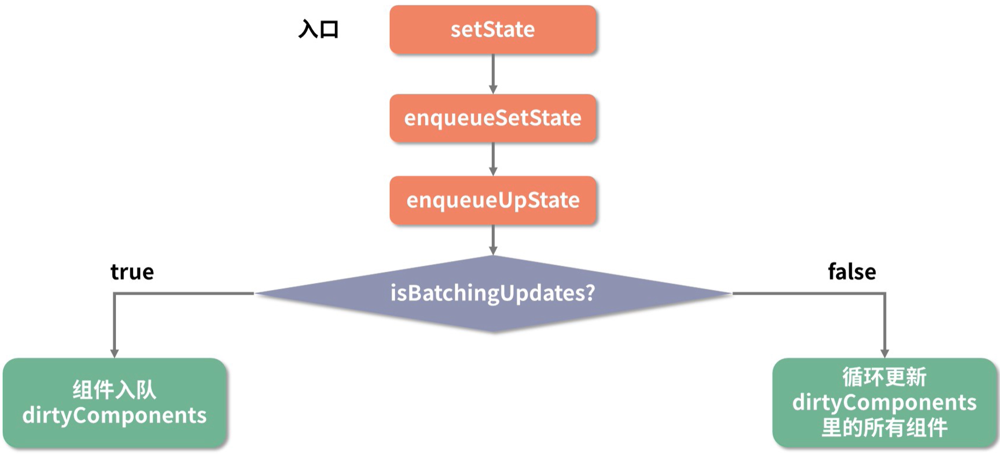

```JavaScript
ReactComponent.prototype.setState = function (partialState, callback) {
  this.updater.enqueueSetState(this, partialState);
  if (callback) {
    this.updater.enqueueCallback(this, callback, 'setState');
  }
}
```

```JavaScript
enqueueSetState: function (publiclnstance, partialState) {
  // 根据 this 拿到对应的组件实例
  var internalInstance = getInternalInstanceReadyForUpdate(publicInstance, 'setState');
  
  // 这个 queue 对应的就是一个组件实例的 state 数组
  var queue = internalInstance._pendingStateQueue || (internalInstance._pendingStateQueue = []);
  queue.push(partialState);

  // enqueueUpdate 用来处理当前的组件实例
  enqueueUpdate(internalInstance);
}
```

```JavaScript
function enqueueUpdate(component) {
  ensureInjected();
  // 注意这一句是问题的关键，isBatchingUpdates 标识着当前是否处于批量创建/更新组件的阶段
  if (!batchingStrategy.isBatchingUpdates) {
    // 若当前没有处于批量创建/更新组件的阶段，则立即更新组件
    batchingStrategy.batchedUpdates(enqueueUpdate, component);
    return;
  }

  // 否则，先把组件塞入 dirtyComponents 队列里，让它“再等等”
  dirtyComponents.push(component);
  if (component._updateBatchNumber == null) {
    component._updateBatchNumber = updateBatchNumber + 1;
  }
}
```

```JavaScript
/**
 * batchingStrategy 源码
 * 可以理解为锁管理器，锁是指 isBatchingUpdates 属性
 */
var ReactDefaultBatchingStrategy = {
  // 全局唯一的锁标识，初始为 false，表示当前并未进行任何批量更新操作
  isBatchingUpdates: false,
  // 发起更新动作的方法
  batchedUpdates: function (callback, a, b, c, d, e) {
    // 缓存锁变量
    var alreadyBatchingStrategy = ReactDefaultBatchingStrategy.isBatchingUpdates
    // 把锁“锁上”，当锁被锁上的时候，任何需要更新的组件都只能暂时进入 dirtyComponents 里排队，等候下一次的批量更新，而不能随意插队
    ReactDefaultBatchingStrategy.isBatchingUpdates = true
    // 此处体现的任务所的思想是 React 面对大佬状态，仍然能够实现有序分批处理的基石
    if (alreadyBatchingStrategy) {
      callback(a, b, c, d, e)
    } else {
      // 启动事务，将 callback 放进事务里执行
      transaction.perform(callback, null, a, b, c, d, e)
    }
  }
}
```

### **理解 React 中的 Transaction（事务）机制**

Transaction 在 React 源码中的分布非常广泛。

如果在 debug React 项目的过程当中，发现函数调用栈中出现了 **initialize、perform、close、closeAll** 或者 **notifyAll** 这样的方法名，那么很可能当前就处于一个 transaction 中。

Transaction 在 React 源码中表现为一个核心类，Transaction 是创建一个黑盒，该黑盒能够封装任何的方法，因此那些需要在函数运行前后运行的方法，可以通过此方法封装实例化 transaction 时，只需提供相关的方法即可。

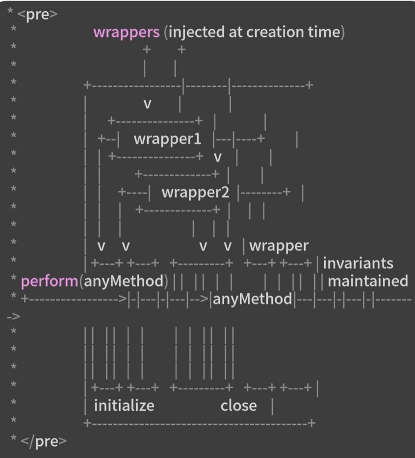

Transaction 就像是一个壳子，它首先会将目标函数用 wrapper 封装起来，同时需要使用 Transaction 类暴露的 perform 方法去执行它，如上面的注释所示，在 anyMethod 执行之前，perform 会先执行所有 wrapper 的 initialize 方法，执行完后再执行所有 wrapper 的 close 方法，这就是 React 中的事务机制。

### **“同步现象” 的本质**

ReactDefaultBatchingStrategy 其实就是一个批量更新策略事务，它的 wrapper 有两个，FLUSH\_BATCHED\_UPDATES 和 RESET\_BATCHED\_UPDATES，把这两个 wrapper 套进 Transaction 的执行机制里，不难得出一个这样的流程，在 callback 执行完之后，RESET\_BATCHED\_UPDATES 将 isBatchingUpdates 设置为 false，FLUSH\_BATCHED\_UPDATES 执行 flushBatchedUpdates，然后里面会循环所有 dirtyComponent，调用 updateComponent 来执行所有的生命周期方法，最后实现组件的更新。

```JavaScript
var RESET_BATCHED_UPDATES = {
  initialize: emptyFunction,
  close: function () {
    ReactDefaultBatchingStrategy.isBatchingUpdates = false
  }
}

var FLUSH_BATCHED_UPDATES = {
  initialize: emptyFunction,
  close: ReactUpdates.flushBatchedUpdates.bind(ReactUpdates)
}

var TRANSACTION_WRAPPERS = [FLUSH_BATCHED_UPDATES, RESET_BATCHED_UPDATES];
```

```JavaScript
// ReactMount.js

// 在组件首次渲染时执行，它内部调用了一次 batchedUpdates，这是因为在组件的渲染过程当中，会按照顺序调用各生命周期函数，开发者很有可能在生命周期函数中调用 setState，因此，需要开启 batch 来确保所有的更新都能够进入 dirtyComponent 里面去，进而确保初始渲染流程中，所有的 setState 都是生效的
_renderNewRootComponent: function(nextElement, container, shouldReuseMarkup, context) {
  // 实例化组件
  var componentlnstance = instantiateReactComponent(nextElement);
  // 初始染直接调用 batchedUpdates 进行同步渲染
  ReactUpdates.batchedUpdates(
    batchedMountComponentlntoNode,
    componentlnstance,
    container,
    shouldReuseMarkup,
    context
  );
  // ...
}
```

```JavaScript
// ReactEventListener.js

// React 事件系统的一部分，当在组件上绑定了事件之后，事件中也有可能会触发 setState，为了确保每一次 setState 都有效，React 同样会在此处手动开启批量更新
dispatchEvent: function (topLevelType, nativeEvent) {
  // ...
  try {
    // 处理事件
    ReactUpdates.batchedUpdates(handleTopLevelImpl, bookKeeping)
  } finally {
    TopLevelCallbackBookKeeping.release(bookKeeping)
  }
}
```

isBatchingUpdates 在 React 的生命周期函数以及合成事件执行前，已经被 React 悄悄修改为了 true，这时所作的 setState 操作自然不会立即生效，当函数执行完毕后，事务的 close 方法会再把 isBatchingUpdates 改为 false。

setState 的表现会因调用场景的不同而不同：

- 在 React 钩子函数及合成事件中，它表现为**异步**

- 在 setTimeout、setInterval 等函数中，包括在 DOM 原生事件中，它都表现为**同步**

# **Fiber**

## **Stack Reconciler 到底有着怎样根深蒂固的局限性?**

### **单线程的 JavaScript 与多线程的浏览器**

多线程的浏览器除了要处理 JavaScript 线程以外，还需要处理各种各样的任务线程，其中也包括负责处理 DOM 的 UI 渲染线程，而 JavaScript 线程是可以操作 DOM 的。

如果渲染线程和 JavaScript 线程同时在工作，那么渲染结果必然是难以预测的。

因此，**JavaScript 线程和渲染线程必须是互斥的，当其中一个线程执行时，另一个线程只能挂起等待。**

当事件被触发时，对应的任务不会立刻被执行，而是由事件线程把它添加到任务队列的末尾，等待 JavaScript 的同步代码执行完毕后，在空闲的时间里执行出队。

渲染层面的更新长时间地等待，界面长时间不更新，带给用户的体验就是所谓的 “卡顿”，事件线程也在等待 JavaScript，这就导致你触发的事件也将是难以被响应的。

### **为什么会产生 “卡顿” 这样的困局？**

JavaScript 对主线程的超时占用问题，导致 Stack Reconciler 是一个同步的递归过程。

栈调和机制下的 Diff 算法，其实是树的深度优先遍历的过程。

调和器会重复 “父组件调用子组件” 的过程，直到最深的一层节点更新完毕，才慢慢向上返回。

这个过程的致命性在于它是同步的，不可以被打断。

当处理结构相对复杂，体谅相对庞大的虚拟 DOM 树时，Stack Reconciler 需要的调和时间会很长，这就意味着 JavaScript 线程将长时间地霸占主线程，进而导致我们上文中所描述的，渲染卡顿/卡死、交互长时间无响应等问题。

## **设计思想：Fiber 是如何解决问题的？**

### **什么是 Fiber？**

Fiber 就是比线程还要纤细的一个过程，也就是所谓的 “纤程“，纤程的出现意在对渲染过程实现更加精细的控制。

- 从**架构**角度来看，Fiber 是对 React 核心算法的重写

- 从**编码**角度来看，Fiber 是 React 内部所定义的一种数据结构

- 从**工作流**的角度来看，Fiber 节点保存了组件需要更新的状态和副作用

Fiber 架构的应用目的是实现 **“增量渲染”**，实现增量渲染的目的，是为了**实现任务的可中断、可恢复**，并**给不同的任务赋予不同的优先级**，最终达成**更加顺滑的用户体验**。

### **Fiber 架构核心：“可中断”、“可恢复” 与 “优先级“**

#### **React 16 之前**

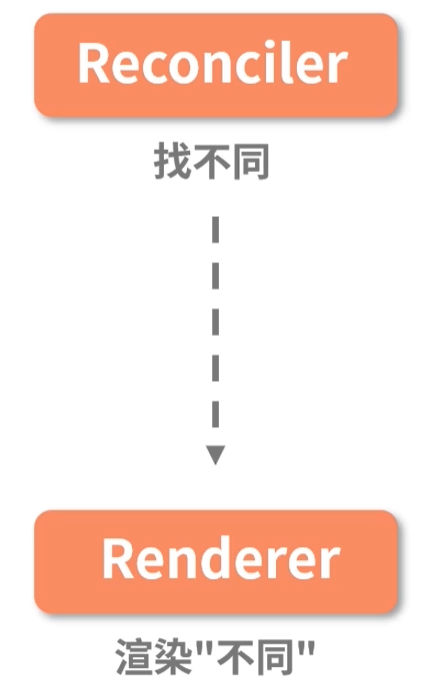

- Reconciler 这一层负责对比出新老虚拟 DOM 之间的变化。

- Renderer 这一层负责将变化的部分应用到视图上，从 Reconciler 到 Renderer 这个过程是严格同步的。

#### **React 16 之后**

在 React 16 中，为了实现可中断和优先级两层架构，变成了如下图所示的三层架构。

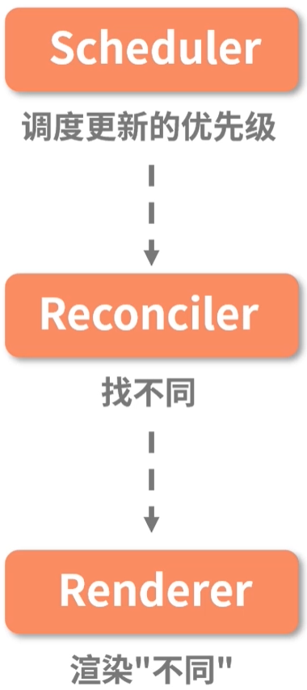

在这套架构模式下，更新的处理工作流变成了这样：

1. 每个更新任务都会被赋予一个优先级，当更新任务抵达调度器时，高优先级的更新任务会更快的被调度进 Reconciler 层，此时若有新的更新任务抵达调度器，调度器会检查它的优先级

2. 若发现 B 的优先级高于当前任务 A，那么当前处于 Reconciler 层的 A 任务就会被中断，调度器会将 B 任务推进 Reconciler 层，当 B 任务完成渲染后，新一轮的调度开始之前

3. 之前被中断的 A 任务将会被重新推入 Reconciler 层，继续它的渲染之旅，这便是所谓 “可恢复”

## **Fiber 架构对生命周期的影响**

### **React15 中 render 到 commit 的过程**

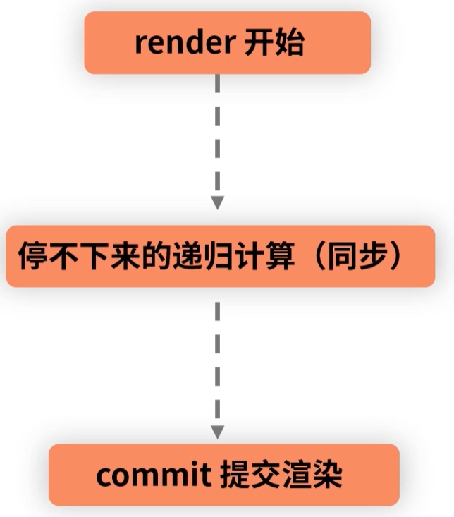

### **React16 中 render 到 commit 的过程**

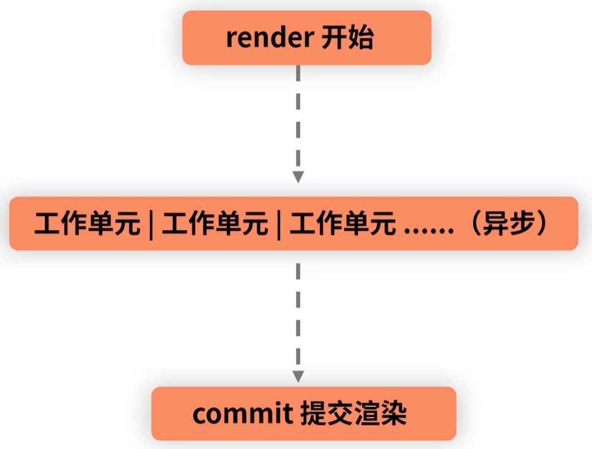

新老两种架构对 React 生命周期的影响，主要在 render 的这个阶段，这个影响是通过增加 Scheduler 层和改写 Reconciler 层来实现的，在 render 阶段，一个庞大的更新任务被分解为了一个个的工作单元，render 的工作单元有着不同的优先级，React 可以根据优先级的高低去实现工作单元的打断和恢复。

由于 render 阶段的操作，对用户来说其实是不可见的，所以就算打断再重启，对用户来说也是零感知的，但是工作单元的重启，将会伴随着对部分生命周期的重复执行，这些生命周期是：

- componentWillMount

- componentWillUpdate

- shouldComponentUpdate

- componentWillReceiveProps

## **ReactDOM\.render**

### **ReactDOM\.render 调用栈的逻辑分层**

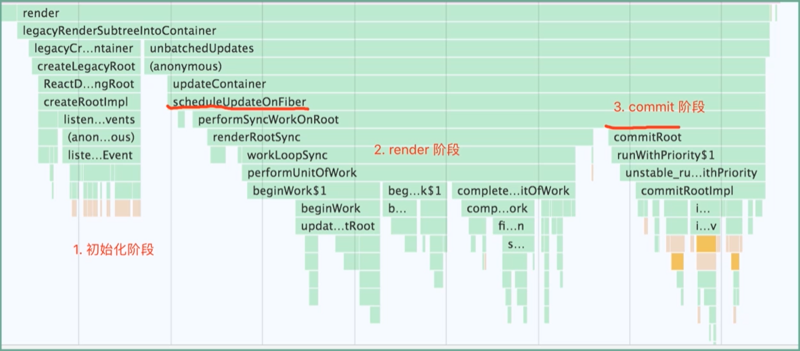

- performSyncWorkOnRoot 开启的正是我们反复强调的 **render 阶段**

- commitRoot 方法开启的则是真实 DOM 的渲染过程 **commit 阶段**

### **ReactDOM\.render 调用栈——初始化阶段**

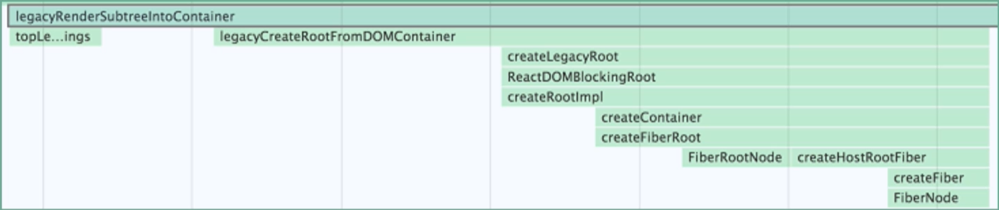

完成 Fiber 树中基本实体的创建。

```JavaScript
// ReactDOM.render 代码

return legacyRenderSubtreeIntoContainer(null, element, container, false, callback):
```

```JavaScript
function legacyRenderSubtreelntoContainer(parentComponent, children, container, forceHydrate, callback) {
  // container 对应的是我们传入的真实 DOM 对象
  var root = container.reactRootContainer;
  // 初始化 fiberRoot 对象
  var fiberRoot;
  // DOM 对象本身不存在 _reactRootContainer 属性，因此 root 为空
  if (!root) {
    // 若 root 为空，则初始化 _reactRootContainer，并将其值赋值给 root
    root = container._reactRootContainer = legacyCreateRootFromDOMContainer(container, forceHydrate);
    // legacyCreateRootFromDOMContainer 创建出的对象会有一个 _internalRoot 属性，将其赋值给 fiberRoot
    fiberRoot = root.internalRoot;

    // 这里处理的是 ReactDOM.render 入参中的回调函数，了解即可
    if (typeof callback === 'function') {
      var originalCallback = callback;

      callback = function () {
        var instance = getPublicRootInstance(fiberRoot);
        originalCallback.call(instance);
      };
    } // 初始化挂载不应该被 batch

    // 进入unbatchedUpdates 方法
    unbatchedUpdates(function () {
      updateContainer(children, fiberRoot, parentComponent, callback);
    });
  } else {
    // else 逻辑处理的是非首次染的情况 (即更新) ，其逻辑除了跳过了初始化工作，与楼上基本一致
    fiberRoot = root.internalRoot;
    if (typeof callback === 'function') {
      var _originalCallback = callback;
      callback = function () {
        var instance = getPublicRootlnstance(fiberRoot);

        _originalCallback.call(instance);
      }
    } // 更新

    updateContainer(children, fiberRoot, parentComponent, callback);
  }

  return getPublicRootInstance(fiberRoot);
}
```

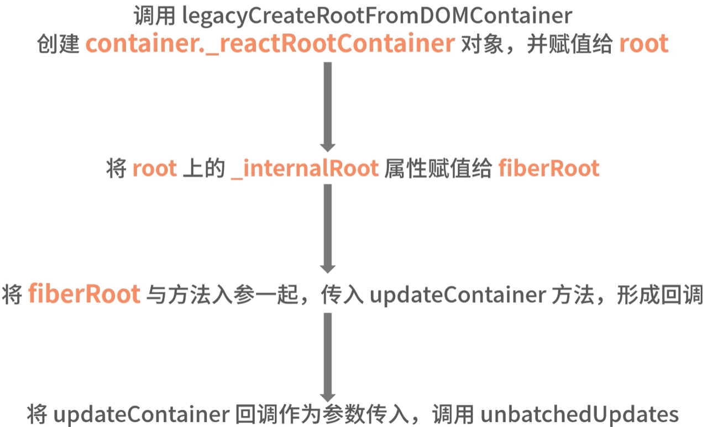

Root 结构：

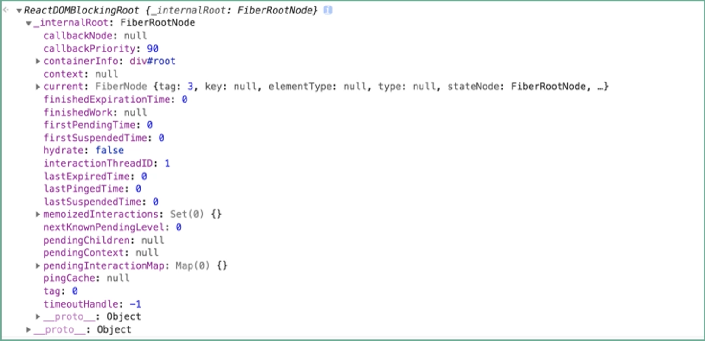

Root 结构下的 `_nternalRoor` 属性就是 fiberRoot，fiberRoot 的本质是一个 fiberRootNode 对象，其中包含一个 current 属性：

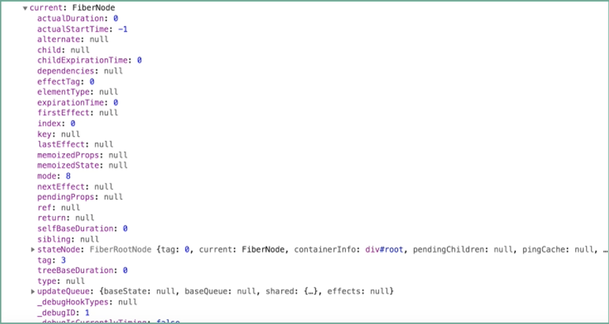

current 对象是一个 fiberNode 实例，FiberNode 正是 Fiber 节点对应的对象类型，current 对象是一个 fiber 节点，不仅如此，它还是当前 fiber 树的头部节点。

current 属性对应的 FiberNode 节点在调用站中实际是由 createHostRootFiber方法创建的，React 源码中，也由多处以 rootFiber 代指 current 对象。

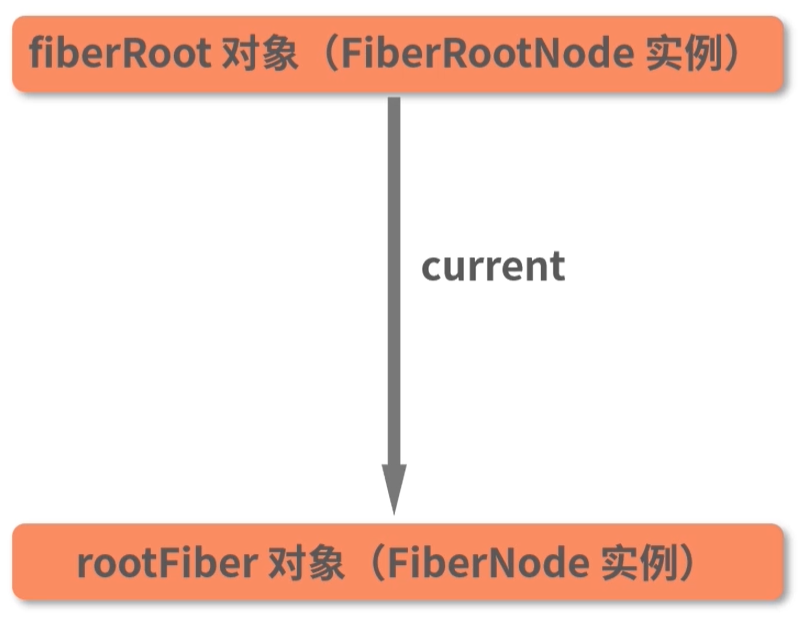

fiberRoot 的关联对象是真实 DOM 的容器节点，而 rootFiber 则作为虚拟 DOM 的根节点存在，这两个节点将是整棵 Fiber 树构建的起点。

接下来，fiberRoot 将和 ReactDOM\.render 方法的其他入参一起被传入 updateContainer 方法，从而形成一个回调，这个回调正是接下来要对应的 unbatchedUpdates 方法的入参。

```JavaScript
function unbatchedUpdates(fn, a) {
  // 这里是对上下文的处理，不必纠结
  var prevExecutionContext = executionContext;
  executionContext &= ~BatchedContext;
  executionContext |= LegacyUnbatchedContext;

  try {
    // 重点在这里，直接调用了传入的回调函数 fn，对应当前链路中的
    return fn(a);
  } finally {
    // finally 逻辑里是对回调队列的处理，此处不用太关注
    executionContext = prevExecutionContext;

    if (executionContext === NoContext) {
      // 清空本批次中已调度的即时回调
      resetRenderTimer();
      flushSyncCallbackQueue();
    }
  }
}
```

在这个链路中 fn 是对 updateContainer 的调用。

```JavaScript
unbatchedUpdates(function () {
  updateContainer(children, fiberRoot, parentComponent, callback):
});
```

```JavaScript
/**
 * 主要做了3件事：
 * 1、请求当前 Fiber 节点的lane（优先级）
 * 2、结合 lane（优先级）创建当前 Fiber 节点的 update 对象，并将其入队
 * 3、调度当前节点（rootFiber）
 */
function updateContainer(element, container, parentComponent, callback) {
  // .....

  // 这是一个 event 相关的入参，此处不必关注
  var eventTime = requestEventTime();

  // ......
  // 这是一个比较关键的入参，lane 表示优先级
  var lane = requestUpdateLane(current$1);

  // 结合 lane (优先级) 信息，创建 update 对象，一个 update 对象意味着一个更新
  var update = createUpdate(eventTime, lane);

  // update 的 payload 对应的是一个 React 元素
  update.payload = {
    element: element
  };
  // 处理 callback，这个 callback 其实就是我们调用 ReactDOM.render 时传入的 callback
  callback = callback === undefined ? null : callback;

  if (callback !== null) {
    {
      if (typeof callback !== 'function') {
        error('render(...): Expected the last optional `callback` argument to be a' + 'function. Instead received: %s.', callback);
      }
    }

    update.callback = callback;
  }

  // 将 update 入队
  enqueueUpdate(current$1, update);
  // 调度 fiberRoot
  // 函数体中的 schedule work，其实就是 scheduleUpdateOnFiber，scheduleUpdateOnFiber 函数的任务是调度当前节点的更新，在函数中，会处理一系列与优先级打断操作相关的逻辑，但是在 ReactDOM.render 发起的首次渲染链路中，这些意义都不大，因为这个渲染过程其实是同步的
  scheduleUpdateOnFiber(current$1, lane, eventTime);
  // 返回当前节点 (fiberRoot) 的优先级
  return lane;
}
```

performSyncWorkOnRoot 是 render 阶段的起点，render 阶段的任务就是完成 Fiber 树的构建，它是整个渲染链路中最核心的一环。

在异步渲染的模式下，render 阶段应该是一个可打断的异步过程。

疑问：都说 Fiber 架构带来的异步渲染是 React 16 的亮点，为什么分析到现在竟然发现 ReactDOM\.render 触发的首次染是个同步过程呢？

#### **同步的 ****`ReactDOM.render`****，异步的 ****`ReactDOM.createRoot`**

React 有以下三种启动方式：

1. **legacy 模式**：`ReactDOM.render(<App />, rootNode)`，是 React App 使用的方式，可能不支持某些新功能

2. **blocking 模式**：`ReactDOM.createBlockingRoot(rootNode).render(<App />)`，实验中，作为迁移到 concurrent 模式的第一个步骤

3. **concurrent 模式**：`ReactDOM.createRoot(rootNode).render(<App />)`，目前在实验中，未来稳定后打算作为 React 的默认开发模式，这个模式开启了所有的新功能

`ReactDOM.render` 对应的是 legacy 模式，实际触发的仍然是同步渲染的链路。

长远来看，模式的数量会收敛，不用考虑不同的模式，由此可以看出，Concurrent 模式确实是 React 的终极目标，也是其创作团队使用 Fiber 架构重写核心算法的动机所在。

#### **扩展：关于异步模式下的首次渲染链路**

如果想要开启异步渲染，需要调用 `ReactDOM.createRoot` 方法来启动应用。

```JavaScript
// React v17.0.0

ReactDOM.unstable_createRoot(rootElement).render(<App />);
```

concurrent 模式开启后，首次渲染的调用站变成了如下图所示的样子：

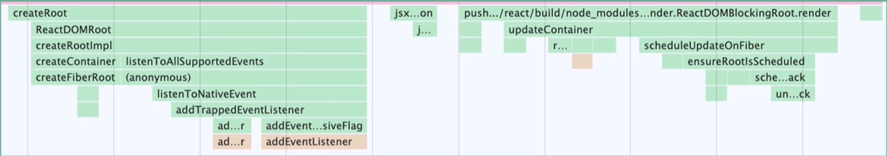

React 是如何知道当前处于哪个模式的呢？这里以 requestUpdateLane 为例：

```JavaScript
function requestUpdateLane(fiber) {
  // 获取 mode 属性
  var mode = fiber.mode;

  // 结合 mode 属性判断当前的同、异步模式
  if ((mode & BlockingMode) === NoMode) {
    return SyncLane;
  } else if ((mode & ConcurrentMode) === NoMode) {
    return getCurrentPriorityLevel() === ImmediatePriorityS1 ? SyncLane : SyncBatchedLane;
  }

  // ...

  return lane;
}
```

因此不同的渲染模式在挂载阶段的差异，本质上来说 **mode 属性**的差异，mode 属性决定着这个工作流是**同步**的，还是**异步**的。

#### **Fiber 架构一定是异步渲染吗？**

React 16 如果没有开启 Concurrent 模式，那它还能叫 Fiber 架构吗？

从动机上来看，Fiber 架构的设计确实是为了 Concurrent 而存在。

但是，Fiber 架构在 React 中并不能够和异步染画严格的等号，它是一种同时兼容了同步渲染与异步渲染的设计。

### **ReactDOM\.render 调用栈——render 阶段**

#### **workInProgress 节点的创建**

React 15 下的调和过程是一个递归的过程，在 ReactDOM\.render 触发的同步模式下，它仍然是一个深度优先搜索的过程，在这个过程中，beginWork 将创建新的 Fiber 节点，而 completeWork 则负责将 Fiber 节点映射为 DOM 节点。


```JavaScript
//这里入参中的 current 传入的是现有树结构中的 rootFiber 对象
function createWorklnProgress(current, pendingProps) {
  var workInProgress = current.alternate;
  // ReactDOM.render 触发的首屏渲染将进入这个逻辑
  if (workInProgress === null) {
    // 这是需要关注的第一个点，workInProgress 是 createFiber 方法的返回值
    workInProgress = createFiber(current.tag, pendingProps, current.key, current.mode)
    workInProgress.elementType = current.elementType;
    workInProgress.type = current.type;
    workInProgress.stateNode = current.stateNode;

    // 这是需要关注的第二个点，workInProgress的 alternate 将指向 current
    workInProgress.alternate = current;

    // 这是需要关注的第三个点，current 的 alternate 将反过来指向 workInProgress
    current.alternate = workInProgress;
  } else {
    // else 的逻辑此处先不用关注
  }

  // 以下省略大量 workInProgress 对象的属性处理逻辑

  // 返回 workInProgress 节点
  return workInProgress;
}
```

current 入参：现有树结构中的 rootFiber 对象

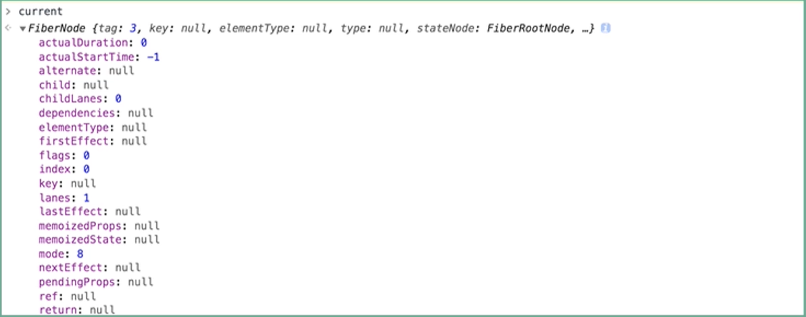

- createWorklnProgress 将调用 createFiber，workInProgress 是 createFiber 方法的返回值

- workInProgress 的 alternate 将指向 current

- current 的 alternate 将反过来指向 workInProgress

```JavaScript
// createFiber 将创建一个 FiberNode 实例
var createFiber = function (tag, pendingProps, key, mode) {
  return new FiberNode(tag, pendingProps, key, mode);
}
```

```JavaScript
workInProgress = createFiber(current.tag, pendingProps, current.key, current.mode);
```

workInProgress 节点其实就是 current 节点（即 rootFiber）的副本。

Fiber 树结构如下图所示：


完成了这个任务之后，就会进入 workLoopSync 的逻辑。

```JavaScript
// workLoopSync 的逻辑就是：通过 while 循环反复判断 workInProgress 是否为空
function workLoopSync() {
  // 若 workInProgress 不为空
  while (workInProgress !== null) {
    // 针对它执行 performUnitOfWork 方法
    // performUnitOfWork 函数将触发对 beginWork 的调用，进而实现对新 Fiber 节点的创建，若 beginWork 所创建的 Fiber 节点不为空，则 performUnitOfWork 会用这个新的 Fiber 节点来更新 workInProgress 的值，为下一次循环做准备
    performUnitOfWork(workInProgress)
  }
}
```

通过循环调用 performUnitofWork 来触发 beginWork，新的 Fiber 节点就会被不断地创建。

当 workInProgress 终于为空时，说明没有新的节点可以创建了，也就意味着已经完成对整个 Fiber 树的构建，在这个过程当中，每一个被创建出来的新 Fiber 节点都会一个一个挂载为最初那个 workInProgress 节点的后代节点。

而上述过程当中构建出的这个 Fiber 树，也正是大名鼎鼎的 workInProgress 树。

#### **beginWork 开启 Fiber 节点创建过程**

```JavaScript
function beginWork(current, workInProgress, renderLanes) {
  // .....

  // current 节点不为空的情况下，会加一道辨识，看看是否有更新逻辑要处理
  if (current !== null) {
    // 获取新旧 props
    var oldProps = current.memoizedProps;
    var newProps = workInProgress.pendingProps;
    // 若 props 更新或者上下文改变，则认为需要"接受更新
    if (oldProps !== newProps || hasContextChanged() || (workInProgress.type !== current.type)) {
      // 打个更新标
      didReceiveUpdate = true;
    } else if (A/* 不需要更新的情况 A */) {
      return A
    } else {
      if (B/* 需要更新的情况 B */) {
        didReceiveUpdate = true;
      } else {
        // 不需要更新的其他情况，这里的首次渲染就将执行到这一行的逻辑
        didReceiveUpdate = false;
      }
    }
  } else {
    didReceiveUpdate = false;
  }

  // ...

  // 这坨 switch 是 beginWork 中的核心逻辑，原有的代码量相当大
  switch (workInProgress.tag) {
    // ......

    // 这里省略掉大量形如"case:xxx”的逻辑
    // 根节点将进入这个逻辑
    case HostRoot:
      return updateHostRoot(current, workInProgress, renderLanes)

    // dom 标签对应的节点将进入这个逻辑
    case HostComponent:
      return updateHostComponent(current, workInProgress, renderLanes)

    // 文本节点将进入这个逻辑
    case HostText:
      return updateHostText(current, workInProgress)
    // .....
    // 这里省略掉大量形如"case:xxx”的逻辑
  }

  // 这里是错误兜底，处理 switch 匹配不上的情况
  {
    {
      throw Error("Unknown unit of work tag (" + workInProgress.tag + "). This error is likely caused by a bug in React. Please file an issue.")
    }
  }
}
```

- beginWork 的入参是一对用 alternate 连接起来的 worklnProgress 和 current 节点

- beginWork 的核心逻辑是根据 fiber 节点（workInProgress）的 tag 属性的不同，调用不同的节点创建函数

当前的 current 节点是 rootFiber，而 workInProgress 则是 current 的副本，它们的 tag 都是 3。

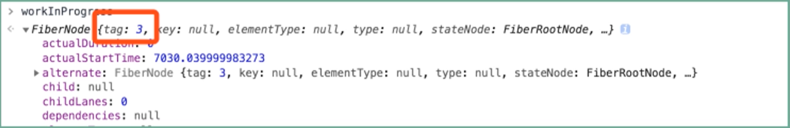

而 3 正是 HostRoot 所对应的值，因此第一个 `beginWork` 将进入 `updateHostRoot` 的逻辑，而 React 源码中 "updateXxx" 命名的函数有十多种，我们不可能去扣每一个函数的逻辑，但它们都有一个共同的逻辑，就是调用了 `reconcileChildren` 函数，生成当前节点的子节点。

```JavaScript
// reconcileChildren 只是做逻辑的分发，具体的工作还要到 mountChildFibers 和 reconcileChildFibers 里面去看
function reconcileChildren(current, workInProgress, nextChildren, renderLanes) {
  // 判断 current 是否为 null
  if (current === null) {
    // 若 current为 null，则进入 mountChildFibers 的逻辑
    workInProgress.child = mountChildFibers(workInProgress, null, nextChildren, renderLanes)
  }
  else {
    // 若 current 不为 null，则进入 reconcileChildFibers 的逻辑
    worklnProgress.child = reconcileChildFibers(workInProgress, current.child, nextChildren, renderLanes);
  }
}
```

#### **ChildReconciler，处理 Fiber 节点的幕后 “操盘手“**

```JavaScript
// 它们都是 ChildReconciler 这个函数的返回值，仅仅存在入参上的区别
var reconcileChildFibers = ChildReconciler(true);
var mountChildFibers = ChildReconciler(false);
```

```JavaScript
function ChildReconciler(shouldTrackSideEffects) {
  // 删除节点的逻辑
  function deleteChild(returnFiber, childToDelete) {
    if (!shouldTrackSideEffects) {
      // Noop.
      return;
    }

    // 以下执行删除逻辑
  }

  // ......

  // 单个节点的插入逻辑
  function placeSingleChild(newFiber) {
    if (shouldTrackSideEffects && newFiber.alternate === null) {
      newFiber.flags = Placement;
    }

    return newFiber;
  }

  // 插入节点的逻辑
  function placeChild(newFiber, lastPlacedIndex, newlndex) {
    newFiber.index = newIndex;

    if (!shouldTrackSideEffects) {
      // Noop.
      return lastPlacedIndex;
    }

    // 以下执行插入逻辑
  }

  // .....

  // 此处省略一系列 updateXXX 的函数，它们用于处理 Fiber 节点的更新

  // 处理不止一个子节点的情况
  function reconcileChildrenArray(returnFiber, currentFirstChild, newChildren, lanes) {
    // ......
  }

  // 此处省略一堆 reconcileXXXXX 形式的函数，它们负责处理具体的 reconcile 逻辑
  function reconcileChildFibers(returnFiber, currentFirstChild, newChild, lanes) {
    // 这是一个逻辑分发器，它读取入参后，会经过一系列的条件判断，调用上方所定义的负责具体节点操作的函数
  }

  // 将总的 reconcileChildFibers 函数返回
  return reconcileChildFibers;
}
```

- 关键的入参 shouldTrackSideEffects 意为是否需要追踪副作用，因此 reconcileChildFibers 和 mountChildFibers 的不同，在于对副作用的处理不同

- ChildReconciler 中定义了大量如 placeXXX、deleteXXX、updateXXX、reconcileXXX 等这样的函数，这些函数覆盖了对 Fiber 节点的创建、增加、删除、修改等动作，将直接或间接地被reconcileChildFibers 所调用

- childReconciler 的返回值是一个名为 reconcileChildFibers 的函数，这个函数是一个逻辑分发器，它将根据入参的不同，执行不同的 Fiber 节点操作，最终返回不同的目标 Fiber 节点

对于对副作用的处理不同，到底是哪里不同，以 placeSingleChild 为例：

```JavaScript
function placeSingleChild(newFiber) {
  if (shouldTrackSideEffects && newFiber.alternate === null) {
    // 给 fiber 节点打上 flags 的标记
    newFiber.flags = Placement;
  }

  return newFiber;
}
```

在这里，Placement 对应的显然是 DOM 相关的副作用操作，像 Placement 这样的副作用标识还有很多，它们均已二进制常量的形式存在。

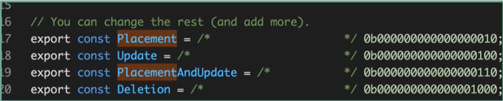

以上仅为局部示例。

由于 current 是 rootFiber，它不为 null，因此它将走入 `worklnProgress.child = reconcileChildFibers(workInProgress, current.child, nextChildren, renderLanes);` 的逻辑，也就是说，在 `reconcileChildFibers`  和`mountChildFibers` 之间，它选择的是 `reconcileChildFibers`。

结合前面的分析可知，`reconcileChildFibers` 是 `ChildReconciler` 的返回值，入参为 true，意味着其内部逻辑是允许追踪副作用的，因此答 effectTag 这个动作将会生效，接下来进入 `reconcileChildFibers` 的逻辑，在 `reconcileChildFibers` 这个逻辑分发器中，会把 `rootFiber` 子节点的创建工作分发给 `reconcileXxx` 函数家族的一员。

`reconcileSingleElement` 来处理具体的调用形式，`reconcileSingleElement` 将基于 rootFiber 子节点的 React Element 对象信息，创建其对应的 FiberNode，逻辑如下：`var _created4 = createFiberFromElement(element, returnFiber.mode, lanes);
``var`，这里需要说明的一点是，rootFiber 作为 Fiber 树的根节点，它并没有一个确切的 React Element 与之映射，结合 JSX 结构来看，可以将其理解为 JSX 中根组件的父节点。


#### **小科普：flags 是什么？**

在更早一些的版本中，这个属性名叫 “effectTag”。

Placement 这个 effectTag 的意义是告诉渲染器：**我这里需要新增 DOM 节点**。

effectTag 记录的是**副作用**的类型（“数据获取、订阅或者修改DOM” 等动作）。

#### **Fiber 节点的创建过程梳理**

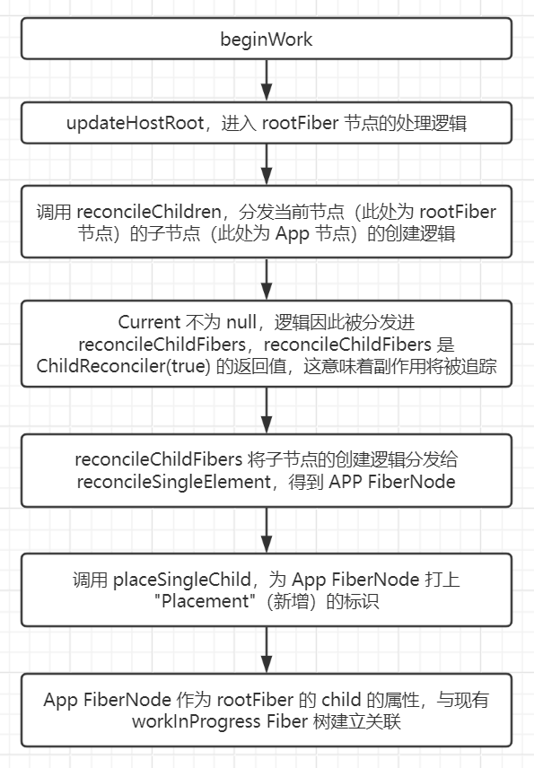

#### **Fiber 树的构建过程**

##### **循环创建新的 Fiber 节点**

```JavaScript
function workLoopSync() {
  // 若 workInProgress 不为空
  while (workInProgress !== null) {
    // 针对它执行 performUnitOfWork 方法
    // performUnitOfWork 的主要作用是通过调用 beginWork 来实现新 Fiber 节点的创建，它还有一个次要工作，就是把新创建的这个 Fiber 节点的值，更新到 workInProgress 变量里面去
    performUnitOfWork(worklnProgress);
  }
}
```

```JavaScript
// performUnitOfWork 内部的部分源码

// 新建 Fiber 节点
next = beginWork$1(current, unitOfWork, subtreeRenderLanes);

// 将新的 Fiber 节点赋值给 workInProgress
if (next === null) {
  // 如果这不会催生新的工作，那就完成当前的工作。
  completeUnitofWork(unitofWork);
} else {
  workInProgress = next;
}
```

##### **Fiber 节点间是如何连接的呢？**

不同的 Fiber 节点之间，将通过 **child、return、sibling** 这 3 个属性建立关系。

- 其中 **child、return** 记录的是**父子**节点关系

- 而 **sibling** 记录的则是**兄弟**节点关系

通过上述可以得知，Fiber 树虽然被称为树，但是它的数据结构本质其实已经从树变成了链表，注意在上述分析 Fiber 的构建过程时，选取了 `beginWork` 作为切入点，但整个 Fiber 树的构建过程中，并不是只有 `beginWork` 在工作，这其中还穿插着 `completeWork` 的工作，只用将 `completeWork` 和 `beginWork` 放在一起来看，才能够真正理解 Fiber 架构下的深度优先遍历到底是怎么回事。

### **ReactDOM\.render 调用栈——commit 阶段**

#### **completeWork 的调用时机**


```JavaScript
function performUnitofWork(unitOfWork) {
  // ...

  // 获取入参节点对应的 current 节点
  var current = unitOfWork.alternate;

  var next;

  // performUnitofWork 每次会尝试调用 beginWork 来创建当前节点的子节点
  if (xxx) {
    // ...

    // 创建当前节点的子节点
    next = beginWork$1(current, unitOfWork, subtreeRenderLanes);

    // ...
  } else {
    // 创建当前节点的子节点
    next = beginWork$1(current, unitOfWork, subtreeRenderLanes);
  }

  // ...

  // 若创建出来的子节点为 null，则说明当前节点是一个叶子节点，按照深度优先遍历的原则，当遍历到叶子节点时，递节点就结束了，随之而来的是归的过程，因此，在这种情况下，就会调用 completeUnitOfWork 执行当前节点对应的 completeWork 逻辑
  if (next === null) {
    // 调用 completeUnitofWork
    completeUnitofWork(unitofWork);
  } else {
    // 将当前节点更新为新创建出的 Fiber 节点
    workInProgress = next;
  }

  // ...
}
```

#### **completeWork 的工作原理**

```JavaScript
// 1、completeWork 的核心逻辑是一段体量巨大的 switch 语句，在这段 switch 语句中，completeWork 将根据 workInProgress 节点的 tag 属性不同，进入不同的 DOM 节点的创建处理逻辑
// 2、
function completeWork(current, workInProgress, renderLanes) {
  // 取出 Fiber 节点的属性值，存储在 newProps 里
  var newProps = workInProgress.pendingProps;

  // 根据 workInProgress 节点的 tag 属性的不同，决定要进入哪段逻辑
  switch (worklnProgress.tag) {
    case xxx:
      return null;
    case ClassComponent:
      {
        // ...
      }

    case HostRoot:
      {
        // ...
      }

    // h1 节点的类型属于 HostComponent，因此这里为你讲解的是这段逻辑
    case HostComponent:
      {
        popHostContext(workInProgress);
        var rootContainerInstance = getRootHostContainer();
        var type = workInProgress.type;

        // 判断 current 节点是否存在，因为目前是挂载阶段，因此 current 节点是不存在的
        if (current !== null && workInProgress.stateNode != null) {
          updateHostComponent$1(current, workInProgress, type, newProps, rootContainerInstance);

          if (current.ref !== workInProgress.ref) {
            markRef$1(workInProgress);
          }
        } else {
          // 这里首先是针对异常情况进行 return 处理
          if (!newProps) {
            if (!(workInProgress.stateNode !== null)) {
              {
                throw Error("We must have new props for new mounts. This error is likely caused by a bug in React.Please file an issue.");
              }
            }

            return null;
          }

          // 接下来就为 DOM 节点的创建做准备了
          var currentHostContext = getHostContext();

          // _wasHydrated 是一个与服务端渲染有关的值，这里不用关注
          var _wasHydrated = popHydrationState(workInProgress);

          // 判断是否是服务端渲染
          if (_wasHydrated) {
            // 这里不用关注，请你关注 else 里面的逻辑
            if (prepareToHydrateHostlnstance(worklnProgress, rootContainerInstance, currentHostContext)) {
              markUpdate(worklnProgress);
            } else {
              // 这一步很关键，createInstance 的作用是创建 DOM 节点
              var instance = createInstance(type, newProps, rootContainerInstance, currentHostContext, workInProgress);
              // appendAllChildren 会尝试把上一步创建好的 DOM 节点挂载到 DOM 树上去
              appendAllChildren(instance, workInProgress, false, false);

              // stateNode 用于存储当前 Fiber 节点对应的 DOM 节点
              workInProgress.stateNode = instance;

              // finalizeInitialChildren 用来为 DOM 节点设置属性
              if (finalizeInitialChildren(instance, type, newProps, rootContainerInstance)) {
                markUpdate(workInProgress);
              }
            }

            // ...
          }

          return null;
        }
      }

    case HostText:
      {
        // ...
      }

    case SuspenseComponent:
      {
        // ...
      }
    case HostPortal:
      // ...
      return null;

    case ContextProvider:
      // ...
      return null;
    // ...
  }

  {
    {
      throw Error("Unknown unit of work tag (" + workInProgress.tag + "). This error is likely caused by a bug in React. Please file an issue.");
    }
  }
}
```

- completeWork 的工作内容：负责处理 Fiber 节点到 DOM 节点的映射逻辑

- completeWork 内部有3个关键动作：

    1. **创建** DOM 节点（Createlnstance）

    2. 将 DOM 节点**插入**到 DOM 树中（AppendAllChildren）

    3. 为 DOM 节点**设置属性**（FinalizelnitialChildren）

- 创建好的 DOM 节点会被赋值给 workInProgress 节点的 stateNode 属性，也就是说，当想要定位一个 Fiber 对应的 DOM 节点时，访问它的 stateNode 属性就可以了

- 将 DOM 节点插入到 DOM 的操作是通过 appendAllchildren 函数来完成的，说是将 DOM 节点插入到 DOM 树里去，实际上是将子 Fiber 节点所对应的 DOM 节点挂载到其父 Fiber 节点所对应的 DOM 节点里去

> 如果执行 appendAllchildren 时，父级的 DOM 节点还不存在怎么办？
> 
> 比如 h1 节点作为第一个进入 completeWork 的节点，它的父节点 div 对应的 DOM 就尚不存在。其实不存在也没关系，反正 h1 DOM 节点被创建后，会作为 h1 Fiber 节点的 stateNode 属性存在，当父节点 div 进入 appendAllChildren 逻辑后，会逐步向下查找并添加自己的后代节点，这时候 h1 就会被它的父级 DOM 节点收入囊中了。
> 
> 

#### **completeUnitOfWork——开启收集 EffectList 的 “大循环“**

completeUnitOfWork 的作用是开启一个大循环，在这个大循环中将会重复的做下面三件事：

1. 针对传入的当前节点，调用 completeWork

    > 工作内容在上方
    > 
    > 

2. 将当前节点的副作用链插入到其父节点对应的副作用链中

3. 以当前节点为起点，循环遍历其兄弟节点及其父节点，

    - 当遍历到兄弟节点时，将 return 掉当前调用，触发兄弟节点对应的 performUnitOfWork 逻辑

    - 当遍历到父节点时，则会直接进入下一轮循环，也就是重复1、2的逻辑

#### **completeUnitofWork 开启下一轮循环的原则**

步骤三是整个循环体的收尾工作，他会在当前节点相关的各种工作都做完之后执行，当前节点处理完了自然是去寻找下一个可以处理的节点，当前的 Fiber 节点之所以会进入 completeWork，是因为 “递无可递” 了，才会进入 “归” 的逻辑，这就意味着当前 Fiber 要么没有 child 的节点，那么 child 节点的 completeWork 早就执行过了，因此这样的节点不会是下次循环需要考虑的对象，下次循环只需要考虑兄弟节点和父节点。

```JavaScript
// 以下为步骤三的源码
do {
  // ...
  // 这里省略步骤 1和步骤 2的逻辑

  // 获取当前节点的兄弟节点
  var siblingFiber = completedWork.sibling;

  // 若兄弟节点存在
  if (siblingFiber !== null) {
    // 将 workInProgress 赋值为当前节点的兄弟节点
    workInProgress = siblingFiber;
    // 将正在进行的 completeUnitOfWork 逻辑 return 掉
    return;
  }

  // 若兄弟节点不存在，completeWork 会被赋值为 returnFiber，也就是当前节点的父节点
  completedWork = returnFiber;
  // 这一步与上一步是相辅相成的，上下文中要求 workInProgress 与 completedWork 保持一致
  workInProgress = completedWork;
} while (completedWork !== null);
```

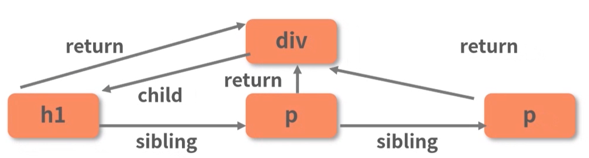

h1 节点是递归过程中所触及的第一个叶子节点，也是其兄弟节点中被遍历到的第一个节点，而剩下的两个 P 节点此时都还没有被便利到，也就是说连 beginWork 都没有执行过，对于 h1 节点的兄弟节点来说，当下的第一要务是回去从 beginWork 开始走起，直到 beginWork “递无可递” 时，才能够执行 completeWork 的逻辑。

completeWork 的调用是在 performUnitOfWork 里发生的，因此 completeUnitOfWork 一旦识别当前节点的兄弟节点不为空，就会终止后续的逻辑，退回到上一层的 performUnitOfWork 里去。

在向下递归到 h1 的过程中，div 必定已经被遍历过了，也就是说 div 的 “递” 阶段（beginWork）已经执行完毕，只剩下 “归” 阶段的工作要处理了，因此对于父节点，completeUnitOfWork 会毫不犹豫地把它推到下一次循环离去，让它进入 completeWork 的逻辑，值得注意的是，completeUnitOfWork 中处理兄弟节点和父节点的顺序是，先检查兄弟节点是否存在，若存在则优先处理兄弟节点，确认没有待处理的兄弟节点后，才转而处理父节点，这也就意味着，completeWork 的执行是严格自底向上的，子节点的 completeWork 总会优先于父节点执行。

#### **副作用链（effectList）的设计与实现**

无论是 beginWork 还是 completeWork，它们的应用对象都是 workInProgress 树上的节点，render 阶段是一个递归的过程，递归的对象正是这个 workInProgress 树。

那么递归的目的是什么呢，或者说 render 阶段的工作目标是什么呢？

**找出界面中需要处理的更新**。在实际的操作当中，并不是所有的节点上都会产生需要处理的更新，比如在挂载阶段，对图中的整棵 workInProgress 递归完毕后，React 会发现实际只需要对 App 节点执行一个挂载操作就可以了，而在更新阶段，这种现象更为明显，更新阶段与挂载阶段的主要区别在于，更新阶段的 current 树不为空。

按照 React 的设计思路，render 阶段结束后，”找不同” 这件事情其实也就告一段落了，**commit 只负责实现更新，而不负责寻找更新**，这就意味着必须找到一个办法，能让 commit 阶段直接拿到 render 阶段的工作成功，而这正式副作用链的价值所在。

**副作用链（effectList）**可以理解为 render 阶段 “工作成果” 的一个集合，每个 fiber 节点都维护着一个属于它自己的 effectList，effectList 在数据结构上以列表的形式存在，列表内的每一个元素都是一个 Fiber 节点，这些 Fiber 节点需要满足两个共性：

1. 都是当前 Fiber 节点的后代节点

2. 都有待处理的副作用

Fiber 节点的 effectList 里记录的是其需要更新的后代节点。

> 将当前节点的副作用链（effectList）插入到其父节点对应的副作用链（effectList）中。
> 
> 

把所有需要更新的 Fiber 节点单独串成一串链表，方便后续有针对性地对它们进行更新，这就是所谓的 “收集副作用” 的过程。

effectList 列表在 Fiber 节点中是通过 firstEffect（effectList 的第一个节点）和 lastEffect（effectList 的最后一个节点）来维护的。

```JavaScript
// completeUnitOfWork 的源码
// effectList 的创建逻辑非常简单，只需要为 firstEffect 和 lastEffect 各附一个引用即可
// 若副作用类型的值大于 “PerformedWork”，则说明这里存在一个需要记录的副作用
if (flags > PerformedWork) {
  // returnFiber 是当前节点的父节点
  if (returnFiber.lastEffect !== null) {
    // 若父节点的 effectList 不为空，则将当前节点追加到 effectList 的末尾去
    returnFiber.lastEffect.nextEffect = completedWork;
  } else {
    // 若父节点的 effectList 为空，则当前节点就是 effectList 的 firstEffect
    returnFiber.firstEffect = completedWork;
  }

  // 将 effectList 的 lastEffect 指针后移一位
  returnFiber.lastEffect = completedWork;
}
```

1. App FiberNode 的 flags 属性为 3，大于 PerformedWork，因此会进入 effectList 的创建逻辑

2. 创建 effectList 时，并不是为当前 Fiber 节点创建，而是为它的父节点创建，App 节点的父节点是 rootFiber，rootFiber 的 effectList 此时为空

3. rootFiber 的 firstEffect 和 lastEffect 指针都会指向 App 节点，App 节点由此成为 effectList 中的唯一一个 FiberNode

#### **commit 阶段工作流简析**

在整个 ReactDOM\.render 的渲染链路当中，render 阶段是 Fiber 架构的核心体现。

commit 会在 performSuncWorkOnRoot 中被调用，如下图所示：


这里的入参 root 并不是 rootFiber，而是 fiberRoot 实例， fiberRoot 的 current 节点指向 rootFiber，因此拿到 effectList 对后续的流程来说不是什么难事，从流程上来说 commit 共分为三个阶段：

1. **before mutation 阶段**。这个阶段 DOM 节点还没有被染到界面上去，过程中会触发 getSnapShotBeforeUpdate，也会处理useEffect 钩子相关的调度逻辑

2. **mutation 阶段**。这个阶段负责 DOM 节点的渲染，在渲染过程中会遍历 effectList，根据 flex 的不同执行不同的 DOM 操作

3. **layout 阶段**。这个阶段处理 DOM 染完毕之后的收尾逻辑，比如调用 componentDidMount、componentDidUpdate、useLayoutEffect 钩子函数的回调等等，除了这些之外，它还会把 fiberRoot 的 current 指针指向 worklnProgress Fiber 树

## **Concurrent 模式的实现原理**

经过上面的讲述，现在需要对下面这些函数的工作内容有所了解：

1. performSyncWorkOnRoot：开启 render 阶段

2. workLoopSync：通过 while 循环反复判断 workInProgress 是否为空

3. performUnitOfWork：触发对 beginWork 的调用，进而实现对新 Fiber 节点的创建

4. beginWork：开启 “递” 的过程，将创建新的 Fiber 节点

5. completeWork：开启 “归” 的过程，将 Fiber 节点映射为 DOM 节点

6. completeUnitOfWork：开启 “大循环”，收集 effectList

7. reconcileChildFibers：一个逻辑分发器，它将根据入参的不同，执行不同的 Fiber 节点操作，最终返回不同的目标 Fiber 节点

上述中遗留下来的两棵树问题：两棵树之间的合作模式，足以将挂载过程和更新过程联系起来，current 树与 workInProgress 树双缓冲模式在 Fiber 架构下的实现。

### **什么是 “双缓冲” 模式？**

“双缓冲” 模式，其实是一种在游戏领域由来已久、广泛应用的经典设计模式。

示例：

假如去看一场总时长只有1个小时的话剧，中场不休息，需要不间断地演出，对这场话剧来说，半个小时处需要一次转场（转场是指话剧舞台的灯光、布景、氛围都要全部切换到另一种风格里去），在不中断演出的情况下，想要实现转场，怎么办呢？场务工作做得再快也要十几分钟，二十几分钟，这对一场时长一小时的话剧来说，实在太漫长了，观众也无法接受这样的剧情卡顿体验。

有一种解法，那就是准备两个舞台来做这场戏，当一个舞台处于使用中时，第二个舞台的布局已经完成，这样当第一个舞台的表演结束时，只需要把第一个舞台的灯光灭掉，第二个舞台的灯光亮起，就可以做到剧情的无缝衔接了，事实上，在真实的话剧当中，我们也确实常常看到这样的画面，演员从舞台的左侧走到了右侧，灯光一切换就从卧室走到了公园，又从公园走到了办公室，左侧舞台的布景从卧室变成了办公室。这个过程正是在演员利用右侧舞台表演时完成的，在这个过程当中，我们可以认为，左侧舞台和右侧舞台分别是两套缓冲数据，而呈现在观众眼前的连贯画面，就是不同的缓冲数据交替被读取后的结果。

在计算机图形领域，通过让图形硬件交替读取两套缓冲数据，可以实现画面的无缝切换，减少视觉效果上的抖动甚至卡顿。在 React 中，双缓冲模式的主要利好，则是能够帮我们较大限度地实现 Fiber 节点的复用，从而减少性能方面的开销。

current 树与 workInProgress 树之间是如何相互利用的？

### **completeWork 的工作原理**

在 React 中，current 树与 worklnProgress 树可以对标 “双缓冲” 模式下的两套缓冲数据，当 current 树呈现在用户眼前时，所有的更新都会由 worklnProgress 树来承接，workInProgress 树将会在用户看不到的地方（内存里）悄悄地完成所有改变。

直到灯光打到它身上，也就是 current 指针指向它的时候，此时就意味着 commit 阶段已经执行完毕，workInProgress 树变成了那颗呈现在界面上的 current 树。

### **current 树与 worklnProgress 树之间是如何 “相互利用” 的**

示例代码：

```JavaScript
import { useState } from "react";

function App() {
  const [state, setState] = useState(0);
  return (
    <div className="App">
      <div
        onClick={() => {
          setState(state + 1);
        }}
        className="container"
      >
        <p style={{ width: 128, textAlign: "center" }}>{state}</p>
      </div>
    </div>
  );
}

export default App;
```

#### **挂载后的 Fiber 树**

挂载时的，render 阶段结束后，commit 阶段执行前的两棵 Fiber 树的形态。

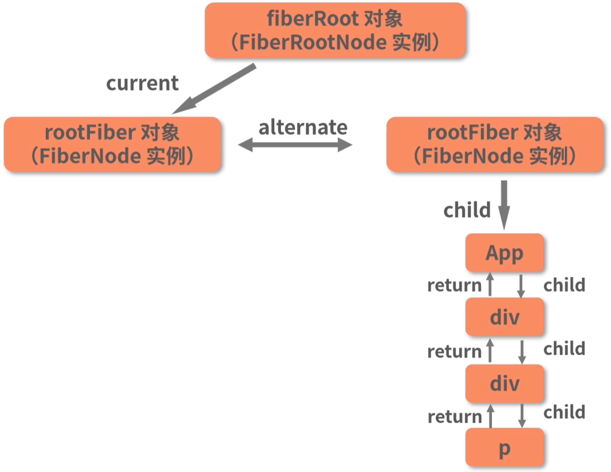

在 commit 阶段完成后，右侧的 workInProgress 树对应的 DOM 树就被真正渲染到页面上。此时，current 指针会指向 workInProgress 树。

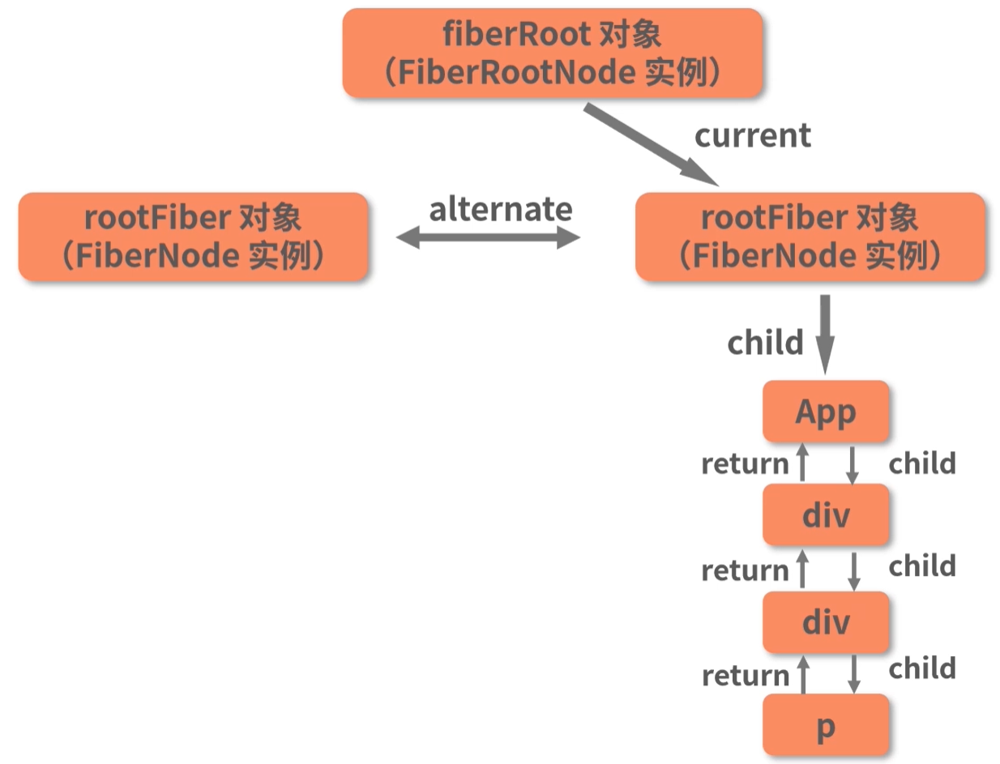

由于挂载是一个从无到有的过程，那在这个过程当中，我们是在不断的创建新节点，因此还谈不上什么节点复用，节点复用要到更新过程中去看。

#### **第一次更新**

第一次更新，下图高亮的 rootFiber 节点就会被复用，这段复用的逻辑在 beginWork 调用链路中的 createWorkInProgress 方法里。

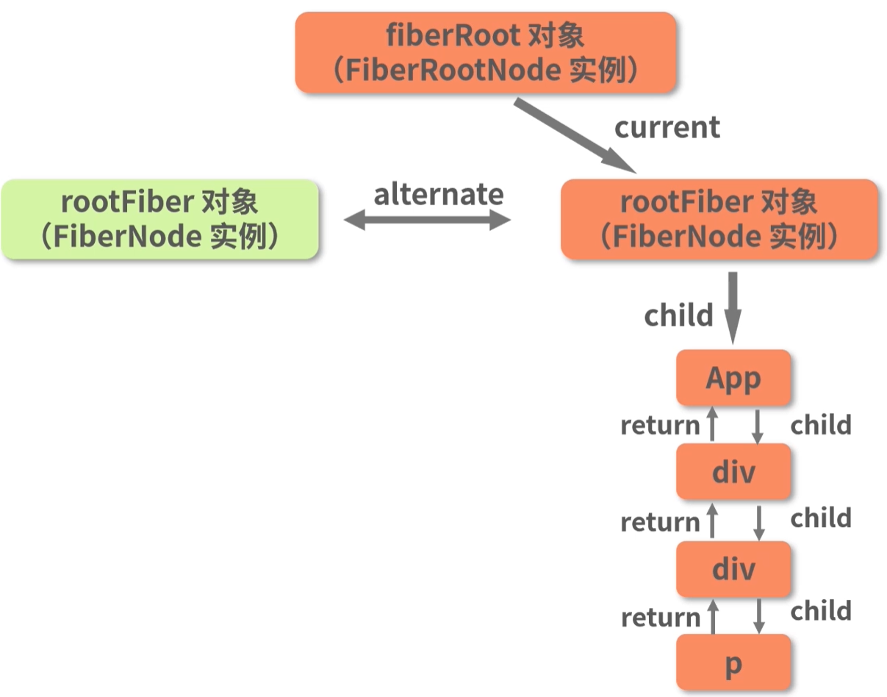

以下为 createWorkInProgress 函数的逻辑：在 createWorkInProgress 方法中，会先取当前节点的 alternate 属性，将其记为 workInProgress 节点，对于 rootFiber 节点来说，它的 alternate 属性其实就是上一棵 current 树的 rootFiber 节点，如上图高亮节点所示。

当检查到上一棵 current 树的 rootFiber 存在时，root 会直接复用这个节点，让它作为下一棵 workInProgress 的节点存在下去，也就是说会走进 createWorkInProgress 的 else 逻辑里去，如果它和目标的 workInProgress 节点之间存在差异，直接在该节点上修改属性，使其与目标节点一致即可，而不必再创建新的 Fiber 节点。

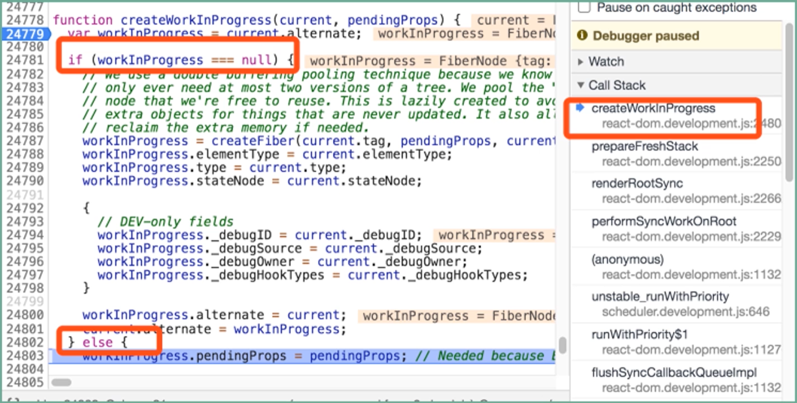

至于剩下的 App、div、p 等节点，由于没有对应的 alternate 节点存在，因此它们的 createWorkInProgress 调用会走进下图高亮处的逻辑中。

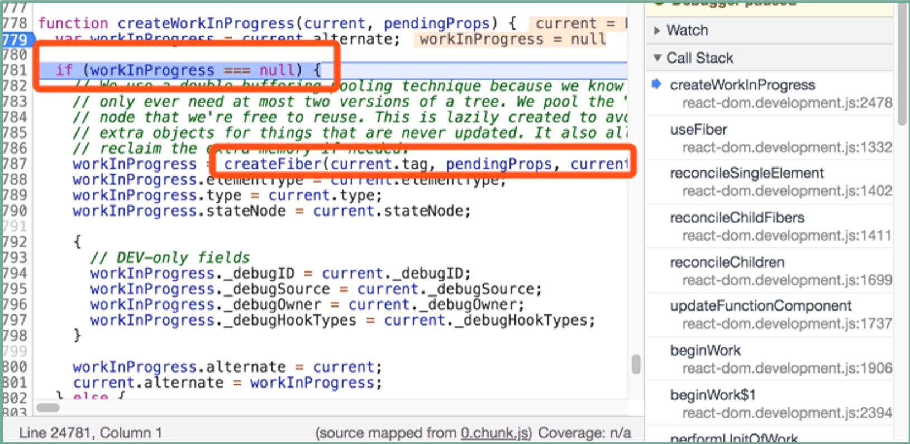

在这段逻辑里将调用 createFiber 来新建一个 fiberNode，第一次更新结束后，会得到一个新的 workInProgress Fiber 树，current 指针最后将会指向这个新的 workInProgress Fiber 树，如下图所示。

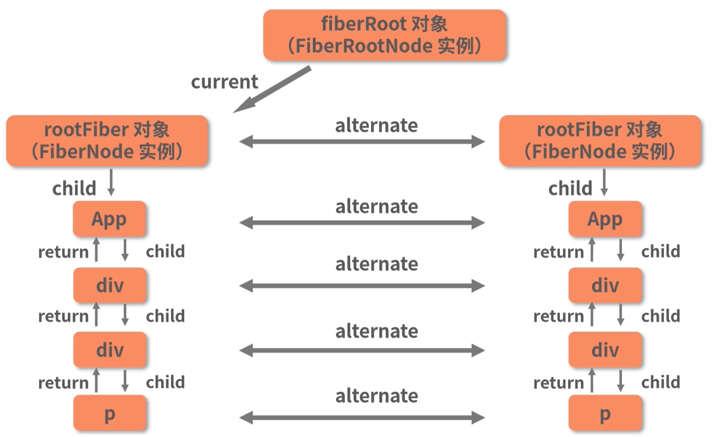

#### **第二次更新**

在第二次更新中，current 树中的每一个 alternate 属性都不为空，每次通过 beginWork 触发 createWorklnProgress 调用时，都会一致地走入 else 里面的逻辑，也就是直接复用现成的节点，以上便是 current 树和 workInProgress 树相互打配合，实现节点复用的过程。

### **更新链路要素拆解**

同步模式下的更新电路与挂载链路的 render 阶段基本上是一致的，都是通过 performSyncWorkOnRoot 来触发包括 beginWork、completeWork 在内的深度优先搜索过程，如下是一个更新过程的调用栈：

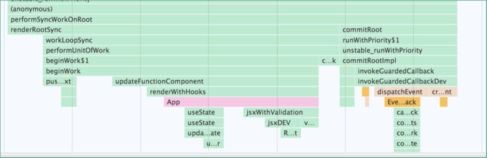

挂载可以理解为一种特殊的更新，ReactDOM\.render 和 setState 也是一种触发更新的姿势。

在 React 中，ReactDOM\.render、setState、useState 等方法都是可以以触发更新的，这些方法发起的调用链路很相似，是因为它们最后殊途同归，都会通过创建 update 对象来进入同一套更新工作流。

#### **update 的创建**

更新过程首先触发的是 dispatchAction 这个方法，如下图所示：


整体的更新链路如下：


dispatchAction 中会完成 update 对象的创建，如下图标红处所示：


#### **从 update 对象到 scheduleUpdateOnFiber**

下图为 updateContainer 函数中的相关逻辑：

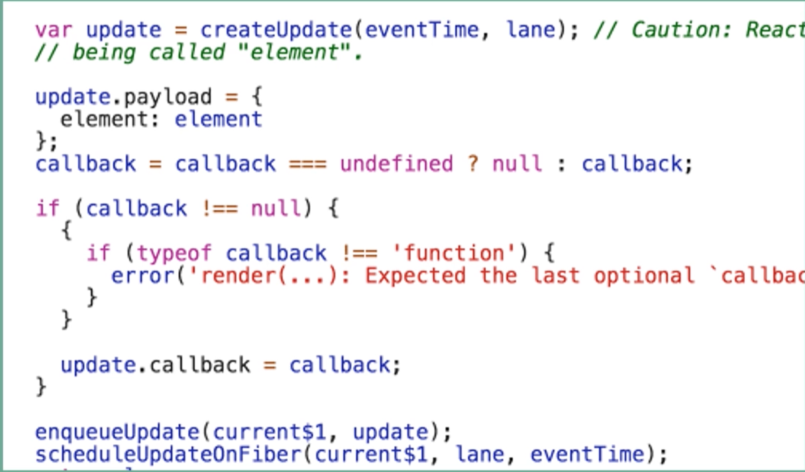

以 enqueueUpdate 为例，它一共做了以下三件事：

1. enqueueUpdate 之前：创建 update

2. enqueueUpdate 调用：将 update 入队

    > 每一个 Fiber 节点都会有一个属于它自己的 updateQueue，用于存储多个更新这个 updateQueue 是以链表形式存在的，在 render 阶段，updateQueue 的内容会成为 render 阶段，计算 Fiber 节点的新 state 的依据。
    > 
    > 

3. scheduleUpdateOnFiber：调度 update

    > 在同步挂载链路中，这个方法后面紧跟的就是 performSyncWorkOnRoot 所触发的 render 阶段
    > 
    > 

现在回过头来看 dispatchAction 的逻辑，就会发现，dispatchAction 里面同样有对这三个动作的处理，包含了对 update 对象的创建和入队处理，这里有一点需要提示一下，dispatchAction 中调度的是当前处理更新的节点，这一点和挂载过程需要区分开来，在挂载过程中，updateContainer 会直接调度根节点。

其实对于更新这种场景来说，大部分的更新动作确实都不是由根节点触发的，而 render 阶段的七点则是根节点，因此在 scheduleUpdateOnFiber 中有这样一个方法，见下图标红处：

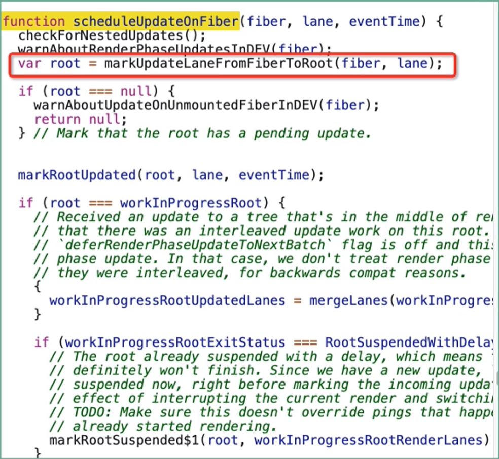

markUpdateLaneFromFiberToRoot 将会从当前 Fiber 节点开始向上遍历，直至根节点，并将根节点返回。

#### **scheduleUpdateOnFiber 如何区分同步还是异步？**

下图为 scheduleUpdateOnFiber 中的一段逻辑：

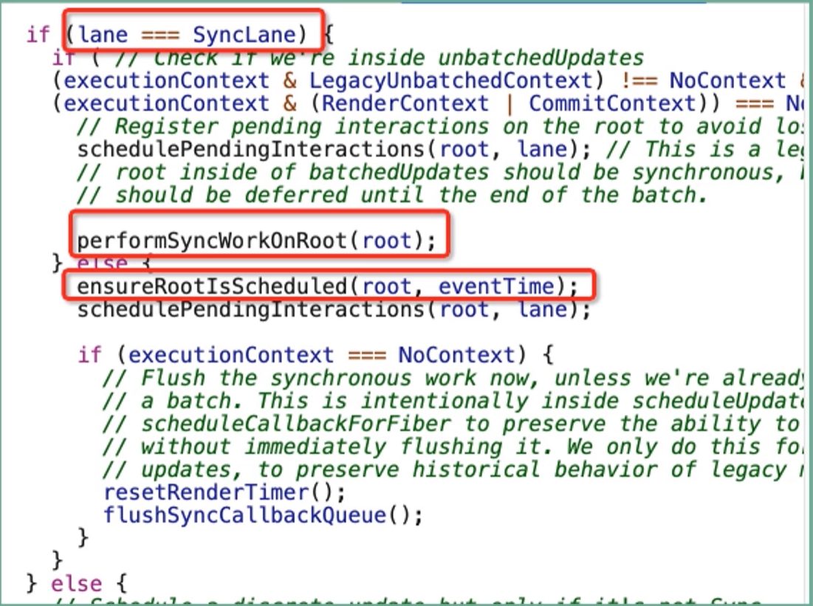

在同步的渲染链路中，`lane === SyncLane` 这个条件是成立的，因此会直接进入 performSyncWorkOnRoot 的逻辑，开启同步的 render 阶段。

而在异步渲染模式下，则将进入 else 的逻辑，在 else 中需要注意的是，ensureRootIsScheduled 这个方法，它将决定如何开启当前更新所对应的 render 阶段。

在 ensureRootIsScheduled 中，有如下一段核心逻辑：

```JavaScript
if (newCallbackPriority === SyncLanePriority) {
  // 同步更新的 render 入口
  newCallbackNode = scheduleSyncCallback(performSyncWorkOnRoot.bind(null, root));
} else {
  // 将当前任务的 lane 优先级转换为 scheduler 可理解的优先级
  var schedulerPriorityLevel = lanePriorityToSchedulerPriority(newCallbackPriority);
  // 异步更新的 render 入口
  newCallbackNode = scheduleCallback(schedulerPriorityLevel, performConcurrentWorkOnRoot.bind(null, root));
}
```

需要关注 performSyncWorkOnRoot 和 performConcurrentWorkOnRoot 这两个方法，前者是同步更新模式下的 render 阶段入口，而后者是异步模式下的 render 阶段入口，从这段逻辑当中可以看出，React 会以当前更新任务的优先级类型为依据，决定接下来是调度 performWorkOnRoot 还是 performConcurrentWorkOnRoot，这里调度任务用到的函数分别是 scheduleSyncCallback 和 scheduleCallback，这两个函数在内部都是通过调用 unstableScheduleCallback 方法来执行任务调度的，而 unstableScheduleCallback 正是 scheduler 中导出的一个核心方法。

### **scheduler——“时间切片” 与 “优先级” 的幕后推手**

scheduler 从架构上来看是 Fiber 架构分层中的调度层，从实践上来看，它并非是一段内嵌的逻辑，而是一个与 ReactDOM 同级的文件夹，其中收敛了所有相对通用的调度逻辑。

Fiber 架构下的异步渲染（即 Concurrent 模式）的核心特征分别是 **“时间切片”** 和 **“优先级调度”**，而这两点也正是 scheduler 的核心能力，接下来就以这两个特征为线索，解锁 scheduler 的工作原理。

#### **结合 React 调用栈，理解时间切片现象**

同步渲染模式下的 render 阶段是一个同步的、深度优先搜索的过程。

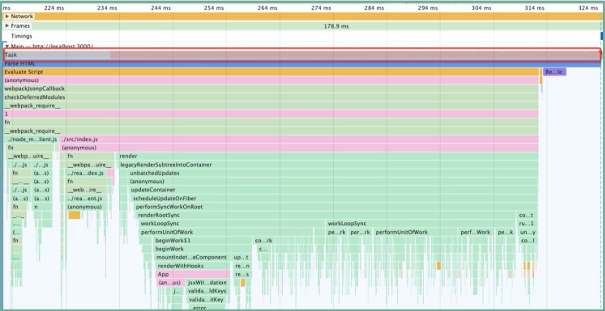

上图的顶层是一个不间断的灰色 Tack 长条，对浏览器来说，这就意味着一个不可中断的任务，在浏览器上，这个 Tack 的执行时长在 130ms 以上，假如浏览器的刷新频率为 60HZ，也就是说每 16\.6ms 就会刷新一次，在这 16\.6ms 里，处理 JS 线程外，渲染线程也有着工作要处理，超长的 Task 显然会挤占渲染线程的工作时间，引起 “调帧”，进而带来卡顿的风险。

若将 ReactDOM\.render 调用改为 createRoot 调用，调用栈就会变成下面这样：

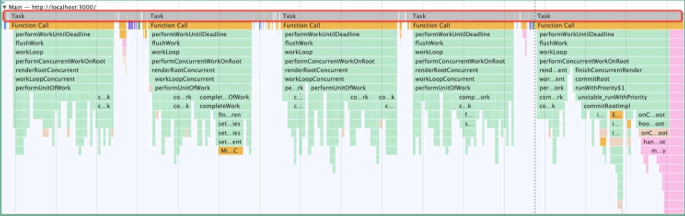

发现那个不间断的 Task 任务，现在像是被切过了一样，已经变成了多个断断续续的 Task 短条，也就是小任务，单个短 Task 的执行时长在浏览器中是 5ms 左右，这些短 Task 的工作量加起来和之前长 Task 工作量是一样的，但短 Task 之间流出的时间缝隙却给了浏览器喘息的机会，这就是所谓的时间切片效果。

#### **时间切片是如何实现的？**

在同步渲染中循环创建 Fiber 节点，构建 Fiber 树的过程是由 workLoopSync 函数来触发。

```JavaScript
function workLoopSync() {
  // 只要 workInProgress 不为空，while 循环就不会结束，它触发的是一个同步的 performUnitOfWork 循环调用过程
  while(workInProgress !== null) {
    performUnitOfWork(workInProgress);
  }
}
```

而在异步渲染模式下，这个循环是由 workLoopConcurrent 来开启的。

```JavaScript
function workLoopConcurrent() {
  // 当 shouldYield() 调用返回为 true，就说明当前需要对主线程进行让出了，此时 while 循环的判断条件整体为 false，while 循环将不再继续
  while(workInProgress !== null && !shouldYield()) {
    performUnitOfWork(workInProgress);
  }
}
```

```JavaScript
var Scheduler_shouldYield = Scheduler.unstable_shouldYield;

var shouldYield = Scheduler_shouldYield;
```

```JavaScript
exports.unstable_shouldYield = function () {
  // deadline：当前时间切片的到期时间，它的计算过程在 scheduler 包中的 performWorkUntilDeadline 方法里可以找到
  return exports.unstable_now() >= deadline;
};
```

```JavaScript
// currentTime：当前时间
// yieldInterval：时间切片的长度，不是一个常量，而是 React 根据浏览器的帧率大小计算所得出来的，与浏览器的性能有关
deadline = currentTime + yieldInterval;
```

时间切片的实现原理：React 会根据浏览器的帧率，计算出时间切片的大小，并结合当前时间计算出每一个切片的到期时间，在 workLoopConcurrent 中，while 循环每次执行前会调用 shouldYield 的函数来询问当前时间切片是否到期，若已到期则结束循环，出让主线程的控制权。

### **优先级调度是如何实现的**

无论是 scheduleSyncCallback 还是 scheduleCallback，最终都是通过调用 unstable\_scheduleCallback 来发起调度的，unstable\_scheduleCallback 是 scheduler 导出的一个核心方法，它将结合任务的优先级信息，为其执行不同的调度逻辑。

```JavaScript
function unstable_scheduleCallback(priorityLevel, callback, options) {
  // 获取当前时间
  var currentTime = exports.unstable_now();
  // 声明 startTime，startTime 是任务的预期开始时间
  var startTime;


  // 以下是对 options 入参的处理
  if (typeof options === 'object' && options !== null) {
    var delay = options.delay;

    // 若入参规定了延迟时间，则累加延迟时间
    if (typeof delay === 'number' && delay > 0) {
      startTime = currentTime + delay;
    } else {
      startTime = currentTime;
    }
  } else {
    startTime = currentTime;
  }

  // timeout 是 expirationTime 的计算依据
  var timeout;

  // 根据 priorityLevel，确定 timeout 的值
  switch (priorityLevel) {
    case ImmediatePriority:
      timeout = IMMEDIATE_PRIORITY_TIMEOUT;
      break;

    case UserBlockingPriority:
      timeout = USER_BLOCKING_PRIORITY_TIMEOUT
      break;

    case IdlePriority:
      timeout = IDLE_PRIORITY_TIMEOUT;
      break;

    case LowPriority:
      timeout = LOW_PRIORITY_TIMEOUT;
      break;

    case NormalPriority:
    default:
      timeout = NORMAL_PRIORITY_TIMEOUT;
      break;
  }

  // 优先级越高，timout 越小，expirationTime 越小
  var expirationTime = startTime + timeout;

  // 创建 task 对象
  var newTask = {
    id: taskIdCounter++,
    callback: callback,
    priorityLevel: priorityLevel,
    startTime: startTime,
    expirationTime: expirationTime,
    sortIndex: -1
  };

  {
    newTask.isQueued = false;
  }

  // 若当前时间小于开始时间，说明该任务可延时执行(未过期)
  if (startTime > currentTime) {
    // 将未过期任务推入 "timerQueue"
    newTask.sortIndex = startTime;
    push(timerQueue, newTask);

    // 若 taskQueue 中没有可执行的任务，而当前任务又是 timerQueue 中的第一个任务
    if (peek(taskQueue) === null && newTask === peek(timerQueue)) {
      // .....

      // 那么就派发一个延时任务，这个延时任务用于检查当前任务是否过期
      requestHostTimeout(handleTimeout, startTime - currentTime);
    }
  } else {
    // else 里处理的是当前时间大于 startTime 的情况，说明这个任务已过期
    newTask.sortIndex = expirationTime;
    // 过期的任务会被推入 taskQueue
    push(taskQueue, newTask);

    // ...

    // 执行 taskQueue 中的任务
    requestHostCallback(flushWork);
  }

  return newTask;
}
```

主要工作是针对当前任务创建一个 task，然后结合 startTime 信息，将这个 task 推入 timerQueue 或 taskQueue，最后根据 timerQueue 和 taskQueue 的情况，执行延时任务或提示任务。要想理解这个过程，首先要搞清楚以下几个概念：

1. **startTime**：任务的开始时间

2. **expirationTime**：expirationTime 越小，任务的优先级就越高

3. **timerQueue**：一个以 startTime 为排序依据的小顶堆，它存储的是 startTime 大于当前时间（也就是待执行）的任务

4. **taskQueue**：一个以 expirationTime 为排序依据的小顶堆，它存储的是 startTime 小于当前时间（也就是已过期）的任务

延时调用（也就是 handleTimeout）并不会直接调度执行当前任务，它的作用是在当前任务到期后，将其从 timerQueue 中取出，加入 taskQueue 中，然后触发对 flushWork 的调用，真正的调度执行过程是在 flushWork 中进行的，flushWork 中将调用 workLoop，workLoop 会逐一执行 taskQueue 中的任务，直到调度过程被暂停（时间片用尽）或任务全部被清空。

与 timerQueue 不同的是，taskQueue 是一个以 expirationTime 为 sortIndex 的小顶堆，对于已过期任务 React 在将其推入 taskQueue 后，会通过 requestHostCallback 发起一个针对 flushWork 的及时任务，而 flushWork 会执行 taskQueue 中过期的任务。

从 React v17\.0\.0 源码来看，React 发起 Task 调度的姿势有两个：**setTimeout**、**MessageChannel**，在宿主环境不支持 MessageChannel 的情况下会降级别为 setTimeout，但不管是 setTimeout 还是 MessageChannel，它们发起的都是异步任务，requestHostCallback 发起的 “即时任务” 最早也要等到下一次事件循环才能够执行，即时仅仅意味着它相对于延时任务来说不需要等待指定的时间间隔，并不意味着同步调用。

如下为 unstable\_scheduleCallback 方法的工作流：

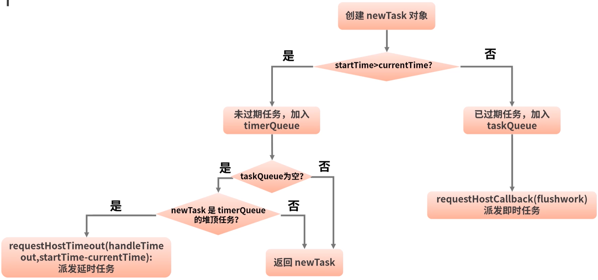

# **React 事件**

React 有着自成一派的事件系统，这与原生 DOM 事件不一样。

## **原生 DOM 下的事件流**

W3C 标准约定了一个事件的传播过程要经过以下3个阶段：

1. 事件捕获阶段

2. 目标阶段

3. 事件冒泡阶段


### **DOM 事件流下的性能优化思路：事件委托**

事件委托：把多个子元素的同一类型的监听逻辑，合并到父元素上通过一个监听函数来管理的行为。

## **React 事件系统是如何工作的**

React 的事件系统沿袭了事件委托的思想，在 React 中，除了少数特殊的不可冒泡的事件无法被事件系统处理外，绝大部分的事件都不会被绑定在具体的元素上，而是**统一被绑定在页面的 document 上**，当事件在具体的 DOM 节点上被触发后，最终都会冒泡到 document 上，document 上所绑定的统一事件处理程序会将事件分发到具体的组件实例，在分发事件之前，React 首先会对事件进行包装，把原生 DOM 事件包装成合成事件。

## **认识 React 合成事件**

合成事件是 React 自定义的事件对象，它符合 W3C 规范，在底层抹平了不同浏览器的差异，在上层面向开发者暴露统一的、稳定的、与 DOM 原生事件相同的事件接口，开发者们由此便不必再关注繁琐的兼容性问题，可以专注于业务逻辑的开发，虽然合成事件并不是原生 DOM 事件，但它保存了原生 DOM 事件的引用，当需要访问原生 DOM 事件对象时，可以通过合成事件对象的 `e.nativeEvent` 属性获取到它。

## **React 事件系统工作流拆解**

事件系统分为了**事件绑定**和**事件调用**两个方面。

事件绑定是在 completeWork 中完成的，completeWork 内部有三个关键动作：

1. 创建 DOM 节点（createInstance）

2. 将 DOM 节点插入到 DOM 树中（appendAllChildren）

3. 为 DOM 节点设置属性（finalizeInitialChildren）

其中为 DOM 节点设置属性这个环节会遍历 fiberNode 的 props key，当遍历到事件相关的 props 时，就会触发事件的注册链路，整个过程涉及的函数调用栈如下图所示：


从上图可知，事件的注册过程是由 ensureListeningTo 函数开启的，在 ensureListeningTo 中，会尝试获取当前 DOM 结构中的根节点，然后通过调用 legacyListenToTopLevelEvent 将统一的事件监听函数注册到 document 上，在 legacyListenToEvent 中，实际上是通过调用 legacyListenToTopLevelEvent 来处理事件和 document 之间的关系的 legacyListenToTopLevelEvent，直译过来就是监听顶层的视线，这里的顶层就可以理解为事件委托的最上层，也就是 document 节点，在 legacyListenToTopLevelEvent 中有这样一段逻辑值得注意：


listenerMap 是在 legacyListenToEvent 里创建、获取的一个数据结构，它将记录当前 document 已经坚定了哪些事件，在 legacyListenToTopLevelEvent 逻辑的起点，会首先判断 `listenerMap.has(topLevelType)` 这个条件是否为 true。

topLevelTap 在 legacyListenToTopLevelEvent 的函数上下文中代表事件的类型，比如：尝试监听的是一个点击事件，那么 topLevelTap 的值就会是 click。

若事件系统识别到 `listenerMap.has(topLevelType)` 为 true，也就是当前这个事件 document 已经鉴定过了，那么就会直接跳过对这个事件的处理，否则才会进入具体的事件监听逻辑，如此一来，即使我们在 React 项目中多次调用了对同一事件的监听，也只会在 document 上触发一次注册。

为什么针对同一个事件，即使可能会存在多个回调，document 也只需要注册一次监听？

因为 React 最终注册到 document 上的并不是某一个 DOM 节点上对应的具体回调逻辑，而是一个统一的事件分发函数。

```JavaScript
function addEventBubbleListener(element, eventType, listener) {
  element.addEventListener(eventType, listener, false);
}
```

在这段逻辑中，element 就是 document 这个 DOM 元素，它在 legacyListenToEvent 阶段被获取后，又被层层的逻辑传递到了这个位置，而重点需要关注的是 listener 这是事件分发函数。


可以看到 listener 本体是一个名为 dispatchDiscreteEvent 的函数，事实上根据情况的不同，listener 可能是以下三个函数当中的任意一个：

1. dispatchDiscreteEvent

2. dispatchUserBlockingUpdate

3. dispatchEvent

dispatchDiscreteEvent 和 dispatchUserBlockingUpdate 的不同主要体现在对优先级的处理上，对事件分发动作倒是没什么影响，无论是 dispatchDiscreteEvent 还是 dispatchUserBlockingUpdate，它们最后都是通过调用 dispatchEvent 来执行事件分发的，因此可以认为，最后绑定到 document 上的这个统一的事件分发函数其实就是 dispatchEvent。

那么 dispatchEvent 是如何实现事件分发的呢？

事件触发的本质是对 dispatchEvent 函数的调用，由于 dispatchEvent 触发的调用链路较长，中间涉及的要素也过多，因此这里不再逐个跟踪函数的调用栈，直接来看核心工作流。


## **事件回调的收集与执行**

收集过程的源码逻辑：

```JavaScript
function traverseTwoPhase(inst, fn, arg) {
  // 定义一个 path 数组
  var path = [];

  while (inst) {
    // 将当前节点收集进 path 数组
    path.push(inst);
    // 向上收集 tag===HostComponent 的父节点
    inst = getParent(inst);
  }

  var i;

  // 从后往前，收集 path 数组中会参与捕获过程的节点与对应回调
  for (i = path.length; i-- > 0;) {
    fn(path[i], 'captured', arg);
  }

  // 从后往前，收集 path 数组中会参与冒泡过程的节点与对应回调
  for (i = 0; i < path.length; i++) {
    fn(path[i], 'bubbled', arg);
  }
}
```

traverseTwoPhase 函数主要做了以下三件事：

1. 循环收集符合条件的父节点，存进 path 数组中

    > traverseTwoPhase 会以当前节点（触发事件的目标节点）为起点不断向上寻找 `tag===HostComponent` 的父节点，并将这些节点按顺序收集进 path 数组中，其中 `tag===HostComponent` 这个条件是在 getParent 函数中管控的，为什么一定要求 `tag===HostComponent` 呢？HostComponent 是 DOM 元素对应的 Fiber 节点类型，此处限制 `tag===HostComponent`，也就是说只收集 DOM 元素对应的 Fiber 节点，之所以这样做，是因为浏览器只认识 DOM 节点，浏览器事件也只会在 DOM 节点之间传播，收集其他节点是没有意义的。
    > 
    > 

2. 模拟事件在捕获阶段的传播顺序，收集捕获阶段相关的节点实例与回调函数

    > 接下来，traverseTwoPhase 会从后往前遍历 path 数组，模拟事件的捕获顺序，收集事件在捕获阶段对应的回调与实例，path 数组是从子节点触发向上收集得来的，所以说 path 数组中子节点在前，祖先节点在后，从后往前遍历，path 数组其实就是从父节点向下遍历子节点，直至遍历到目标节点的过程，这个遍历过程和事件在捕获阶段的传播顺序是一致的，在遍历的过程中，fn 函数会对每个节点的回调情况进行检查，若该节点上对应当前事件的捕获回调不为空，那么节点实例会被收集到合成事件的 dispatchInstance 属性中，事件回调则会被收集到合成事件的 dispatchListener 属性中去，等待后续执行。
    > 
    > 

3. 模拟事件在冒泡阶段的传播顺序，收集冒泡阶段相关的节点实例与回调函数

    > 捕获阶段的工作完成后，traverseTwoPhase 会从后往前遍历 path 数组，模式事件的冒泡顺序，收集事件在捕获阶段对应的回调与实例，这个过程和步骤二基本是一样的，唯一的区别是对 path 数组的倒序遍历变成了正序遍历，既然倒序遍历模拟的是捕获阶段的事件传播顺序，那么正序遍历自然模拟的就是冒泡阶段的事件传播顺序，在正序遍历的过程当中，同样会对每个节点的回调情况进行检查，若该节点上对应当前事件的冒泡回调不会空，那么**节点实例**和**事件回调**同样会分别被收集到 **`SyntheticEvent._dispatchInstances`** 和 **`SyntheticEvent._dispatchListeners`** 中去。
    > 
    > 需要注意的是：当前事件对应的 SyntheticEvent 实例有且仅有一个，因此在模拟捕获和模拟冒泡这两个过程当中，收集到的实力会被推入同一个 `SyntheticEvent._dispatchInstances`，收集到的事件回调也会被推入同一个 `SyntheticEvent._dispatchListeners` 中去。
    > 
    > 因此，在事件回调的执行阶段，只需要按照顺序执行 `SyntheticEvent._dispatchInstances` 数组中的回调函数，就能够一口气模拟出整个完整的 DOM 事件流，也就是捕获、目标、冒泡这三个阶段。
    > 
    > 

## **React 事件系统的设计动机是什么？**

- 在底层抹平了不同浏览器的差异

- 在上层向开发者暴露统一的、稳定的、与 DOM 原生事件相同的事件接口

    > 开发者们由此便不必再关注繁琐的底层兼容问题，可以专注于业务逻辑的开发
    > 
    > 

对 React 来说，事件委托主要的作用应该在于帮助 React 实现了**对所有事件的中心化管控**，至于 React 事件是否比不使用事件委托的原生 DOM 事件性能更好，没有明确的说明。

# **Redux**

## **Redux 背后的架构思想——认识 Flux 架构**

Redux 的设计在很大程度上收益于 Flux 架构，虽然它并不严格遵守 Flux 的设定，但可以认为 Redux 是 Flux 的一种实现形式。

Flux 并不是一个具体的框架，它是一套由 Facebook 技术团队提出的应用架构，这套架构约束的是**应用处理数据的模式**，在 Flux 架构中，一个应用将被拆分为以下四个部分：

1. **View（视图层）——用户界面**

    > 该用户界面可以是任何形式实现出来的，React 组件是一种形式，Vue、Angular 也完全 OK，Flux 架构与 React 之间并不存在耦合关系。
    > 
    > 

2. **Action（动作）**

    > 可以理解为视图层发出的 “消息”，它会触发应用状态的改变。
    > 
    > 

3. **Dispatcher（派发器）**

    > 它负责对 action 进行分发。
    > 
    > 

4. **Store（数据层）**

    > 它是存储应用状态的 “仓库”，此外还会定义修改状态的逻辑，Store 的变化最终会映射到 View 层上去。
    > 
    > 

一个典型的 Flux 工作流是这样的，用户与 View 之间产生交互，通过 View 发起一个 Action，Dispatcher 会把这个 Action 派发给 Store，Store 状态更新完成后会进一步通知 View 去更新界面。


值得注意的是，图中所有的箭头都是单向的，这也正是 Flux 架构最核心的一个特点——**单向数据流**。

## **Flux 架构到底解决了什么问题？**

Flux 的核心特征是**单向数据流**，要想完全了解单向数据流的好处，需要先了解**双向数据流带来了什么问题**。

### **MVC 模式在前端场景下的局限性**

双向数据流最为典型的代表就是前端场景下的 MVC 架构，该架构额示意图如下图所示：


除了允许用户通过 View 层交互来触发流程以外，MVC 架构还有另一种形式，即允许用户通过直接触发 Controller 逻辑来触发流程，这种模式的架构图如下图所示：


在 MVC 应用中会涉及这三个部分：

1. Model 模型

    > 存储需要操作的数据或信息。
    > 
    > 

2. View 视图

3. Controller 控制器

    > 用于连接 View 和 Model，管理 Model 与 View 之间的逻辑。
    > 
    > 

三者的关系如上图所示，用户操作 View 后由 Controller 来处理逻辑，经过 Controller 将改变应用到 Model 中，最终再反馈到 View 上，在这个过程中，数据流应该是单向的。

事实上，在许多服务端的 MVC 应用中，数据流确实能够保持单向，但是在前端场景下，实际的 MVC 应用要复杂不少，前端应用/框架往往出于交互的需要，允许 View 和 Model 直接通信，此时的架构关系就会变成下图这样：


这就允许了双向数据流的存在，当业务复杂度较高时，数据流会变得非常混乱，出现类似下图这种情况：


图中的示例只有一个 Controller，但考虑到一个应用中还可能存在多个 Controller，实际的情况应该比上图还复杂得多，在如此复杂得依赖关系下，再小的项目变更也会伴随着不容小觑的风险，或许一个小小的改动，就会对整个项目造成蝴蝶效应般的巨大影响，如此混乱的修改来源，将会使得连 BUG 排查都无从下手，因为很难区分出一个数据的变化到底是由哪个 Controller 或者哪个 View 引发的。

回过头来看 Flux 的流程图就会发现其中的妙处，Flux 最核心的地方在于严格的单向数据流，在单向数据流下，状态的变化是可预测的，如果 Store 中的数据发生了变化，那么有且仅有一个原因，那就是由 Dispatcher 派发 Action 来触发的，这样一来就从根本上避免了混乱的数据关系，使整个流程变得清晰简单，不过这并不意味着 Flux 是完美的，事实上，Flux 对数据流的约束背后是不可忽视的成本，除了开发者的学习成本会提升外，Flux 架构还意味着项目中代码量的增加，Flux 架构往往在复杂的项目中才会体现出它的优势和必要性，如果项目中的数据关系并不复杂，其实完全轮不到 Flux 登场，这一点对于 Redux 来说也是一样的。

## **Redux 关键要素与工作流回顾**

虽然 Redux 在实现层面并没有按照 Flux 那一套来，比如：Flux 中允许多个 Store 存在，而 Redux 中只有一个 Store 等，但是 Redux 在设计思想上确实和 Flux 一脉相承。

Flux 架构的特征、解决问题的思想，包括使用场景方面的注意事项完全可以迁移到 Redux 上来用。

Redux 主要由三部分组成：

1. **Store**：它是一个单一的数据源，而且是只读的

2. **Action**：是 ”动作“ 的意思，它是对变化的描述

3. **Reducer**：是一个函数，它负责对变化进行分发和处理，最终将新的数据返回给 Store

Store、Action 和 Reducer 三者紧密配合，便形成了 Redux 独树一帜的工作流，在 Redux 的整个工作过程当中，数据流是严格单向的，如果相对数据进行修改，只有一种途径，那就是派发 Action，Action 会被 Reducer 读取，Reducer 将根据 Action 内容的不同，执行不同的计算逻辑，最终生成新的 State，这个新的 State 会更新到 Store 对象里，进而驱动视图层面做出对应得改变，对于组件来说，任何组件都可以以约定的方式从 Store 读取到全局的状态，任何组件也都可以通过合理地派发 Action 来修改全局地状态，Redux 通过提供一个统一的状态容器，使得数据能够自由而有序的在任何组件之间穿梭。

## **Redux 是如何工作的？**

如下为 Redux 源码的目录结构：

```JavaScript
+ utils：工具方法库
- index.js：入口文件，用于对功能模块进行收敛和导出
- applyMiddleware.js：中间件模块
- bindActionCreators.js：用于将传入的 actionCreator 与 dispatch 方法相结合，揉成一个新的方法
- combineReducers.js：用于将多个 reducer 合并起来
- compose.js：用于把接收到的函数从右向左进行组合
- createStore.js：整个流程的入口，Redux 中最核心的 API
```

### **故事的开始：createStore**

如下为使用 createStore 的代码：

```JavaScript
// 引入 Redux
import { createStore } from 'redux'

// 创建 store
const store = createStore(
  reducer, // Reducer
  initial_state, // 初始化内容
  applyMiddleware(middleware1, middleware2/* , ... */) // 指定中间件
)
```

如下为 `createStore.js` 的核心源码：

```JavaScript
// createStore.js

function createStore(reducer, preloadedState, enhancer) {
  // 这里处理的是没有设定初始状态的情况，也就是第一个参数和第二个参数都传 function 的情况
  if (typeof preloadedState === 'function' && typeof enhancer === 'undefined') {
    // 此时第二个参数会被认为是 enhancer（中间件）
    enhancer = preloadedState;
    preloadedState = undefined;
  }

  // 当 enhancer 不为空时，便会将原来的 createStore 作为参数传入到 enhancer 中
  if (typeof enhancer !== 'undefined') {
    return enhancer(createStore)(reducer, preloadedState);
  }

  // 记录当前的 reducer，因为 replaceReducer 会修改 reducer 的内容
  let currentReducer = reducer;
  // 记录当前的 state
  let currentState = preloadedState;

  // 声明 listeners 数组，这个数组用于记录在 subscribe 中订阅的事件
  let currentListeners = [];
  // nextListeners 是 currentListeners 的快照
  let nextListeners = currentListeners;
  // 该变量用于记录当前是否正在进行 dispatch
  let isDispatching = false

  // 该方法用于确认快照是 currentListeners 的副本，而不是 currentListeners 本身
  function ensureCanMutateNextListeners() {
    if (nextListeners === currentListeners) {
      nextListeners = currentListeners.slice();
    }
  }

  // 通过调用 getState 来获取当前的状态
  function getState() {
    return currentState;
  }

  // subscribe 订阅方法，它将会定义 dispatch 最后执行的 listeners 数组的内容
  function subscribe(listener) {
    // 校验 listener 的类型
    if (typeof listener !== 'function') {
      throw new Error('Expected the listener to be a function.')
    }
    // 禁止在 reducer 中调用 subscribe
    if (isDispatching) {
      throw new Error('You may not call store.subscribe() while the reducer is executing.' + 'If you would like to be notified after the store has been updated, subscribe from a' + 'component and invoke store.getState() in the callback to access the latest state.' + 'See https://redux.js.org/api-reference/storesubscribe(listener) for more details.')
    }

    // 该变量用于防止调用多次 unsubscribe 函数
    let isSubscribed = true;
    // 确保 nextListeners 与 currentListeners 不指向同一个引用
    ensureCanMutateNextListeners();
    // 注册监听函数
    nextListeners.push(listener);

    //返回取消订阅当前 listener 的方法
    return function unsubscribe() {
      if (!isSubscribed) {
        return;
      }
      isSubscribed = false;
      ensureCanMutateNextListeners();
      const index = nextListeners.indexOf(listener);
      // 将当前的 listener 从 nextListeners 数组中删除
      nextListeners.splice(index, 1);
    };
  }

  // 定义 dispatch 方法，用于派发 action
  function dispatch(action) {
    // 校验 action 的数据格式是否合法
    if (!isPlainObject(action)) {
      throw new Error('Actions must be plain objects.' + 'Use custom middleware for async actions.');
    }

    // 约束 action 中必须有 type 属性作为 action 的唯一标识
    if (typeof action.type === 'undefined') {
      throw new Error('Actions may not have an undefined "type" property.' + 'Have you misspelled a constant?');
    }

    // 若当前已经位于 dispatch 的流程中，则不允许再度发起 dispatch (禁止套娃)
    if (isDispatching) {
      throw new Error('Reducers may not dispatch actions.');
    }

    try {
      // 执行 reducer 前，先"上锁”，标记当前已经存在 dispatch 执行流程
      isDispatching = true
      // 调用 reducer，计算新的 state
      currentState = currentReducer(currentState, action)
    } finally {
      // 执行结束后，把"锁"打开，允许再次进行 dispatch
      isDispatching = false
    }

    // 触发订阅
    const listeners = (currentListeners = nextListeners);
    for (let i = 0; i < listeners.length; i++) {
      const listener = listeners[i];
      listener();
    }
    return action;
  }

  // replaceReducer 可以更改当前的 reducer
  function replaceReducer(nextReducer) {
    currentReducer = nextReducer;
    dispatch({ type: ActionTypes.REPLACEI });
    return store;
  }

  // 初始化 state，当派发一个 type 为 ActionTypes.INIT 的 action，每个 reducer 都会返回
  // 它的初始值
  dispatch({ type: ActionTypes.INIT });

  // observable 方法可以忽略，它在 redux 内部使用，开发者一般不会直接接触
  function observable() {
    // observable 方法的实现
  }

  // 将定义的方法包裹在 store 对象里返回
  return {
    dispatch,
    subscribe,
    getState,
    replaceReducer,
    [$$observable]: observable
  }
}
```

createStore 的内部逻辑为下图：


其中需要关注的有：

1. getState：获取当前状态

2. subscribe：发布\-订阅模式，订阅方法

3. dispatch：分发 action

### **Redux 工作流的核心：dispatch 动作**


有两个点值得注意：

1. 通过 ”上锁“ 避免 “套娃式” 的 dispatch

2. 触发订阅的过程

### **通过 ”上锁“ 避免 “套娃式” 的 dispatch**

dispatch 工作流中最关键的就是执行 reducer，reducer 的本质是 store 的更新规则，它指定了应用状态的变化如何响应 action 并发送到 store。

```JavaScript
try {
  // 执行reducer前，先“上锁”，标记当前已经存在 dispatch 执行流程
  isDispatching = true
  // 调用 reducer，计算新的 state
  currentState = currentReducer(currentState, action)
} finally {
  // 执行结束后，把“锁”打开，允许再次进行 dispatch
  isDispatching = false
}
```

这段代码中，调用 reducer 传入 currentState 和 action。

在调用 reducer 之前，Redux 首先会将 isDispatching 变量置为 true，待 reducer 执行完毕后，再将 isDispatching 变量置为 false，在 React 中，setState 的状态更新处理也是用类似的上锁方式来实现。

这里之所以用 isDispatch 将 dispatch 的过程锁起来，目的是为了规避套娃式的 dispatch，更准确的说，是为了**避免**开发者在 reducer 中手动调用 dispatch。

”禁止套娃“ 用意何在？

1. 首先，从设**计**的角度来看，作为一个计算 state 专用函数，Redux 在设计 reducer 时就强调了它必须是 **”纯净“** 的，它不应该执行除了计算之外的任何脏操作，dispatch 调用显然是一个脏操作

2. 其次，从**执行**的角度来看，如果真的在 reducer 中调用 dispatch，那么 dispatch 又会反过来调用 reducer，reducer 又会再次调用 dispatch，这样反复相互调用下去，就会进入死循环，处于非常严重的误操作，因此在 dispatch 的前置校验逻辑中，一旦识别出 isDispatching 为 true，就会直接 throw error，把死循环扼杀在摇篮里

### **触发订阅的过程**

在 reducer 执行完毕后，会进入触发定义的过程，它对应的是下面这段代码：

```JavaScript
// 触发订阅
const listeners = (currentListeners = nextListeners);
for (let i = 0; i < listeners.length; i++) {
  const listener = listeners[i];
  listener();
}
```

两个疑问点：

1. 它们到底是如何与 Redux 主流程相结合的呢？

2. 为什么会有 currentListeners 和 nextListeners 这两个 listeners 数组？

#### **Redux 中的 ”发布\-订阅“ 模式：认识 subscribe**

dispatch 中执行的 listeners 数组从订阅中来，而执行订阅需要调用 subscribe，在实际的开发当中，subscribe 并不是一个严格必要的方法，只有在需要监听状态的变化时，才会调用 subscribe。

subscribe 接收一个 function 类型的 listener 作为入参，它的返回内容恰恰就是这个 listener 对应的解绑函数，也可以通过下面这段示例代码简单把握一下 subscribe 的使用姿势：

```JavaScript
function handleChange() {
  // 函数逻辑
}

const unsubscribe = store.subscribe(handleChange);
unsubscribe();
```

subscribe 在订阅时只需要传入监听函数，而不需要传入事件类型，这是因为 Redux 中已经默认订阅的对象就是 ”**状态的变化**（准确地说是 dispatch 函数的调用）” 这个事件。

> 它们到底是如何与 Redux 主流程相结合的呢？
> 
> 在 **store 对象创建成功后**，通过调用 store\.subscribe 来注册监听函数，也可以通过调用 subscribe 的返回函数来解绑监听函数，监听函数是用 listeners 数组来维护的。
> 
> 当 **dispatch action 发生时**，Redux 会在 reducer 执行完毕后，将 listeners 数组中的监听函数逐个执行。
> 
> 这就是 subscribe 与 Redux 主流程之间的关系。
> 
> 


有一个点值得注意：

1. 对 ensureCanMutateNextListeners 的调用

ensureCanMutateNextListeners 的作用是确保 nextListeners 不会和 currentListener 指向同一个引用，那么为什么要这么做呢？

为什么会有 currentListeners 和 nextListeners 两个 listeners 数组？

#### **订阅过程中的 listeners 数组**

两个 listeners 之间的第一次交锋发生在 createStore 的变量初始化阶段，nextListeners 会复制为 currentListeners。

```JavaScript
let nextListeners = currentListeners;
```

这之后两者确实指向同一个引用，但在 subscribe 第一次被调用时，ensureCanMutateNextListeners 就会发现这一点，然后将 nexListeners 纠正为一个内容与 currentListeners 一致，但引用不同的新对象，对应的逻辑如下面代码所示：

```JavaScript
function ensureCanMutateNextListeners() {
  // 若两个数组指向同一个引用
  if (nextListeners === currentListeners) {
    // 则将 nextListeners 纠正为一个内容与 currentListeners 一致，但引用不同的新对象
    nextListeners = currentListeners.slice();
  }
}
```

在 subscribe 的逻辑当中，ensureCanMutateNextListeners 每次都会在 listener 注册前被无条件调用，用于确保两个数组引用不同，紧跟在 ensureCanMutateNextListeners 之后执行的是 listener 的注册逻辑，源码如下：

```JavaScript
nextListeners.push(listener);
```

listener 最终会被注册到 nextListeners 数组中去。

#### **发布过程中的 listeners 数组**

触发订阅这个动作是由 dispatch 来做的，相关源码如下：

```JavaScript
// 触发订阅
const listeners = (currentListeners = nextListeners);
for (let i = 0; i < listeners.length; i++) {
  const listener = listeners[i];
  listener();
}
```

在触发订阅的过程当中，currentListeners 会被复制为 nextListeners，而实际被执行的 listeners 数组又会被复制为 currentListeners，因此，最终被执行的 listeners 数组，实际上和当前的 nextListeners 指向同一个引用。

注册监听也是操作 nextListeners，触发订阅也是读取 nextListeners，取消监听操作的也是 nextListeners，既然如此，**要 currentListeners 有何用？**

##### **currentListeners 数组用于确保监听函数执行过程的稳定性**

正因为任何变更都是在 nextListeners 上发生的，因此才需要一个不会被变更的、内容稳定的 currentListeners 来确保监听函数在执行过程当中不会出意外，如下示例代码：

```JavaScript
// 定义监听函数 A
function listenerA() { }

// 订阅 A，并获取 A 的解绑函数
const unSubscribeA = store.subscribe(listenerA)

// 定义监听函数 B
function listenerB() {
  // 在 B 中解绑 A
  unSubscribeA()
}

// 定义监听函数 C
function listenerC() { }

// 订阅 B
store.subscribe(listenerB)
// 订阅 C
store.subscribe(listenerC)
```

上面的操作在 Redux 中完全合法，在这个 demo 执行完毕后，nextListeners 数组的内容是 A、B、C 三个 listener `[listenerA、listenerB、listenerC]`，接下来如果调用 dispatch，则会执行下面这段触发定位的逻辑：

```JavaScript
// 触发订阅
const listeners = (currentListeners = nextListeners);
for (let i = 0; i < listeners.length; i++) {
  const listener = listeners[i];
  listener();
}
```

当 for 循环执行到索引 `i = 1` 处，也就是对应的 listener 为 listenerB 时，问题就会出现，listenerB 中执行了 unnsubscribeA 这个动作，而结合前面的分析，监听函数、注册解绑、触发这些动作实际影响的都是 nextListeners。

如下为解绑函数 unnsubscribe 的源码：

```JavaScript
function unsubscribe() {
  // 避免多次解绑
  if (!isSubscribed) {
    return;
  }
  isSubscribed = false;

  // 调用 ensureCanMutateNextListeners 方法
  ensureCanMutateNextListeners();

  // 获取 listener 在 nextListeners 中的索引
  const index = nextListeners.indexOf(listener);

  // 将当前的 listener 从 nextListeners 数组中删除
  nextListeners.splice(index, 1);
}
```

当 listenerB 执行完成后，nextListeners 数组变为了只有 B、C 两个 listener 的数组 `[listenerB、listenerC]`，如果遍历的是 nextListeners 则遍历到 `i = 2` 时，则会找不到 listenerC，此时，undifined 就会代替 listenerC 被执行，进入引发函数异常。

结局办法：将 nextListeners 与当前正在执行中的 listeners 剥离开来，将两者指向不同的引用，这也正是 ensureCanMutateNextListeners 所做的事情。

在示例的这种场景下，ensureCanMutateNextListeners 执行前，listeners、currentListeners、nextListeners 的关系如下：

```JavaScript
listeners === currentListeners === nextListeners
```

而 ensureCanMutateNextListeners 执行后，nextListeners 就会被剥离出去。

```JavaScript
listeners === currentListeners !== nextListeners
```

这样一来，nextListeners 上的任何改变都无法影响正在执行当中的 listeners 了。

currentListeners 在此处的作用就是为了记录下当前正在工作中的 listeners 数组的引用，将它与可能发生改变的 nextListeners 区分开来，以确保监听函数在执行过程中的稳定性。

## **Redux 中间件的实现原理**

### **中间件的引入**

**中间件的信息**将作为 createStore 函数的一个 function 类型的入参被传入，示例如下：

```JavaScript
// 引入 redux
import { createStore, applyMiddleware } from 'redux'

// 创建 store
const store = createStore(
  reducer,
  initial_state,
  applyMiddleware(middleware1, middleware2/*, ... */)
)
```

可以看到 Redux 对外暴漏了 applyMiddleware 这个方法，applyMiddleware 接收任意一个中间件作为入参，它的返回值将作为参数传入 createStore，这就是中间件的引入过程。

### **中间件的工作模式**

思考一个问题：中间件的引入，会对 Redux 工作流带来什么样的改变呢？

这里以 redux\-thunk 为例，从经典的 “异步 Action” 场景切入，看看中间件是如何帮助我们解决问题的，在针对 Redux 源码主流程的分析当中，不难看出这样一个规律：

#### **redux\-thunk——经典的异步 Action 解决方案**

Redux 源码中只有同步操作，也就是说当 dispatch Action 时，state 会被立即更新，如果想要在 Redux 中引入异步数据流，该怎么办呢？

Redux 官方给出的建议是使用中间件来增强 createStore，支持异步数据流的 Redux 中间件有很多，其中最适合用来快速上手的，应该就是 redux\-thunk 了。

redux\-thunk 的引入和普通中间件无异，示例如下：

```JavaScript
// 引入 redux-thunk
import thunkMiddleware from 'redux-thunk'
import reducer from './reducer'

// 将中间件用 applyMiddleware 包装后传入
const store = createStore(reducer, applyMiddleware(thunkMiddleware))
```

在 createStore 的源码中，有这样一段逻辑：

```JavaScript
// 这里处理的是没有设定初始状态的情况，也就是第一个参数和第二个参数都传 function 的情况
if (typeof preloadedState === 'function' && typeof enhancer === 'undefined') {
  // 此时第二个参数会被认为是 enhancer（中间件）
  enhancer = preloadedState;
  preloadedState = undefined;
}
```

这段代码说明了：在只传入两个参数的情况下，createStore 会去检查第二个参数是否是 function 类型，若是，则认为第二个参数是 enhancer，这里的 enhancer 是增强器的意思，而 applyMiddleware 包装过的中间件正是增强器的一种。

这也就解释了为什么上面 redux\-thunk 的调用示例中，applyMiddleware 调用明明是作为 createStore 的第二个参数被传入，却仍然能够被识别为中间件信息。

redux\-thunk 带来的改变非常好理解，它允许以函数的形式派发一个 Aciton，示例代码如下：

```JavaScript
import axios from "axios";
import { createStore, applyMiddleware } from 'redux'
import thunk from 'redux-thunk'
import reducer from './reducers'

// 创建一个有 thunk 中间件加持的 store 对象
const store = createStore(
  reducer,
  applyMiddleware(thunk)
)

// 发起异步请求的函数
const payMoney = (payInfo) => (dispatch) => {
  // 付款前发出准备信号
  dispatch({ type: 'payStart' })
  fetch().then(res => { dispatch() })
  return axios.post('/api/payMoney', {
    payInfo
  }).then((res) => {
    console.log(res);
    // 付款成功信号
    dispatch({ type: 'paySuccess' })
  }).catch((err) => {
    console.log(err);
    // 付款失败信号
    dispatch({ type: 'payError' })
  })
}

// 支付信息 - 入参
const payInfo = {
  userName: 'xxx',
  password: 'xxx',
  count: 'xxx',
  // ...
}

// dispatch 一个 Aciton，注意这个 Action 是一个函数
store.dispatch(payMoney(patInfo));
```

这里尝试用 redux\-thunk 模拟了一个付款请求的发起响应过程，这个过程单从表面上来看，和普通的 redux 调用最大的不同就是 dispatch 的入参从 action 对象变成了一个函数。

由于 action 入参必须是一个对象，而 thunk 中间件似乎巧妙地 “绕开” 了这层校验，这背后到底藏着什么玄机呢？

要想搞清楚这个问题，除了需要理解 thunk 的执行逻辑，更重要的是要知道 redux 中间件是如何工作的，如何与 redux 主流程相结合的。

#### **Redux 中间件是如何与 Redux 主流程相结合的？**

Redux 中间件将会在 action 被分发后，到达 reducer 之前执行，对应到工作流中它的执行时机，如下图所示：


若有多个中间件，那么 Redux 会结合它们被安装的先后顺序，依次调用这些中间件，这个过程如下图所示：


中间件的执行时机允许它在状态真正发生变化之前，结合 action 的信息做一些它想做的事情，那么中间件又是如何绕过 dispatch 的校验逻辑的呢？

其实绕过 dispatch 只是主观上的一个使用感受，dispatch 并非被 “绕过” 了，而是被 **“改写”** 了，改写它的不是别人，正是 applyMiddleware。

至此，对于 Redux 中间件的工作模式，需要牢牢把握以下两点：

1. 中间件的**执行时机**

    > 即 action 被分发之后、reducer 触发之前。
    > 
    > 

2. 中间件的**执行前提**

    > 即 applyMiddleware 将会对 dispatch 函数进行改写，使得 dispatch 在触发 reducer 之前会首先执行对 Redux 中间件的链式调用。
    > 
    > 

#### **thunk 中间件到底做了什么？**

redux\-thunk 源码如下：

```JavaScript
// createThunkMiddleware 用于创建 thunk
function createThunkMiddleware(extraArgument) {
  // 返回值是一个 thunk，它是一个函数
  return ({ dispatch, getState }) => (next) => (action) => {
    // thunk 若感知到 action 是一个函数，就会执行 action
    if (typeof action === 'function') {
      return action(dispatch, getState, extraArgument);
    }

    // 若 action 不是一个函数，则不处理，直接放过
    return next(action);
  };
}

const thunk = createThunkMiddleware();
thunk.withExtraArgument = createThunkMiddleware;

export default thunk;
```

redux\-thunk 主要做的事情就是在拦截到 action 以后，会去检查它是否是一个函数，若 action 是一个函数，则 redux\-thunk 就会执行它，并返回执行结果；若 action 不是一个函数，那么它就不是 redux\-thunk 的处理目标，直接调用 next 告诉 Redux 工作完成了，工作流可以继续往下走了。

## **Redux 中间件机制是如何实现的**

Redux 中间件是通过调用 applyMiddleware 来引入的，源码如下：

```JavaScript
// applyMiddleware 会使用 “...” 运算符将入参收敛为一个数组
export default function applyMiddleware(...middlewares) {
  // 它返回的一个接收 createStore 为入参的函数
  return createStore => (...args) => {
    // 首先调用 createStore，创建一个 store
    const store = createStore(...args)
    let dispatch = () => {
      throw new Error(`Dispatching while constructing your middleware is not allowed.` + `Other middleware would not be applied to this dispatch.`)
    }

    // middlewareAPI 是中间件的入参
    const middlewareAPI = {
      getState: store.getState,
      dispatch: (...args) => dispatch(...args)
    }
    // 遍历中间件数组，调用每个中间件，并且传入 middlewareAPI 作为入参，得到目标数组 chain
    const chain = middlewares.map(middleware => middleware(middlewareAPI))
    // 改写原有的 dispatch: 将 chain 中的函数按照顺序 “组合” 起来，调用最终组合出来的函数，传入 dispatch 作为入参
    dispatch = compose(...chain)(store.dispatch)

    // 返回一个新的 store 对象，这个 store 对象的 dispatch 已经被改写过了
    return {
      ...store,
      dispatch
    }
  }
}
```

在上述源码中，需要搞清楚以下几个问题：

1. applyMiddleware 返回了一个什么样的函数，这个函数是如何与 createStore 配合工作的？

2. dispatch 函数是如何被改写的？

3. compose 函数是如何组合中间件的？

### **applyMiddleware 是如何与 createStore 配合工作的？**

applyMiddleware 的返回值是一个接收 createStore 为入参的函数，这个函数会作为入参传递给 createStore，那么 createStore 会如何理解它呢？

createStore 的源码如下：

```JavaScript
function createStore(reducer, preloadedState, enhancer) {
  // 这里处理的是没有设定初始状态的情况，也就是第一个参数和第二个参数都传 function 的情况
  if (typeof preloadedState === 'function' && typeof enhancer === 'undefined') {
    // 此时第二个参数会被认为是 enhancer（中间件）
    enhancer = preloadedState;
    preloadedState = undefined;
  }
  // 当 enhancer 不为空时，便会将原来的 createStore 作为参数传入到 enhancer 中
  if (typeof enhancer !== 'undefined') {
    return enhancer(createStore)(reducer, preloadedState);
  }
  // ...
}
```

从这个代码片段中可以看出，一旦发现 enhancer 存在，那么 createStore 内部就会直接 return 一个针对 enhancer 的调用，在这个调用当中，第一次入参是 createStore，第二层入参是 reducer 和 preloadedState，可以尝试将这个逻辑在 applyMiddleware 中对号入座一下：

```JavaScript
// applyMiddleware 会使用 “...” 运算符将入参收敛为一个数组
export default function applyMiddleware(...middlewares) {
  // 它返回的一个接收 createStore 为入参的函数
  return createStore => (...args) => {
    // ...
  }
}
```

结合 createStore 中对 enhancer 的处理，可以知道，在 applyMiddleware return 出的这个函数中，createStore 这个入参对应的是 createStore 函数本身，而 args 入参则对应的是 reducer、preloadedState，这两个参数均为 createStore 函数的约定入参。

applyMiddleware 是 enhancer 的一种，而 enhancer 的意思是 “增强器”，它增强的正是 createStore 的能力，因此，调用 enhancer 时，传入 createStore 及其相关的注册信息是非常必要的。

### **dispatch 函数是如何被改写的？**

dispatch 函数的改写是由下面源码完成的：

```JavaScript
// middlewareAPI 是中间件的入参
const middlewareAPI = {
  getState: store.getState,
  dispatch: (...args) => dispatch(...args),
}
// 遍历中间件数组，调用每个中间件，并且传入 middlewareAPI 作为入参，得到目标函数数组 chain
const chain = middlewares.map(middleware => middleware(middlewareAPI))
// 改写原有的 dispatch: 将 chain 中的函数按照顺序 “组合” 起来，调用最终组合出来的函数，传入 dispatch 作为入参
dispatch = compose(...chain)(store.dispatch)
```

这段代码做了两件事：

1. 首先，以 middlewareAPI 作为入参，逐个调用传入的 middleware，获取一个由内层函数组成的数组 chain

2. 然后，调用 compose 函数将 chain 中内层函数逐个组合起来，并调用最终组合出来的函数

在上面这段描述中，有两个点可能对理解构成障碍：

1. 什么是内层函数？

2. compose 函数到底是怎么组合函数的，它组合出来的又是个什么东西？

#### **内层函数的含义？**

首先，需要站在函数的视角来观察一下 thunk 中间件的源码：

```JavaScript
// createThunkMiddleware 用于创建 thunk
function createThunkMiddleware(extraArgument) {
  // 返回值是一个 thunk，它是一个函数
  return ({ dispatch, getState }) => (next) => (action) => {
    // thunk 若感知到 action 是一个函数，就会执行 action
    if (typeof action === 'function') {
      return action(dispatch, getState, extraArgument);
    }

    // 若 action 不是一个函数，则不处理，直接放过
    return next(action);
  };
}

const thunk = createThunkMiddleware();
thunk.withExtraArgument = createThunkMiddleware;

export default thunk;
```

thunk 中间件是 createThunkMiddleware 的返回值，createThunkMiddleware 返回的是这样一个函数，该函数的返回值仍是一个函数，显然它是一个高阶函数，事实上，按照约定，所有的 Redux 中间件都必须是高阶函数，在高阶函数中，将原函数称为外层函数，将 return 出来的函数称为内层函数，而 apply 中遍历 middlewares 数组，逐个调用 middleware、middlewareAPI，无非是为了获取中间件的内层函数。

以 thunk 源码为例，不难看出：

- **外层函数**的主要作用是获取 dispatch、getState 这两个 API，而真正的中间件逻辑是在内层函数中包裹的

- 待 `middlewares.map(middleware => middleware(middlewareAPI))` 执行完毕后，**内层函数**会被悉数提取值 chain 数组

接下来，直接拿 chain 数组开刀就行，提取出 chain 数组之后，applyMiddleware 做的第一件事就是将数组当中的中间件逻辑 compose 起来，那么 compose 函数又是如何工作的呢？

### **compose 源码解读：函数的合成**

函数合成（组合函数）并不是 Redux 的专利，而是函数式编程中一个通用的概念，因此在 Redux 源码当中，compose 函数是作为一个独立文件存在的，它具备较强的工具属性，源码如下：

```JavaScript
// compose 会首先利用 “...” 运算符将入参收敛为数组格式
export default function compose(...funcs) {
  // 处理数组为空的边界情况
  if (funcs.length === 0) {
    return arg => arg
  }

  // 若只有一个函数，也就谈不上组合，直接返回
  if (funcs.length === 1) {
    return funcs[0]
  }

  // 若有多个函数，那么调用 reduce 方法来实现函数的组合
  return funcs.reduce((a, b) => (...args) => a(b(...args)))
}
```

从最后一行代码可以得知：函数组合是通过调用数组的 reduce 方法来实现的。

#### **加餐：中间件与面向切面编程**

中间件这个概念并非 Redux 的专利，它在软件领域由来已久，熟知的 koa、express 这些 node 框架中也都不乏对中间件的应用。

为什么中间件可以流行？

为什么应用中需要中间件呢？

这里以 Redux 中间件机制为例，聊聊中间件背后的面向切面编程思想。

AOP（面向切面）的存在恰恰是为了解决 OOP（面向对象）的局限性，可以将 AOP 看作是对 OOP 的一种补充。

在 OOP 模式下，想要扩展一个类的逻辑时，最常见的思路就是继承，class A 继承 class B，class B 继承 class C\.\.\.\.\.\.，这样一层一层将逻辑向下传递，当要为某几个类追加一段共同的逻辑时，可以通过修改他们共同的父类来实现，这无疑会使得公共类越来越臃肿，可确实没有什么更好的办法，总不能任这些公共逻辑散落在不同的业务逻辑里面吧，那将会引发更加严重的代码冗余和耦合问题，那怎么办呢，面向切面来救场，既然是面向切面，那么首先要搞清楚什么是切面？

切面是一个相对于执行流程来说的概念，以 Redux 为例，它的工作流自上而下应该是这样的：


此时考虑这样一个需求，要求在每个 action 被派发后，打出一个 console\.log 记录 action 被派发了，这个动作也就是常说的日志追溯，这个需求的通用性很强，业务属性很弱，因此不适合与任何的业务逻辑耦合在一起，那就可以以切面的这种形式，把它与应用逻辑剥离开来。

扩展功能，在工作流中的执行节点可以视为一个单独切点，把扩展功能的逻辑放到这个切点上来，形成的就是一个可以拦截前序逻辑的切面，如下图所示：


切面与应用逻辑是分离的，因此 AOP 是一种典型的非侵入式的逻辑扩充思路，在日常开发当中，向日志追溯、异步工作流处理、性能打点这类和业务逻辑关系不大的功能，都可以考虑把他们抽到切面中去做。

从 Redux 中间件机制不难看出，面向切面思想在很大程度上，提升了组织逻辑的灵活度与干净度，帮助规避掉了逻辑冗余、逻辑耦合这类问题，通过将切面与业务逻辑剥离，开发者能够专注于业务逻辑的开发，并通过即插即用的方式，自由地组织自己想要地扩展功能。

# **React\-Router**

## **认识 React\-Router**

以下为一个简单的使用 React\-Router 的例子：

```JavaScript
import React from "react";
import { BrowserRouter as Router, Route, Link } from "react-router-dom";

// 导出目标组件
const BasicExample = () => (
  // 组件最外层用 Router 包裹
  <Router>
    <div>
      <ul>
        <li>
          <Link to="/">Home</Link>
        </li>
        <li>
          <Link to="/about">About</Link>
        </li>
        <li>
          <Link to="/dashboard">Dashboard</Link>
        </li>
      </ul>

      <hr />

      {/* Route 是用于声明路由映射到应用程序的组件层 */}
      <Route exact path="/" component={Home}></Route>
      <Route exact path="/about" component={About}></Route>
      <Route exact path="/dashboard" component={Dashboard}></Route>
    </div>
  </Router>
);

// Home 组件的定义
const Home = () => (
  <div>
    <h2>Home</h2>
  </div>
);

// About 组件的定义
const About = () => (
  <div>
    <h2>About</h2>
  </div>
);

// Dashboard 组件的定义
const Dashboard = () => (
  <div>
    <h2>Dashboard</h2>
  </div>
);

export default BasicExample;
```

React\-Router 最基本也是最核心的能力——**路由的跳转**。

## **React\-Router 是如何实现路由跳转的？**

以上述 demo 为例，实现一个简单的路由跳转需要从 React\-Router 中引入三个组件：

- BrowserRouter

- Route

- Link

这三个组件代表了 React\-Router 当中的三个核心角色：

- **路由器**，比如：BrowserRouter 和 HashRouter，根据 Route 定义出来的映射关系，为新的路径匹配它对应的逻辑

    > React\-Router 应用程序的核心
    > 
    > 

- **路由**，比如：Route 和 Switch，负责定义路径与组件之间的映射关系

- **导航**，比如：Link、NavLink、Redirect，负责触发路径的改变

## **路由器：BrowserRouter 和 HashRouter**

**路由器**负责感知路由的变化并作出反应，它是整个路由系统中最为重要的一环，React\-Router 支持使用 hash 和 browser 两种路由规则。

- **HashRouter**

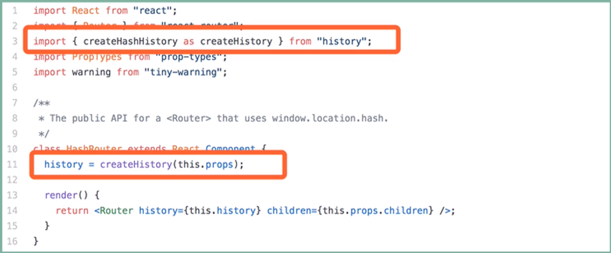

- **BrowserRouter**

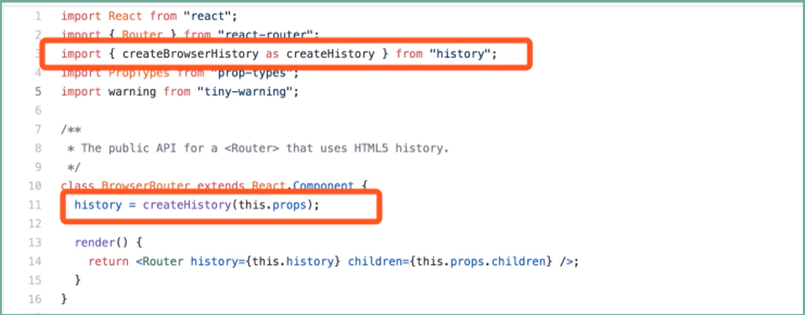

HashRouter 和 BrowserRouter 本质的区别是**调用 history 实例化方法不同**，HashRouter 调用了 createHashHistory，BrowserRouter 调用了 createBrowserHistory，这两个 history 的实例化方法均来源于 history 这个独立的代码库。

对于 createHashHistory 和 createBrowserHistory 这两个 API，最要紧的是掌握它们各自的特征：

- createHashHistory 是使用 hash tag 处理 URL 的方法，能够处理形如这样的 URL：`example.com/#/somepath`，由此可得，**HashRouter 是通过 URL 的 hash 属性来控制路由跳转的**

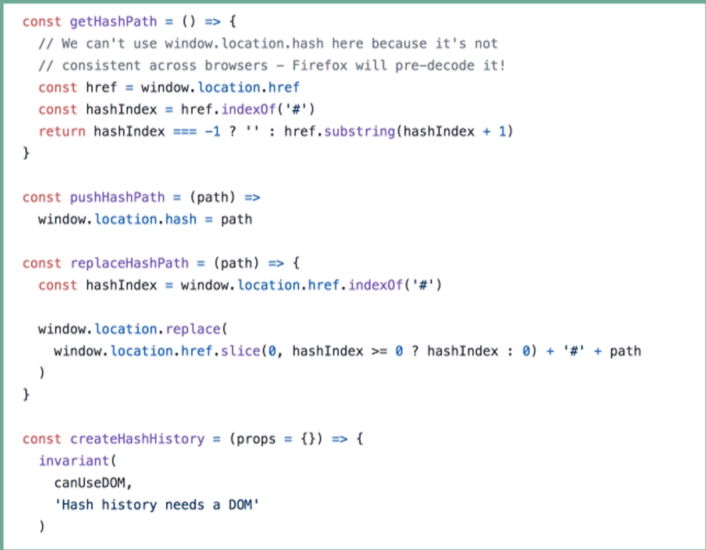

- createBrowserHistory 它将在浏览器中使用 HTML5 history API 来处理 URL，它能够处理形如这样的 URL：`example.com/somepath`，由此可得，**BrowserRouter 是使用 HTML5 的 history API 来控制路由跳转的**

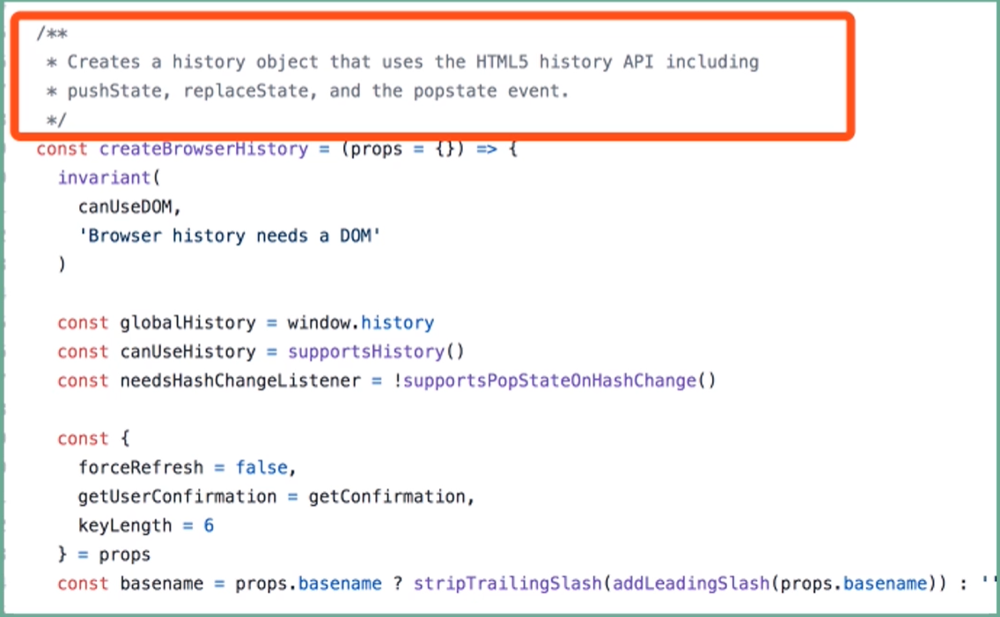

至此，需要思考一个问题：为什么需要 React\-Router，或者把这个问题拔高一点，为什么需要前端路由？

这一切的一切都要从很久以前说起，首先，需要理解前端路由是什么？它能解决什么问题？那要从背景，也就是问题的产生来谈一谈。

## **理解前端路由——是什么？解决什么问题？**

### **背景——问题的产生？**

在前端技术早期，一个 URL 对应一个页面，如果要从 A 页面跳转到 B 页面，那么必然伴随着页面的刷新，这个体验并不好，不过在最初也是无奈之举，毕竟用户只有在刷新页面的情况下才可以重新去请求数据，后来改变发生了，AJAX 出现了。

AJAX 允许在不刷新页面的情况下发起请求，同时还有 “不刷新页面即可更新页面内容” 需求，在这样的背景下，出现了 SPA（单页面应用），SPA 极大地提升了用户体验，允许页面在不刷新地情况下更新页面内容，使内容的切换更加流畅，但是在 SPA 诞生之初，并没有考虑到定位这个问题，即在内容切换前后，页面的 URL 都是一样的，这就带来了两个问题：

1. **SPA 并不会 “记住” 历史操作**

    > SPA 并不知道当前页面进展到了哪一步，可能在一个站点下经过了反复的前进，才终于换出了某一块内容，但是此时只要刷新一个页面，一切就会被清零，必须重复之前的操作才可以重新对内容进行定位
    > 
    > 

2. **有且仅有一个 URL 给页面做映射，对 SEO 不够友好**

    > 搜索引擎无法收集全面的信息
    > 
    > 

为了解决这些问题，前端路由出现了。

### **前端路由——SPA “定位” 解决方案**

前端路由，可以在仅有一个页面的情况下，“记住” 用户当前走到了哪一步，为 SPA 中的各个视图匹配一个唯一标识，这意味着用户前进后退触发的新内容都会映射到不同的 URL 上去，此时，即使刷新页面，因为当前的 URL 可以标识出所在的位置，因此，内容也不会丢失。

那么如何实现这个目的呢？首先要解决以下两个问题：

1. 当刷新页面时，浏览器会默认根据当前 URL 对资源进行重新定位（发起请求），这个动作对 SPA 是不必要的，因为 SPA 作为单页面，无论如何也只会有一个资源与之对应，此时，若走正常的请求刷新流程，反而会使用户的前进后退操作无法被记录

2. 单页面应用对服务端来说，就是一个 URL、一套资源，那么如何做到用 “不同的 URL” 来映射不同的视图内容呢？

从这两个问题来看，服务端已经救不了 SPA 这个场景了，所以要看前端自力更生，不然怎么叫前端路由呢？

作为前端，可以提供以下这样的解决思路：

- 拦截用户的刷新操作，避免服务端盲目响应、返回不符合预期的资源内容

    > 把刷新这个动作完全放到前端逻辑里消化掉。
    > 
    > 

- 感知 URL 的变化

    > 并不是说要改造 URL，凭空制造出 n 个 URL 来，而是说 URL 还是那个 URL，只不过可以对它做一些微小的处理，这些处理并不会影响 URL 本身的性质，不会影响服务器对它的识别，只有前端能感知到，一旦感知到了，就根据这些变化，用 JS 去给它生成不同的内容。
    > 
    > 

### **实现思路——hash 和 history**

- **hash 模式**：指通过改变 URL 后面以 “\#” 分割的字符串（URL 上的哈希值），从而让页面感知到路由变化的一种实现方式。

    举个例子，比如这样的一个 URL：`https://www.imooc.com/`，就可以通过添加和改变哈希值，来让这个 URL 变得有那么一点点不一样，`https://www.imooc.com/#index`、`https://www.imooc.com/#activePage`，其实这个不一样是前端完全可感知的，JS 可以捕获到哈希值的内容。

    在 hash 模式下，实现路由的思路可以概括如下：

    - 关于 **hash 的改变**，可以通过 location 暴露出来的属性，直接去修改当前 URL 的 hash 值

        ```JavaScript
        window.location.hash = 'index';
        ```

    - 关于 **hash 的感知**，通过监听 hashChange 事件，可以用 JS 来捕获 hash 值的变化，进而决定是否需要更新

        ```JavaScript
        window.addEventListener('hashchange', (e) => {
          // 根据 hash 的变化更新内容
        }, false)
        ```

- **history 模式**：通过 HTML5 新增的 history API 实现，即浏览器左上方的前进/后退按钮。

    在 history 模式下，实现路由的思路可以概括如下：

    - 关于 **history 的改变**，可以通过 history API 去操作

        ```JavaScript
        // HTML4 新增
        window.history.forward() // 前进到下一页
        window.history.back() // 后退到上一页
        window.history.go(2) // 前进两页
        window.history.go(-2) // 后退两页
        
        // HTML5 新增
        history.pushState(data[, title][, url]); // 像浏览器历史中追加一条记录
        history.replaceState(data[, title][, url]); // 修改（替换）当前页在浏览历史中的信息
        ```

    - 关于 **history 的感知**，可以通过 popstate 事件来监听

        ```JavaScript
        // 注意：go、forward 和 back 等方法会触发 popstate，但是 pushState 和 replaceState 不会
        window.addEventListener('popstate', (e) => {
          console.log(e);
        })
        ```

# **扩展：如何打造高性能的 React 应用？**

组件性能优化最关键的有三个思路：

1. 使用 shouldComponentUpdate 规避冗余的更新逻辑

2. PureComponent \+ Immutable\.js

3. React\.memo 与 useMemo

## **朴素思路：善用 shouldComponentUpdate**

shouldComponentUpdate 是 React 类组件的一个生命周期，调用形式如下：

```JavaScript
shouldComponentUpdate(nextProps, nextState)
```

render 方法由于伴随着对虚拟 DOM 的构建和对比过，过程可以说相当耗时，而在 React 当中，很多时候开发者会不经意间就频繁的调用了 render，为了避免不必要的 render 操作带来的性能开销，React 提供了 shouldComponentUpdate 这个生命周期，React 组件会根据 shouldComponentUpdate 的返回值，来决定是否执行该方法之后的生命周期，进而决定是否对组件进行 **re\-render（重渲染）**。

shouldComponentUpdate 的默认值为 true，也就是说 **“无条件 re\-render”**，在设计的开发当中，往往通过手动往树的 componentUpdate 中填充判断逻辑来实现按有条件的 re\-render。

使用 shouldComponentUpdate 来调停不必要的更新，避免无意义的 re\-render 发生，这是 React 组件中最基本的性能优化手段，也是最重要的手段。

## **进阶玩法：PureComponent \+ Immutable\.js**

PureComponent：提前安排好更新判定逻辑。

shouldComponentUpdate 虽然一定程度上解决了性能方面的问题，但在写了不计其数个 shouldComponentUpdate 逻辑之后，难免会怀疑人生。

React 15\.3 新增了一个叫 PureComponent 的类，PureComponent 与 Component 的区别在于它内置了对 shouldComponentUpdate 的实现，PureComponent 将会在 shouldComponentUpdate 中，对组件更新前后的 props 和 state 进行**浅比较**，并根据浅比较的结果，决定是否需要继续更新流程。

若为基本数据类型，PureComponent 可以很好的达到要求，但若为引用数据类型，那么这种基于浅比较的判断逻辑就会带来两个风险：

1. 若**数据内容没变，但是引用变了**，那么浅比较仍然会认为 “数据发生了变化”，进而**触发**一次不必要的更新，导致过度渲染

2. 若**数据内容变了，但是引用没变**，那么浅比较则会认为 “数据没有发生变化”，进而**阻断**一次更新，导致不渲染

解决办法：利用 Immutable\.js。

PureComponent 浅比较带来的问题，本质上是对 “变化” 的判断不够精确导致的。

Immutable：“不可变值” 让 “变化” 无处遁形，它是对 “不可变值” 这一思想的贯彻实践，在 2014 年被 Facabook 团队推出，给它的定位是**实现持久性数据结构的库**。

**“持久性数据”**：指的是这个数据只要被创建出来了，就不能被更改，对当前数据的任何修改动作，都会导致一个新的对象的返回，这就将数据内容的变化和数据的引用，严格的关联了起来，使得变化无处遁形。

以下为一个简单的示例：

```JavaScript
// 引入 immutable 库里的 Map 对象，它用于创建对象
import { Map } from 'immutable'

// 初始化一个对象 baseMap
const baseMap = Map({
  name: 'J',
  carrer: '前端',
  age: 22
})

// 使用 immutable 暴露的 API 来修改 baseMap 的内容
const changedMap = baseMap.set({
  age: 100
})

// 会发现修改 baseMap 后将返回一个新的对象，这个对象的引用和 baseMap 是不同的
console.log(baseMap === changedMap); // false
```

## **函数组件的性能优化：React\.memo 和 useMemo**

以上都是类组件的优化思路，那么在函数组件中，有没有什么通用的手段可以阻止 “过渡 re\-render” 的发送呢？

当然是有的，那就是 “函数版” 的 shouldComponentUpdate/PureComponent——**React\.memo**。

React\.memo 是 React 导出的一个顶层函数，它本质上是一个高阶组件，负责对函数组件进行包装，以下为一个简单的示例：

```JavaScript
import React from 'react';

// 定义一个组件
function FunctionDemo(props) {
  return 'xxx';
}

// areEqual 函数是 memo 的第二个入参，之前放在 shouldComponentUpdate 里面的逻辑就可以转移至此处
function areEqual(prevProps, nextProps) {
  /* 
    return true if passing nextProps to render would return
    the same result as passing prevProps to render,
    otherwise return false
  */
}

// 使用 React.memo 来包装函数组件
export default React.memo(FunctionDemo, areEqual);
```

React\.memo 会记住函数组件的渲染结果，在组件前后两次 props 对比结果一致的情况下，它会直接复用最近一次渲染的结果，如果组件在相同的 props 下会渲染相同的结果，那么使用 React\.memo 来包装他将是个不错的选择。

React\.memo 接受两个参数，第一个参数（FunctionDemo）是需要渲染的目标组件，第二个参数（areEqual）是用来承接 props 的对比逻辑，之前在 shouldComponentUpdate 里面做的事情，现在就可以放在 areEqual 里来做。

与 shouldComponentUpdate 不同的是，React\.memo 只负责对比 props，而不会去感知组件内部状态的变化。

通过上述分析可以知道：React\.memo 可以实现类似于 shouldComponentUpdate 或者 PureComponent 的效果，对组件级别的 re\-render 进行管控。

### **useMemo：更加 “精细” 的 memo**

但有的时候呢，希望复用的并不是整个组件，而是组件当中的某一个或几个部分，这种更加 “精细化” 的管控，就需要 **useMemo** 来帮忙了。

简而言之：

- **React\.memo** 控制是否需要重渲染一个组件

- **useMemo** 控制的则是是否需要重复执行某一段逻辑。

如下为一个使用 useMemo 的示例：

```JavaScript
const memoizedValue = useMemo(() => computeExpensiveValue(a, b), [a, b]);
```

- 第一个参数为目标逻辑

- 第二个参数为依赖项数组

只有当依赖项数组当中的某个依赖发生变化时，useMemo 才会重新执行第一个入参当中的目标逻辑。

# **React 设计模式**

## **高阶组件（HOC）：最经典的组件逻辑复用方式**

**高阶组件（HOC）**是 React 中用于复用组件逻辑的一种高级技巧。HOC 自身不是 React API 的一部分，它是一种基于 React 的组合特性而形成的设计模式。

高阶组件（Higher Order Components）在概念上沿袭了高阶函数（Higher\-Order Function）。

**高阶函数**是接受函数作为输入，或者输出另一个函数的一类函数。

相应的，高阶组件就是参数为组件，返回值为新组件的函数。

如下为一个高阶组件的示例：

```JavaScript
const withProps = (WrappedComponent) => {
  const targetComponent = (props) => (
    <div className="wrapper-container">
      <WrappedComponent {...props}></WrappedComponent>
    </div>
  );
  return targetComponent;
};
```

### **高阶组件是如何实现逻辑复用的？**

示例：有一个名为 checkUserAccess 的方法，这个方法专门用来校验用户的身份是否合法，若不合法，那么一部分组件就要根据这个不合法的身份调整自身的展示逻辑，比如查看个人信息页面、需要提示请校验身份等等。

假如说页面中的 A、B、C、D、E 五个组件都需要甄别用户身份是否合法，那么这五个组件在理论上都需要先请求一遍 checkUserAccess 这个接口，但一个一个对组件进行修改未免太麻烦了，因此期望对获取 checkUserAccess 接口信息，并通知到对应组件这层逻辑进行复用。

这时候就可以用到高阶组件了，可以像下面代码这样，在高阶组件中定义这层通用的逻辑：

```JavaScript
// 假设 checkUserAccess 已经在 utils 文件中被封装为了一段独立的逻辑
import checkUserAccess from "./utils";

// 用高阶组件包裹目标组件
const withCheckAccess = (WrappedComponent) => {
  // 这部分是通用的逻辑：判断用户身份是否合法
  const isAccessible = checkUserAccess();

  // 将 isAccessible（是否合法）这个信息传递给目标组件
  const targetComponent = (props) => (
    <div className="wrapper-container">
      <WrappedComponent
        {...props}
        isAccessible={isAccessible}
      ></WrappedComponent>
    </div>
  );

  return targetComponent;
};
```

这样当需要为某个组件复用这层请求逻辑的时候，只需要直接用 withCheckAccess 包裹这层组件就可以了，以 A 组件为例，假设 A 组件的原始版本为 AComponent，那么包裹它的形式如下：

```JavaScript
const EnhancedAComponent = withCheckAccess(AComponent);
```

通过简单的对高阶组件 withCheckAccess 进行引入，EnhancedAComponent 轻松具备了校验用户合法性的能力，这样一来，即使再多出五个组件，想要引入 checkUserAccess 也完全没问题，毕竟包裹五个组件和重写五段逻辑的工作流是没法相提并论的。

高阶组件不仅能够简化逻辑的引入过程，还可以规避掉逻辑变更带来的烦恼的修改步骤，假如这段 checkUserAccess 的逻辑是散落在 A、B、C、D、E 这五个组件之中的，那么一旦 checkUserAccess 的判断规则需要修改，就得去修改五段代码，但是现在，checkUserAccess 被抽离进了一个独立的高阶函数里，在高阶函数中的一次修改，将在所有被它处理过的组件中生效。

由此可以看出，高阶组件可以**从根本上减少重复的编写和修改工作**，这不仅是高阶组件这种模式的利好，更是逻辑复用这件事情的意义所在。

## **Render Props：逻辑复用的另一种思路**

**“render prop”** 是指一种**在 React 组件之间使用一个值为函数的 prop 共享代码**的简单技术。

### **什么是 render props？**

render props 是 React 中复用组件逻辑的另一种思路，它在实现上和高阶组件有异曲同工之妙，两者都是把通用的逻辑抽取到某一处，区别主要在于使用层面。

高阶组件的使用姿势是用 “函数” 包裹 “组件”，而 **render props** 恰恰相反，它强调的是用 “组件” 包裹 “函数”。

以下为一个简单的 render props 示例：

```JavaScript
import React from "react";

// RenderChildren 将渲染它所有的子组件
const RenderChildren = (props) => {
  return <React.Fragment>{props.children(props)}</React.Fragment>;
};
```

从上述代码，需要把握两个要点：

1. render props 的载体应该是一个 React 组件，这一点是与高阶组件不同的

2. render props 组件正常工作的前提是它的子组件需要以函数形式存在

第一点相对明显一点，可能会对第二点感到迷惑，没关系，直接来看 render props 的使用方式：

```JavaScript
<RenderChildren>{() => <p>我是 RenderChildren 的子组件</p>}</RenderChildren>;
```

RenderChildren 本身是一个 React 组件，可以包裹其他的 React 组件，一般来说，常见的包裹形式是标签包裹着标签，也就是如下代码所示：

```JavaScript
<RenderChildren>
  <p>我是 RenderChildren 的子组件</p>
</RenderChildren>
```

但在 render props 这种模式下，它要求被 render props 组件标签包裹的一定是个函数，也就是所谓的函数作为子组件传入，这样一来，render props 组件就可以通过调用这个函数传递 props，从而实现和目标组件的通信了。

至此，可能会产生疑问，render props 是如何实现逻辑复用的，仍然以 checkUserAccess 这个场景举例，使用 render props 复用 checkUserAccess 这段逻辑的代码如下：

```JavaScript
// 假设 checkUserAccesss 已经在 utils 文件中被封装为了一段独立的逻辑
import React from "react";
import checkUserAccess from "./utils";

// 定义 render props 组件
const checkUserAccess = (props) => {
  // 这部分是通用的逻辑：判断用户身份是否合法
  const isAccessible = checkUserAccess();

  // 将 isAccessible（是否合法）这个信息传递给目标组件
  return (
    <React.Fragment>
      {props.children({ ...props, isAccessible })}
    </React.Fragment>
  );
};
```

接下来，checkAccess 子组件就可以这样获取 isAccessible 的值：

```JavaScript
<CheckAccess>
  {(props) => {
    const { isAccessible } = props;
    return <ChildComponent {...props} isAccessible={isAccessible} />;
  }}
</CheckAccess>;
```

至此，函数作为子组件传入这种情况已经了解，但其实对于 render props 这种模式来说，函数并不一定要作为子组件传入，它也可以以任意属性名传入，只要 render props 组件可以感知到它就行。

举个例子，可以允许函数通过一个名为 checkTarget 的属性传入 render props 组件，那么 checkAccess 组件只需要改写一下它接收函数的形式即可，代码如下：

```JavaScript
// 假设 checkUserAccess 已经在 utils 文件中被封装为了一段独立的逻辑
import React from "react";
import checkUserAccess from "./utils";

// 定义 render props 组件
const CheckAccess = (props) => {
  // 这部分是通用的逻辑：判断用户身份是否合法
  const isAccessible = checkUserAccess();

  // 将 isAccessible（是否合法）这个信息传递给目标组件
  return (
    <React.Fragment>
      {/* 在使用 checkAccess 组件的时候，将函数放在 checkTarget 中传入组件即可 */}
      {props.checkTarget({ ...props, isAccessible })}
    </React.Fragment>
  );
};
```

### **理解 render props 的灵活之处**

至此，不免会产生一个困惑：高阶组件和 render props 都能复用逻辑，那到底用哪个好呢？

结论：**render props** 是更好的选择，因为它**更灵活**。

render props 和 高阶组件一个非常重要的区别在于对数据的处理上。

- 在**高阶组件**中，目标组件对于数据的获取没有主动权，数据的分发逻辑全部收敛在高阶组件的内部

- 在 **render props** 中，除了父组件可以对数据进行分发处理之外，子组件也可以选择性地对数据进行接收

举个例子，假如说现在多出一个 F 组件，它同样需要 checkUserAccess 这段逻辑，但是这个 F 组件是一个老组件，它识别不了 props\.isAccessible，只认识 props\.isValidated，分别用高阶组件和 render props 实现这个需求：

- **高阶组件**

    ```JavaScript
    // 假设 checkUserAccess 已经在 utils 文件中被封装为了一段独立的逻辑
    import checkUserAccess from "./utils";
    
    // 用高阶组件包裹目标组件
    const withCheckAccess = (WrappedComponent) => {
      // 这部分是通用的逻辑：判断用户身份是否合法
      const isAccessible = checkUserAccess();
    
      // 将 isAccessible（是否合法）这个信息传递给目标组件
      const targetComponent = (props) => (
        <div className="wrapper-container">
          <WrappedComponent
            {...props}
            isAccessible={isAccessible}
          ></WrappedComponent>
        </div>
      );
      return targetComponent;
    };
    ```

    高阶组件会给所有的组件安装上 isAccessible 这个变量，要想让它适配 F 组件的逻辑，组直接的一个思路就是在 withCheckAccess 中增加一个组件类型的判断，一旦判断出当前入参是 F 组件，就专门将 isAccessible 改名为 isValidated，这样做虽然能够暂时解决问题，但这并不是一个灵活的解法，假如需要改属性名的组件越来越多，那么 withCheckAccess 内部将不可避免的变得越来越臃肿，长此以往将难以维护。

    在软件设计模式中，有一个非常重要的原则叫 **“开放封闭原则”**，一个好的模式，应该尽可能做到对扩展开放，对修改封闭，当发现 withCheckAccess 的内部逻辑需要频繁地跟随需求的变化而变化时，就应该提高警惕了，因为这已经违反了对修改封闭这一原则。

    处理同样的需求，render props 就能够在保全 “开放封闭” 原则的基础上达到目的。

- **render props**

    ```JavaScript
    <CheckAccess>
      {(props) => {
        const { isAccessible } = props;
        return (
          <ChildComponent {...props} isValidated={isAccessible}></ChildComponent>
        );
      }}
    </CheckAccess>;
    ```

## **什么是 “单一职责” 原则？**

单一职责原则又叫 **“单一功能原则”**，它指的是**一个类或者模块应该有且只有一个改变的原因**。

通俗来讲，就是说组件功能要尽可能的聚合，不要试图让一个组件做太多的事情。

### **什么是有状态组件？什么是无状态组件？**

函数组件，就是以函数的形式存在的 React 组件，早期并没有 React\-Hooks 的加持，函数**组件内部无法定义和维护 state**，因此它还有一个别名叫 **“无状态组件”**。

反之，能够在组件内部维护状态、管理数据的组件就是 **”有状态组件“**。

### **为什么需要剥离有状态组件和无状态组件？**

核心是把**数据处理**和**界面渲染**这两个工作剥离开。

因为 React 的主张是数据驱动视图，它做得事情无外乎就是两件：

1. **处理数据**，包括数据的获取、格式化、分发等等

2. **渲染界面**

在一个组件内也可以做完这两件事，但是这样做不够优雅，按照 “单一职责” 的原则，应该将数据处理的逻辑和界面渲染的逻辑剥离到不同的组件中去，这样功能模块的组合将会更加灵活，也会更加有利于逻辑的复用。

此外，单一职责还能尽可能地控制变更范围，降低代码地维护成本，当数据相关的逻辑发生变化时，只需要去修改有状态组件就可以了，无状态组件将完全不受影响。

## **Hooks**

### **Why Hooks：设计模式解决不了所有的问题**

就 React 来说，无论是高阶组件，还是 render props，两者的出现都是为了弥补类组件在 “逻辑复用” 这个层面的不灵活性，它们各自都有着自己的不足，这些不足包括但不限于以下几点：

1. 嵌套地狱问题

    > 当嵌套层级过多后，数据源的追溯将会变得十分困难。
    > 
    > 

2. 较高的学习成本

3. props 属性命名冲突问题

4. \.\.\.\.\.\.

总体来看，高阶组件、render props \+ 类组件这种研发模式还是不够优秀。

当设计模式解决不了问题时，本能地需要从编程模式上寻找答案，于是便有了如今 React 对函数式编程面向对象的补充，并且大有替代之势，有了一切即可 hooks 的大趋势。

现在，当想要去复用一段逻辑时，第一反应肯定不是 “高阶组件” 或者 “render props”，而应该是 “自定义 Hook”。

Hooks 能够很好的规避掉旧时类组件中，各种设计模式带来的弊端，比如：不存在嵌套地狱、允许属性重命名、允许在任何需要它的地方引入并访问目标状态等等。

由此可以看出，一个好的编程模式，可以帮助开发者节约掉大量打补丁式的时间，框架设计越合理，开发者的工作就越轻松。

# **React 17**

## **React 17 带来了哪些改变**

React v17 的发布非比寻常，因为它没有增加任何面向开发者的新特性。但是，**这个版本会使得 React 自身的升级变得更加容易**。值得特别说明的是，React v17 作为后续版本的 “基石”，它让不同版本的 React 相互嵌套变得更加容易。

React 17 的定位是后续 18、19 等更新版本的 “基石“，是一个呈上启下的版本。

用官方的话来说，”React v17 开启了 React 渐进式升级的新篇章“。

”渐进式升级” 是相对于 “一次性升级” 来说的，以后将项目从 React 17 迁移至 18、19 等更新版本时，不需要把整个应用都升级，而是可以部分升级。

比如说完全可以在 React 18 中，安全地引入 React 17 版本的某个组件，在 React 17 之前，这样做将会伴随着不可用的风险，彼时但凡要升级 React 版本，就必须一次性将整个应用迁移至目标版本。

“渐进式升级” 意味着更大的选择余地，它将在未来为大量的 React 老版本项目留出喘息的空间，确保开发者们不必为了兼容多版本而徒增烦恼，没有新特性不代表没有变化，事实上，在 React 17 中，仍然有不少值得关注的用户所改变，个人认为最重要的是以下三点：

1. **新的 JSX 转换逻辑**

2. **事件系统重构**

3. **Lane 模型的引入**

除此之外，React 17 中，还有一些细节层面的变化，比如调整了 useEffect 钩子中清理副作用的时机，强化了组件返回 undefined 的错误校验等等。

## **重构 JSX 转换逻辑**

在过去，如果在 React 项目中写下如下代码：

```JavaScript
function MyComponent() {
  return <p>这是我的组件</p>
}
```

React 是会报错的，原因是 React 中对 JSX 代码的转换，依赖的是 React\.createElement 这个函数，因此但凡在代码中包含了 JSX 那么就必须在文件中引入 React 代码，如下所示：

```JavaScript
import React from 'react';

function MyComponent() {
  return <p>这是我的组件</p>
}
```

而 React 17 则允许在不引入 React 的情况下，直接使用 JSX，这是因为在 React 17 中，编译器会自动引入 JSX 的解析器，也就是说，上述逻辑会被编译器转换成这个样子：

```JavaScript
import { jsx as _jsx } from "react/jsx-runtime";

function MyComponent() {
  return _jsx("p", { children: "这是我的组件" });
}
```

`react/jsx-runtime` 中的 JSX 解析器将取代 React\.createElement，完成 JSX 的编译工作，这个过程对开发者而言是自动化无感知的，因此新的 JSX 转换逻辑带来的最显著的改变，就是降低了开发者的学习成本。

为什么说降低了学习成本呢？仔细回想，刚开始入门 React 时，是不是很容易因为漏对 React 的引入从而引发 JSX 相关的问题？当这些问题发生的时候，作为新手难免会感觉到很懵，直到有一天成了进阶选手，理解了 JSX 和 React\.createElement 之间的关系。

于是，每次用 JSX 的时候都要手动 import 一下 React，虽极为不便，但也没有什么办法。

如果学习的是 React 17，从一开始就不会感知到 React 需要和 JSX 一同引入这件事情，后续更不必去纠结背后的许多个为什么，因为 React 17 已经为你打点好了一切。

新的 JSX 转换逻辑告诉了我们一个道理，框架，并不是越复杂越难学才越牛，好的框架，甚至说好的 “轮子”，追求的一定都是简单和稳定。

`react/jsx-runtime` 中的 JSX 解析器，看上去似乎在调用方式上和 React\.createElement 区别不大，那么它是否只是 React\.createElement 换了个马甲呢？

当然不是，它在内部实现了 React\.createElement 无法做到的性能优化和简化，在一定情况下，它可能会略微改善编译输出内容的大小。

## **事件系统重构**

事件系统在 React 17 中的重构要从以下两个方面来讲：

1. **卸掉历史包袱**

    > 放弃利用 document 来做事件的中心化管控。
    > 
    > 

    React 16 会通过将所有事件冒泡到 document 来实现对事件的中心化管控，这样的做法虽然看上去已经足够巧妙，但仍然有他不聪明的地方，document 是整个文档树的根节点，操作 document 带来的影范围实在是太大了，这将会使得事情变得更加不可控。

    比较出名的相关 BUG：

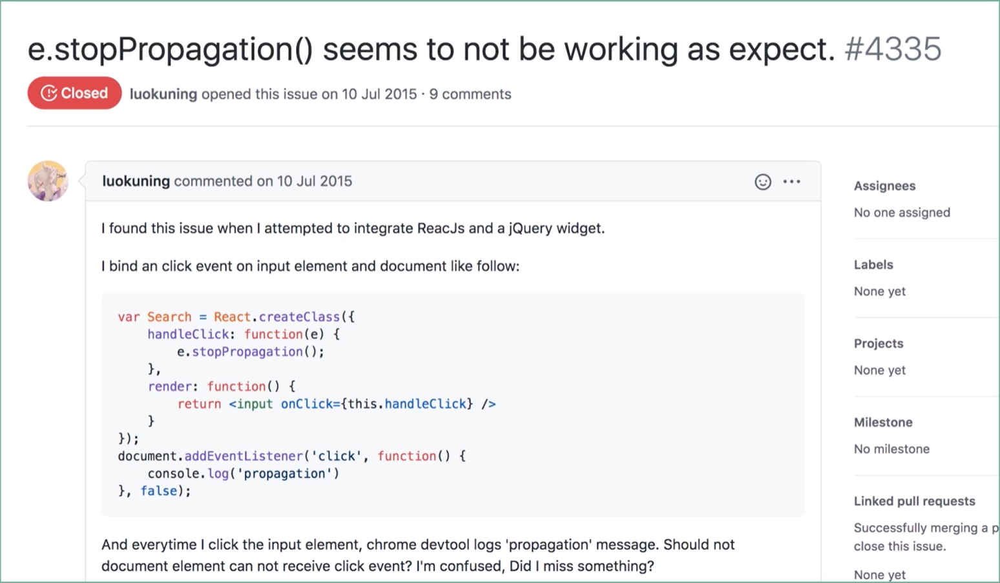

    提问者说，他试图在 input 这个元素的 React 事件函数中阻止冒泡，但事实并没有如他所愿，每次点击 input 的时候，事件还是会被冒泡到 document 上去。

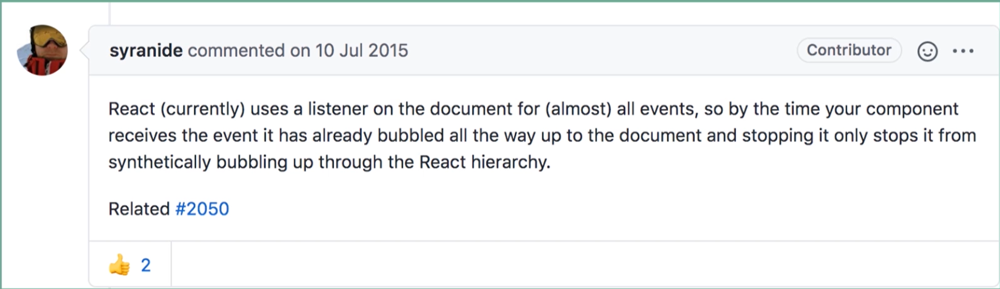

    对此他得到的回复是这样的，由于 React 依赖将 DOM 事件冒泡到 document 上来，实现对所有事件的中心化管控，图中源代码中，作者在 handleClick 这个 React 事件函数中阻止了冒泡，这只能保证该事件对应的合成事件，在 React 事件体系下的冒泡被阻止了，并不能够阻止原声盗墓事件的冒泡，因此安装在 document 的事件监听器，一定会被触发。

    且不说 document 中心化管控这个设定给开发者带来了多大的限制，侃侃设计理念就多少能够预感到其中的风险，document 是一个全局的概念，而组件只是全局的一个部分，由 React 组件引入的 React 事件系统，理论上看和组件绑在一起是最合适的，不应该将影响范围扩大到全局，在 React 17 中，React 团队终于正面解决了这个问题，事件的中心化管控不会再全部依赖 document 管控，相关的逻辑被转移到了每个 React 组件自己的容器 DOM 节点中。

    比如在 id 为 root 的 DOM 节点下，挂在了一个 React 组件，如下代码：

    ```JavaScript
    const rootElement = document.getElementById("root");
    ReactDOM.render(<App />, rootElement);
    ```

    那么事件管控的逻辑就会安装到 root 节点上去，这样一来，React 的组件就能够自己玩自己的，再也无法对全局的事件流构成威胁了。

2. **拥抱新的潮流**

    > 放弃事件池。
    > 
    > 

    在 React 17 之前，合成事件对象会被放进一个叫作 “事件池” 的地方统一管理，这样做的目的是能够实现事件对象的复用，进而提高性能，每当事件处理函数执行完毕后，其对应的合成事件对象内部的所有属性都会被置空，意在为下一次被复用做准备，这也就意味着事件逻辑一旦执行完毕，就拿不到事件对象了，React 官方给出的这个例子就能够说明问题：

    ```JavaScript
    function handleChange(e) {
      // This won't work because the event object gets reused.
      setTimeout(() => {
        console.log(e.target.value); // Too late!
      }, 100);
    }
    ```

    事件池的这个设计，虽然利好了性能，却整懵了用户，很多人只有在写过无数 bug 之后，才会后知后觉的发现，要想达到目标，事件对象必须显示的告诉 React，也就是调用一点 persist 函数，如下所示：

    ```JavaScript
    function handleChange(e) {
      // Prevents React from resetting its properties:
      e.persist();
      
      // This won't work because the event object gets reused.
      setTimeout(() => {
        console.log(e.target.value); // Too late!
      }, 100);
    }
    ```

    在旧版本中，React 这样做在很大程度上，是希望能够对部分性能一般的老浏览器进行向下兼容，但随着时代的发展，如今市面上的浏览器虽不能说性能绝佳，但基本上也不会因为事件沉底的对象，多几个少几个就表演内存泄露。

    因此，React 17 拥抱了新时代的潮流，重新在研发体验和向下兼容性能之间做了选择，这一次，它选择了前者——放弃事件池，为每一个合成事件创建新的对象，因此在 React 时期中，不需要一点 persist，也可以随时随地的访问想要的事件对象。

## **Lane 模型的引入**

初学 React 源码的同学由此可能会很自然地认为，优先级就应该是用 Lane 来处理的，但事实上，React 16 中处理优先级采用的是 expirationTime 模型，expirationTime 模型使用 expirationTime（一个时间长度）来描述任务的优先级，而 Lane 模型则使用二进制数来表示任务的优先级，Lane 模型**通过将不同优先级赋值给一个位，通过 31 位的位运算来操作优先级**，Lane 模型提供了一个新的优先级排序的思路，相对于 expirationTime 来说，它对优先级的处理会更细腻，能够覆盖更多的边界条件。

<!-- obsidian-nav:start -->
---
## 关联导航

- 所属目录：[[前端/框架/React/00. 目录|React目录]]
- 领域入口：[[前端/00. 前端知识地图|前端知识地图]]
- 相邻笔记：[[前端/框架/React/1. React 基础|上一篇]] · [[前端/框架/React/3. React 状态管理|下一篇]]
- 总导航：[[00. 知识库导航|知识库导航]]
<!-- obsidian-nav:end -->
