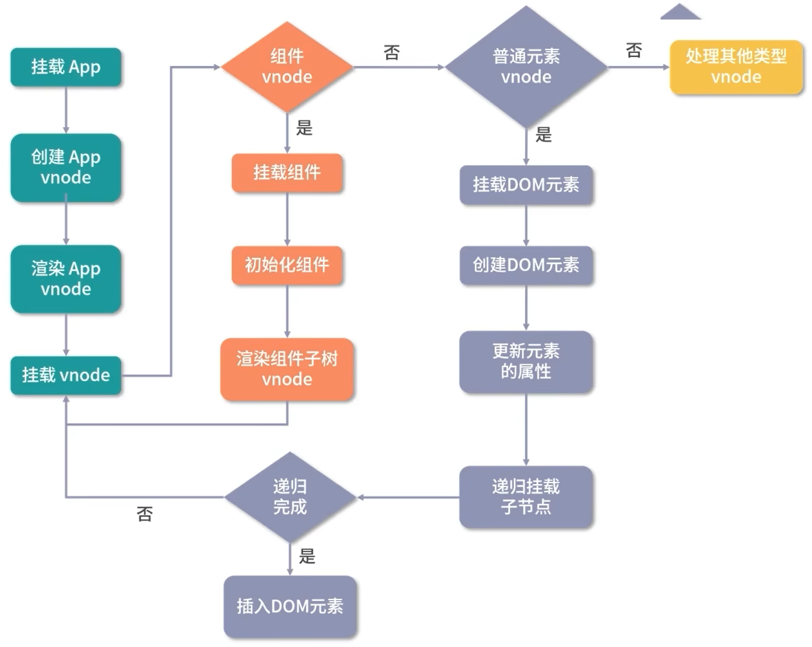
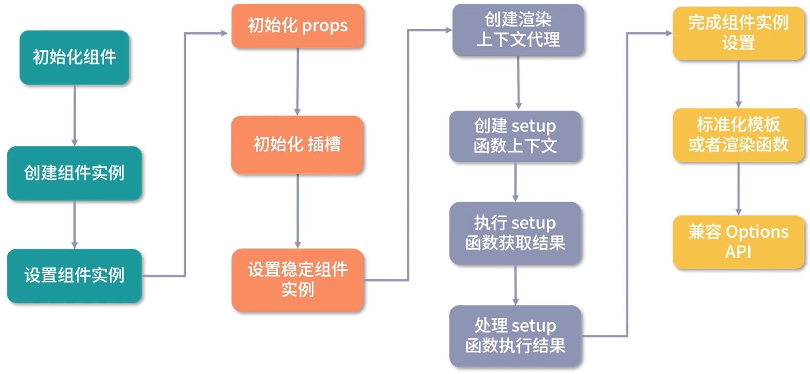
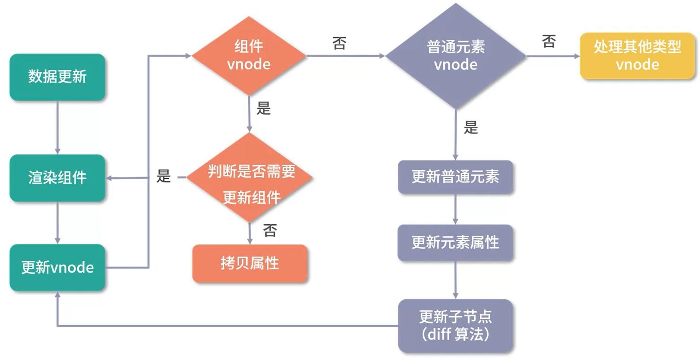
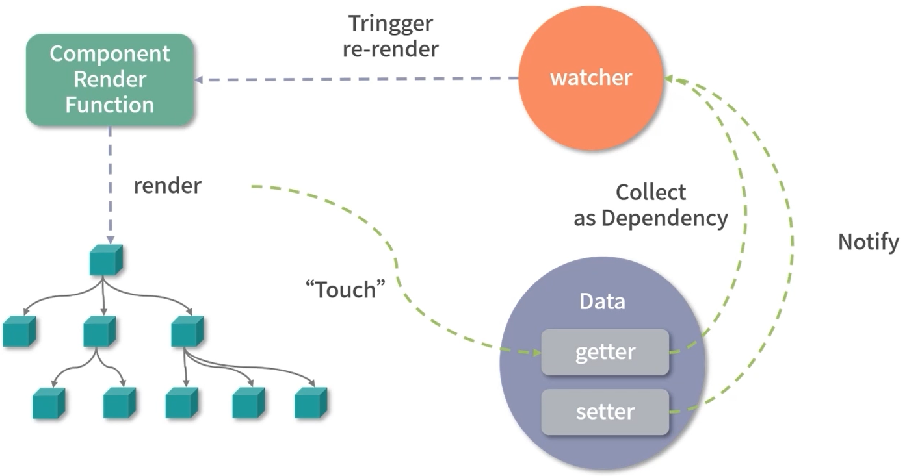
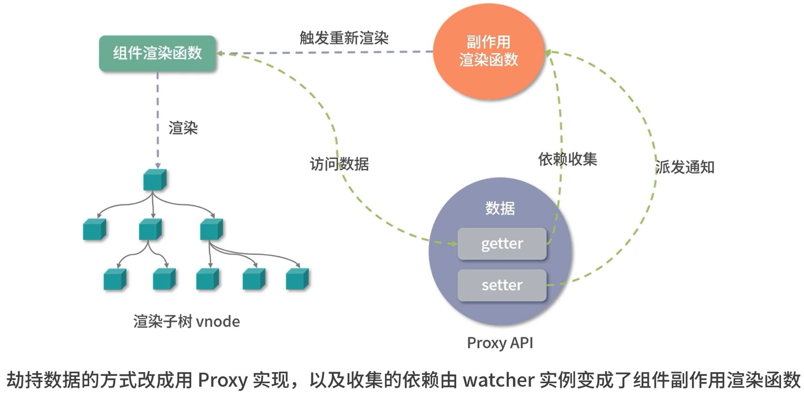
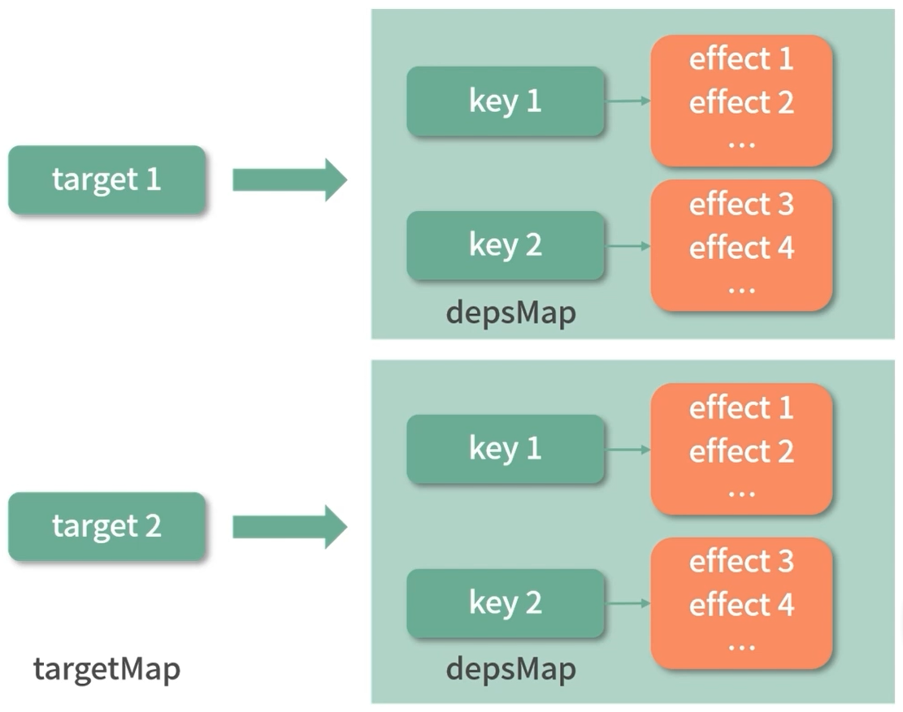
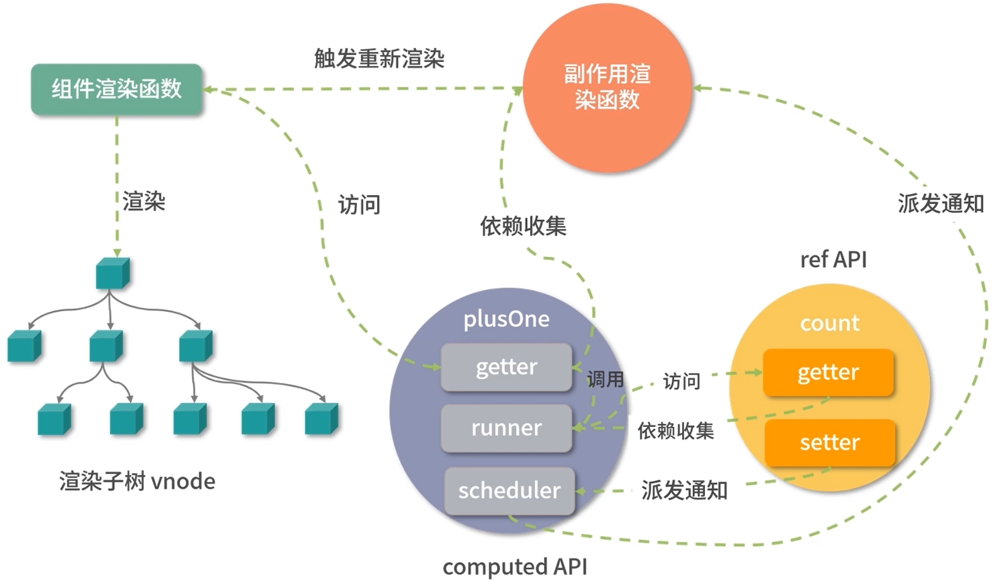
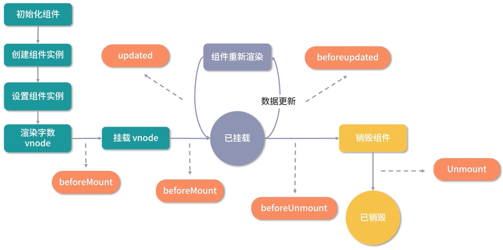

# Vue3 原理

# **Vue3 对比 Vue2 的优化**

## **源码优化**

### 使用 monorepo 管理代码

将各模块拆分到不同的 package 中，每个 package 有各自的 API、类型定义和测试，使得模块拆分更加细化，模块之间的依赖也更加明确。

### 使用 TypeScript 开发代码

相比 Vue2 使用 flow 的优势：

1. 提供了更好的类型推导

2. 对 TypeScript 更加友好

## **性能优化**

### 减少体积

- 移除一些冷门的 feature

- 引入 tree\-shaking 技术

### 数据劫持优化

Vue2 采用 **`Object.defineProperty()`** 劫持数据的 getter 和 setter，即在对象上添加 get 和 set 方法。

缺点：

1. 无法知道用户具体要访问哪一个属性，如果要实现深度监听需要递归给每一个对象都添加 get 和 set 方法，这会带来相当大的性能负担

2. 无法检测对象属性的新增和删除

Vue3 采用了 **`Proxy`** 劫持数据的 getter 和 setter。

优点：

1. 可以实现懒深度响应式，对性能有大幅度优化

> Proxy 并不能监听到内部深层次的对象变化，因此 Vue3 的处理方式是**在 getter 中去递归响应式**，起到懒深度监听的效果
> 
> 

### 编译优化

Vue2

- **静态标记**：创建一个数组用于缓存静态节点，并且生成的 vnode 带有 `inStatic: true` 属性，用于在 diff 中跳过它们的对比

Vue3

- **静态提升**：将静态节点提取到 render 函数外面，减少 vnode的创建带来的性能损耗

- **预字符串化**：将大量连续的静态节点转换为字符串，既减少 vnode 创建过程，也可以减少代码体积

- **缓存事件处理函数**：每次 render 函数执行过后，生成新的 vnode，对 vnode 的 props 中事件属性进行 patch 的时候，就直接取上一次缓存的函数，如果没有缓存，每次函数都是新的，引用不一致，会造成组件的更新

- **Block tree**：在模板编译过程中收集动态子节点，能够在 diff 过程中根据动态子节点数量更新

- **PatchFlag**：比较动态子节点时配合使用 `patchFlag` 比较动态属性

### `<slot>` 优化

- 在 Vue2 中，无论插槽内容是否改变，都会重新生成 vnode 节点。

- 在 Vue3 中，会将插槽分为静态插槽和动态插槽，组件更新时只会比较动态插槽。

## **语法优化**

### 优化逻辑组织

Vue2 中使用的 Options API 是按照 methods、data 等进行分类。

缺点：

1. 当组件变得越来越大时，一个组件可能有多个逻辑关注点，此时 Options API 就会造成很差的开发体验

Vue3 中提供了 Composition API。

优点：

1. 可以将相关逻辑放在一块，无需在一个文件的多个地方 “反复横跳”

2. Composition API 无需使用 this，因此对 tree\-shaking 也更加友好

### 优化逻辑复用

Vue2 中使用 mixin 来保存共用的逻辑。

缺点：

1. 每个 mixin 之间是无感的，这会导致多个 mixin 容易定义相同的变量，导致**命名冲突**

2. 对于组件而言，如果在模板中使用不在当前组件中定义的变量，会导致**数据来源不清晰**的问题

Vue3 中通过自定义 hook 来保存共用的逻辑。

优点：

1. 可以在引入的时候对同名变量重命名，以解决命名冲突的问题

2. 可以通过查看具体使用了哪一个 hook 来追溯数据来源

3. 可以向自定义 hook 传递参数来改变逻辑，而 mixin 不行

# **初始化应用实例**

1. 创建 Vue 实例对象

    `createApp` 中做了两件事：

    1. 创建 app 对象

    2. 保存并重写 mount

    > **为什么需要重写 ****`mount`**** 方法，而不把相关逻辑放在 app 对象的 mount 方法内部来实现呢？**
    > 
    > 答：因为 Vue 不仅仅是为 Web 平台服务，它的目标是**支持跨平台渲染**，`createApp` 函数内部的 `app.mount` 方法是一个标准的可跨平台的组件渲染流程，因此需要根据具体场景进行定制化。
    > 
    > 

    ```JavaScript
    /**
     * 创建 Vue 实例对象
     */
    const createApp = ((...args) => {
      // 1、创建 app 对象，延时创建渲染器，优点是当用户只依赖响应式包的时候，可以通过 tree-shaking 移除核心渲染逻辑相关的代码，减少体积
      const app = ensureRenderer().createApp(...args)
    
      // 2、保存并重写 mount
      const { mount } = app
      app.mount = (containerOrSelector) => {
        // ...
      }
      return app
    })
    ```

2. 使用 `ensureRenderer().createApp()` 来创建 app 对象

    ```JavaScript
    // 渲染相关的一些配置，比如：更新属性的方法，操作 DOM 的方法
    const rendererOptions = {
      patchProp,
      ...nodeOps
    }
    
    let renderer
    /**
     * 检查是否存在渲染器
     */
    function ensureRenderer() {
      return renderer || (renderer = createRenderer(rendererOptions))
    }
    /**
     * 创建渲染器
     */
    function createRenderer(options) {
      return baseCreateRenderer(options)
    }
    /**
     * 创建渲染器的基本逻辑
     */
    function baseCreateRenderer(options) {
      // 组件渲染的核心逻辑
      function render(vnode, container) {
        // ...
      }
      return {
        render,
        createApp: createAppAPI(render)
      }
    }
    /**
     * 创建应用实例的 API
     */
    function createAppAPI(render) {
      // 创建应用实例，接收的两个参数：rootComponent - 根组件的对象 和 rootProps - props参数
      return function createApp(rootComponent, rootProps = null) {
        const app = {
          _component: rootComponent,
          _props: rootProps,
          // app.mount 组件挂载逻辑
          mount(rootContainer) {
            // 1、创建根组件的 vnode
            const vnode = createVNode(rootComponent, rootProps)
    
            // 2、利用渲染器渲染 vnode
            render(vnode, rootContainer)
    
            // 3、设置应用实例的容器为根组件的容器
            app._container = rootContainer
            return vnode.component.proxy
          }
        }
        return app
      }
    }
    ```

3. 重写 `app.mount` 方法

    ```JavaScript
    /**
     * 重写 app.mount 方法
     * 重写的目的：
     * 1、让用户可以更灵活的使用 API
     * 2、兼容 Vue2 的写法
     */
    app.mount = (containerOrSelector) => {
      // 1、标准化容器，可以传字符串选择器或 DOM 对象，如果传的是字符串选择器则会将其转换为 DOM 对象作为最终挂载的容器
      const container = normalizeContainer(containerOrSelector)
      if (!container) return
      const component = app._component
    
      // 2、如果组件对象没有定义 render 函数和 template 模板，则取容器的 innerHTML 作为组件模板内容
      if (!isFunction(component) && !component.render && !component.template) {
        component.template = container.innerHTML
      }
    
      // 3、挂载前清空容器内容
      container.innerHTML = ''
    
      // 4、真正的挂载
      return mount(container)
    }
    ```

# 虚拟 DOM

## 组件渲染

> vnode 本质是用来描述 DOM 的 JavaScript 对象，它在 Vue 中可以描述**不同类型的节点**，比如：普通元素节点、组件节点等。
> 
> vnode 的优点：
> 
> 1. **抽象**：引入 vnode，可以把渲染过程抽象化，从而使得组件的抽象能力也得到提升
> 
> 2. **跨平台**：因为 patch vnode 的过程不同平台可以有自己的实现，基于 vnode 再做服务端渲染、weex 平台、小程序平台的渲染
> 
> 

组件的渲染流程：



### **创建 vnode**

createVNode 主要做了四件事：

1. 处理 props，标准化 class 和 style

2. 对 vnode 类型信息编码

3. 创建 vnode 对象

4. 标准化子节点

```JavaScript
/**
 * 创建 vnode
 */
function createVNode(type, props = null, children = null) {
  // 1、处理 props，标准化 class 和 style
  if (props) {
    // ...
  }

  // 2、对 vnode 类型信息编码
  const shapeFlag = isString(type)
    ? 1 /* ELEMENT */
    : isSuspense(type)
      ? 128 /* SUSPENSE */
      : isTeleport(type)
        ? 64 /* TELEPORT */
        : isObject(type)
          ? 4 /* STATEFUL_COMPONENT */
          : isFunction(type)
            ? 2 /* FUNCTIONAL_COMPONENT */
            : 0

  // 3、创建 vnode 对象
  const vnode = {
    type,
    props,
    shapeFlag,
    // 一些其他属性
  }

  // 4、标准化子节点，把不同数据类型的 children 转成数组或者文本类型
  normalizeChildren(vnode, children)
  return vnode
}
```

### 渲染 vnode

> 组件自身通过 render 进行渲染，子组件通过 patch 进行渲染。
> 
> 

render 主要做了几件事：

1. 检查是否存在 vnode

    - 如果之前有，现在没有，则销毁

    - 如果现在有，则创建或更新

2. 缓存 vnode，用于判断是否已经渲染

```JavaScript
/**
 * 渲染 vnode
 */
const render = (vnode, container) => {
  // vnode 为 null，则销毁组件
  if (vnode == null) {
    if (container._vnode) {
      unmount(container._vnode, null, null, true)
    }
  }
  // 否则创建或者更新组件
  else {
    patch(container._vnode || null, vnode, container)
  }

  // 缓存 vnode 节点，表示已经渲染
  container._vnode = vnode
}
```

patch 主要做了两件事：

1. 判断是否销毁节点

2. 挂载新节点

```JavaScript
/**
 * 更新 DOM
 * @param {vnode} n1 - 旧的 vnode（为 null 时表示第一次挂载）
 * @param {vnode} n2 - 新的 vnode
 * @param {DOM} container - DOM 容器，vnode 渲染生成 DOM 后，会挂载到 container 下面
 */
const patch = (n1, n2, container, anchor = null, parentComponent = null, parentSuspense = null, isSVG = false, optimized = false) => {
  // 如果存在新旧节点，且新旧节点类型不同，则销毁旧节点
  if (n1 && !isSameVNodeType(n1, n2)) {
    anchor = getNextHostNode(n1)
    unmount(n1, parentComponent, parentSuspense, true)
    n1 = null
  }

  // 挂载新 vnode
  const { type, shapeFlag } = n2
  switch (type) {
    case Text:
      // 处理文本节点
      break
    case Comment:
      // 处理注释节点
      break
    case Static:
      // 处理静态节点
      break
    case Fragment:
      // 处理 Fragment 元素
      break
    default:
      if (shapeFlag & 1/* ELEMENT */) {
        // 处理普通 DOM 元素
        processElement(n1, n2, container, anchor, parentComponent, parentSuspense, isSVG, optimized)
      } else if (shapeFlag & 6/* COMPONENT */) {
        // 处理 COMPONENT
        processComponent(n1, n2, container, anchor, parentComponent, parentSuspense, isSVG, optimized)
      } else if (shapeFlag & 64/* TELEPORT */) {
        // 处理 TELEPORT
      } else if (shapeFlag & 128/* SUSPENSE */) {
        // 处理 SUSPENSE
      }
  }
}
```

#### 处理组件

在 props、data、methods、computed 等 options 中定义一些变量，在组件初始化阶段，Vue3 内部会处理这些 options，即把定义的变量添加到了组件实例上等模板编译成 render 函数的时候，内部通过 `with(this){}` 的语法去访问在组件实例中的变量。

组件的渲染流程：



```JavaScript
/**
 * 处理 COMPONENT
 */
const processComponent = (n1, n2, container, anchor, parentComponent, parentSuspense, isSVG, optimized) => {
  // 旧节点为 null，表示不存在旧节点，则直接挂载组件
  if (n1 == null) {
    mountComponent(n2, container, anchor, parentComponent, parentSuspense, isSVG, optimized)
  }
  // 旧节点存在，则更新组件
  else {
    updateComponent(n1, n2, parentComponent, optimized)
  }
}

/**
 * 挂载组件
 * mountComponent 做了三件事：
 * 1、创建组件实例
 * 2、设置组件实例
 * 3、设置并运行带副作用的渲染函数
 */
const mountComponent = (initialVNode, container, anchor, parentComponent, parentSuspense, isSVG, optimized) => {
  // 1、创建组件实例，内部也通过对象的方式去创建了当前渲染的组件实例
  const instance = (initialVNode.component = createComponentInstance(initialVNode, parentComponent, parentSuspense))

  // 2、设置组件实例，instance 保留了很多组件相关的数据，维护了组件的上下文包括对 props、插槽，以及其他实例的属性的初始化处理
  setupComponent(instance)

  // 3、设置并运行带副作用的渲染函数
  setupRenderEffet(instance, initialVNode, container, anchor, parentSuspense, isSVG, optimized)
}
```

```JavaScript
/**
 * 创建组件实例
 */
function createComponentInstance(vnode, parent, suspense) {
  // 继承父组件实例上的 appContext，如果是根组件，则直接从跟 vnode 中取
  const appContext = (parent ? parent.appContext : vnode.appContext) || emptyAppContext;

  // 定义组件实例
  const instance = {
    uid: uid++, // 组件唯一 id
    vnode, // 组件 vnode
    parent, // 父组件实例
    appContext, // app 上下文
    type: vnode.type, // vnode 节点类型
    root: null, // 根组件实例
    next: null, // 新的组件 vnode
    subTree: null, // 子节点 vnode
    update: null, // 带副作用更新函数
    render: null, // 渲染函数
    proxy: null, // 渲染上下文代理
    withProxy: null, // 带有 with 区块的渲染上下文代理
    effects: null, // 响应式相关对象
    provides: parent ? parent.provide : Object.create(appContext.provides), // 依赖注入相关
    accessCache: null, // 渲染代理的属性访问缓存
    renderCache: [], // 渲染缓存
    ctx: EMPTY_OBJ, // 渲染上下文
    data: EMPTY_OBJ, // data 数据
    props: EMPTY_OBJ, // props 数据
    attrs: EMPTY_OBJ, // 普通属性
    slots: EMPTY_OBJ, // 插槽相关
    refs: EMPTY_OBJ, // 组件或者 DOM 的 ref 引用
    setupState: EMPTY_OBJ, // setup 函数返回的响应式结果
    setupContext: null, // setup 函数上下文数据
    components: Object.create(appContext.components), // 注册的组件
    directives: Object.create(appContext.directives), // 注册的指令
    suspense, // suspense 相关
    asyncDep: null, // suspense 异步依赖
    asyncResolved: false, // suspense 异步依赖是否都已处理
    isMounted: false, // 是否挂载
    isUnmounted: false, // 是否卸载
    isDeactivated: false, // 是否激活
    bc: null, // 生命周期 before create
    c: null, // 生命周期 created
    bm: null, // 生命周期 before mount
    m: null, // 生命周期 mounted
    bu: null, // 生命周期 before update
    u: null, // 生命周期 update
    um: null, // 生命周期 unmounted
    bum: null, // 生命周期 before unmounted
    da: null, // 生命周期 deactivated
    a: null, // 生命周期 activated
    rtg: null, // 生命周期 render triggered
    rtc: null, // 生命周期 render tracked
    ec: null, // 生命周期 err captured
    emit: null // 派发事件方法
  }

  // 初始化渲染上下文
  instance.ctx = { _: instance }

  // 初始化根组件指针
  instance.root = parent ? parent.root : instance

  // 初始化派发事件方法
  instance.emit = emit.bind(null, instance)
  return instance
}
```

```JavaScript
/**
 * 设置组件实例
 */
function setupComponent(instance, isSSR = false) {
  const { props, children, shapeFlag } = instance.vnode

  // 判断是否是一个有状态的组件
  const isStateful = shapeFlag & 4

  // 初始化 props
  initProps(instance, props, isStateful, isSSR)

  // 初始化插槽
  initSlots(instance, children)

  // 如果是一个有状态的组件，则设置有状态的组件实例
  const setupResult = isStateful ? setupStatefulComponent(instance, isSSR) : undefined
  return setupResult
}

/**
 * 设置有状态的组件实例
 */
function setupStatefulComponent(instance, isSSR) {
  const Component = instance.type

  // 创建渲染代理的属性访问缓存
  instance.accessCache = []

  // 1、创建渲染上下文代理
  /**
   * 为什么需要代理？
   * 答：在执行组件渲染函数的时候，直接访问渲染上下文 instance.ctx 中的属性，做一层 proxy 对渲染上下文 instance.ctx 属性的访问和修改代理到对 setupState、ctx、data、props 中的数据的访问和修改（简单来说：通过 proxy 拦截对组件实例上下文的修改，代理为对 data 等的修改）
   */
  instance.proxy = new Proxy(instance.ctx, PublicInstanceProxyHandlers)

  // 2、判断处理 setup 函数
  const { setup } = Component

  // 3、组件实例的设置
  if (setup) {
    // 3.1、如果 setup 函数带参数，则创建一个 setupContext
    const setupContext = (instance.setupContext = setup.length > 1 ? createSetupContext(instance) : null)

    // 3.2、执行 setup 函数，获取结果
    const setupResult = callWithErrorHandling(setup, instance, 0/* SETUP_FUNCTION */, [instance.props, setupContext])

    // 3.3、处理 setup 返回结果
    handleSetupResult(instance, setupResult)
  } else {
    // 完成组件实例设置
    finishComponentSetup(instance)
  }
}

// 渲染上下文代理的处理器
const PublicInstanceProxyHandlers = {
  get({ _: instance }, key) {
    const { ctx, setupState, data, props, accessCache, type, appContext } = instance
    // 判断 key 不已 $ 开头的情况(！！！注意优先级) - setupState(setup 函数返回的数据) | data | props | ctx
    if (key[0] !== '$') {
      // 在缓存中访问渲染代理的属性
      const n = accessCache[key]
      // 如果缓存中存在该属性
      if (n !== undefined) {
        switch (n) {
          case 0: /* SETUP */
            return setupState[key]
          case 1: /* DATA */
            return data[key]
          case 3: /* CONTEXT */
            return ctx[key]
          case 2: /* PROPS */
            return props[key]
        }
      }
      // 从 setupState 中取数据
      else if (setupState !== EMPTY_OBJ && hasOwn(setupState, key)) {
        accessCache[key] = 0
        return setupState[key]
      }
      // 从 data 中取数据
      else if (data !== EMPTY_OBJ && hasOwn(data, key)) {
        accessCache[key] = 1
        return data[key]
      }
      // 从 props 中取数据
      else if (type.props && hasOwn(normalizePropsOptions(type.props)[0], key)) {
        accessCache[key] = 2
        return props[key]
      }
      // 从 ctx 中取数据
      else if (ctx !== EMPTY_OBJ && hasOwn(ctx, key)) {
        accessCache[key] = 3
        return ctx[key]
      }
      // 都取不到
      else {
        accesssCache[key] = 4
      }
    }
    const publicGetter = publicPropertiesMap[key]
    let cssModul, globalProperties

    // 公开的 $xxx 属性或方法
    if (publicGetter) {
      return publicGetter(instance)
    }
    // css 模块，通过 vue-loader 编译的时候注入
    else if ((cssModule = type.__cssModules) && (cssModule = cssModule[key])) {
      return cssModule
    }
    // 用户的自定义的属性，也用 $ 开头
    else if (ctx !== EMPTY_OBJ && hasOwn(ctx, key)) {
      accessCache[key] = 3
      return ctx[key]
    }
    // 全局定义的属性
    else if (((globalProperties = appContext.config.globalProperties), hasOwn(globalProperties, key))) {
      return globalProperties[key]
    } else if ((process.env.NODE_ENV !== 'production') && currentRenderingInstance && key.indexOf('__v') !== 0) {
      if (data !== EMPTY_OBJ && key[0] === '$' && hasOwn(data, key)) {
        // 如果在 data 中定义的数据以 $ 开头，会报警告，因为 $ 是保留字符，不会做代理
        warn(/* ... */)
      } else {
        // 在模板中使用的变量如果没有定义，报警告
        warn(/* ... */)
      }
    }
  },
  set({ _: instance }, key, value) {
    const { data, setupState, ctx } = instance
    // 给 setupState 赋值
    if (setupState !== EMPTY_OBJ && hasOwn(setupState, key)) {
      setupState[key] = value
    }
    // 给 data 赋值
    else if (data !== EMPTY_OBJ && hasOwn(data, key)) {
      data[key] = value
    }
    // 不能直接给 props 赋值，因为不符合单向数据流的设计思想
    else if (key in instance.props) {
      (process.env.NODE_ENV !== 'production') && warn(/* ... */)
      return false
    }
    // 不能给 Vue 内部以 $ 开头的保留属性赋值
    if (key[0] === '$' && key.slice(1) in instance) {
      (process.env.NODE_ENV !== 'production') && warn(/* ... */)
      return false
    }
    // 用户自定义数据赋值
    else {
      ctx[key] = value
    }
    return true
  },
  has({ _: { data, setupState, accessCache, ctx, type, appContext } }, key) {
    // 依次判断 key 是否存在于 缓存、data、setupState、props、ctx(渲染上下文)、publicPropertiesMap(公开属性)、appContext.config.globalProperties(应用全局属性)
    return (accessCache[key] !== undefined
      || (data !== EMPTY_OBJ && hasOwn(data, key))
      || (setupState !== EMPTY_OBJ && hasOwn(setupState, key))
      || (type.props && hasOwn(normalizePropsOptions(type.props)[0], key))
      || hasOwn(ctx, key)
      || hasOwn(publicPropertiesMap, key)
      || hasOwn(appContext.config.globalProperties, key))
  }
}

/**
 * 创建 setupContext - setup 函数的第二个参数
 */
function createSetupContext(instance) {
  return {
    attrs: instance.attrs,
    slots: instance.slots,
    emit: instance.emit
  }
}

/**
 * 对 setup 进行封装，处理错误的情况
 */
function callWithErrorHandling(fn, instance, type, args) {
  let res
  try {
    res = args ? fn(...args) : fn()
  } catch (err) {
    handleError(err, instance, type)
  }
  return res
}

/**
 * 处理 setupResult - setup 返回结果
 */
function handleSetupResult(instance, setupResult) {
  // 当 setupResult 为函数，则把该函数设置为组件实例的渲染函数
  if (isFunction(setupResult)) {
    instance.render = setupResult
  }
  // 当 setupResult 为对象，则把 setupResult 变成响应式
  else if (isObject(setupResult)) {
    instance.setupState = reactive(setupResult)
  }

  // 完成组件实例设置
  finishComponentSetup(instance)
}

/**
 * 完成组件实例设置
 * finishComponentSetup 主要做了两件事：
 * 1、标准化模板或者渲染函数
 * 2、兼容 Options API
 */
function finishComponentSetup(instance) {
  const Component = instance.type
  // 1、标准化模板或者渲染函数
  /**
   * Vue 的两种写法：
   * 1、引入 Vue.js - 直接在组件对象的 template 属性中编写组件的模板（对应 runtime-compiled）
   * 2、SFC - 通过编写组件的 tempalte 模板去描述一个组件的 DOM 结构（对应 runtime-only）
   * Vue 在 Web 端有两种编译方式：
   * 1、runtime-compiled（古老写法）
   * 2、runtime-only（推荐：体积更小、运行时不用编译、耗时更少、性能更优秀）
   * 区别在于是否注册了 compile 方法
   */
  if (!instance.render) {
    // runtime-compiled 编译方式，存在 template 不存在 render，则在 JavaScript 运行时进行模板编译，生成 render 函数
    if (compile && Component.template && !Component.render) {
      Component.render = compile(Component.template, {
        isCustomElement: instance.appContext.config.isCustomElement || No
      })
      Component.render._rc = true
    }

    if ((process.env.NODE_ENV !== 'production') && !Component.render) {
      // runtime-only 编译模式，存在 tempalte 不存在 render，则警告如果想要在运行时编译应使用 runtime-compiled 模式
      if (!compile && Component.template) {
        warn(/* ... */)
      }
      // 既没有写 render，也没有 template，则警告缺少 template 或 render
      else {
        warn(/* ... */)
      }
    }

    // 把组件的 render 函数赋值给 instance.render
    instance.render = (Component.render || NOOP)
    if (instance.render._rc) {
      // 对于使用 with 块的运行时编译的渲染函数，使用 RuntimeCompiledPublicInstanceProxyHandlers 代理
      instance.withProxy = new Proxy(instance.ctx, RuntimeCompiledPublicInstanceProxyHandlers)
    }
  }

  // 2、兼容 Options API
  {
    currentInstance = instance
    applyOptions(instance, Component)
    currentInstance = null
  }
}

// 使用 with 块运行时编译的渲染函数的代理处理器，在之前渲染上下文代理 PublicInstanceProxyHandlers 的基础上进行扩展
const RuntimeCompiledPublicInstanceProxyHandlers = {
  ...PublicInstanceProxyHandlers,
  get(target, key) {
    if (key === Symbol.unscopables) return
    return PublicInstanceProxyHandlers.get(target, key, target)
  },
  has(_, key) {
    // 如果 key 以 _ 开头或者 key 在全局变量白名单内，则 has 为 false
    const has = key[0] !== '_' && !isGloballyWhitelisted(key)
    if ((process.env.NODE_ENV !== 'production') && !has && PublicInstanceProxyHandlers.has(_, key)) {
      warn(/* ... */)
    }
    return has
  }
}

/**
 * 兼容 Option API
 */
function applyOptions(instance, options, deferredData = [], deferredWatch = [], asMixin = false) {
  const {
    mixins, // 混入
    extends: extendsOptions, // 继承
    props: propsOptions, // 父组件传参
    data: dataOptions, // 状态
    computed: computedOptions, // 计算属性
    methods, // 方法
    watch: watchOptions, // 监视属性
    provide: provideOptions, // 依赖
    inject: injectOptions, // 注入
    components, // 组件
    directives, // 指令
    // 生命周期
    beforeMount,
    mounted,
    beforeUpdata,
    updated,
    activated,
    deactivated,
    beforeUnmount,
    unmounted,
    renderTracked,
    renderTriggered,
    errorCaptured
  } = options

  // instance.proxy 作为 this
  const publicThis = instance.proxy
  const ctx = instance.ctx

  // 处理全局 mixin、extend、本地 mixins、inject、methods、data、computed、watch、provide、components、directives、生命周期 option
  // ...
}
```

```JavaScript
/**
 * setup 渲染副作用函数
 * 副作用：当组件数据发生变化时，effect 函数包裹的内部渲染函数 componentEffect 会重新执行一遍，从而达到重新渲染组件的目的
 */
const setupRenderEffect = (instance, initialVNode, container, anchor, parentSuspense, isSVG, optimized) => {
  // 创建响应式的副作用渲染函数
  instance.update = effect(function componentEffect() {
    // 如果组件实例 instance 上的 isMounted 属性为 false，说明是初次渲染
    /**
     * 初始化渲染主要做两件事情：
     * 1、渲染组件生成子树 subTree
     * 2、把 subTree 挂载到 container 中
     */
    if (!instance.isMounted) {
      // 1、渲染组件生成子树 vnode
      const subTree = (instance.subTree = renderComponentRoor(instance))

      // 2、把子树 vnode 挂载到 container 中
      patch(null, subTree, container, anchor, instance, parentSuspense, isSVG)

      // 保留渲染生成的子树根 DOM 节点
      initialVNode.el = subTree.el
      instance.isMounted = true
    }
    // 更新组件
    else {
      // ...
    }
  }, prodEffectOptions)
}
```

#### 处理普通元素

```JavaScript
/**
 * 处理 ELEMENT
 */
const processElement = (n1, n2, container, anchor, parentComponent, parentSuspense, isSVG, optimized) => {
  isSVG = isSVG || n2.type === 'svg'
  // 旧节点为 null，说明没有旧节点，为第一次渲染，则挂载元素节点
  if (n1 == null) {
    mountElement(n2, container, anchor, parentComponent, parentSuspense, isSVG, optimized)
  }
  // 否则更新元素节点
  else {
    patchElement(n1, n2, parentComponent, parentSuspense, isSVG, optimized)
  }
}

/**
 * 挂载元素
 * mountElement 主要做了四件事：
 * 1、创建 DOM 元素节点
 * 2、处理 props
 * 3、处理子节点
 * 4、把创建的 DOM 元素节点挂载到 container 上
 */
const mountElement = (vnode, container, anchor, parentComponent, parentSuspense, isSVG, optimized) => {
  let el
  const { type, props, shapeFlag } = vnode

  // 1、创建 DOM 元素节点
  el = vnode.el = hostCreateElement(vnode.type, isSVG, props && props.is)

  // 2、处理 props，比如 class、style、event 等属性
  if (props) {
    // 遍历 props，给这个 DOM 节点添加相关的 class、style、event 等属性，并作相关的处理
    for (const key in props) {
      if (!isReservedProp(key)) {
        hostPatchProp(el, key, null, props[key], isSVG)
      }
    }
  }

  // 3、处理子节点
  // 子节点是纯文本的情况
  if (shapeFlag & 8/* TEXT_CHILDREN */) {
    hostSetElementText(el, vnode.children)
  }
  // 子节点是数组的情况
  else if (shapeFlag & 16/* ARRAY_CHILDREN */) {
    mountChildren(vnode.children, el, null, parentComponent, parentSuspense, isSVG && type !== 'foreignObject', optimized || !!vnode.dynamicChildren)
  }

  // 4、把创建的 DOM 元素节点挂载到 container 上
  hostInsert(el, container, anchor)
}

/**
 * 创建元素
 */
function createElement(tag, isSVG, is) {
  // 在 Web 环境下的方式
  isSVG ? document.createElementNS(svgNS, tag) : document.createElement(tag, is ? { is } : undefined)

  // 如果是其他平台就不是操作 DOM 了，而是平台相关的 API，这些相关的方法是在创建渲染器阶段作为参数传入的
}

/**
 * 处理子节点是纯文本的情况
 */
function setElementText(el, text) {
  // 在 Web 环境下通过设置 DOM 元素的 textContent 属性设置文本
  el.textContent = text
}

/**
 * 处理子节点是数组的情况
 */
function mountChildren(children, container, anchor, parentComponent, parentSuspense, isSVG, optimized, start = 0) {
  // 遍历 chidren，获取每一个 child，递归执行 patch 方法挂载每一个 child
  for (let i = start; i < children.length; i++) {
    // 预处理 child
    const child = (children[i] = optimized ? cloneIfMounted(children[i]) : normalizeVNode(children[i]))

    // 执行 patch 挂载 child
    // 执行 patch 而非 mountElement 的原因：因为子节点可能有其他类型的 vnode，比如 组件 vnode
    patch(null, child, container, anchor, parentComponent, parentSuspense, isSVG, optimized)
  }
}

/**
 * 把创建的 DOM 元素节点挂载到 container 下
 * 因为 insert 的执行是在处理子节点后，所以挂载的顺序是先子节点，后父节点，最终挂载到最外层的容器上
 */
function insert(child, parent, anchor) {
  // 如果有参考元素 anchor，则把 child 插入到 anchor 前
  if (anchor) {
    parent.insertBefore(child, anchor)
  }
  // 否则直接通过 appendChild 插入到父节点的末尾
  else {
    parent.appendChild(child)
  }
}
```

> 扩展：**嵌套组件**
> 
> 组件 vnode 主要维护着组件的定义对象，组件上的各种 props，而组件本身是一个抽象节点，它自身的渲染其实是通过执行组件定义的 render 渲染函数生成的子树 vnode 来完成，然后再通过 patch 这种递归的方式，无论组件的嵌套层级多深，都可以完成整个组件树的渲染。
> 
> 

## 组件更新

组件更新流程：

1. 从头部开始同步

2. 从尾部开始同步

3. 挂载剩余的新节点

4. 删除多余的旧节点

5. 处理未知的子序列

    - 当两个节点类型相同时，执行更新操作

    - 当新子节点中没有旧子节点中的某些节点时，执行删除操作

    - 当新子节点中多了旧子节点中没有的节点时，执行添加操作

    > 相对来说，这些操作中最麻烦的就是移动，既要判断哪些节点需要移动，也要清除如何移动。
    > 
    > 

6. 移动子节点（**如何以最小的时间复杂度移动子节点才是重点**）

    - 在新旧子节点序列中找出相同节点并更新

    > 找出多余的节点**删除**，找出新的节点**添加**。
    > 
    > 找出需要**移动**的节点，需要遍历对应的序列，如果在遍历旧子序列的过程中需要判断某个节点是否在新子序列中存在，这就需要双重循环，双重循环的复杂度是 O\(n\(2\)\)，为了优化这个复杂度，建立索引图，把时间复杂度降低到 O\(n\)。
    > 
    > 

    - 建立索引图（空间换时间）

    > 在开发过程中，会给 `v-for` 生成的列表中的每一项分配唯一 key 作为项的唯一 ID。
    > 
    > 对比新旧子序列中的节点，key 相同的就是同一个节点，执行执行 patch 更新即可。
    > 
    > 

    - 移动和挂载新节点

    > Vue3 是通过**获取最长递增子序列**来进行移动的，**动态规划**解法的时间复杂度为 O\(n\(2\)\)，而 Vue3 采用了 ”**贪心\+二分查找**“ 来实现，贪心的时间复杂度为 O\(n\)，二分查找的时间复杂度 O\(logn\)，总时间复杂度为 O\(nlogn\)。
    > 
    > 



```JavaScript
/**
 * 比较节点
 */
const patchKeyedChildren = (c1, c2, container, parentAnchor, parentComponent, parentSuspense, isSVG, optimized) => {
  let i = 0 // 新、旧子序列的头部索引
  const l2 = c2.length
  let e1 = c1.length - 1 // 旧子节点的尾部索引
  let e2 = l2 - 1 // 新子节点的尾部索引

  // 1、从头部开始同步
  while (i <= e1 && i <= e2) {
    const n1 = c1[i] // 旧节点
    const n2 = c2[i] // 新节点
    // 相同类型的节点，递归执行 patch 更新节点
    if (isSameVNodeType(n1, n2)) {
      patch(n1, n2, container, parentAnchor, parentComponent, parentSuspense, isSVG, optimized)
    }
    // 节点类型不同 或 不存在新 | 旧节点，则退出
    else {
      break
    }
    i++
  }

  // 2、从尾部开始同步
  while (i <= e1 && i <= e2) {
    const n1 = c1[e1] // 旧节点
    const n2 = c2[e2] // 新节点
    // 相同类型的节点，递归执行 patch 更新节点
    if (isSameVNodeType(n1, n2)) {
      patch(n1, n2, container, parentAnchor, parentComponent, parentSuspense, isSVG, optimized)
    }
    // 节点类型不同 或 不存在新 | 旧节点，则退出
    else {
      break
    }
    e1--
    e2--
  }

  // 3、挂载剩余的新节点
  if (i > e1) {
    if (i <= e2) {
      const nextPos = e2 + 1
      const anchor = nextPos < l2 ? c2[nextPos].el : parentAnchor
      while (i <= e2) {
        // 挂载新节点
        patch(null, c2[i], container, anchor, parentComponent, parentSuspense, isSVG)
        i++
      }
    }
  }

  // 4、删除多余的旧节点
  else if (i > e2) {
    while (i <= e1) {
      // 删除节点
      unmount(c1[i], parentComponent, parentSuspense, true)
      i++
    }
  }

  // 5、处理未知的子序列
  // 5.1、根据 key 建立新子序列的索引图
  const s1 = i // 旧子序列开始索引，从 i 开始记录
  const s2 = i // 新子序列开始索引，从 i 开始记录
  const keyToNewIndexMap = new Map() // 新子序列节点的 key -> index 的索引表
  // 遍历新子序列，记录索引表
  for (i = s2; i <= e2; i++) {
    const nextChild = c2[i]
    keyToNewIndexMap.set(nextChild.key, i)
  }

  // 5.2、正序遍历旧子序列，找到匹配的节点更新，删除不在新子序列中的节点，判断是否有移动节点
  let patched = 0 // 新子序列已更新节点的数量
  const toBePatched = e2 - s2 + 1 // 新子序列待更新节点的数量，等于新子序列的长度
  let moved = false // 是否存在要移动的节点
  let maxNewIndexSoFar = 0 // 用于跟踪判断是否有节点移动
  const newIndexToOldIndexMap = new Array(toBePatched) // 存储新子序列中的节点在旧子序列中的索引，用于确定最长递增子序列
  // 初始化数组，每个元素的只都是 0
  // 0 是一个特殊的值，如果遍历完了仍有元素的值为 0，则说明这个新节点没有对应的旧节点
  for (i = 0; i < toBePatched; i++) {
    newIndexToOldIndexMap[i] = 0
  }
  // 正序遍历旧子序列
  for (i = s1; i <= e1; i++) {
    const prevChild = c1[i]
    // 所有新的子序列节点都已经更新，删除剩余的节点
    if (patched >= toBePatched) {
      unmount(prevChild, parentComponent, parentSuspense, true)
      continue
    }
    let newIndex = keyToNewIndexMap.get(prevChild.key) // 查找旧子序列中的节点在新子序列中的索引
    // 找不到说明旧子序列已经不存在于新子序列中，则删除该节点
    if (newIndex === undefined) {
      unmount(prevChild, parentComponent, parentSuspense, true)
    }
    // 否则更新新子序列中的元素在旧子序列中的索引
    else {
      // 这里加 1 偏移，是为了避免 i 为 0 的特殊情况，影响对后续最长递增子序列的求解
      newIndexToOldIndexMap[newIndex - s2] = i + 1
      // maxNewIndexSoFar 始终存储的是上次求值的 newIndex，如果不是一直递增，则说明有移动
      if (newIndex >= maxNewIndexSoFar) {
        maxNewIndexSoFar = newIndex
      } else {
        moved = true
      }
      // 更新新旧子序列中匹配的节点
      patch(prevChild, c2[newIndex], container, null, parentComponent, parentSuspense, isSVG, optimized)
      patched++
    }
  }

  // 5.3、移动和挂载新节点
  // 仅当节点移动时生成最长递增子序列
  const increasingNewIndexSequence = moved ? getSequence(newIndexToOldIndexMap) : EMPTY_ARR
  let j = increasingNewIndexSequence.length - 1
  // 倒序遍历以便我们可以使用最后更新的节点作为锚点
  for (i = toBePatched - 1; i >= 0; i--) {
    const nextIndex = s2 + 1
    const nextChild = c2[nextIndex]
    // 锚点指向上一个更新的节点，如果 nextIndex 超过新子节点的长度，则指向 parentAnchor
    const anchor = nextIndex + 1 < l2 ? c2[nextIndex + 1].el : parentAnchor
    // 挂载新的子节点
    if (newIndexToOldIndexMap[i] === 0) {
      patch(null, nextChild, container, anchor, parentComponent, parentSuspense, isSVG)
    }
    // 没有最长递增子序列（reverse 的场景）或者当前的节点索引不在最长递增子序列中，需要移动
    else if (moved) {
      if (j < 0 || i !== increasingNewIndexSequence[j]) {
        move(nextChild, container, anchor, 2)
      } else {
        // 倒序递增子序列 
        j--
      }
    }
  }
}

/**
 * 获取最长递增子序列，实际求的是最长递增子序列各项的索引
 */
function getSequence(arr) {
  const p = arr.slice()
  const result = [0] // 长度为 i 的最长递增子序列各项的索引
  let i, j, u, v, c
  const len = arr.length
  // 对数组遍历，依次求解长度为 i 时的最长递增子序列
  for (i = 0; i < len; i++) {
    const arrI = arr[i]
    if (arrI !== 0) {
      j = result[result.length - 1]
      // 当 i 元素大于 i-1 的元素时，添加 i 元素并更新最长子序列
      if (arr[j] < arrI) {
        // 存储在 result 更新前的最后一个索引的值
        p[i] = j
        result.push(i)
        continue
      }
      // 否则往前查找直到找到一个比 i 小的元素，然后插在该元素后面并更新对应的最长递增子序列
      u = 0
      v = result.length - 1
      // 二分搜索，查找比 arrI 小的节点，更新 result 的值
      while (u < v) {
        c = ((u + v) / 2) | 0
        if (arr[result[c]] < arrI) {
          u = c + 1
        } else {
          v = c
        }
      }
      if (arrI < arr[result[u]]) {
        if (u > 0) {
          p[i] = result[u - 1]
        }
        result[u] = i
      }
    }
  }
  u = result.length
  v = result[u - 1]

  // 回溯数组 p，找到最终的索引
  while (u-- > 0) {
    result[u] = v
    v = p[v]
  }
  return result
}
```

> 问题：`v-for` 时能否用 index 作为 key？
> 
> 答：如果列表只是用于展示的话没有问题，如果列表涉及增、删、改就一定要用唯一标识。
> 
> 

# 响应式

响应式的本质是**当数据变化后会自动执行某个函数**。

映射到组件的实现就是，当数据变化后，会自动触发组件的重新渲染。

响应式的两个核心流程：

1. 依赖收集

2. 派发通知

## Vue2



> Vue2 中只有 data 中定义的数据才是响应式的，因为 data 中的数据会通过 `Object.defineProperty` 劫持后再挂载到 this 上，这是一个相对**黑盒**的行为。
> 
> 

```JavaScript
/**
 * 观察某个对象的所有属性
 */
function observe(obj) {
  for(const key in obj) {
    let internalValue = obj[key];
    let funcs = new Set(); // 依赖该属性的函数(注意：要用 Set 而非 Array，因为一个函数可能在多个地方都有用到该属性)
    Object.defineProperty(obj, key, {
      get: function() {
        // 依赖收集，记录：是哪个函数在用我
        if(window.__func) {
          funcs.add(window.__func)
        }
        return internalValue;
      },
      set: function(val) {
        internalValue = val;
        // 派发更新，运行：执行用我的函数
        for(let i = 0; i < funcs.length; i++) {
          funcs[i]();
        }
      }
    })
  }
}

/**
 * 自动运行
 * @param {Function} fn - 自动运行的函数
 */
function autorun(fn) {
  window.__func = fn;
  fn();
  window.__func = null;
}
```

> `Object.defineProperty` 的缺点：
> 
> 1. 不能监听对象属性的**新增**和**删除**
> 
> 2. 初始化阶段递归执行 `Object.defineProperty` 带来的**性能负担**
> 
> 

## Vue3



### **reactive**

#### **创建 reactive 对象**

创建 reactive 对象主要做了 6 件事：

1. 判断 target 不是对象或数组类型，直接返回

2. 判断 target 已经是响应式对象，直接返回

3. 判断 target 已经有 readonly 或者 reactive，返回该响应式对象

4. 判断 target 不能被监听，直接返回

5. 通过 Proxy 劫持 target 对象，把它变成响应式

6. 给原始数据打个标记，说明它已经存在响应式对象了

```JavaScript
/**
 * 响应式函数 - reactive
 */
function reactive(target) {
  // 如果尝试把一个 readonly 变成 reactive，直接返回这个 readonly
  if (target && target.__v_isReadonly) {
    return target
  }

  // 否则创建 reactive 对象
  return createReactiveObject(target, false, mutableHandlers, mutableCollectionHandlers)
}

/**
 * 创建 reactive 对象
 * createReactiveObject 主要做了 6 件事：
 * 1、判断 target 不是对象或数组类型，直接返回
 * 2、判断 target 已经是响应式对象，直接返回
 * 3、判断 target 已经有 readonly 或者 reactive，返回该响应式对象
 * 4、判断 target 不能被监听，直接返回
 * 5、通过 Proxy 劫持 target 对象，把它变成响应式
 * 6、给原始数据打个标记，说明它已经存在响应式对象了
 */
function createReactiveObject(target, isReadonly, baseHandlers, collectionHandlers) {
  // 1、判断 target 不是对象或数组类型，直接返回 - 限制目标对象必须为对象或数组
  if (!isObject(target)) {
    if (process.env.NODE_ENV !== 'production') {
      console.warn(/* ... */)
    }
    return target
  }

  // 2、判断 target 已经是响应式对象，直接返回
  // 有个例外，如果是 readonly 作用于一个响应式对象，则继续
  if (target.__v_raw && !(isReadonly && target.__v_isReactive)) {
    return target
  }

  // 3、判断 target 已经有 readonly 或者 reactive，返回该响应式对象 - 同一原始数据生成的响应式对象只有一个
  if (hasOwn(target, isReadonly ? "__v_readonly"/* readonly */ : "__v_reactive"/* reactive */)) {
    return isReadonly ? target.__v_readonly : target.__v_reactive
  }

  // 4、判断 target 不能被监听，直接返回
  if (!canObserve(target)) {
    return target
  }

  // 5、通过 Proxy 劫持 target 对象，把它变成响应式
  const observed = new Proxy(target, collectionTypes.has(target.constructor) ? collectionHandlers : baseHandlers)

  // 6、给原始数据打个标记，说明它已经存在响应式对象了
  def(target, isReadonly ? "__v_readonly"/* readonly */ : "__v_reactive"/* reactive */, observed)
  return observed
}

/**
 * 能否被监听
 * 同时满足以下三点：
 * 1、不存在 __v_skip 属性
 * 2、是可以被监听的数据类型
 * 3、没有被冻结
 */
function canObserv(value) {
  // 判断是否是可以被监听的数据类型
  const isObservableType = makeMap('Object,Array,Map,Set,WeakMap,WeakSet')

  return (!value.__v_skip && isObservableType(toRawType(value)) && !Object.isFrozen(value))
}

// 处理器对象
const mutableHandlers = {
  get, // 访问对象属性会触发 get 函数
  set, // 设置对象属性会触发 set 函数
  deleteProperty, // 删除对象属性会触发 deleteProperty 函数
  has, // in 操作符会触发 has 函数
  ownKeys // Object.getOwnPropertyNames 触发 ownKeys 函数
}
```

#### **get \- 依赖收集**

```JavaScript
/**
 * 创建 getter - 依赖收集
 * get 主要做了 4 件事：
 * 1、对特殊的 key 做代理
 * 2、通过 Reflect.get 求值
 * 3、执行 track 函数进行依赖收集
 * 4、判断 res 为对象或者数组，递归执行 reactive 函数把 res 变成响应式（在对象属性被访问时递归 - 懒响应式）
 */
function createGetter(isReadonly = false) {
  return function get(target, key, receiver) {
    // 1、对特殊的 key 做代理
    // 代理 observed.__v_isReactive
    if (key === "__v_isReactive") {
      return !isReadonly
    }
    // 代理 observed.__v_isReadonly
    else if (key === "__v_isReadonly") {
      return isReadonly
    }
    // 代理 observed.__v_raw
    else if (key === "__v_raw") {
      return target
    }

    // 2、通过 Reflect.get 求值
    const targetIsArray = isArray(target) // 判断目标对象是否是数组
    if (targetIsArray && hasOwn(arrayInstrumentations, key)) {
      return Reflect.get(arrayInstrumentations, key, receiver)
    }
    const res = Reflect.get(target, key, receiver)
    // 内置 Symbol key 不需要依赖收集
    if (isSymbol(key) && builtInSymbols.has(key) || key === '__proto__') {
      return res
    }

    // 3、执行 track 函数进行依赖收集
    !isReadonly && track(target, "get", key)

    // 4、判断 res 为对象或者数组，递归执行 reactive 函数把 res 变成响应式（在对象属性被访问时递归 - 懒响应式）
    return isObject(res) ? isReadonly ? readonly(res) : reactive(res) : res
  }
}

// arrayInstrumentations - 包含对数组一些方法修改的函数
const arrayInstrumentations = {}

['includes', 'indexOf', 'lastIndexOf'].forEach(key => {
  arrayInstrumentations[key] = function (...args) {
    // toRaw - 把响应式对象转化为原始数据
    const arr = toRaw(this)
    for (let i = 0, l = this.length; i < l; i++) {
      // 依赖收集 - get
      track(arr, "get", i + '')
    }

    // 先尝试用参数本身，可能是响应式数据
    const res = arr[key](...args)
    if (res === -1 || res === false) {
      // 如果失败，再尝试把参数转成原始数据
      return arr[key](...args.map(toRaw))
    } else {
      return res
    }
  }
})
```

依赖收集



```JavaScript
let shouldTrack = true // 是否应该收集依赖
let activeEffect // 当前激活的 effect
const targetMap = new WeakMap() // 原始数据对象 map

/**
 * 收集依赖函数
 */
function track(target, type, key) {
  if (!shouldTrack || activeEffect === undefined) return

  // 每个 target 对应一个 depsMap
  let depsMap = targetMap.get(target)
  if (!depsMap) {
    targetMap.set(target, (depsMap = new Map()))
  }

  // 每个 key 对应一个 dep 集合
  let dep = depsMap.get(key)
  if (!dep) {
    depsMap.set(key, (dep = new Set()))
  }
  if (!dep.has(activeEffect)) {
    // 收集当前激活的 effect 作为依赖
    dep.add(activeEffect)
    // 当前激活的 effect 收集 dep 集合作为依赖
    activeEffect.deps.push(dep)
  }
}
```

#### **set \- 派发通知**

```JavaScript
/**
 * 创建 setter - 事件派发
 * set 主要做了 2 件事：
 * 1、通过 Reflect.set 求值
 * 2、通过 trigger 函数派发通知
 */
function createSetter() {
  return function set(target, key, value, receiver) {
    const oldValue = target[key]
    value = toRaw(value)

    // 1、通过 Reflect.set 求值
    const result = Reflect.set(target, key, value, receiver)

    // 2、通过 trigger 函数派发通知
    // 如果目标的原型链也是一个 proxy，通过 Reflect.set 修改原型链上的属性会再次触发 setter，这种情况下就没必要触发两次 trigger 了
    if (target === toRaw(receiver)) {
      // 根据 key 是否存在于目标对象上判断是 新增属性 还是 修改属性，然后通过 trigger 函数派发通知
      const hadKey = hasOwn(target, key)
      if (!hadKey) {
        trigger(target, "add"/* ADD */, key, value)
      } else if (hasChanged(value, oldValue)) {
        trigger(target, "set"/* SET */, key, value, oldValue)
      }
    }
    return result
  }
}
```

派发通知

```JavaScript
const targetMap = new WeakMap() // 原始数据对象 map
/**
 * 派发通知 - 根据 target 和 key 从 targetMap 中找到相关的所有副作用函数遍历执行一次
 * trigger 主要做了 4 件事：
 * 1、通过 targetMap 拿到 target 对应的依赖集合 depsMap
 * 2、创建运行的 effects 集合
 * 3、根据 key 从 depsMap 中找到对应的 effects（SET|ADD|DELETE），添加到 effects 集合
 * 4、遍历 effects，执行相关的副作用函数
 */
function trigger(target, type, key, newValue) {
  // 1、通过 targetMap 拿到 target 对应的依赖集合 depsMap
  const depsMap = targetMap.get(target)

  // 没有依赖，直接返回
  if (!depsMap) return

  // 2、创建 effects 集合
  const effects = new Set()

  // 添加 effects 的函数
  const add = (effectsToAdd) => {
    if (effectsToAdd) {
      effectsToAdd.forEach(effect => {
        effects.add(effect)
      })
    }
  }

  // 3、根据 key 从 depsMap 中找到对应的 effects（SET|ADD|DELETE），添加到 effects 集合
  if (key !== void 0) {
    add(depsMap.get(key))
  }

  // 执行副作用函数的函数
  const run = (effect) => {
    // 调度执行（用于计算属性的调度）
    if (effect.options.scheduler) {
      effect.options.scheduler(effect)
    }
    // 直接运行
    else {
      effect()
    }
  }

  // 4、遍历 effects，执行相关的副作用函数
  effects.forEach(run)
}

const effectStack = [] // 全局 effect 栈
let activeEffect // 当前激活 effect
/**
 * 副作用函数
 */
function effect(fn, options = EMPTY_OBJ) {
  // 如果 fn 已经是一个 effect 函数了，则指向原始函数
  if (isEffect(fn)) {
    fn = fn.raw
  }

  // 通过 createReactiveEffect 创建一个新的 effect，它是一个响应式的副作用的函数
  const effect = createReactiveEffect(fn, options)

  // lazy 配置，计算属性会用到，非 lazy 则直接执行一次
  if (!options.lazy) {
    effect()
  }
  return effect
}

/**
 * 创建响应式副作用函数，并且添加一些额外的属性
 */
function createReactiveEffect(fn, options) {
  /**
   * 响应式副作用函数
   * reactiveEffect 主要做了 2 件事：
   * 1、把全局的 activeEffect 指向它
   * 2、执行被包装的原始函数 fn 即可
   */
  const effect = function reactiveEffect(...args) {
    // 非激活状态，则判断如果非调度执行，则直接执行原始函数
    if (!effect.active) {
      return options.scheduler ? undefined : fn(...args)
    }
    if (!effectStack.includes(effect)) {
      // 入栈前执行 cleanup 清空 reactiveEffect 对应的依赖（防止添加 render 函数导致组件重新渲染，例如 v-show、v-if 的情况）
      cleanup(effect)
      try {
        // 开启全局 shouldTrack，允许依赖收集
        enableTracking()
        // 压栈
        effectStack.push(effect)

        // 1、把全局的 activeEffect 指向它
        activeEffect = effect
        // 2、执行被包装的原始函数 fn 即可
        return fn(...args)
      } finally {
        // 出栈
        effectStack.pop()
        // 恢复 shouldTrack 开启之前的状态
        resetTracking()
        // 指向栈最后一个 effect（目的是解决 effect 嵌套的问题）
        activeEffect = effectStack[effectStack.length - 1]
      }
    }
  }
  effect.id = uid++ // 唯一标识
  effect.isEffect = true // 标识是一个 effect 函数
  effect.active = true // effect 自身的状态
  effect.raw = fn // 包装的原始函数
  effect.deps = [] // effect 对应的依赖，双向指针，依赖包含对 effect 的引用，effect 也包含对依赖的引用
  effect.options = options // effect 的相关配置
  return effect
}

/**
 * 清空 effect 引用的依赖
 */
function cleanup(effect) {
  const { deps } = effect
  if (deps.length) {
    for (leti = 0; i < deps.length; i++) {
      deps[i].delete(effect)
    }
    deps.length = 0
  }
}
```

### **readonly**

```JavaScript
/**
 * 只读响应式对象
 */
function readonly(target) {
  // 和 reactive 一样都是通过 createReactiveObject 来创建响应式对象，区别在于第二个参数 isReadonly 不同
  return createReactiveObject(target, true, readonlyHandlers, readonlyCollectionHandlers)
}

/**
 * 只读响应式对象处理对象
 * readonlyHandlers 和 mutableHandlers 的区别主要在于 get、set、deleteProperty 三个函数上
 */
const readonlyHandlers = {
  get: readonlyGet, // createGetter 的返回值
  has,
  ownKeys,
  set(target, key) {
    // 只读对象不允许修改，所以直接警告并返回
    if ((process.env.NODE_ENV !== 'production')) {
      console.warn(/* ... */)
    }
    return true
  },
  deleteProperty(target, key) {
    // 只读对象不允许删除，所以直接警告并返回
    if ((process.env.NODE_ENV !== 'production')) {
      console.warn(/* ... */)
    }
    return true
  }
}

/**
 * readonlyGet 的实现
 */
function createGetter(isReadonly = false) {
  return function get(target, key, receiver) {
    // ...

    // 是 readonly 响应式对象，则不需要依赖收集，节省性能
    !isReadonly && track(target, "get"/* GET */, key)

    // 如果 res 是个对象或者数组类型，则递归执行 readonly 函数把 res 只读化
    return isObject(res) ? isReadonly ? readonly(res) : reactive(res) : res
  }
}
```

### **ref**

```JavaScript
/**
 * ref 的实现
 */
function ref(value) {
  return createRef(value)
}

const convert = (val) => isObject(val) ? reactive(val) : val

/**
 * 创建 ref 对象
 */
function createRef(rawValue) {
  // 如果传入的就是一个 ref，那么返回自身即可，处理嵌套 ref 的情况
  if (isRef(rawValue)) {
    return rawValue
  }

  // 如果是对象或者数组类型，则转换一个 reactive 对象
  let value = convert(rawValue)

  const r = {
    _v_isRef: true,
    get value() { // getter
      // 依赖收集，key 为固定的 value
      track(r, "get"/* GET */, 'value')
      return value
    },
    set value(newVal) { // setter，只处理 value 属性的修改
      // 判断有变化后
      if (hasChanged(toRaw(newVal), rawValue)) {
        // 1、更新值
        rawValue = newVal
        value = convert(newVal)
        // 2、派发通知
        trigger(r, "set"/* SET */, 'value', void 0)
      }
    }
  }
  return r
}
```

# **计算属性**

计算属性允许用户定义一个计算方法，然后根据一些依赖的响应式数据计算出新值并返回。

**当依赖发生变化时**，计算属性可以自动重新计算获取新值，使用方便。

计算属性的运行机制：



计算属性的两个特点：

1. 延时计算

> 只有当访问计算属性的时候，真正运行 computed getter 函数计算。
> 
> 

2. 缓存

> 内部会缓存上次的计算结果 value，而且只有 dirty 为 true 时才会重新计算，如果访问计算属性时 dirty 为 false，那么直接返回这个 value。
> 
> 

```JavaScript
/**
 * computed 的实现
 * 1、标准化参数
 * 2、创建副作用函数
 * 3、创建 computed 对象
 */
function computed(getterOrOptions) {
  let getter // getter 函数
  let setter // setter 函数

  // 1、标准化参数
  if (isFunction(getterOrOptions)) {
    // 表面传入的是 getter 函数，不能修改计算属性的值
    getter = getterOrOptions
    setter = (process.env.NODE_ENV !== 'production') ? () => {
      conosle.warn(/* ... */)
    } : NOOP
  } else {
    getter = getterOrOptions.get
    setter = getterOrOptions.set
  }

  let dirty = true // 数据是否脏
  let value // 计算结果
  let computed

  // 2、创建副作用函数
  const runner = effect(getter, {
    lazy: true, // 延时执行
    computed: true, // 标记这是一个 computed effect 用于在 trigger 阶段的优先级排序
    scheduler: () => { // 调度执行的实现 
      if (!dirty) {
        dirty = true
        // 派发通知，通知运行访问该计算属性的 activeEffect
        trigger(computed, "set", 'value') // SET
      }
    }
  })

  // 3、创建 computed 对象
  computed = {
    __v_isRef: true,
    effect, // 暴露 effect 对象以便计算属性可以停止计算
    runner,
    get value() { // 计算属性的 getter
      // 只有数据为脏的时候才会重新计算
      if (dirty) {
        value = runner()
        dirty = false
      }
      // 依赖收集，收集运行访问该计算属性的 activeEffect
      track(computed, "get", 'value') // GET
      return value
    },
    set value(newValue) { // 计算属性的 setter
      setter(newValue)
    }
  }
  return computed
}

/**
 * trigger 函数内部添加 effects 的过程
 */
const add = (effectsToAdd) => {
  if (effectsToAdd) {
    effectsToAdd.forEach(effect => {
      if (effect !== activeEffect || !shouldTrack) {
        if (effect.options.computed) {
          computedRunners.add(effect)
        } else {
          effects.add(effect)
        }
      }
    })
  }
}

// trigger 函数内部的执行函数
const run = (effect) => {
  if (effect.options.scheduler) { // 调度执行
    effect.options.scheduler(effect)
  } else { // 直接运行
    effect()
  }
}

// 先执行 computed 的调度，再执行普通依赖函数的调度
computedRunners.forEach(run)
effects.forEach(run)
```

问题：能否在 computed 中执行异步函数？

答：可以，分情况：

1. 使用 `async/await` 同步后的异步函数

    > 由于 async 定义的函数返回的是 promise，所以虽然内部的执行同步了，但是不能达到我们想要的效果，不会报错，但几乎可以视为不行。
    > 
    > 

2. 未使用 `async/await` 同步后的异步函数

    > 可以正常返回，但是可能会影响用户体验，例如：在回调函数中通过 setTimeout 将某个依赖变量进行更改，此时页面会先展示定时器执行前的结果，等定时器执行完成后，页面会重新渲染。
    > 
    > 

如果对上述结果有问题的可以去了解 V8 的事件循环机制。

# **侦听器**

## **watch**

侦听器是当侦听的对象或者函数发生了变化则自动执行某个回调函数。

侦听器的内部设计：侦听响应式数据的变化，内部创建 effect runner，首次执行 runner 做依赖收集，然后在数据发生变化后，以某种调度方式去执行回调函数。

调用侦听器的两种方式：

1. 通过 Composition API `watch`

    ```JavaScript
    watch(sourch, callback, options?)
    ```

2. 通过 `vm.$watch`

    ```JavaScript
    vm.$watch(sourch, callback, options?)
    ```

侦听器主要做了5件事：

1. 标准化 `source`

    - 如果 `source` 是一个数组，则遍历该数组的每一项，判断该项为 `ref`、`reactive`、`function` 进行分别的处理

    - 如果 `source` 是 `ref` 对象，则创建一个访问 `source.value` 的 `getter` 函数

    - 如果 `source` 是 `reactive` 对象，则创建一个访问 `source` 的 `getter` 函数，并设置 `deep` 为 `true`

    - 如果 `source` 是一个函数，则会进一步判断第二个参数 `cb` 是否存在，对于 `watch API` 来说，`cb` 是一定存在且是一个回调函数，`getter` 就是一个简单的对 `source` 函数封装的函数

    - 如果 `source` 不满足上述条件，则在非生产环境下报警告，提示 `source` 类型不合法

2. 构造 `applyCb` 回调函数

3. 创建 `scheduler` 时序执行函数

    - 当 `flush` 为 `sync` 时，表示它是一个同步 `watcher`，即当数据变化时同步执行回调函数

    - 当 `flush` 为 `pre` 时，回调函数通过 `queueJob` 的方式在组件更新之前执行，如果组件还没挂载，则同步执行确保回调函数在组件挂载之前执行

    - 如果没设置 `flush`，回调函数通过 `queuePostRenderEffect` 的方式在组件更新之后执行

4. 创建 `effect` 副作用函数，用于依赖收集

5. 返回侦听器销毁函数

```JavaScript
/**
 * watch 侦听器的实现
 */
function watch(source, cb, options) {
  // 如果传入的 cb 参数不是函数，则警告
  if ((process.env.NODE_ENV !== 'production') && !isFunction(cb)) {
    warn(/* ... */)
  }
  return doWatch(source, cb, options)
}

/**
 * 侦听函数
 * doWatch 主要做了 5 件事：
 * 1、标准化 source
 * 2、构造 applyCb 回调函数
 * 3、创建 scheduler 时序执行函数
 * 4、创建 effect 副作用函数
 * 5、返回侦听器销毁函数
 */
function doWatch(source, cb, { immediate, deep, flush, onTrack, onTrigger } = EMPTY_OBJ) {
  // 1、标准化 source
  /**
   * source 的标准化根据 source 的类型分类：
   * · 如果 source 是 ref 对象，则创建一个访问 source.value 的 getter 函数
   * · 如果 source 是 reactive 对象，则创建一个访问 source 的 getter 函数，并设置 deep 为 true
   * · 如果 source 是一个函数，则会进一步判断第二个参数 cb 是否存在，对于 watch API 来说，cb 是一定存在且是一个回调函数，getter 就是一个简单的对 source 函数封装的函数
   * · 如果 source 不合法，则在非生产环境下报警告，提示 source 类型不合法
   */
  // source 不合法时报警告的函数
  const warnInvalidSource = (s) => {
    warn(/* ... */)
  }
  const instance = currentInstance // 当前组件实例
  let getter
  // source 为数组，遍历判断每一个的类型
  if (isArray(source)) {
    getter = () => source.map(s => {
      // 如果是 ref，则返回访问 s.value 的 getter
      if (isRef(s)) {
        return s.value
      }
      // 如果是 reactive，则返回访问 s 的 getter，并递归执行侦听
      else if (isReactive(s)) {
        return traverse(s)
      }
      // 如果是函数，则返回访问 s 的返回的响应式对象的 getter
      else if (isFunction(s)) {
        return callWithErrorHandling(s, instance, 2/* WATCH_GETTER */)
      }
      // 如果不合法，则在非生产环境下报警告
      else {
        (process.env.NODE_ENV !== 'production') && warnInvalidSource(s)
      }
    })
  }
  // source 为 ref，则返回访问 source.value 的 getter
  else if (isRef(source)) {
    getter = () => source.value
  }
  // source 为 reactive，则返回访问 source 的 getter，并且设置 deep:true
  else if (isReactive(source)) {
    getter = () => source
    deep = true
  }
  // source 为函数，则进一步判断是否存在回调函数 cb
  /**
   * 如果存在，则返回访问 source 的返回的响应式对象的 getter
   * 如果不存在，说明是省略 source，因为 cb 是一定存在的，则执行 watchEffect 的逻辑，source 为依赖的响应式对象
   */
  else if (isFunction(source)) {
    // getter with cb
    if (cb) {
      getter = () => callWithErrorHandling(source, instance, 2/* WATCH_GETTER */)
    }
    // getter without cb
    else {
      // watchEffect 的逻辑
    }
  }
  // source 不合法，则在非生产环境下报警告
  else {
    getter = NOOP;
    (process.env.NODE_ENV !== 'production') && warnInvalidSource(source)
  }
  // 如果存在 cb，且 deep:true，则递归侦听每一个子属性
  if (cb && deep) {
    const baseGetter = getter
    getter = () => traverse(baseGetter())
  }

  // 2、构造 applyCb 回调函数
  /**
   * cb 的三个参数：
   * 1、newValue - 新值
   * 2、oldValue - 旧值
   * 3、onCleanup - 无效回调函数
   */
  let cleanup
  // 注册无效回调函数
  const onInvalidate = (fn) => {
    cleanup = runner.options.onStop = () => {
      callWithErrorHandling(fn, instance, 4/* WATCH_CLEANUP */)
    }
  }
  let oldValue = isArray(source) ? [] : INITIAL_WATCHER_VALUE/* {} */ // 旧值初始值
  // applyCb 回调函数        
  const applyCb = cb ? () => {
    // 若组件被销毁，则直接返回
    if (instance && instance.isUnmounted) return
    // 执行 runner 求得新值
    const newValue = runner()
    if (deep || hasChanged(newValue, oldValue)) {
      // 执行清理函数
      if (cleanup) {
        cleanup()
      }
      callWithAsyncErrorHandling(cb, instance, 3/* WATCH_CALLBACK */, [
        newValue,
        oldValue === INITIAL_WATCHER_VALUE ? undefined : oldValue, // 第一次更改时传递旧值为 undefined
        onInvalidate
      ])
      // 更新旧值，用于下次比对
      oldValue = newValue
    }
  } : void 0

  // 3、创建 scheduler 时序执行函数
  const invoke = (fn) => fn()
  // scheduler 的作用是根据某种调度方式去执行某种函数，在 watch API 中主要影响的是回调函数的执行方式，而 scheduler 又受到第三个参数 options 的 flush 属性的影响
  /**
   * 当 flush 为 sync 时，表示它是一个同步 watcher，即当数据变化时同步执行回调函数
   * 当 flush 为 pre 时，回调函数通过 queueJob 的方式在组件更新之前执行，如果组件还没挂载，则同步执行确保回调函数在组件挂载之前执行
   * 如果没设置 flush，回调函数通过 queuePostRenderEffect 的方式在组件更新之后执行
   */
  let scheduler
  // 同步
  if (flush === 'sync') {
    scheduler = invoke
  }
  // 进入异步队列，组件更新前执行
  else if (flush === 'pre') {
    scheduler = job => {
      // 如果组件已经挂载或销毁，则在组件更新之前执行
      if (!instance || instance.isMounted) {
        queueJob(job)
      }
      // 如果组件还没挂载，则同步执行确保回调函数在组件挂载前执行
      else {
        job()
      }
    }
  }
  // 进入异步队列，组件更新后执行
  else {
    scheduler = job => queuePostRenderEffect(job, instance && instance.suspense)
  }

  // 4、创建 effect 副作用函数
  const runner = effect(getter, {
    lazy: true, // 延时执行
    computed: true, // computed effect 可以优先于普通的 effect 先运行，比如组件渲染的 effect
    onTrack,
    onTrigger,
    scheduler: applyCb ? () => scheduler(applyCb) : scheduler
  })
  // 在组件实例中记录这个 effect
  recordInstanceBoundEffect(runner)
  // 存在 cb
  if (applyCb) {
    // 配置了 options: { immediate: true }，直接执行
    if (immediate) {
      applyCb()
    }
    // 没有配置 options: { immediate: true }，在指定时机执行
    else {
      oldValue = runner()
    }
  }
  // 没有 cb 的情况
  else {
    runner()
  }

  // 5、返回侦听器销毁函数
  return () => {
    // 执行 stop 函数让 runner 失活，这样可以停止对数据的侦听
    stop(runner)
    if (instance) {
      // 移除组件 effects 对这个 runner 的引用
      remove(instance.effects, runner)
    }
  }
  function stop(effect) {
    if (effect.active) {
      cleanup(effect)
      if (effect.options.onStop) {
        effect.options.onStop()
      }
      effect.active = false
    }
  }
}
```

```JavaScript
/**
 * 异步任务队列的设计
 * 当前 flush 不是 sync 时，把回调函数执行的任务推到一个异步任务队列中执行
 */
function queuePostRenderEffect() {
  const queue = [] // 异步任务队列
  const postFlushCbs = [] // 异步任务队列任务执行完后执行的回调函数队列

  const p = Promise.resolve()
  let isFlushing = false // 是否正在执行任务队列
  let isFlushPending = false // 是否在等待 nextTick 执行 flushJobs

  // 添加到下一个 Tick(宏任务执行的周期) 队列
  function nextTick(fn) {
    // 通过 promise.then() 实现异步
    return fn ? p.then(fn) : p
  }

  // 添加异步任务到执行队列
  function queueFlush() {
    if (!isFlushing && !isFlushPending) {
      isFlushPending = true
      nextTick(flushJobs)
    }
  }

  // 添加任务到队列
  function queueJob(job) {
    if (!queue.includes(job)) {
      queue.push(job)
      queueFlush()
    }
  }

  // 添加回调函数到队列
  function queuePostFlushCb(cb) {
    // 如果不是数组，则直接 push
    if (!isArray(cb)) {
      postFlushCbs.push(cb)
    }
    // 如果是数组，则拍平后 push
    else {
      postFlushCbs.push(...cb)
    }
    queueFlush()
  }
}

const getId = (job) => (job.id == null ? Infinity : job.id)

/**
 * 执行异步任务
 */
function flushJobs(seen) {
  isFlushPending = false
  isFlushing = true
  let job
  if ((process.env.NODE_ENV !== 'production')) {
    seen = seen || new Map()
  }

  // 异步任务队列 queue 从小到大排序
  /* 
    原因：
    1、保证组件更新的顺序：创建组件的过程是父->子，创建组件副作用函数也是父->子，因此父组件的副作用渲染函数的 effect.id 小于子组件
    2、确保子组件在父组件的更新过程中被卸载就不更新自身了
  */
  queue.sort((a, b) => getId(a) - getId(b))

  while ((job = queue.shift()) !== undefined) {
    if (job === null) continue

    // 在非生产环境下检测是否有循环更新，即在侦听器的回调函数中更改了依赖响应式对象的值，从而导致死循环
    if ((process.env.NODE_ENV !== 'production')) {
      checkRecursiveUpdates(seen, job)
    }
    callWithErrorHandling(job, null, 14/* SCHEDULER */)
  }

  // 遍历执行异步任务队列
  flushPostFlushCbs(seen)
  isFlushing = false
  // 一些 postFlushCb 执行过程中会再次添加异步任务，递归 flushJobs 直到把它们都执行完毕
  if (queue.length || postFlushCbs.length) {
    flushJobs(seen)
  }
}

/**
 * 遍历执行所有推入到 postFlushCbs 的函数
 */
function flushPostFlushCbs(seen) {
  if (postFlushCbs.length) {
    // 在 cb 的执行过程中可能会修改 postFlushCbs，因此通过拷贝副本的方式以防止收到其影响
    const cbs = [...new Set(postFlushCbs)]
    postFlushCbs.length = 0
    if ((process.env.NODE_ENV !== 'production')) {
      seen = seen || new Map()
    }
    for (let i = 0; i < cbs.length; i++) {
      if ((process.env.NODE_ENV !== 'production')) {
        checkRecursiveUpdates(seen, cbs[i])
      }
    }
  }
}

/**
 * 检测是否存在循环更新
 */
const RECURSION_LIMIT = 100 // 循环的最大次数
function checkRecursiveUpdates(seen, fn) {
  // 第一次添加 fn
  if (!seen.has(fn)) {
    seen.set(fn, 1)
  }
  // 多次添加 fn
  else {
    const count = seen.get(fn)
    // 超出限制次数，则报错
    if (count > RECURSION_LIMIT) {
      throw new Error(/* 报错内容 */)
    }
    // 没有超出限制次数，则计数 +1
    else {
      seen.set(fn, count + 1)
    }
  }
}
```

> **优化：只使用一个变量**
> 
> 从功能上讲，isFlushPending 和 isFlushing 的作用主要有两点：
> 
> 1. 在一个 Tick 内可以多次添加任务到队列中，但是任务队列会在 nextTick 后执行
> 
> 2. 在任务队列的过程中，也可以添加新的任务到队列中，在当前 Tick 去执行剩余的任务队列
> 
> 优化思路：
> 
> - 去掉 isFlushPending 变量，默认为 true 可以执行异步任务，执行完毕后再设置为 false，禁止执行异步任务
> 
> 优化后的代码：
> 
> ```JavaScript
> function queueFlush() {
>   if (!isFlushing) {
>     isFlushing = true
>     nextTick(flushJobs)
>   }
> }
> 
> function flushJobs(seen) {
>   let job
>   if ((process.env.NODE_ENV !== 'production')) {
>     seen = seen || new Map()
>   }
>   queue.sort((a, b) => getld(a) - getld(b))
>   while ((job = queue.shift()) !== undefined) {
>     if (job === null) {
>       continue
>     }
>     if ((process.env.NODE_ENV !== 'production')) {
>       checkRecursiveUpdates(seen, job)
>     }
>     callWithErrorHandling(job, null, 14/* SCHEDULER */)
>   }
>   flushPostFlushCbs(seen)
>   if ((queue.length || postFlushCbs.length)) {
>     flushJobs(seen)
>   }
>   isFlushing = false
> }
> ```
> 
> 

## **watchEffect**

watchEffect 的作用是注册一个副作用函数，副作用函数内部可以访问到响应式对象，当内部响应式对象变化后再立即执行这个函数。

与 watch 的区别：

1. 侦听源不同

    - watch 手动设置侦听源

    - watchEffect 自动侦听依赖响应式对象

2. 是否懒执行

    - watch 是懒执行，即初次不会执行，需要设置 `options: { immediate: true }` 才会立即执行

    - watchEffect 会立即执行

```JavaScript
/**
 * watchEffect 侦听器
 */
function watchEffect(effect, options) {
  return doWatch(effect, null, options)
}

/**
 * 侦听
 */
function doWatch(source, cb, { immediate, deep, flush, onTrack, onTrigger } = EMPTY_OBJ) {
  instance = currentlnstance
  let getter // source 包装函数
  if (isFunction(source)) {
    getter = () => {
      // 判断组件实例是否销毁
      if (instance && instance.isUnmounted) return

      // 执行清理函数
      if (cleanup) {
        cleanup()
      }

      // 执行 source 函数，传入 onInvalide 作为参数
      return callWithErrorHandling(source, instance, 3/* WATCH_CALLBACK */, [onInvalidate])
    }
  }

  let cleanup // 无效回调函数
  const onInvalidate = (fn) => {
    cleanup = runner.options.onStop = () => {
      callWithErrorHandling(fn, instance, 4/* WATCH_CLEANUP */)
    }
  }
  let scheduler
  // 创建 scheduler
  if (flush === 'sync') {
    scheduler = invoke
  } else if (flush === 'pre') {
    sheduler = job => {
      if (!instance || instance.isMounted) {
        queueJob(job)
      } else {
        job()
      }
    }
  } else {
    scheduler = job => queuePostRenderEffect(job, instance && instance.suspense)
  }

  // 创建 runner
  const runner = effect(getter, {
    lazy: true,
    computed: true,
    onTrack,
    onTrigger,
    scheduler
  })
  recordInstanceBoundEffect(runner);

  // 立即执行 runner
  runner();

  // 返回销毁函数
  return () => {
    stop(runner);
    if (instance) {
      remove(instance.effects, runner);
    }
  }
}
```

1. 问题：在组件中创建的自定义 watcher，在组件销毁的时候会被销毁吗，是如何做的呢？

    答：会，通过访问对象属性时的回调函数

2. 问题：动态创建的 watcher 会销毁吗？

    答：不会，需要手动清除。

# **生命周期**



## **正常的生命周期**

```JavaScript
// 注册钩子函数
const onBeforeMount = createHook('bm'/* BEFORE_MOUNT */)
const onMounted = createHook('m'/* MOUNTED */)
const onBeforeUpdate = createHook('bu'/* BEFORE_UPDATE */)
const onUpdated = createHook('u'/* UPDATED */)
const onBeforeUnmount = createHook('bum'/* BEFORE_UNMOUNT */)
const onUnmounted = createHook('um'/* UNMOUNTED */)
const onRenderTriggered = createHook('rtg'/* RENDER_TRIGGERED */)
const onRenderTracked = createHook('rtc'/* RENDER_TRACKED */)
const onErrorCaptured = (hook, target = currentInstance) => {
  injectHook('ec'/* ERROR_CAPTURED */, hook, target)
}

/**
 * 创建钩子函数
 * createHook 只是对 injectHook 的封装，区别只有第一个参数不同
 */
function createHook(lifecycle) {
  return function (hook, target = currentInstance) {
    // 通过 injectHook 注册钩子函数
    injectHook(lifecycle, hook, target)
  }
}

/**
 * 注册钩子函数
 * injectHook 主要是对用户注册的 hook 进行封装，然后添加到一个数组中，把数组保存到当前组件实例 target 上
 * 钩子函数必须要保存在当前的组件实例上，通过不同的字符串 key 找到对应的钩子函数数组并执行
 */
function injectHook(type, hook, target = currentInstance, prepend = false) {
  const hooks = target[type] || (target[type] = [])

  // 封装 hook 钩子函数并缓存
  const wrappedHook = hook.__weh || (hook.__weh = (...args) => {
    if (target.isUnmounted) return

    // 停止依赖收集（因为执行生命周期时往往已经执行过依赖收集了，所以不需要在执行生命周期时继续依赖收集，这会损耗性能）
    pauseTracking()

    // 在钩子函数执行的时候，为了确保此时的 currentInstance 和注册钩子函数是一致的，会通过 setCurrentInstance 设置 target 为当前的组件实例
    setCurrentInstance(target)

    // 执行钩子函数
    const res = callWithAsyncErrorHandling(hook, target, type, args)
    setCurrnetInstance(null)

    // 恢复依赖收集
    resetTracking()
    return res
  })
  if (prepend) {
    hooks.unshift(wrappedHook)
  } else {
    hook.push(wrappedHook)
  }
}

/**
 * 组件副作用渲染函数
 */
const setupRenderEffect = (instance, initialVNode, container, anchor, parentSuspense, isSVG, optimized) => {
  // 创建响应式的副作用渲染函数
  instance.update = effect(function componentEffect() {
    // 组件挂载部分
    // 父 beforeMount -> 子 beforeMount -> 子 mounted -> 父 mounted
    if (!instance.isMounted) {
      // 获取组件实例上通过 onBeforeMount 钩子函数和 onMounted 注册的钩子函数
      const { bm, m } = instance

      // 渲染组件生成子树 vnode
      const subTree = (instance.subTree = renderComponentRoot(instance))

      // 执行 beforeMount 钩子函数
      if (bm) {
        // bm 是一个数组，因为用户可以通过指定多个 onBeforeMount 函数注册多个钩子函数，因此这里是遍历数组依次执行
        invokeArrayFus(bm)
      }

      // 把子树 vnode 挂载到 container 中
      patch(null, subTree, container, anchor, instance, parentSuspense, isSVG)

      // 保留渲染生成的子树根 DOM 节点
      initialVNode.el = subTree.el

      // 执行 mounted 钩子函数
      if (m) {
        queuePostRenderEffect(m, parentSuspense)
      }
      instance.isMounted = true
    }
    // 组件更新部分
    // 组件的更新只涉及当前组件
    else {
      // 获取组件实例上通过 onBeforeUpdate 钩子函数和 onUpdated 注册的钩子函数
      let { next, vnode, bu, u } = instance

      // next 表示新的组件 vnode
      if (next) {
        // 更新组件 vnode 节点信息
        updateComponentPreRender(instance, next, optimized)
      } else {
        next = vnode
      }

      // 渲染新的子树 vnode
      const nextTree = renderComponentRoot(instance)

      // 缓存旧的子树 vnode
      const prevTree = instance.subTree

      // 更新子树 vnode
      instance.subTree = nextTREE

      // 执行 beforeUpdate 钩子函数
      if (bu) {
        invokeArrayFns(bu)
      }

      // 组件更新核心逻辑，根据新旧子树 vnode 做 patch
      patch(prevTree, nextTree,
        // 如果在 teleport 组件中父节点可能已经改变，所以容器直接找旧树 DOM 元素的父节点
        hostParentNode(prevTree.el),
        // 缓存更新后的 DOM 节点
        getNextHostNode(prevTree), instance, parentSuspense, isSVG)

      // 缓存更新后的 DOM 节点
      next.el = nextTree.el

      // 执行 updated 钩子函数
      // 注意：不要在 updated 钩子函数中更改数据，因为会再次触发组件更新！！！
      if (u) {
        queuePostRenderEffect(u, parentSuspense)
      }
    }
  }, prodEffectOptions)
}

/**
 * 组件副作用渲染函数 - 组件销毁部分
 * 父 beforeUnmount -> 子 beforeUnmount -> 子 unmounted -> 父 unmounted
 */
const unmountComponent = (instance, parentSuspense, doRemove) => {
  const { bum, effects, update, subTree, um } = instance

  // 执行 beforeUnmount 钩子函数
  if (bum) {
    invokeArrayFns(bum)
  }

  // 清理组件引用的 effects 副作用函数
  if (effects) {
    for (let i = 0; i < effects.length; i++) {
      stop(effects[i])
    }
  }

  // 如果一个异步组件在加载前就销毁了，则不会注册副作用渲染函数
  if (update) {
    stop(update)

    // 调用 unmount 销毁子树
    unmount(subTree, instance, parentSuspense, doRemove)
  }

  // 执行 unmounted 钩子函数，通过递归的方式遍历子树销毁子节点
  if (um) {
    queuePostRenderEffect(um, parentSuspense)
  }
}
```

## **捕获后代组件错误的生命周期**

```JavaScript
/**
 * 捕获后代组件的错误 - onErrorCaptured
 */
function handleError(err, instance, type) {
  const contextVNode = instance ? instance.vnode : null
  if (instance) {
    let cur = instance.parent
    const exposedInstance = instance.proxy // 为了兼容 2.x 版本，暴露组件实例给钩子函数

    // 获取错误信息
    const errorInfo = (process.env.NODE_ENV !== 'production') ? ErrorTypeStrings[type] : type

    // 尝试向上查找所有父组件，执行 errorCaptured 钩子函数
    while (cur) {
      const errorCapturedHooks = cur.ec
      // 如果存在则遍历执行
      if (errorCapturedHooks) {
        for (let i = 0; i < errorCapturedHooks.length; i++) {
          // 判断 errorCaptured 钩子函数返回 true，则停止向上查找
          if (errorCapturedHooks[i](err, exposedInstance, errorInfo)) return
        }
      }
      cur = cur.parent
    }
  }
  // 如果整个链路上都没有能够正确处理错误的 errCaptured 钩子函数，则控制台输出未处理的错误
  logError(err, type, contextVNode)
}
```

## **开发环境下调试的生命周期**

```JavaScript
/**
 * 创建开发环境的副作用函数的配置
 * 实际上是在 track、trigger 阶段添加副作用函数并执行
 */
function createDevEffectOptions(instance) {
  return {
    scheduler: queueJob,
    onTrack: instance.rtc ? e => invokeArrayFns(instance.rtc, e) : void 0,
    onTrigger: instance.rtg ? e => invokeArrayFns(instance.rtg, e) : void 0
  }
}

/**
 * track 的实现
 */
function track(target, type, key) {
  // 执行一些依赖收集的操作
  // ...

  // 执行完依赖收集后执行 onTrack 函数，遍历执行 renderTracked 钩子函数
  if (!dep.has(activeEffect)) {
    dep.add(activeEffect)
    activeEffect.deps.push(dep)
    // 在非生产环境下检测当前 activeEffect 的配置有没有定义 onTrack 函数，如果有，则执行该方法
    if ((process.env.NODE_ENV !== 'production') && activeEffect.options.onTrack) {
      // 执行 onTrack 函数
      activeEffect.options.onTrack({
        effect: activeEffect,
        target,
        type,
        key
      })
    }
  }
}

/**
 * trigger 的实现
 */
function trigger(target, type, key, newValue) {
  // 添加要运行的 effects 集合，然后遍历执行
  // ...

  // 在非生产环境下检测待执行的 effect 配置是否定义 onTrigger 函数，如果有，则执行该方法
  const run = (effect) => {
    if ((process.env.NODE_ENV !== 'production') && effect.options.onTrigger) {
      // 执行 onTrigger
      effect.options.onTrigger({
        effect,
        target,
        key,
        type,
        newValue,
        oldValue,
        oldTarget
      })
    }

    if (effect.options.scheduler) {
      effect.options.scheduler(effect)
    } else {
      effect()
    }
  }

  // 遍历执行 effects
  effects.forEach(run)
}
```

# **依赖注入**

**依赖注入**用于祖先组件向后代组件传递数据。

特点：

- 祖先组件不需要知道哪些后代组件在使用它提供的数据。

- 后代组件也不需要知道注入的数据来自哪里。        


```JavaScript
/**
 * provide 的实现
 */
function provide(key, value) {
  let provides = currentInstance.provides // 当前实例的 provides
  const parentProvides = currentInstance.parent && currentInstance.parent.provides // 父组件的 provides

  // 判断 key 重复，子组件实例的 key:value 会覆盖父组件的
  if (parentProvides === provides) {
    provides = currentInstance.provides = Object.create(parentProvides)
  }
  provides[key] = value
}

// 组件实例的 provides 对象指向父组件实例的 provides 对象
const instance = {
  provides: parent ? parent.provides : Object.craete(appContext.provides), // 依赖注入相关
  // others...
}
```

```JavaScript
/**
 * inject 的实现
 */
function inject(key, defaultValue) {
  const instance = currentInstance || currentRenderingInstance
  if (instance) {
    const provides = instance.provides
    // 存在 key，则返回对应的 value
    if (key in provides) {
      return provides[key]
    }
    // 不存在 key，则返回默认值 defaultValue
    else if (arguments.length > 1) {
      return defaultValue
    }
    // 如果都不成立，则在非生产环境报警告
    else if ((process.env.NODE_ENV !== 'production')) {
      warn(/* ... */)
    }
  }
}
```

依赖注入（provide/inject）与模块导出导入（export/import）的区别：

1. **作用域不同**

    - 依赖注入的作用域是**局部范围**，把数据注入这个节点为根的后代组件中

    - 模块化的作用域是**全局范围**的，在任何地方引用它导出的数据

2. **数据来源不同**

    - 使用依赖注入，后代组件不需要注入的数据来自哪里

    - 使用模块化，后代组件必须要知道数据定义在哪个文件

3. **上下文不同**

    - 依赖注入根据不同的组件上下文提供不同的数据给后代组件

    - 模块化则是从 API 层面上来做设计

# **编译**

web 模式的编译主要做了 3 件事：

1. 解析 template 生成 AST

2. AST 转换

3. 生成代码

```JavaScript
/**
 * web 编译
 * @param {string} template - 待编译的模板字符串
 * @param {string} options - 配置对象
 */
function compile(template, options = {}) {
  return baseCompile(template, extend({}, parserOptions, options, {
    nodeTransforms: [...DOMNodeTransforms, ...(options.nodeTransforms || [])],
    directiveTransforms: extend({}, DOMDirectiveTransforms, opotins.directiveTransforms || {}),
    transformHoist: null
  }))
}

/**
 * 基础编译
 * baseCompile 主要做了 3 件事：
 * 1、解析 template 生成 AST
 * 2、AST 转换
 * 3、生成代码
 */
function baseCompile(template, options = {}) {
  const prefixIdentifiers = false

  // 1、解析 template 生成 AST
  const ast = isString(template) ? baseParse(template, options) : template
  const [nodeTransforms, directiveTransforms] = getBaseTransformPreset()

  // 2、AST 转换
  transform(ast, extend({}, options, {
    prefixIdentifiers,
    nodeTransforms: [
      ...nodeTransforms,
      ...(options.nodeTransforms || [])
    ],
    directiveTransforms: extend({}, directiveTransforms, options.directiveTransforms || {})
  }))

  // 3、生成代码
  return generage(ast, extend({}, options, {
    prefixIdentifiers
  }))
}
```

## **解析 template 生成 AST**

1. 问题：AST 是什么？

    答：AST 是抽象语法树，用于描述节点在模板中完整的映射信息。

2. 问题：为什么 AST 的根节点是虚拟节点？        

    答：因为 Vue3 中支持 `<Fragment>` 语法，即：组件可以有多个根节点，但是树状结构只能有一个根节点，所以需要在外层套一个虚拟节点。

> **HTML 的嵌套结构的解析过程其实就是一个递归解析元素节点的过程。**
> 
> 

```JavaScript
/**
 * 解析 template 生成 AST
 * baseParse 主要做了 2 件事：
 * 1、创建解析上下文
 * 2、解析子节点，并创建 AST 根节点
 */
function baseParse(content, options = {}) {
  // 1、创建解析上下文
  const context = createParserContext(content, options)
  const start = getCursor(context)

  // 2、解析子节点，并创建 AST 根节点
  return createRoot(parseChildren(context, 0/* DATA */, []), getSelection(context, start))
}

// 默认解析配置
const defaultParserOptions = {
  delimiters: [`{{`, `}}`],
  getNamespace: () => 0/* HTML */,
  getTextMode: () => 0/* DATA */,
  isVoidTag: NO,
  isPreTag: NO,
  isCustomElement: NO,
  decodeEntities: (rawText) => rawText.replace(decodeRE, (_, p1) => decodeMap[p1]),
  onError: defaultOnError
}

/**
 * 创建解析器上下文
 */
function createParserContext(content, options) {
  return {
    options: extend({}, defaultParserOptions, options), // 解析相关配置
    column: 1, // 当前代码的列号
    line: 1, // 当前代码的行号
    offset: 0, // 当前代码相对于原始代码的偏移量
    originalSource: content, // 最初的原始代码
    source: content, // 当前代码
    inPre: false, // 当前代码是否在 pre 标签内
    inVPre: false //  当前代码是否在 VPre 指定的环境下
  }
}

/**
 * 解析子节点
 * 目的：解析并创建 AST 节点数组
 * parseChildren 主要做了 2 件事：
 * 1、自顶向下分析代码，生成 nodes
 * 2、空白字符管理
 */
function parseChildren(context, mode, ancestors) {
  const parent = last(ancestors) // 父节点
  const ns = parent ? parent.ns : 0/* HTML */
  const nodes = []

  // 1、自顶向下分析代码，生成 nodes（AST 节点数组）
  // 自顶向下遍历代码，然后根据不同情况去解析代码
  while (!isEnd(context, mode, ancestors)) {
    const s = context.source
    let node = undefined
    if (mode === 0/* DATA */ || mode === 1/* RCDATA */) {
      // 处理 {{ 插值代码
      if (!context.inVPre && startsWith(s, context.options.delimiters[0])) {
        node = parseInterpolation(context, mode)
      }
      // 处理 < 开头的代码
      else if (mode === 0/* DATA */ && s[0] === '<') {
        // s 长度为 1，说明代码结尾是 <，报错
        if (s.length === 1) {
          emitError(context, 5/* EOF_BEFORE_TAG_NAME */, 1)
        }
        // 处理 <! 开头的代码
        else if (s[1] === '!') {
          // 处理注释节点
          if (startsWith(s, '<!--')) {
            node = parseComment(context)
          }
          // 处理 <!DOCTYPE 节点
          else if (startsWith(s, '<!DOCTYPE')) {
            node = parseBogusComment(context)
          }
          // 处理 <![CDATA] 节点
          else if (startsWith(s, '<![CDATA]')) {
            if (ns !== 0/* HTML */) {
              node = parseCDATA(context, ancestors)
            } else {
              emitError(context, 1/* CDATA_IN_HTML_CONTENT */)
              node = parseBogusComment(context)
            }
          }
          // 处理其他情况
          else {
            emitError(context, 11/* INCORRECTLY_OPENED_COMMENT */)
            node = parseBogusComment(context)
          }
        }
        // 处理 </ 结束标签
        else if (s[1] === '/') {
          // s 长度为2，说明代码结尾是 </，报错
          if (s.length === 2) {
            emitError(context, 5/* EOF_BEFORE_TAG_NAME */, 2)
          }
          // </> 缺少结束标签，报错
          else if (s[2] === '>') {
            emitError(context, 14/* MISSING_END_TAG_NAME */, 2)
            advanceBy(context, 3)
            continue
          }
          // 多余的结束标签
          else if (/[a-z]/i.test(s[2])) {
            emitError(context, 23/* X_INVALID_END_TAG */)
            parseTag(context, 1/* END */, parent)
            continue
          } else {
            emitError(context, 12/* INVALID_FIRST_CHARACTER_OF_TAG_NAME */, 2)
            node = parseBogusComment(context)
          }
        }
        // 解析标签元素节点
        else if (/[a-z]/i.test(s[1])) {
          node = parseElement(context, ancestors)
        } else if (s[1] === '?') {
          emitError(context, 21/* UNEXPECTED_QUESTION_MARK_INSTEAD_OF_TAG_NAME */, 1)
          node = parseBogusComment(context)
        } else {
          emitError(context, 12/* INVALID_FIRST_CHARACTER_OF_TAG_NAME */, 1)
        }
      }
    }
    // 解析普通文本节点
    if (!node) {
      node = parseText(context, mode)
    }
    // 如果 node 是数组，则遍历添加
    if (isArray(node)) {
      for (let i = 0; i < node.length; i++) {
        pushNode(nodes, node[i])
      }
    }
    // 否则，添加单个 node
    else {
      pushNode(nodes, node)
    }
  }

  // 2、空白字符管理（用于提高编译效率）
  let removedWhitespace = false
  if (mode !== 2/* RAWTEXT */) {
    if (!context.inPre) {
      for (let i = 0; i < nodes.length; i++) {
        const node = nodes[i]
        if (node.type === 2 /* TEXT */) {
          if (!/[Atr\n\f]/.test(node.content)) {
            // 匹配空白字符
            const prev = nodes[i - 1]
            const next = nodes[i + 1]
            // 如果 空白字符是开头或者结尾节点 或者 空白字符与注释节点相连 或者 空白字符在两个元素之间并包含换行符 那么这些空白字符节点都应该被移除
            if (!prev || !next || prev.type === 3/* COMMENT */ || next.type === 3/* COMMENT */ ||
              (prev.type === 1/* ELEMENT */ && next.type === 1/* ELEMENT */ && /[\r\n]/.test(node.content))) {
              removedWhitespace = true
              nodes[i] = null
            }
            // 否则压缩这些空白字符到一个空格
            else {
              node.content = ''
            }
          }
          // 替换内容中的空白空间到一个空格
          else {
            node.content = node.content.replace(/[\t\r\n\f]+/g, '')
          }
        }
        // 生产环境移除注释节点
        else if (!(process.env.NODE_ENV !== 'production') && node.type === 3/* COMMENT */) {
          removedWhitespace = true
          nodes[i] = null
        }
      }
    }
    // 根据 HTML 规范删除前导换行符
    else if (parent && context.options.isPreTag(parent.tag)) {
      const first = nodes[0]
      if (first && first.type === 2/* TEXT */) {
        first.content = first.content.replace(/^\r?\n/, '')
      }
    }
  }

  // 过滤空白字符节点
  return removedWhitespace ? nodes.filter(Boolean) : nodes
}
```

### **解析子节点**

#### **解析注释节点**

```JavaScript
/**
 * 解析注释节点
 */
function parseComment(context) {
  const start = getCursor(context)
  let content

  const match = /--(\!)?>/.exec(context.source) // 注释结束符

  // 如果没有匹配的注释结束符，则报错
  if (!match) {
    content = context.source.slice(4)
    advanceBy(context, context.source.length)
    emitError(context, 7/* EOF_IN_COMMENT */)
  } else {
    // 非法的注释符号
    if (match.index <= 3) {
      emitError(context, 0/* ABRUPT_CLOSING_OF_EMPTY_COMMENT */)
    }
    // 注释结束符不正确
    if (match[1]) {
      emitError(context, 10/* INCORRECTLY_CLOSED_COMMENT */)
    }
    content = context.source.slice(4, match.index) // 获取注释的内容
    const s = context.source.slice(0, match.index) // 截取到注释结尾之间的代码，用于后续判断嵌套注释
    let prevIndex = 1, nestedIndex = 0

    // 判断嵌套注释符的情况，存在即报错
    while ((nestedIndex = s.indexOf('<!--', prevIndex)) !== -1) {
      advanceBy(context, nestedIndex - prevIndex + 1)
      if (nestedIndex + 4 < s.length) {
        emitError(context, 16/* NESTED_COMMENT */)
      }
      prevIndex = nestedIndex + 1
    }

    // 前进代码到注释符结束后，目的是用来前进代码，更新 context 解析上下文
    advanceBy(context, match.index + match[0].length - prevIndex + 1)
  }
  return {
    type: 3/* COMMENT */,
    content,
    loc: getSelection(context, start)
  }
}

/**
 * 前进代码
 */
function advanceBy(context, numberOfCharacters) {
  const { source } = context

  // 更新 context 的 offset?line?column?
  advancePositionWithMutation(context, source, numberOfCharacters)

  // 更新 context 的 source
  context.source = source.slice(numberOfCharacters)
}

/**
 * 更新 context 的 offset?line?column?
 */
function advancePositionWithMutation(pos, source, numberOfCharacters = source.length) {
  let linesCount = 0
  let lastNewLinePos = -1
  for (let i = 0; i < numberOfCharacters; i++) {
    if (source.charCodeAt(i) === 10/* newline char code */) {
      linesCount++
      lastNewLinePos = i
    }
  }
  pos.offset += numberOfCharacters
  pos.line += linesCount
  pos.column = lastNewLinePos === -1 ? pos.column + numberOfCharacters : numberOfCharacters - lastNewLinePos
  return pos
}
```

#### **解析插值**

```JavaScript
/**
 * 解析插值
 */
function parseInterpolation(context, mode) {
  // 从配置中获取插值开始和结束分隔符，默认是 {{ 和 }}
  const [open, close] = context.options.delimiters
  const closeIndex = context.source.indexOf(close, open, length)

  // 没有结束符，报错
  if (closeIndex === -1) {
    emitError(context, 25/* X_MISSING_INTERPOLATION_END */)
    return undefined
  }

  const start = getCursor(context)

  // 代码前进到插值开始分隔符后
  advanceBy(context, open.length)
  const innerStart = getCursor(context) // 内部插值开始位置
  const innerEnd = getCursor(context) // 内部插值结束位置
  const rawContentLength = closeIndex - open.length // 插值原始内容的长度
  const rawContent = context.source.slice(0, rawContentLength) // 插值原始内容
  const preTrimContent = parseTextData(context, rawContentLength, mode) // 获取插值的内容，并前进代码到插值的内容后
  const content = preTrimContent.trim()
  const startOffset = preTrimContent.indexOf(contend) // 内容相对于插值开始分隔符的头偏移

  // 更新内部插值开始位置
  if (startOffset > 0) {
    advancePositionWithMutation(innerStart, rawContent, startOffset)
  }

  // 内容相对于插值结束分隔符的尾偏移
  const endOffset = rawContentLength - (preTrimContent.length - content.length - startOffset)

  // 更新内部插值结束位置
  advancePositionWithMutation(innerEnd, rawContent, endOffset)

  // 前进代码到插值结束分隔符后
  advanceBy(context, close.length)

  // 返回一个描述节点的对象
  return {
    type: 5/* INTERPOLATION */, // 插值节点
    content: { // 表达式节点的对象
      type: 4/* SIMPLE_EXPRESSION */, // 表达式节点
      isStatic: false,
      isConstant: false,
      content, // 插值的内容
      loc: getSelection(context, innerStart, innerEnd) // 内容代码开头和结束的位置信息
    },
    loc: getSelection(context, start) // 插值代码开头和结束的位置信息
  }
}
```

#### **解析普通文本**

```JavaScript
/**
 * 解析普通文本
 */
function parseText(context, mode) {
  const endTokens = ['<', context.options.delimiters[0]] // 文本结束符 

  // CDATA 标记 XML 中的纯文本
  if (mode === 3/* CDATA */) {
    endTokens.push(']]>')
  }
  let endIndex = context.source.length

  // 遍历文本结束符，匹配找到结束的位置
  for (let i = 0; i < endTokens.length; i++) {
    const index = context.source.indexOf(endTokens[i], 1)
    if (index !== -1 && endIndex > index) {
      endIndex = index
    }
  }

  // 获取文本的内容，并前进代码到文本的内容后
  const start = getCursor(context)
  const content = parseTextData(context, endIndex, mode)
  return {
    type: 2/* TEXT */,
    content,
    loc: getSelection(context, start)
  }
}
```

#### **解析元素节点**

```JavaScript
/**
 * 解析元素节点
 * parseElement 主要做了 3 件事：
 * 1、解析开始标签
 * 2、解析子节点
 * 3、解析结束标签
 */
function parseElement(context, ancestors) {
  const wasInPre = context.inPre // 是否在 pre 标签内
  const wasInVPre = context.inVPre // 是否在 v-pre 指令内
  const isPreBoundary = context.inPre && !wasInPre // 是否在 pre 标签的边界
  const isVPreBoundary = context.inVPre && !wasInVPre // 是否在 v-pre 指令的边界

  // 获取当前元素的父标签节点
  const parent = last(ancestors)
  // 1、解析开始标签，生成一个标签节点，并前进代码到开始标签后
  const element = parseTag(context, 0/* Start */, parent)
  // 如果是自闭和标签，直接返回标签节点
  if (element.isSelfClosing || context.options.isVoidTag(element.tag)) {
    return element
  }
  // 下面是处理子节点的逻辑
  // 先把标签节点添加到 ancestors，入栈
  ancestors.push(element)
  const mode = context.options.getTextMode(element, parent)

  // 2、递归解析子节点，传入 ancestors
  const children = parseChildren(context, mode, ancestors)
  // ancestors 出栈
  ancestors.pop()
  // 添加到 children 属性中
  element.children = children
  // 结束标签
  if (startsWithEndTagOpen(context.source, element.tag)) {
    // 3、解析结束标签，并前进代码到结束标签后
    parseTag(context, 1/* End */, parent)
  }
  else {
    emitError(context, 24/* X_MISSING_END_TAG */, 0, element.loc.start);
    if (context.source.length === 0 && element.tag.toLowerCase() === 'script') {
      const first = children[0];
      if (first && startsWith(first.loc.source, '<!--')) {
        emitError(context, 8/* EOF_IN SCRIPT_HTML COMMENT_LIKE_TEXT */)
      }
    }
  }
  // 更新标签节点的代码位置，结束位置到结束标签后
  element.loc = getSelection(context, element.loc.start)
  if (isPreBoundary) {
    context.inPre = false
  }
  if (isVPreBoundary) {
    context.inVPre = false
  }
  return element
}

/**
 * 解析并创建一个标签节点
 */
function parseTag(context, type, parent) {
  const start = getCursor(context) // 开始标签

  // 1、匹配标签文本结束的位置
  const match = /^<\/?([a-z][^\t\r\n\f/>]*)/i.exec(context.source)
  const tag = match[1]
  const ns = context.options.getNamesxpace(tag, parent)
  // 前进代码到标签文本结束位置
  advanceBy(context, match[0].length)

  // 2、前进代码到标签文本后面的空白字符后
  advanceSpaces(context)
  // 保存当前状态以防我们需要用 v-pre 重新解析属性
  const cursor = getCursor(context)
  const currentSource = context.source

  // 3、解析标签中的属性，并前进代码到属性后
  let props = parseAttributes(context, type)

  // 4、检查是不是一个 pre 标签
  if (context.options.isPreTag(tag)) {
    context.inPre = true
  }

  // 5、检查属性中有没有 v-pre 指令，如果有，则设置 context.inVPre 为 true，并重置上下文 context 和 重新解析属性
  if (!context.inVPre && props.some(p => p.type === 7/* DIRECTIVE */ && p.name === 'pre')) {
    context.inVPre = true;
    // 重置 context
    extend(context, cursor);
    context.source = currentSource;
    // 重新解析属性，并把 v-pre 过滤了
    props = parseAttributes(context, type).filter(p => p.name !== 'v-pre');
  }


  let isSelfClosing = false; // 是否是闭合标签
  // 6、判断是否自闭合标签
  if (context.source.length === 0) {
    emitError(context, 9/* EOF IN TAG */);
  } else {
    isSelfClosing = startsWith(context.source, '/>')
    if (type === 1/* End */ && isSelfClosing) {
      // 结束标签不应该是自闭和标签
      emitError(context, 4/* END_TAG_WITH_TRAILING_SOLIDUS */);
    }
    // 前进代码到闭合标签后
    advanceBy(context, isSelfClosing ? 2 : 1);
  }

  let tagType = 0/* ELEMENT */
  const options = context.options
  // 7、判断标签类型是组件、插槽还是模板
  if (!context.inVPre && !options.isCustomElement(tag)) {
    const hasVIs = props.some(p => p.type === 7/* DIRECTIVE */ && p.name === 'is') // 判断是否有 is 属性
    if (options.isNativeTag && !hasVIs) {
      if (!options.isNativeTag(tag)) {
        tagType = 1/* COMPONENT*/
      }
    } else if (hasVIs || isCoreComponent(tag) || (options.isBuiltInComponent && options.isBuiltInComponent(tag)) || /^[A-Z]/.test(tag) || tag === 'component') {
      tagType = 1/* COMPONENT */
    }
    if (tag === 'slot') {
      tagType = 2/* SLOT */
    } else if (tag === 'template' && props.some(p => {
      return (p.type === 7/* DIRECTIVE */ && isSpecialTemplateDirective(p.name));
    })) {
      tagType = 3/* TEMPLATE */
    }
  }

  // 返回描述标签节点的对象
  return {
    type: 1/* ELEMENT */, // 节点类型
    ns,
    tag, // 标签名
    tagType, // 标签类型
    props,
    isSelfClosing, // 是否是闭合标签
    children: [], // 标签子节点数组（初始化为空）
    loc: getSelection(context, start), // 文本的开头和结尾信息
    codegenNode: undefined
  }
}
```

问题：在 parseTag 的过程中，如果解析的属性有 `v-pre` 标签，为什么要回到之前的 context，重新解析一次？

答：避免标签中的内容不会被其他属性影响。

### **创建 AST 根节点**

```JavaScript
/**
 * 创建 AST 根节点
 */
function createRoot(children, loc = locStub) {
  return {
    type: 0/* ROOT */,
    children,
    helpers: [],
    components: [],
    directives: [],
    hoists: [],
    imports: [],
    cached: 0,
    temps: 0,
    codegenNode: undefined,
    loc
  }
}
```

## **AST 转换**

AST 转换流程：

1. 创建 transform 上下文

2. 遍历 AST 节点

3. 静态提升

    > 好处：针对静态节点不用每次在 render 阶段都执行一次 createVNode 创建 vnode 对象。
    > 
    > 

4. 创建根代码生成节点

> AST 转换其实就是语法分析阶段，把 AST 节点做一层转换，构造出语义化更强信息更丰富的 codegenCode，它在后续的代码生成阶段起非常重要的作用。
> 
> 

### **创建 transform 上下文**

```JavaScript
/**
 * 获取节点和指令转换的方法
 */
function getBaseTransformPreset(prefixIdentifiers) {
  return [
    [
      transformOnce,
      transformIf,
      transformFor,
      transformExpression,
      transformSlotOutlet,
      transformElement,
      trackSlotScopes,
      transformText,
    ],
    {
      on: transformOn,
      bind: transformBind,
      model: transformModel
    }
  ]
}

/**
 * Node 环境的转换
 * transform 主要做了 4 件事：
 * 1、创建 transform 上下文
 * 2、遍历 AST 节点
 * 3、静态变量提升
 * 4、创建根代码的生成节点
 */
function transform(root, options) {
  // 1、创建 transform 上下文
  const context = createTransformContext(root, options)

  // 2、遍历 AST 节点
  traverseNode(root, context)

  // 3、静态变量提升
  if (options.hoistStatic) {
    hoistStatic(root, context)
  }

  // 4、创建根代码的生成节点
  if (!options.ssr) {
    createRootCodegen(root, context)
  }
  root.helpers = [...context.helpers]
  root.components = [...context.components]
  root.directives = [...context.directives]
  root.imports = [...context.imports]
  root.hoists = context.hoists
  root.temps = context.temps
  root.cached = context.cached
}

/**
 * 创建转换上下文
 */
function createTransformContext(root, { prefixIdentifiers = false, hoistStatic = false, cacheHandlers = false, nodeTransforms = [], directiveTransforms = {}, transformHoist = null, isBuiltInComponents = NOOP, expressionPlugins = [], scopeId = null, ssr = false, onError = defaultOnError }) {
  // transform 过程中的一些配置 和 状态数据等
  const context = {
    // 配置
    prefixIdentifiers,
    hoistStatic,
    cacheHandlers,
    nodeTransforms,
    directiveTransforms,
    transformHoist,
    isBuiltInComponents,
    expressionPlugins,
    scopeId,
    ssr,
    onError,
    // 状态数据
    root,
    helpers: new Set(),
    components: new Set(),
    directives: new Set(),
    hoists: [],
    imports: new Set(),
    temps: 0,
    cached: 0,
    identifiers: {},
    scopes: {
      vFor: 0,
      vSlot: 0,
      vPre: 0,
      vOnce: 0
    },
    parent: null,
    currentNode: root,
    childIndex: 0,
    // methods
    helper(name) {
      context.helpers.add(name)
      return name
    },
    helperString(name) {
      return `_${helperNameMap[context.helper(name)]}`
    },
    replaceNode(node) {
      context.parent.children[context.childIndex] = context.currentNode = node
    },
    removeNode(node) {
      const list = context.parent.children
      const removalIndex = node ? list.indexOf(node) : context.currentNode ? context.childIndex : -1

      // 移除当前节点
      if (!node || node === context.currentNode) {
        context.currentNode = null
        context.onNodeRemoved()
      }
      // 移除兄弟节点
      else {
        if (context.childIndex > removalIndex) {
          context.childIndex--
          context.onNodeRemoved()
        }
      }

      // 移除节点
      context.parent.children.splice(removalIndex, 1)
    },
    onNodeRemoved: () => { },
    addIdentifiers(exp) { },
    removeIdentifiers(exp) { },
    hoist(exp) {
      context.hoists.push(exp)
      const identifier = createSimpleExpression(`_hoisted_${context.hoists.length}`, false, exp.loc, true)
      identifier.hoisted = exp
      return identifier
    },
    cache(exp, isVNode = false) {
      return createCacheExpression(++context.cached, exp, isVNode)
    }
  }
  return context
}

/**
 * 遍历 AST 节点
 */
function traverseNode(node, context) {
  context.currentNode = node

  // 节点转换函数
  const { nodeTransforms } = context
  const exitFns = []
  for (let i = 0; i < nodeTransforms.length; i++) {
    // 有些转换函数会涉及一个退出函数，在处理完子节点后执行
    const onExit = nodeTransforms[i](node, context)
    if (onExit) {
      if (isArray(onExit)) {
        exitFns.push(...onExit)
      } else {
        exitFns.push(onExit)
      }
    }
    // 节点被移除
    if (!context.currentNode) return
    // 因为在转换的过程中节点可能被替代，恢复到之前的节点
    else {
      node = context.currentNode
    }
  }
  switch (node.type) {
    case 3/* COMMENT */:
      if (!context.ssr) {
        // 需要导入 createComment 符主函数
        context.helper(CREATE_COMMENT)
      }
      break
    case 5/* INTERPOLATION */:
      // 需要导入 toString 辅助函数
      if (!context.ssr) {
        context.helper(TO_DISPLAY_STRING)
      }
      break
    case 9/* IF */:
      // 递归遍历每个分支节点
      for (let i = 0; i < node.branches.length; i++) {
        traverseNode(node.branches[i], context)
      }
      break
    case 10/* IF_BRANCH */:
    case 11/* FOR */:
    case 1/* ELEMENT */:
    case 0/* ROOT */:
      // 遍历子节点
      traverseChildren(node, context)
      break
  }

  // 执行转换函数返回的退出函数
  let i = exitFns.length
  while (i--) { }
}
```

### **遍历 AST 节点**

#### **转换元素节点**

```JavaScript
/**
 * 转换元素节点
 */
const transformElement = (node, context) => {
  // 如果节点不会 元素 或 组件，则直接返回
  if (!(node.type === 1/* ELEMENT */ && (node.tagType === 0/* ELEMENT */ || node.tagType === 1/* COMPONENT */))) return

  // 返回退出函数，在所有子表达式处理并合并后执行
  return function postTransformElement() {
    // 转换的目标是创建一个实现 VNodeCall 接口的代码生成节点
    const { tag, props } = node
    const isComponent = node.tagType === 1/* COMPONENT */
    const vnodeTag = isComponent ? resolveComponentType(node, context) : `"${tag}"`
    const isDynamicComponent = isObject(vnodeTag) && vnodeTag.callee === RESOLVE_DYNAMIC_COMPONENT
    let vnodeProps // 属性
    let vnodeChildren // 子节点

    // 标记更新的类型标识，用于运行时优化
    let vnodePatchFlag
    let patchFlag = 0

    // 动态绑定的属性
    let vnodeDynamicProps
    let dynamicPropNames
    let vnodeDirectives

    // 动态组件、svg、foreignObejct 标签以及动态绑定 prop 的节点都被视作为一个 Block
    let shouldUseBlock = isDynamicComponent || (!isComponent && (tag === 'svg' || tag === 'foreignObject' || findProp(node, 'key', true)))

    // 处理 props - 从 AST 节点的 props 对象中进一步解析出指令 directives、动态属性 dynamicPropsNames、更新标识 patchFlag
    if (props.length > 0) {
      const propsBuildResult = buildProps(node, context)
      vnodeProps = propsBuildResult.props
      patchFlag = propsBuildResult.patchFlag // 更新标识 - 用于标识节点更新的类型，在组件更新的过程中会用到
      dynamicPropNames = propsBuildResult.dynamicPropsNames // 动态属性
      const directives = propsBuildResult.directives // 指令
      vnodeDirectives = directives && directives.length ? createArrayExpression(directives.map(dir => buildDirectiveArgs(dir, context))) : undefined
    }

    // 处理 children
    if (node.children.length > 0) {
      // 把 KeepAlive 看做是一个 Block，这样可以避免它的子节点的动态节点被父 Block 收集
      if (vnodeTag === KEEP_ALIVE) {
        shouldUseBlock = true
        // 确保它始终更新
        patchFlag |= 1024/* DYNAMIC_SLOTS */
        if ((propcess.env.NODE_ENV !== 'production') && node.children.length > 1) {
          context.onError(createCompilertError(42/* X_KEEP_ALIVE_INVALID_CHILDREN */, {
            start: node.children[0].loc.start,
            end: node.children[node.children.length - 1].loc.end,
            source: ''
          }))
        }
      }

      // Teleport 不是一个真正的组件，它有专门的运行时处理
      const shouldBuildAsSlots = isComponent && vnodeTag !== TELEPORT && vnodeTag !== KEEP_ALIVE

      // 如果节点只有一个子节点，并且子节点是一个普通的文本节点插值或表达式，则直接把节点赋值给 vnode.children
      if (shouldBuildAsSlots) {
        // 组件有 children，则处理插槽
        const { slots, hasDynamicSlots } = buildSlots(node, context)
        vnodeChildren = slots
        if (hasDynamicSlots) {
          patchFlag |= 1024/* DYNAMIC_SLOTS */
        }
      } else if (node.children.length === 1 && vnodeTag !== TELEPORT) {
        const child = node.children[0]
        const type = child.type
        const hasDyanmicTextChild = type === 5/* INTERPOLATION */ || type === 8/* COMPOUND_EXPRESSION */
        if (hasDynamicTextChild && !getStaticType(child)) {
          patchFlag |= 1/* TEXT */
        }

        // 如果只是一个普通文本节点、插值或者表达式，直接把节点赋值给 vnodeChildren
        if (hasDynamicTextChild || type === 2/* TEXT */) {
          vnodeChildren = child
        } else {
          vnodeChildren = node.children
        }
      } else {
        vnodeChildren = node.children
      }
    }

    // 处理 patchFlag 和 dynamicPropNames
    if (patchFlag !== 0) {
      // 根据 patchFlag 的值从 patchFlagNames 中获取 flag 对应的名字，从而生成注释
      if ((process.env.NODE_ENV !== 'production')) {
        if (patchFlag < 0) {
          vnodePatchFlag = patchFlag + `/*${PatchFlagNames[patchFlag]}*/`
        } else {
          const flagNames = object.keys(PatchFlagNames).map(Number).filter(m => n > 0 && patchFlag & n).map(n => PatchFlagNames[n]).join(`,`)
          vnodePatchFlag = patchFlag + `/* ${flagNames} */`
        }
      } else {
        vnodePatchFlag = String(patchFlag)
      }
      // 将 dynamicPropNames 转化为 vnodeDynamicProps 字符串，便于后续对节点生成代码逻辑的处理
      if (dynamicPropNames && dynamicPropNames.length) {
        vnodeDynamicProps = stringifyFynamicPropNames(dynamicPropNames)
      }
    }
    // 通过 createVNodeCall 创建了实现 VNodeCall 接口的代码生成节点
    node.codegenNode = createVNodeCall(context, vnodeTag, vnodeProps, vnodeChildren, vnodeFlag, vnodeDynamicProps, vnodeDirectives, !!shouldUseBlock, false/* disableTrancking */, node.loc)
  }
}

/**
 * 创建了实现 VNodeCall 接口的代码生成节点
 */
function createVNodeCall(context, tag, props, children, patchFlag, dynamicProps, directives, isBlock = false, disableTranking = false, loc = locStub) {
  if (context) {
    // context.helper 会将一些 simple 对象添加到 context.helps 数组中，目的是为了后续代码生成阶段生成一些辅助代码
    if (isBlock) {
      context.helper(OPEN_BLOCK)
      context.helper(CREATE_BLOCK)
    } else {
      context.helper(CREATE_VNODE)
    }
    if (directives) {
      context.helper(WITH_DIRECTIVES)
    }
  }

  // 返回一个对象，包含了传入的参数
  return {
    type: 13/* VNODE_CALL */,
    tag,
    props,
    children,
    patchFlag,
    dynamicProps,
    directives,
    isBlock,
    disableTracking,
    loc
  }
}
```

#### **转换表达式节点**

```JavaScript
/**
 * 转换表达式节点（只有在 node 环境下的编译或者是 web 端的非生产环境下才会执行）
 * transformExpression 主要做了 2 件事：
 * 1、转换插值中的动态表达式
 * 2、转换元素指令中的动态表达式
 */
const transformExpression = (node, context) => {
  // 处理插值中的动态表达式
  if (node.type === 5/* INTERPOLATION */) {
    node.content = processExpression(node.content, context)
  }
  // 处理元素指令中的动态表达式
  else if (node.type === 1/* ELEMENT */) {
    for (let i = 0; i < node.props.length; i++) {
      const dir = node.props[i]
      // v-on 和 v-for 不处理，因为它们都有各自的处理逻辑
      if (dir.type === 7/* DIRECTIVE */ && dir.name !== 'for') {
        const exp = dir.exp
        const arg = dir.arg
        if (exp && exp.type === 4/*SIMPLE EXPRESSION*/ && !(dir.name === 'on' && arg)) {
          dir.exp = processExpression(exp, context, dir.name === 'slot')
        }
        if (arg && argtype === 4 /* SIMPLE_EXPRESSION */ && !arg.isStatic) {
          dir.arg = processExpresstion(arg, context)
        }
      }
    }
  }
}
/*
  processExpression 的实现：
  1、内部依赖了 @babel/parser 库去解析表达式生成 AST 节点
  2、依赖了 estree-walker 库去遍历这个 AST 节点，然后对节点分析去判断是否需要加前缀
  3、接着对 AST 节点修改，最终转换生成新的表达式对象
*/
```

#### **转换文本节点**

```JavaScript
/**
 * 转换文本节点 - 只处理根节点、元素节点、v-for、v-if分支
 * 目的：合并一些相邻的文本节点，然后为内部每一个文本节点创建一个代码生成节点，
 */
const transformText = (node, context) => {
  // 在节点退出时执行转换，保证所有表达式都已经被处理
  if (node.type === 0/* ROOT */ || node.type === 1/* ELEMENT */ || node.type === 11/* FOR */ || node.type === 10/* IF_BRANCH */) {
    // 返回退出函数，因为要保证所有表达式节点都已经被处理才执行转换逻辑
    return () => {
      const children = node.children
      let currentContainer = undefined
      let hasText = false
      // 遍历节点的子节点数组，把子节点中相邻的文本节点合并成一个
      for (let i = 0; i < children.length; i++) {
        const child = children[i]
        if (isText(child)) {
          hasText = true
          for (let j = i + 1; j < children.length; j++) {
            const next = children[j]
            if (isText(next)) {
              if (!currentContainer) {
                // 创建复合表达式节点
                currentContainer = children[i] = {
                  type: 8/* COMPOUND_EXPRESSION */,
                  loc: child.loc,
                  children: [child]
                }
              }
              currentContainer.children.push(`+`, next)
              children.splice(j, 1)
              j--
            }
            else {
              currentContainer = undefined
              break
            }
          }
        }
      }

      // 如果是一个带有单个文本子元素的纯元素节点，则什么都不需要转换，因为这种情况在运行时可以直接设置元素的 textContent 来更新文本
      if (!hasText || (children.length === 1 && (node.type === 0/* ROOT */ || (node.type === 1/* ELEMENT */ &&
        node.tagType === 0/* ELEMENT*/)))) {
        return
      }

      // 为子文本节点创建一个调用函数表达式的代码生成节点
      for (let i = 0; i < children.length; i++) {
        const child = children[i]
        if (isText(child) || child.type === 8/* COMPOUND_EXPRESSION */) {
          const callArgs = []
          // 为 createTextVNode 添加执行参数
          if (child.type !== 2/* TEXT */ || child.content !== '') {
            callArgs.push(child)
          }
          // 标记动态文本
          if (!context.ssr && child.type !== 2/* TEXT */) {
            callArgs.push(`${1/* TEXT */}/* ${PatchFlagNames[1/* TEXT */]} */`)
          }
          children[i] = {
            type: 12/* TEXT_CALL */,
            content: child,
            loc: child.loc,
            codegenNode: createCallExpression(context.helper(CREATETEXT), callArgs)
          }
        }
      }
    }
  }
}

/**
 * 创建调用函数表达式的代码生成节点
 * @description 创建的函数表达式所生成的节点，对应的函数名是 createTextVNode，参数 callArgs 是子节点本身 child，如果是动态插值节点，那么参数还会多一个 TEXT 的 patchFlag
 */
function createCallExpression(callee, args = [], loc = locStub) {
  // 返回一个类型为 JS_CALL_EXPRESSION 的对象，并包含了执行的函数名和参数
  return {
    type: 14/* JS_CALL_EXPRESSION */, // 类型
    loc, // 位置
    callee, // 函数名
    arguments: args // 参数
  }
}
```

#### **转换 v\-if 节点**

```JavaScript
/**
 * 转换 v-if 节点
 * 通过 createStructuralDirectiveTransform 创建的一个结构化指令的转换函数
 */
const transformIf = createStructuralDirectiveTransform(/^(if|else|else-if)$/, (node, dir, context) => {
  return processIf(node, dir, context, (ifNode, branch, isRoot) => {
    // 返回退出回调函数，当所有子节点转换完成执行
    return () => {
      if (isRoot) {
        // v-if 节点的退出函数
        // 创建 IF 节点的 codegenNode
        ifNode.codegenNode = createCodegenNodeForBranch(branch, 0, context)
      } else {
        // v-else-if、v-else节点的退出函数
        // 将此分支的 codegenNode 附加到 上一个条件节点的 codegenNode 的 alternate 中
        let parentCondition = ifNode.codegenNode
        while (parentCondition.alternate.type === 19/* JS_CONDITIONAL_EXPRESSION */) {
          parentCondition = parentCondition.alternate
        }
        // 更新候选节点
        parentCondition.alternate = createCodegenNodeForBranch(branch, ifNode.branches.length, 1, context)
      }
    }
  })
})

/**
 * 创建结构指令转换
 * @param {string} name - 指令名
 * @param {Function} fn - 构造转换退出函数的方法
 */
function createStructuralDirectiveTransform(name, fn) {
  const matches = isString(name) ? (n) => n === name : (n) => name.test(n)

  // 返回 transformIf 转换函数
  return (node, context) => {
    // 只处理元素节点，因为只有元素节点才会有 v-if 指令
    if (node.type === 1/* ELEMENT */) {
      const { props } = node

      // 结构化指令的转换与插槽无关，插槽相关处理逻辑在 vSlot.ts 中
      if (node.tagType === 3/* TEMPLATE */ && props.some(isVSlot)) return
      const exitFns = []
      for (let i = 0; i < props.length; i++) {
        const prop = props[i]
        // 删除结构指令以避免无限递归
        if (prop.type === 7/* DIRECTIVE */ && matches(prop.name)) {
          props.splice(i, 1)
          i--

          // 执行 fn 获取退出函数
          const onExit = fn(node, prop, context)
          if (onExit) {
            exitFns.push(onExit)
          }
        }
      }
      return exitFns
    }
  }
}

/**
 * 处理 if 分支节点
 */
function processIf(node, dir, context, processCodegen) {
  // 处理 if 节点
  if (dir.name === 'if') {
    // 创建分支节点
    const branch = createIfBranch(node, dir)
    // 创建 IF 节点，替换当前节点
    const ifNode = {
      type: 9 /* IF*/,
      loc: node.loc,
      branches: [branch]
    }
    context.replaceNode(ifNode)
    if (processCodegen) {
      return processCodegen(ifNode, branch, true)
    }
  }
  // 处理 v-else-if、v-else 节点
  else {
    const siblings = context.parent.children
    let i = siblings.indexof(node)
    while (i-- >= -1) {
      const sibling = siblings[i]
      if (sibling && siblingtype === 9/* IF */) {
        // 把节点移动到 IF 节点的 branches 中
        context.removeNode()
        const branch = createIfBranch(node, dir)
        sibling.branches.push(branch)
        const onExit = processCodegen && processCodegen(sibling, branch, false)
        // 因为分支已被删除，所以它的子节点需要在这里遍历
        traverseNode(branch, context)
        // 执行退出函数
        if (onExit) {
          onExit()
        }
        // 恢复 currentNode 为 null，因为它已经被移除
        context.currentNode = null
      } else {
        context.onError(createCompilerError(28/* X_V_ELSE_NO_ADJACENT_IF */, node.loc))
      }
      break
    }
  }
}

/**
 * 创建分支节点
 */
function createIfBranch(node, dir) {
  return {
    type: 10/* IF_BRANCH */,
    loc: node.loc,
    condition: dir.name === 'else' ? undefined : dir.exp,
    // 如果节点 node 不是 template，那么 children 指向的就是这个单个 node 构造的数组
    children: node.tagType === 3/* TEMPLATE */ ? node.children : [node]
  }
}

/**
 * 创建 IF 节点的 codegenNode
 */
function createCodegenNodeForBranch(branch, index, context) {
  if (branch.condition) {
    // 当分支节点存在 condition 的时候，比如 v-if 和 v-else-if，它通过 createConditionalExpression 返回一个条件表达式节点
    return createConditionalExpression(branch.condition, createChildrenCodegenNode(branch, index, context), createCallExpression(context.helper(CREATE_COMMENT), [(process.env.NODE_ENV !== 'production') ? '"v-if"' : '""', 'true']))
  } else {
    return createChildrenCodegenNode(branch, index, context)
  }
}

/**
 * 当分支节点存在 condition 时，返回条件表达式节点
 */
function createConditionalExpression(test, consequent, alterater, newline = true) {
  return {
    type: 19/* JS_CONDIITONAL_EXPRESSION */,
    test,
    consequent, // if 分支的子节点对应的代码生成节点
    alternate,// 后面分支的子节点对应的代码生成节点
    newline,
    loc: locStub
  }
}

/**
 * 判断每个分支子节点是否是 vnodeCall
 */
function createChildrenCodegenNode(branch, index, context) {
  const { helper } = context
  //根据 index 创建 key 属性
  const keyProperty = createObjectProperty(`key`, createSimpleExpression(index + '', false))
  const { children } = branch
  const firstChild = children[0]
  const needFragmentWrapper = children.length !== 1 || firstChild.type !== 1/* ELEMENT */
  if (needFragmentWrapper) {
    if (children.length === 1 && firstChild.type === 11/* FOR */) {
      const vnodeCall = firstChild.codegenNode
      injectProp(vnodeCall, keyProperty, context)
      return vnodeCall
    } else {
      return createVNodeCall(context, helper(FRAGMENT), createObjectExpression([keyProperty]), children, `${64 /* STABLE_FRAGMENT */} /* ${PatchFlagNames[64/* STABLE_FRAGMENT */]}*/`, undefined, undefined, true, false, branch.loc)
    }
  } else {
    const vnodeCall = firstChild.codegenNode
    // 把 createVNode 改变为 createBlock
    if (vnodeCall.type === 13/* VNODE_CALL */ && /* 组件节点的 children 会被视为插槽，不需要添加 block */ (firstChildtagType !== 1/* COMPONENT */ || vnodeCall.tag === TELEPORT)) {
      vnodeCallisBlock = true
      // 创建 block 的辅助代码
      helper(OPEN_BLOCK)
      helper(CREATE_BLOCK)
    }
    // 给 branhc 注入 key 属性
    injectProp(vnodeCall, keyProperty, context)
    return vnodeCall
  }
}
```

### **静态提升**

```JavaScript
/**
 * 静态提升
 */
function hoistStatic(root, context) {
  // 注意：根节点无法实现静态提升
  walk(root, context, new Map(), isSingleElementRoot(root, root.children[0]));
}

/**
 * 移动
 */
function walk(node, context, resultCache, doNotHoistNode = false) {
  let hasHoistedNode = false
  let hasRuntimeConstant = false // 是否包含运行时常量
  const { children } = node
  for (leti = 0; i < children.length; i++) {
    const child = children[i]
    // 普通元素可以静态提升
    if (child.type === 1/* ELEMENT */ && child.tagType === 0/* ELEMENT */) {
      let staticType
      // 获取静态节点的类型，如果是元素，则递归检查它的子节点
      if (!doNotHoistNode && (staticType = getStaticType(child, resultCache)) > 0) {
        // 运行时常量，值只有在运行时才能被确定，所以不能静态提升
        if (staticType === 2/* HAS_RUNTIME_CONSTANT */) {
          hasRuntimeConstant = true
        }
        // 更新 patchFlag
        child.codegenNode.patchFlag = -1/* HOISTED */ + ((process.env.NODE_ENV !== 'production') ? `/* HOISTED  */` : ``)
        // 更新节点的 codegenNode
        child.codegenNode = context.hoist(child.codegenNode)
        hasHoistedNode = true
        continue
      }
      // 节点可能会包含一些动态子节点，但它的静态属性还是可以被静态提升
      else {
        const codegenNode = child.codegenNode
        if (codegenNode.type === 13/* VNODE_CALL */) {
          const flag = getPatchFlag(codegenNode)
          if ((!flag || flag === 512/* NEED_PATCH */ || flag === 1/* TEXT */) && !hasDynamicKeyOrRef(child) && !hasCachedProps()) {
            const props = getNodeProps(child)
            if (props) {
              codegenNode.props = context.hoist(props)
            }
          }
        }
      }
    }
    // 文本节点也可以静态提升
    else if (child.type === 12/* TEXT_CALL */) {
      const staticType = getStaticType(child.content, resultCache)
      if (staticType > 0) {
        // 运行时常量，由于它的值只能在运行时才能被确定，所以不能静态提升
        if (staticType === 2/* HAS_RUNTIME_CONSTANT */) {
          hasRuntimeConstant = true
        }
        child.codegenNode = context.hoist(child.codegenNode)
        hasHoistedNode = true
      }
    }

    // 递归遍历子节点
    if (child.type === 1/* ELEMENT */) {
      walk(child, context, resultCache)
    } else if (child.type === 11/* FOR */) {
      walk(child, context, resultCache, child.children.length === 1)
    } else if (child.type === 9/* IF */) {
      for (leti = 0; i < child.branches.length; i++) {
        walk(child.branches[i], context, resultCache, child.branches[i].children.length === 1)
      }
    }
  }

  // 如果编译配置了 transformHoist，则执行
  if (!hasRuntimeConstant && hasHoistedNode && context.transformHoist) {
    context.transformHoist(children, context, node)
  }
}

/**
 * 提升
 */
function hoist(exp) {
  context.hoists.push(exp)
  const identifier = createSimpleExpression(`_hoisted_${context.hoists.length}`, false, exp.loc, true)
  identifier.hoisted = exp
  return identifier
}
child.codegenNode = context.hoist(child.codegenNode)
```

问题：静态提升的好处是针对静态节点不用每次在 render 阶段都执行一次 createVNode 创建 vnode 对象，但它有没有成本呢？为什么？

答：有成本，原因如下：

1. 在初始化时需要判断区分动态节点和静态节点，这会带来一定的性能损耗

2. 需要内存去保存静态节点，因此会占用更多的内存

### **创建根代码生成节点**

```JavaScript
/**
 * 创建根代码生成节点
 */
function createRootCodegen(root, context) {
  const { helper } = context
  const { children } = root
  const child = children[0]
  if (children.length === 1) {
    // 如果子节点是单个元素节点，则将其转换成一个 block
    if (isSingleElementRoot(root, child) && child.codegenNode) {
      const codegenNode = child.codegenNode
      if (codegenNode.type === 13/* VNODE_CALL */) {
        codegenNode.isBlock = true
        helper(OPEN_BLOCK)
        helper(CREATE_BLOCK)
      }
      root.codegenNode = codegenNode
    } else {
      root.codegenNode = child;
    }
  } else if (children.length > 1) {
    // 如果子节点是多个节点，则返回一个 fragement 的代码生成节点
    root.codegenNode = createVNodeCall(context, helper(FRAGMENT), undefined, root.children, `${64 /* STABLE_FRAGMENT */} /* ${PatchFlagNames[64 /* STABLE_FRAGMENT */]} */`, undefined, undefined, true)
  }
}
```

## **生成代码**

生成代码流程：

1. 创建代码生产上下文

2. 生成预设代码

3. 生成渲染函数

4. 生成资源声明代码

5. 生成创建 VNode 树的表达式

```JavaScript
/**
 * 生成代码
 * @param {Object} ast - 转换后的 AST 树
 * generate 主要做 5 件事：
 * 1、创建代码生成上下文
 * 2、生成预设代码
 * 3、生成渲染函数
 * 4、生成资源声明代码
 * 5、生成创建 VNode 树的表达式
 */
function generate(ast, options = {}) {
  // 1、创建代码生成上下文
  const context = createCodegenContext(ast, options);
  const { mode, push, prefixldentifiers, indent, deindent, newline, scopeld, ssr } = context;
  const hasHelpers = ast.helpers.length > 0;
  const useWithBlock = !prefixldentifiers && mode !== 'module'
  const genScopeld = scopeld != null && mode === 'module';

  // 2、生成预设代码
  if (mode === 'module') {
    genModulePreamble(ast, context, genScopeId)
  } else {
    genFunctionPreamble(ast, context);
  }

  // 3、生成渲染函数
  if (!ssr) {
    push(`function render(_ctx, _cache) {`);
  } else {
    push('function ssrRender( _ctx, _push,_parent,_attrs) {');
  }
  indent();
  if (useWithBlock) {
    // 处理带 with 的情况，Web 端运行时编译
    push(`with (_ctx) {`);
    indent();
    if (hasHelpers) {
      push(`const { ${ast.helpers.map(s => `${helperNameMap[s]}:_${helperNameMap[s]}`).join(',')}} = _Vue`);
      push(`\n`);
      newline();
    }
  }

  // 4、生成资源声明代码
  // 生成自定义组件声明代码
  if (ast.components.length) {
    genAssets(ast.components, 'component', context);
    if (ast.directives.length || ast.temps > 0) {
      newline();
    }
  }
  // 生成自定义指令声明代码
  if (ast.directives.length) {
    genAssets(ast.directives, 'directive', context);
    if (ast.temps > 0) {
      newline();
    }
  }
  // 生成临时变量代码
  if (ast.temps > 0) {
    push('let');
    for (let i = 0; i < ast.temps; i++) {
      push('Si>0?，:]_tempsli');
    }
  }
  // 如果生成了资源的声明代码，则在尾部添加一个换行符，然后再生成一个空行
  if (ast.components.length || ast.directives.length || ast.temps) {
    push(`\n`);
    newline();
  }
  // 如果不是 ssr，则再添加一个 return 字符串
  if (!ssr) {
    push(`return`);
  }

  // 5、生成创建 VNode 树的表达式
  if (ast.codegenNode) {
    genNode(ast.codegenNode, context)
  } else {
    push(`null`);
  }

  if (useWithBlock) {
    deindent();
    push(`}`);
  }
  deindent();
  push(`}`);
  return {
    ast,
    code: context.code,
    map: context.map ? context.map.toJSON() : undefined
  }
}
```

### **创建代码生成上下文**

```JavaScript
/**
 * 创建代码生成上下文
 */
function createCodegenContext(ast, { mode = 'function', prefixldentifiers = mode === 'module', sourceMap = false, filename = `template.vue.html`, scopeld = null, optimizeBindings = false, runtimeGlobalName = `Vue`, runtimeModuleName = `vue`, ssr = false }) {
  // 上下文对象 context 维护了 generate 过程的一些配置、状态数据、辅助函数
  const context = {
    mode,
    prefixIdentifiers,
    sourceMap,
    filename,
    scopeId,
    optimizeBindings,
    runtimeGlobalName,
    runtimeModuleName,
    ssr,
    source: ast.loc.source,
    code: ``,
    column: 1,
    line: 1,
    offset: 0,
    indentLevel: 0,
    pure: false,
    map: undefined,
    helper(key) {
      return `${SfhelperNameMap[key]}`
    },
    // context.code 后追加 code 来更新它的值
    push(code) {
      context.code += code
    },
    // 增加代码的缩进，让上下文维护的代码缩进 context.indentLevel 加 1
    indent() {
      // 执行 newline 方法，添加一个换行符，以及两倍 indentLevel 对应的空格来表示缩进的长度
      newline(++context.indentLevel)
    },
    // 减少代码的缩进，让上下文维护的代码缩进 context.indentLevel 减 1
    deindent(withoutNewLine = false) {
      if (withoutNewLine) {
        --context.indentLevel
      } else {
        // 执行 newline 方法去添加一个换行符，并减少两倍 indentLevel 对应的空格的缩进长度
        newline(--context.indentLevel)
      }
    },
    // 添加换行符
    newline() {
      newline(context.indentLevel)
    }
  }
  function newline(n) {
    context.push('n' + ``.repeat(n))
  }
  return context
}
```

### **生成预设代码**

```JavaScript
/**
 * 生成 module 模式的预设代码
 */
function genModulePreamble(ast, context, genScopeId) {
  const { push, newline, optimizeBindings, runtimeModuleName }
    = context

  // 处理 scopeId...

  // 生成 import 声明代码
  // ast.helpers 是在 transform 阶段通过 context.helper 添加的
  if (ast.helpers.length) {
    if (optimizeBindings) {
      push(`import { ${ast.helpers.map(s => helperNameMap[s]).join(',')}}} from ${JSON.stringif(runtimeModule)} \n`)
      push(`\n// Binding optimization for webpack code-split \nconst ${ast.helpers.map(s => `${helperNameMap[s]}= ${helperNameMap[s]}`).join(',')}\n`)
    } else {
      push(`import { ${ast.helpers.map(s => `${helperNameMap[s]}as_${helperNameMap[s]}`).join(',')}} from ${JSON.stringify(runtimeModuleName)} \n`)
    }
  }
  // 处理 ssrHelpers...

  // 处理imports...

  // 处理scopeId...

  genHoists(ast.hoists, context)
  newline()
  push(`export `)
}

/**
 * 生成静态提升的相关代码
 */
function genHoists(hoists, context) {
  if (!hoists.length) return
  context.pure = true
  const [push, newline] = context

  // 调用 newline 生成空行
  newline()

  // 遍历 hoists 数组生成静态变量提升的方法
  hoists.forEach((exp, i) => {
    if (exp) {
      push(`const_hoisted_${i + 1}=`)
      genNode(exp, context)
      newline()
    }
  })
  context.pure = false
}
```

### **生成渲染函数**

```JavaScript
// 无额外定义的函数
```

### **生成资源声明代码**

```JavaScript
/**
 * 生成自定义组件/指令声明代码
 */
function genAssets(assets, type, { helper, push, newline }) {
  // 获取自定义组件/指令
  const resolver = helper(type === 'component' ? RESOLVE_COMPONENT : RESOLVE_DIRECTIVE)

  // 遍历 assets 数组，生成自定义组件声明代码
  for (let i = 0; i < assets.length; i++) {
    const id = assetslil
    push(`const ${toValidAssetId(id, type)}=
  ${resolver}(${JSON.stringify(id)})`)
    if (i < assets.length - 1) {
      newline()
    }
  }
}

/**
 * 包装变量
 */
function toValidAssetId(name, type) {
  return `_${type}_${name.replace(/[^\w]/g, '_')}`;
}
```

### **生成创建 VNode 树的表达式**

```JavaScript
/**
 * 生成创建 VNode 树的表达式
 */
function genNode(node, context) {
  if (shared.isString(node)) {
    context.push(node)
    return
  }
  if (sharedisSymbol(node)) {
    context.push(context.helper(node))
    return
  }

  // 根据不同类型生成不同代码
  switch (node.type) {
    case 1/* ELEMENT*/:
    case 9 /*IF*/:
    case 11/* FOR */:
      genNode(node.codegenNode, context)
      break
    case 2/* TEXT */:
      genText(node, context)
      break
    case 4/* SIMPLE_EXPRESSION */:
      genExpression(node, context)
      break
    case 5/* INTERPOLATION */:
      genInterpolation(node, context)
      break
    case 12/* TEXT_CALL */:
      genNode(node.codegenNode, context)
      break
    case 8/* COMPOUND EXPRESSION */:
      genCompoundExpression(node, context)
      break
    case 3/* COMMENT */:
      break
    case 13/* VNODE_CALL */:
      genVNodeCall(node, context)
      break
    case 14/* JS_CALL_EXPRESSION */:
      genCallExpression(node, context)
      break
    case 15/* JS_OBJECT_EXPRESSION */:
      genObjectExpression(node, context)
      break
    case 17/* JS_ARRAY_EXPRESSION */:
      genArrayExpression(node, context)
      break
    case 18/* JS_FUNCTION_EXPRESSION */:
      genFunctionExpression(node, context)
      break
    case 19/* JS CONDITIONAL_EXPRESSION */:
      genConditionalExpression(node, context)
      break
    case 20/* JS_CACHE_EXPRESSION */:
      genCacheExpression(node, context)
      break
    // SSR only types
    case 21/* JS_BLOCK_STATEMENT */:
      genNodeList(node.body, context, true, false)
      break
    case 22/* JS_TEMPLATE_LITERAL */:
      genTemplateLiteral(node, context)
      break
    case 23/* JS_IF_STATEMENT */:
      genIfStatement(node, context)
      break
    case 24/* JS_ASSIGNMENT_EXPRESSION */:
      genAssignmentExpression(node, context)
      break
    case 25/* JS_SEQUENCE_EXPRESSION */:
      genSequenceExpression(node, context)
      break
    case 26/* JS_RETURN_STATEMENT */:
      genReturnStatement(node, context)
      break
  }
}

/**
 * 生成创建 VNode 节点的表达式代码
 */
function genVNodeCall(node, context) {
  const { push, helper, pure } = context
  const { tag, props, children, patchFlag, dynamicProps, directives, isBlock, disableTracking } = node
  if (directives) {
    push(helper(WITH_DIRECTIVES) + `(`)
  }
  /*
    isBlock 为 true：生成创建 Block 相关代码
    isBlock 为 false，生成创建 VNode 的相关代码
   */
  if (isBlock) {
    push(`${helper(OPEN_BLOCK)}(${disableTracking ? `true` : ``}),`)
  }
  // 是否生成注释代码
  if (pure) {
    push(PURE_ANNOTATION)
  }
  push(helper(isBlock ? CREATE_BLOCK : CREATE_VNODE) + `(`, node)
  genNodeList(genNullableArgs([tag, props, children, patchFlag, dynamicProps]), context)
  push(`)`)
  if (isBlock) {
    push(`)`)
  }
  if (directives) {
    push(`,`)
    genNode(directives, context)
    push(`)`)
  }
}

/**
 * 从后往前遍历，直到找到第一个不为 null 的索引，并返回前面（包含）的所有数组
 */
function genNullableArgs(args) {
  let i = args.length
  while (i--) {
    if (args[i] != null) break
  }
  return args.slice(0, i + 1).map(arg => arg || `null`)
}

/**
 * 生成参数相关代码
 */
function genNodeList(nodes, context, multilines = false, comma = true) {
  const { push, newline } = context
  // 遍历 nodes，并判断其类型
  for (let i = 0; i < nodes.length; i++) {
    const node = nodes[i]
    // 字符转，则直接添加到代码中
    if (shared.isString(node)) {
      push(node)
    }
    // 数组，则生成数组形式代码
    else if (shared.isArray(node)) {
      genNodeListAsArray(node, context)
    }
    // 对象，则递归执行生成节点代码
    else {
      genNode(node, context)
    }
    if (i < nodes.length - 1) {
      if (multilines) {
        comma && push(',')
        newline()
      } else {
        comma && push(',')
      }
    }
  }
}

/**
 * 生成 nodes 第二个元素 - props 参数
 */
function genExpression(node, context) {
  const { content, isStatic } = node
  // 往代码中添加 context 内容
  context.push(isStatic ? JSON.stringify(content) : content, node)
}

/**
 * 生成 nodes 第二个元素 - children 子节点数组
 */
function genNodeListAsArray(nodes, context) {
  const multilines = nodes.length > 3 || nodes.some(n => isArray(n) || !isText$1(n))
  context.push(`[`)
  multilines && context.indent()
  // 递归调用
  genNodeList(nodes, context, multilines)
  multilines && context.deindent()
  context.push(`]`)
}

/**
 * 生成条件表达式代码
 */
function genConditionalExpression(node, context) {
  const { test, consequent, alternate, newline: needNewline } = node
  const { push, indent, deindent, newline } = context
  // 生成条件表达式
  if (test.type === 4/* SIMPLE EXPRESSION*/) {
    const needsParens = !isSimpleldentifier(test.content)
    needsParens && push(`(`)
    genExpression(test, context)
    needsParens && push(`)`)
  } else {
    push(`(`)
    genNode(test, context)
    push(`)`)
  }
  // 换行加缩进
  needNewline && indent()
  context.indentLevel++
  needNewline || push(` `)
  // 生成主逻辑代码
  push(`?`)
  genNode(consequent, context)
  context.indentLevel--
  needNewline && newline()
  needNewline || push(` `)
}
```

### **Vue3 优化**

```JavaScript
/**
 * 运行时优化：Vue3 采用 Block 的概念来优化性能，即只更新渲染动态节点
 */
const blockStack = []
let currentBlock = null

/**
 * 收集动态的 vnode 节点，在 patch 阶段只对比这些动态 vnode 节点
 */
function openBlock(disableTracking = false) {
  blockStack.push((currentBlock = disableTracking ? null : []));
}

/**
 * 创建 vnode 节点
 */
function createVNode(type, props = null, children = null) {
  // 处理 props 相关逻辑，标准化 class 和 style
  // ...

  // 对vnode 类型信息编码
  // ...

  // 创建 vnode 对象
  // ...

  // 标准化子节点，把不同数据类型的 children 转成数组或者文本类型
  // ...

  // 添加动态 vnode 节点到 currentBlock 中
  if (shouldTrack > 0 && !isBlockNode && currentBlock && patchFlag !== 32/* HYDRATE EVENTS */ && (patchFlag > 0 || shapeFlag & 128/* SUSPENSE */ || shapeFlag & 64/* TELEPORT */ || shapeFlag & 4/* STATEFUL_COMPONENT */ || shapeFlag & 2/* FUNCTION_COMPONENT */)) {
    currentBlock.push(vnode)
  }
  return vnode
}

/**
 * 创建 Block
 */
function createBlock(type, props, children, patchFlag, dynamicProps) {
  // 创建 vnode
  const vnode = createVNode(type, props, children, patchFlag, dynamicProps, true/* isBlock:阻止这个 block 收集自身 */)

  // 在 vnode 上保留当前 Block 收集的动态子节点
  vnode.dynamicChildren = currentBlock || EMPTY_ARR
  blockStack.pop()

  // 当前 Block 恢复到父 Block
  currentBlock = blockStack[blockStack.length - 1] || null

  // 节点本身作为父 Block 收集的子节点
  if (currentBlock) {
    currentBlock.push(vnode)
  }
  return vnode
}

/**
 * 重新渲染元素
 */
const patchElement = (nl, n2, parentComponent, parentSuspense, isSVG, optimized) => {
  const el = (n2.el = n1.el)
  const oldProps = (n1 && n1.props) || EMPTY_OBJ
  const newProps = n2.props || EMPTY_OBJ
  // 更新 props
  patchProps(el, n2, oldProps, newProps, parentComponent, parentSuspense, isSVG)
  const areChildrenSVG = isSVG && n2.type !== 'foreignObject'

  // 更新子节点
  // 如果是 blockVNode，则只需要比较动态子节点就行
  if (n2.dynamicChildren) {
    patchBlockChildren(n1.dynamicChildren, n2.dynamicChildren, currentContainer, parentComponent, parentSuspense, isSVG);
  } else if (!optimized) {
    patchChildren(n1, n2, currentContainer, currentAnchor, parentComponent, parentSuspense, isSVG)
  }
}

/**
 * 比较动态子节点
 */
const patchBlockChildren = (oldChildren, newChildren, fallbackContainer, parentComponent, parentSuspense, isSVG) => {
  for (leti = 0; i < newChildren.length; i++) {
    const oldVNode = oldChildren[i]
    const newVNode = newChildren[i]
    // 确定待更新节点的容器
    const container =
      // 对于 Fragment，我们需要提供正确的父容器
      oldVNode.type === Fragment ||
        // 在不同节点的情况下，将有一个替换节点，我们也需要正确的父容器
        !isSameVNodeType(oldVNode, newVNode) ||
        // 组件的情况，我们也需要提供一个父容器
        oldVNode.shapeFlag & 6/* COMPONENT */
        ? hostParentNode(oldVNode.el) :
        // 在其他情况下，父容器实际上并没有被使用，所以这里只传递 Block 元素即可
        fallbackContainer
    patch(oldVNode, newVNode, container, null, parentComponent, parentSuspense, isSVG, true)
  }
}
```

# **props**

props 的作用：允许组件的使用者在外部传递，实现各种各样的功能。

## **初始化 props**

初始化 Props 主要做了 3 件事：

1. 设置 props 的值

2. 验证 props 合法

3. 把 props 变为响应式并且添加到组件实例 instance 上

```JavaScript
/**
 * 初始化组件
 */
function setupComponent(instance, isSSR = false) {
  const { props, children, shapeFlag } = instance.vnode

  // 判断是否是一个有状态的组件
  const isStateful = shapeFlag & 4

  // 初始化 props
  initProps(instance, props, isStateful, isSSR)

  // 初始化插槽
  initSlots(instance, children)

  // 设置有状态的组件实例
  const setupResult = isStateful ? setupStatefulComponent(instance, isSSR) : undefined
  return setupResult
}

/**
 * 初始化 Props
 * initProps 主要做了 3 件事：
 * 1、设置 props 的值
 * 2、验证 props 合法
 * 3、把 props 变为响应式并且添加到组件实例 instance 上
 */
function initProps(instance, rawProps, isStateful, isSSR = false) {
  const props = {}
  const attrs = {}
  def(attrs, InternalObjectKey, 1)

  // 1、设置 props 的值
  setFullProps(instance, rawProps, props, attrs)

  // 2、验证 props 合法（非生产环境下执行）
  if ((process.env.NODE_ENV !== 'production')) {
    validateProps(props, instance.type)
  }

  // 3、把 props 变为响应式并且添加到组件实例 instance 上
  // 有状态组件，响应式处理（有状态组件是通过对象方式定义的组件）
  if (isStateful) {
    instance.props = isSSR ? props : shallowReactive(props)
  }
  // 函数式组件处理
  else {
    if (!instance.type.props) {
      instance.props = attrs
    } else {
      instance.props = props
    }
  }

  // 普通属性赋值
  instance.attrs = attrs
}
```

### **设置 props 的值**

```JavaScript
/**
 * 设置 props 的值 - 对 props 求值，然后把求得的值赋值给 props 对象和 attrs 对象中
 * @param {Object} instance - 组件实例
 * @param {Object} rawProps - 原始的 props 值，即创建 vnode 过程中传递的 props
 * @param {Object} props - 解析后的 props 数据
 * @param {Object} attrs - 解析后的普通属性数据
 * setFullProps 主要做了 3 件事：
 * 1、标准化 props 的配置
 * 2、遍历 props 数据求值
 * 3、对需要做转换的 props 求值
 */
function setFullProps(instance, rawProps, props, attrs) {
  // 1、标准化 props 的配置
  const [options, needCastKeys] = normalizePropsOptions(instance.type)

  // 2、遍历 props 数据求值
  if (rawProps) {
    for (const key in rawProps) {
      const value = rawProps[key]

      // 一些保留的 prop 比如 ref、 key 是不会传递的
      if (isReservedProp(key)) continue

      // 连字符形式的 props 也转成驼峰形式
      let camelKey
      if (options && hasOwn(options, (camelKey = camelize(key)))) {
        props[camelKey] = value
      }
      // 非事件派发相关的，且不在 props 中定义的普通属性用 attrs 保留
      else if (!isEmitListener(instance.type, key)) {
        attrs[key] = value
      }
    }
  }

  // 3、对需要做转换的 props 求值
  if (needCastKeys) {
    const rawCurrentProps = toRaw(props) // 需要做转换的 props
    for (let i = 0; i < needCastKeys.length; i++) {
      const key = needCastKeys[i]
      props[key] = resolvePropValue(options, rawCurrentProps, key, rawCurrentProps[key])
    }
  }
}
```

#### **标准化 props 的配置**

```JavaScript
/**
 * 标准化 props 的配置
 * @description 所有形式的 props 最终都会被标准化为对象形式
 */
function normalizePropsOptions(comp) {
  // comp.__props 用于缓存标准化的结果，有缓存，则直接返回
  if (comp.__props) {
    return comp.__props
  }
  const raw = comp.props
  const normalized = {} // 标准化后的 props 定义
  const needCastKeys = [] // 需要转换的 props key

  // 处理 mixins和 extends 两个特殊的 prop，因为它们的作用是扩展组件的定义，所以需要对它们定义中的 props 递归执行 normalizePropsOptions
  let hasExtends = false
  if (!shared.isFunction(comp)) {
    const extendProps = (raw) => {
      const [props, keys] = normalizePropsOptions(raw)
      shared.extend(normalized, props)
      if (keys) {
        needCastKeys.push(...keys)
      }
    }
    if (comp.extends) {
      hasExtends = true
      extendProps(comp.extends)
    }
    if (comp.mixins) {
      hasExtends = true
      comp.mixins.forEach(extendProps)
    }
  }
  if (!raw && !hasExtends) {
    return (comp._props = shared.EMPTY_ARR)
  }

  // 处理数组形式的 props 定义，如果 props 以数组的形式定义，那么每一项一定要是一个字符串
  if (shared.isArray(raw)) {
    for (let i = 0; i < rawlength; i++) {
      // 非字符串项，报警告
      if (!shared.isString(raw[i])) {
        warn(/* ... */)
      }
      // 把字符串变为驼峰形式作为 key，并为每一个 key 创建一个空对象作为值
      const normalizedKey = shared.camelize(raw[i])
      if (validatePropName(normalizedKey)) {
        normalized[normalizedKey] = shared.EMPTY_OBJ
      }
    }
  }
  // 处理对象形式的 props 定义
  else if (raw) {
    if (!shared.isObject(raw)) {
      warn(/* ... */)
    }
    for (const key in raw) {
      const normalizedKey = shared.camelize(key)
      if (validatePropName(normalizedKey)) {
        const opt = raw[key]

        // 标准化 prop 的定义格式
        const prop = (normalized[normalizedKey] = shared.isArray(opt) || shared.isFunction(opt) ? { type: opt } : opt)
        if (prop) {
          const booleanlndex = getTypelndex(Boolean, prop.type)
          const stringIndex = getTypelndex(String, prop.type)
          prop[0/* shouldCast */] = booleanindex > -1
          prop[1 /* shouldCastTrue */] = stringIndex < 0 || booleanlndex < stringIndex

          //布尔类型和有默认值的 prop 都需要转换
          if (booleanIndex > -1 || shared.hasOwn(prop, 'default')) {
            needCastKeys.push(normalizedKey)
          }
        }
      }
    }
  }
  const normalizedEntry = [normalized, needCastKeys]

  // 缓存标准化结果
  comp._props = normalizedEntry

  // 返回标准化结果
  return normalizedEntry
}
```

#### **遍历 props 数据求值**

```JavaScript
// 无额外的函数
```

#### **对需要做转换的 props 求值**

```JavaScript
/**
 * 处理 Prop 的值 - 对 Props 求值，然后把求得的值赋给 Props 对象的 attrs 对象中
 */
function resolvePropValue(options, props, key, value) {
  const opt = options[key]
  // 针对两种情况做转换
  if (opt != null) {
    const hasDefault = hasOwn(opt, 'default')

    // 默认值转换，当在 prop 中定义了默认值，且父组件没有传递 prop 时才取默认值
    if (hasDefault && value === undefined) {
      const defaultValue = opt.default
      value = opt.type !== Function && isFunction(defaultValue) ? defaultValue() : defaultValue
    }

    // 布尔类型转换
    if (opt[0 /* shouldCast */]) {
      // 如果在 prop 中定义了 Boolean 类型，且父组件没有传递 prop，且没有定义默认值时，直接转换为 false
      if (!hasOwn(props, key) && !hasDefault) {
        value = false
      }
      // 其他情况转换为 true
      else if (opt[1 /* shouldCastTrue */] &&
        (value === '' || value === hyphenate(key))) {
        value = true
      }
    }
  }
  return value
}
```

### **验证 props 合法**

```JavaScript
/**
 * 验证 props 是否合法
 */
function validateProps(props, comp) {
  const rawValues = toRaw(props)
  const options = normalizePropsOptions(comp)[0]
  // 对标准化后的 props 进行遍历，拿到每一个配置 opt，然后执行 validateProp 验证
  for (const key in options) {
    let opt = options[key]
    if (opt == null) continue
    validateProp(key, rawValues[key], opt, !hasOwn(rawValues, key))
  }
}

/**
 * 验证 prop 是否合法
 */
function validateProp(name, value, prop, isAbsent) {
  const { type, required, validator } = prop

  // 如果配置了 required 但是没有传值，则报警告
  if (required && isAbsent) {
    warn(/* ... */)
    return
  }

  // 虽然没有值但也没有配置 required，直接返回
  if (value == null && !prop.required) return

  // 类型检测，只要满足其中一种类型就是合法的，否则报警告
  if (type != null && type !== true) {
    let isValid = false
    const types = isArray(type) ? type : [type]
    const expectedTypes = []
  }

  // 只要指定的类型之一匹配，值就有效
  for (let i = 0; i < types.length && !isValid; i++) {
    const { valid, expectedType } = assertType(value, types[i])
    expectedTypes.push(expectedType || '')
    isValid = valid
  }
  if (!isValid) {
    warn(/* ... */)
    return
  }

  // 如果配置了自定义校验器但是不满足校验器的规则，则报警告
  if (validator && !validator(value)) {
    warn(/* ... */)
  }
}
```

### **把 props 变为响应式并且添加到组件实例 instance 上**

```JavaScript
// 无额外函数
```

1. 问题：为什么 `instance.props` 要变成响应式？

    答：因为希望在子组件中监听 props 的变化而进行一些操作。

2. 问题：为什么用 shallowReactive API？

    答：因为 props 在更新过程中只会修改最外层属性，shallowReactive 就足够了。

## **更新 props**

```JavaScript
/**
 * 更新组件
 */
const updateComponent = (nl, n2, parentComponent, optimized) => {
  const instance = (n2.component = nl.component)
  // 根据新旧子组件 vnode 判断是否需要更新子组件
  if (shouldUpdateComponent(n1, n2, parentComponent, optimized)) {
    instance.next = n2 // 新的子组件 vnode 赋值给 instance.next

    // 子组件也可能因为数据变化被添加到更新队列里了，移除它们防止对一个子组件重复更新 invalidateJob(instance.update)
    // 执行子组件的副作用渲染函数
    instance.update()
  }
  // 不需要更新，只复制属性
  else {
    n2.component = n1.component
    n2.el = n1.el
  }
}

/**
 * 更新组件 - 初始化渲染副作用
 */
const setupRenderEffect = (instance, initialVNode, container, anchor, parentSuspense, isSVG, optimized) => {
  // 创建响应式的副作用渲染函数
  instance.update = effect(function componentEffect() {
    // 渲染组件
    if (!instance.isMounted) {
      // ...
    }
    // 更新组件
    else {
      let { next, vnode } = instance // next 表示新的组件 vnode

      // 更新组件 vnode 节点信息
      if (next) {
        updateComponentPreRender(instance, next, optimized)
      } else {
        next = vnode
      }

      // 渲染新的子树 vnode
      const nextTree = renderComponentRoot(instance)

      // 缓存旧的子树 vnode
      const prevTree = instance.subTree

      // 更新子树 vnode
      instance.subTree = nextTree
      // 组件更新核心逻辑，根据新旧子树 vnode 做 patch
      patch(prevTree, nextTree,
        hostParentNode(prevTree.el), // 如果在 teleport 组件中父节点可能已经改变，所以容器直接找旧树 DOM 元素的父节点
        getNextHostNode(prevTree), // 考节点在 fragment 的情况可能改变，所以直接找旧树 DOM 元素的下一个节点
        instance, parentSuspense, isSVG)

      // 缓存更新后的 DOM 节点
      next.el = nextTree.el
    }
  }, prodEffectOptions)
}

/**
 * 更新组件 - 在渲染前做一些操作
 */
const updateComponentPreRender = (instance, nextVNode, optimized) => {
  nextVNode.component = instance
  const prevProps = instance.vnode.props
  instance.vnode = nextVNode
  instance.next = null
  updateProps(instance, nextVNode.props, prevProps, optimized)
  updateSlots(instance, nextVNode.children)
}

/**
 * 更新 Props - 把父组件渲染时求得的 props 新值更新到子组件实例的 instance.props 中
 */
function updateProps(instance, rawProps, rawPrevProps, optimized) {
  const { props, attrs, vnode: { patchFlag } } = instance
  const rawCurrentProps = toRaw(props)
  const [options] = normalizePropsOptions(instance.type)
  if ((optimized || patchFlag > 0) && !(patchFlag & 16/* FULL_PROPS */)) {
    // 只更新动态 props 节点
    if (patchFlag & 8/* PROPS */) {
      const propsToUpdate = instance.vnode.dynamicProps
      for (let i = 0; i < propsToUpdate.length; i++) {
        const key = propsToUpdate[i]
        const value = rawProps[key]
        if (options) {
          if (hasOwn(attrs, key)) {
            attrs[key] = value
          }
          else {
            const camelizedKey = camelize(key)
            props[camelizedKey] = resolvePropValue(options, rawCurrentProps, camelizedKey, value)
          }
        } else {
          attrs[key] = value
        }
      }
    }
  }
  else {
    // 全量 props 更新
    setFullProps(instance, rawProps, props, attrs)

    // 因为新的 props 是动态的，把那些不在新的 props 中但存在于旧的 props 中的值设置为 undefined
    let kebabKey
    for (const key in rawCurrentProps) {
      if (!rawProps || (!hasOwn(rawProps, key) && ((kebabKey = hyphenate(key)) === key || !hasOwn(rawProps, kebabKey)))) {
        if (options) {
          if (rawPrevProps && (rawPrevProps[key] !== undefined || rawPrevProps[kebabKey] !== undefined)) {
            props[key] = resolvePropValue(options, rawProps || EMPTY_OBJ, key, undefined)
          }
        } else {
          delete props[key]
        }
      }
    }
  }
  if ((process.env.NODE_ENV === 'production') && rawProps) {
    validateProps(props, instance.type)
  }
}
```

# **emit**

```JavaScript
/**
 * 自定义事件的派发
 * @param {Object} instance - 执行 $emit 的组件实例
 * @param {string} event - 事件名称
 * @param  {...any} args - 事件传递的参数
 */
function emit(instance, event, ...args) {
  const props = instance.vnode.props || EMPTY_OBJ

  // 获取事件名称 - 把传递的 event 首字母大写，然后在前面加上 on
  let handlerName = `on${capitalize(event)}`

  // 根据事件名称在 props 中找到对应的回调函数
  let handler = props[handlerName]

  // 如果没有对应的回调函数 且 事件是以 update: 开头，则尝试将事件名改为 - 形式再查找对应的回调函数
  if (!handler && event.startsWith('update:')) {
    handlerName = `on${capitalize(hyphenate(event))}`
    handler = props[handlerName]
  }

  // 如果有对应的回调函数，则执行
  if (handler) {
    callWithAsyncErrorHandling(handler, instance, 6/* COMPONENT_EVENT_HANDLER */, args)
  }
}
```

# **slot**

插槽的实现实际上就是一种**延时渲染**，把父组件中编写的插槽内容保存到一个对象上，并且把具体渲染 DOM 的代码用函数的方式封装，然后在子组件渲染的时候，根据插槽名在对象中找到对应的函数，然后执行这些函数做真正的渲染。

```JavaScript
/**
 * 创建 vnode
 */
function createVNode(type, props = null, children = null) {
  if (props) {
    // 处理 props 相关逻辑，标准化 class 和 style
  }

  // 对 vnode 类型信息编码

  // 创建 vnode 对象
  const vnode = {
    type,
    props,
    // 其他一些属性
  }

  // 标准化子节点，把不同数据类型的 children 转成数组或者文本类型
  normalizeChildren(vnode, children)
  return vnode
}

/**
 * 标准化子节点，以及获取 vnode 节点类型 shapeFlag，shapeFlag 最终为 SLOTS_CHILDREN | STATEFUL_COMPONENT
 */
function normalizeChildren(vnode, children) {
  let type = 0
  const { shapeFlag } = vnode
  // 没有子节点
  if (children === null) {
    children = null
  }
  // 子节点为数组
  else if (isArray(children)) {
    type = 16 /* ARRAY_CHILDREN */
  }
  // 子节点为对象
  else if (typeof children === 'object') {
    // 子节点为元素或 teleport
    if ((shapeFlag & 1/* ELEMENT */ || shapeFlag & 64 /* TELEPORT */) && children.default) {
      normalizeChildren(vnode, children.default())
      return
    }
    // 子节点为 slot
    else {
      type = 32/* SLOTS_CHILDREN */
      const slotFlag = children._
      if (!slotFlag && !(InternalObjectKey in children)) {
        children._ctx = currentRenderinglnstance
      }
      // 处理类型为 FORWARDED 的情况
      else if (slotFlag === 3 /* FORWARDED */ && currentRenderinglnstance) {
        // 动态插槽
        if (currentRenderingInstance.vnode.patchFlag & 1024/* DYNAMIC_SLOTS */) {
          children._ = 2/* DYNAMIC */
          vnode.patchFlag |= 1024 /* DYNAMIC SLOTS */
        }
        // 静态插槽
        else {
          children._ = 1/* STABLE */
        }
      }
    }
  }
  // 子节点为函数
  else if (isFunction(children)) {
    children = { default: children, _ctx: currentRenderinglnstance }
    type = 32/* SLOTS_CHILDREN */
  }
  // 其他子节点
  else {
    children = String(children)
    // teleport 类型
    if (shapeFlag & 64/* TELEPORT */) {
      type = 16/* ARRAY_CHILDREN */
      children = [createTextVNode(children)]
    }
    // 文本类型
    else {
      type = 8/* TEXT_CHILDREN */
    }
  }
  vnode.children = children
  vnode.shapeFlag |= type
}

/**
 * 初始化 Slots
 */
const initSlots = (instance, children) => {
  if (instance.vnode.shapeFlag & 32/* SLOTS_CHILDREN */) {
    const type = children._
    if (type) {
      instance.slots = children
      def(children, '_', type)
    } else {
      normalizeObjectSlots(children, (instance.slots = {}))
    }
  } else {
    instance.slots = {}
    if (children) {
      normalizeVNodeSlots(instance, children)
    }
  }
  def(instance.slots, InternalObjectKey, 1)
}

/**
 * 渲染 slot DOM
 * @param {Object} slots - 插槽对象 instance.slots
 * @param {string} name - 插槽名
 */
function renderSlot(slots, name, props = {}, fallback) {
  // 根据 name 获取对应插槽函数
  let slot = slots[name]

  // 通过 createBlock 创建 vnode 节点，类型为 Fragment，children 是执行 slot 插槽函数的返回值
  return (openBlock(), createBlock(Fragment, { key: props.key }, slot ? slot(props) : fallback ? fallback() : [], slots._ === 1/* STABLE */ ? 64/* STABLE_FRAGMENT */ : -2/* BAIL */));
}

/**
 * 保证子组件中渲染具体插槽内容，保证它的数据作用域也是父组件
 */
function withCtx(fn, ctx = currentRenderinglnstance) {
  if (!ctx) return fn
  return function renderFnWithContext() {
    // 保存当前渲染的组件实例 owner
    const owner = currentRenderingInstance

    // 把 ctx 设置为当前渲染的实例
    setCurrentRenderinglnstance(ctx)

    // 执行 fn
    const res = fn.apply(null, arguments)

    // 把 ctx 设置为当前渲染的实例
    setCurrentRenderingInstance(owner)
    return res
  }
}

/**
 * 处理 <Fragment>
 */
const processFragment = (nl, n2, container, anchor, parentComponent, parentSuspense, isSVG, optimized) => {
  const fragmentStartAnchor = (n2.el = n1 ? nl.el : hostCreateText(''))
  const fragmentEndAnchor = (n2.anchor = n1 ? nl.anchor : hostCreateText(''))
  let { patchFlag } = n2
  if (patchFlag > 0) {
    optimized = true
  }
  // 插入节点
  if (n1 == null) {
    // 先在前后插入两个空文本节点
    hostInsert(fragmentStartAnchor, container, anchor)
    hostInsert(fragmentEndAnchor, container, anchor)

    // 再挂载子节点
    mountChildren(n2.children, container, fragmentEndAnchor, parentComponent, parentSuspense, isSVG, optimized)
  }
  //更新节点
  else { }
}
```

# **directive**

定义：本质就是一个 JavaScript 对象，对象上挂着一些钩子函数。

实现：在元素的生命周期中注入代码。

## **指令注册**

注册原理：把指令的定义保存到相应的地方，未来使用的时候可以从保存的地方拿到。

全局注册与局部注册的区别：

- 全局注册存放在 `instance.appContext` 里

- 局部注册存放在组件对象里

```JavaScript
/**
 * 全局注册 app.directive
 */
function createApp(rootComponent, rootProps = null) {
  const context = createAppContext()

  const app = {
    _component: rootComponent,
    _props: rootProps,
    directive(name, directive) {
      // 检测指令名是否与内置的指令名有冲突
      if ((process.env.NODE_ENV !== 'production')) {
        validateDirectiveName(name)
      }

      // 没有第二个参数，则获取对应的指令对象
      if (!directive) {
        return context.directives[name]
      }

      // 重复注册的警告
      if ((process.env.NODE_ENV !== 'production') && context.directives[name]) {
        warn(/* ... */)
      }
      context.directives[name] = directive
      return app
    }
  }
  return app
}
```

## **指令解析**

```JavaScript
const DIRECTIVES = 'directives';
/**
 * 解析指令 - 根据指令名称找到保存的指令的对象
 */
function resolveDirective(name) {
  return resolveAsset(DIRECTIVES, name)
}

/**
 * 解析资源
 */
function resolveAsset(type, name, warnMissing = true) {
  // 获取当前渲染实例
  const instance = currentRenderingInstance || currentInstance
  if (instance) {
    const Component = instance.type
    // 先通过 resolve 函数解析局部注册的资源，如果没有则解析全局注册的资源
    const res = resolve(Component[type], name) || resolve(instance.appContext[type], name)
    // 如果没有，则在非生产环境下报警告
    if ((process.env.NODE_ENV !== 'production') && warnMissing && !res) {
      warn(/* ... */)
    }
    return res
  } else if ((process.env.NODE_ENV !== 'production')) {
    warn(/* ... */)
  }
}

/**
 * 解析
 */
function resolve(registry, name) {
  // 先根据 name 匹配，如果失败则把 name 转换成驼峰格式继续匹配，如果失败则把 name 变为驼峰式后再首字母大写继续匹配
  return (registry && (registry[name] || registry[camelize(name)] || registry[capitalize(camelize(name))]))
}

/**
 * 绑定指令 - 给 vnode 添加一个 dirs 属性，值为这个元素上所有指令构成的数组
 */
function withDirectives(vnode, directives) {
  const internalInstance = currentRenderingInstance
  if (internalInstance === null) {
    (process.env.NODE_ENV !== 'production') && warn(/* ... */)
    return vnode
  }
  const instance = internalInstance.proxy
  const bindings = vnode.dirs || (vnode.dirs = [])

  // 遍历 directives，拿到每一个指令对象以及指令的相关内容
  for (let i = 0; i < directives.length; i++) {
    let [dir, value, arg, modifiers = EMPTY_OBJ] = directives[i]
    if (isFunction(dir)) {
      dir = {
        mounted: dir,
        updated: dir
      }
    }
    bindings.push({
      dir, // 指令
      instance, // 组件实例
      value, // 指令值
      oldValue: void 0,
      arg, // 参数
      modifiers // 修饰符
    })
  }
  return vnode
}
```

## **指令生命周期**

### **挂载**

```JavaScript
/**
 * 挂载元素
 */
const mountElement = (vnode, container, anchor, parentComponent, parentSuspense, isSVG, optimized) => {
  let el
  const { type, props, shapeFlag, dirs } = vnode

  // 创建 DOM 元素节点
  el = vnode.el = hostCreateElement(vnode.type, isSVG, props && props.is)
  if (props) {
    // 处理 props，比如 class、style、event 等属性
  }
  // 处理子节点是纯文本的情况
  if (shapeFlag & 8/*TEXT_CHILDREN */) {
    hostSetElementText(el, vnode.children)
  }
  // 处理子节点是数组的情况，挂载子节点
  else if (shapeFlag & 16 /* ARRAY_CHILDREN*/) {
    mountChildren(vnode.children, el, null, parentComponent, parentSuspense, isSVG && type !== 'foreignObject', optimized || !!vnode.dynamicChildren)

    // 在元素插入到容器之前会执行指令的 beforeMount 钩子函数
    if (dirs) {
      invokeDirectiveHook(vnode, null, parentComponent, 'beforeMount')
    }

    // 把创建的 DOM 元素节点挂载到 container 上
    hostInsert(el, container, anchor)

    // 在元素插入到容器之后会执行指令的 mounted 钩子函数  
    if (dirs) {
      // 通过 queuePostRenderEffect 进行包装，目的是组件 render 后同步执行 mounted 钩子
      queuePostRenderEffect(() => {
        invokeDirectiveHook(vnode, null, parentComponent, 'mounted')
      })
    }
  }
}

/**
 * 执行指令 hook
 * @param {Object} vnode - 新 vnode
 * @param {Object} prevVNode - 旧 vnode
 * @param {Object} instance - 组件实例
 * @param {string} name - 钩子名称
 */
function invokeDirectiveHook(vnode, prevVNode, instance, name) {
  const bindings = vnode.dirs
  const oldBindings = prevVNode && prevVNode.dirs
  for (let i = 0; i < bindings.length; i++) {
    const binding = bindings[i]
    if (oldBindings) {
      binding.oldValue = oldBindings[i].value
    }
    const hook = binding.dir[name]
    if (hook) {
      callWithAsyncErrorHandling(hook, instance, 8/* DIRECTIVE_HOOK */, [vnode.el, binding, vnode, prevVNode])
    }
  }
}
```

### **更新**

```JavaScript
/**
 * 组件更新
 */
const patchElement = (nl, n2, parentComponent, parentSuspense, isSVG, optimized) => {
  const el = (n2.el = nl.el)
  const oldProps = (n1 && n1.props) || EMPTY_OBJ
  const newProps = n2.props || EMPTY_OBJ
  const { dirs } = n2

  // 更新 props
  patchProps(el, n2, oldProps, newProps, parentComponent, parentSuspense, isSVG)
  const areChildrenSVG = isSVG && n2.type !== 'foreignObject'

  // 在更新子节点之前会执行指令的 beforeUpdate 钩子
  if (dirs) {
    invokeDirectiveHook(n2, n1, parentComponent, 'beforeUpdate')
  }

  //更新子节点
  patchChildren(n1, n2, el, null, parentComponent, parentSuspense, areChildrenSVG)

  // 在更新子节点之后会执行指令的 updated 钩子
  if (dirs) {
    queuePostRenderEffect(() => {
      invokeDirectiveHook(vnode, null, parentComponent, 'updated')
    })
  }
}
```

### **卸载**

```JavaScript
/**
 * 组件卸载
 */
const unmount = (vnode, parentComponent, parentSuspense, doRemove = false) => {
  const { type, props, children, dynamicChildren, shapeFlag, patchFlag, dirs } = vnode
  let vnodeHook
  if ((vnodeHook = props && props.onVnodeBeforeUnmount)) {
    invokeVNodeHook(vnodeHook, parentComponent, vnode)
  }
  const shouldInvokeDirs = shapeFlag & 1/* ELEMENT */ && dirs
  if (shapeFlag & 6/* COMPONENT*/) {
    unmountComponent(vnode.component, parentSuspense, doRemove)
  } else {
    if (shapeFlag & 128/* SUSPENSE */) {
      vnode.suspense.unmount(parentSuspense, doRemove)
      return
    }

    // 在移除元素的子节点之前执行指令的 beforeUnmount 钩子
    if (shouldInvokeDirs) {
      invokeDirectiveHook(vnode, null, parentComponent, 'beforeUnmount')
    }

    // 卸载子节点，递归卸载自身节点和子节点
    if (dynamicChildren && (type !== Fragment || (patchFlag > 0 && patchFlag & 64/* STABLE_FRAGMENT */))) {
      unmountChildren(dynamicChildren, parentComponent, parentSuspense)
    } else if (shapeFlag & 16/* ARRAY_CHILDREN */) {
      unmountChildren(children, parentComponent, parentSuspense)
    }
    if (shapeFlag & 64/* TELEPORT */) {
      vnode.type.remove(vnode, internals)
    }

    // 移除自身节点
    if (doRemove) {
      remove(vnode)
    }
  }
  if ((vnodeHook = props && props.onVnodeUnmounted) || shouldInvokeDirs) {
    queuePostRenderEffect(() => {
      vnodeHook && invokeVNodeHook(vnodeHook, parentComponent, vnode)

      // 在移除元素的子节点之后执行指令的 unmounted 钩子
      if (shouldInvokeDirs) {
        invokeDirectiveHook(vnode, null, parentComponent, 'unmounted')
      }
    }, parentSuspense)
  }
}
```

# **v\-model**

本质是 **prop** 和 **事件监听** 的语法糖。

通过 prop 实现 `数据 -> 视图` 的单向数据流；通过监听 change 或 input 事件实现 `视图 -> 数据` 的单向数据流。

```JavaScript
/**
 * v-model 的实现
 * 注册了 created 和 beforeUpdate 两个钩子函数
 */
const VModelText = {
  /**
   * created 钩子函数
   * @param {Object} el - 节点对象
   * @param {Object} binding - binding 对象
   * @param {Object} vnode - 虚拟节点对象
   * created 主要做了 3 件事：
   * 1、将 js 对象的 value 赋值为元素的 value 属性
   * 2、通过 getModelAssigner 方法获取 props 中的 onUpdate:modelValue 属性赋值给元素的 _assign 属性
   * 3、通过 addEventListener 监听 input 标签的事件
   */
  created(el, { value, modifiers: { lazy, trim, number } }, vnode) {
    // 1、将 js 对象的 value 赋值为元素的 value 属性（数据 -> 视图的单向数据流）
    el.value = value == null ? '' : value

    // 2、通过 getModelAssigner 方法获取 props 中的 onUpdate:modelValue 属性赋值给元素的 _assign 属性
    el._assign = getModelAssigner(vnode)

    // 判断是否配置了 number 或 元素的 type 为 number
    const castToNumber = number || el.type === 'number'

    // 3、通过 addEventListener 监听 input 标签的事件
    // 根据 lazy 决定监听元素的 change 或 input 事件(change | input)
    addEventListener(el, lazy ? 'change' : 'input', e => {
      if (e.target.composing) return

      // 获取元素的新值
      let domValue = el.value

      // 如果配置了 trim，则调用 String.trim() 清除首尾空格
      if (trim) {
        domValue = domValue.trim()
      }
      // 如果配置了 number 或元素的 type 为 number，则转换成 number 后再赋值给元素
      else if (castToNumber) {
        domValue = toNumber(domValue)
      }

      // 更新数据
      el._assign(domValue)
    })

    // 如果配置了 trim，则调用 String.trim() 清除首尾空格
    if (trim) {
      addEventListener(el, 'change', () => {
        el.value = el.value.trim()
      })
    }

    // 如果没有配置 lazy，则添加两个事件对中文输入法输入进行监听
    if (!lazy) {
      addEventListener(el, 'compositionstart', onCompositionStart)
      addEventListener(el, 'compositionend', onCompositionEnd)
    }
  },
  /**
   * beforeUpdata 钩子函数
   * @param {Object} el - 节点对象
   * @param {Object} binding - binding 对象
   * @param {Object} vnode - 虚拟节点对象
   */
  beforeUpdate(el, { value, modifiers: { trim, number } }, vnode) {
    el._assign = getModelAssigner(vnode)
    if (document.activeElement === el) {
      // 如果配置了 trim，则将元素的值通过 String.trim() 清除首尾空格和再赋值给数据
      if (trim && el.value.trim() === value) return

      // 如果配置了 number 或 元素的 type 为 number，则将元素的值转换为 number 再赋值给数据
      if ((number || el.type === 'number') && toNumber(el.value) === value) return
    }
    const newValue = value == null ? '' : value
    // 更新前判断新旧值是否相同，如果不同，则把数据更新到 DOM 上
    if (el.value !== newValue) {
      el.value = newValue
    }
  }
}

/**
 * 获取 model 分配器
 */
const getModelAssigner = (vnode) => {
  const fn = vnode.props['onUpdate:modelValue']
  return isArray(fn) ? value => invokeArrayFns(fn, value) : fn
}

/**
 * 中文输入法触发的事件
 */
function onCompositionStart(e) {
  e.target.composing = true
}

/**
 * 中文输入法中确定输入的数据后触发的事件
 */
function onCompositionEnd(e) {
  const target = e.target
  if (target.composing) {
    target.composing = false

    // 手动触发 input 事件进行赋值
    trigger(target, 'input')
  }
} 
```

# **内置组件**

问题：内置组件为什么不需要引入？

答：内置组件默认是全局引入的。

## **`<Teleport>`**

### **定义**

```JavaScript
/**
 * Teleport 组件定义
 */
const Teleport = {
  __isTeleport: true,
  // 组件创建和更新
  process(nl, n2, container, anchor, parentComponent, parentSuspense, isSVG, optimized, internals) {
    if (n1 == null) {
      // 创建逻辑
    } else {
      // 更新逻辑
    }
  },
  // 组件删除
  remove(vnode, { r: remove, o: { remove: hostRemove } }) {
    // 删除逻辑
  },
  move: moveTeleport,
  hydrate: hydrateTeleport
}
```

### **创建、更新**

```JavaScript
/**
 * 组件创建、更新
 */
const patch = (n1, n2, container, anchor = null, parentComponent = null, parentSuspense = null, isSVG = false, optimized = false) => {
  // 如果存在新旧节点,且新旧节点类型不同，则销毁旧节点
  if (n1 && !isSameVNodeType(nl, n2)) { }

  // 不同节点采用对应的处理方式
  const { type, shapeFlag } = n2
  switch (type) {
    // 处理文本节点
    case Text:
      break
    // 处理注释节点
    case Comment:
      break
    // 处理静态节点
    case Static:
      break
    // 处理 Fragment 元素
    case Fragment:
      break
    default:
      // 处理普通 DOM 元素
      if (shapeFlag & 1/* ELEMENT */) { }
      // 处理组件
      else if (shapeFlag & 6/* COMPONENT*/) { }
      // 处理 TELEPORT
      else if (shapeFlag & 64/* TELEPORT */) {
        type.process(nl, n2, container, anchor, parentComponent, parentSuspense, isSVG, optimized, internals);
      }
      // 处理 SUSPENSE
      else if (shapeFlag & 128/* SUSPENSE */) { }
  }
}

/**
 * Teleport 组件创建、更新
 */
function process(n1, n2, container, anchor, parentComponent, parentSuspense, isSVG, optimized, internals) {
  const { mc: mountChildren, pc: patchChildren, pbc: patchBlockChildren, o: { insert, querySelector, createText, createComment } } = internals
  const disabled = isTeleportDisabled(n2.props)
  const { shapeFlag, children } = n2

  // 创建 Teleport
  if (n1 == null) {
    // 1、向主视图里插入节点（在非生产环境下插入注释节点，在生产环境下插入空白文本节点）
    const placeholder = (n2.el = (process.env.NODE_ENV !== 'production') ? createComment('teleport start') : createText(''))
    const mainAnchor = (n2.anchor = (process.env.NODE_ENV !== 'production') ? createComment('teleport end') : createText(''))
    insert(placeholder, container, anchor)
    insert(mainAnchor, container, anchor)

    // 2、获取目标移动的 DOM 节点
    const target = (n2.target = resolveTarget(n2.props, querySelector))
    const targetAnchor = (n2.targetAnchor = createText(''))
    // 存在则添加目标节点
    if (target) {
      insert(targetAnchor, target)
    }
    // 不存在则报警告
    else if ((process.env.NODE_ENV !== 'production')) {
      warn(/* ... */)
    }

    // 3、往目标节点插入 Teleport 组件的子节点
    const mount = (container, anchor) => {
      // 子节点为数组，遍历挂载子节点
      if (shapeFlag & 16/* ARRAY_CHILDREN */) {
        mountChildren(children, container, anchor, parentComponent, parentSuspense, isSVG, optimized)
      }
    }
    // disabled 情况就在原先的位置挂载
    if (disabled) {
      mount(container, mainAnchor)
    }
    // 挂载到 target 的位置
    else if (target) {
      mount(target, targetAnchor)
    }
  }
  // 更新 Teleport
  else {
    // 1、更新子节点
    n2.el = nl.el
    const mainAnchor = (n2.anchor = nl.anchor)
    const target = (n2.target = n1.target)
    const targetAnchor = (n2.targetAnchor = nl.targetAnchor)
    const wasDisabled = isTeleportDisabled(n1.props) // 之前是不是 disabled 状态
    const currentContainer = wasDisabled ? container : target
    const currentAnchor = wasDisabled ? mainAnchor : targetAnchor
    // 优化更新
    if (n2.dynamicChildren) {
      patchBlockChildren(n1.dynamicChildren, n2.dynamicChildren, currentContainer, parentComponent, parentSuspense, isSVG)
      if (n2.shapeFlag & 16/* ARRAY_CHILDREN */) {
        const oldChildren = n1.children
        const children = n2.children
        for (let i = 0; i < children.length; i++) {
          if (!children[i].el) {
            children[i].el = oldChildren[i].el
          }
        }
      }
    }
    // 组件全量比对
    else if (!optimized) {
      patchChildren(n1, n2, currentContainer, currentAnchor, parentComponent, parentSuspense, isSVG)
    }

    // 2、处理 disabled 属性以及 to 属性的变化情况
    // 新节点不显示，旧节点显示（把子节点移动回主容器）
    if (disabled) {
      if (!wasDisabled) {
        moveTeleport(n2, container, mainAnchor, internals, 1/* TOGGLE */)
      }
    }
    // 新节点展示
    else {
      // 目标元素改变
      if ((n2.props && n2.props.to) !== (n1.props && n1.props.to)) {
        const nextTarget = (n2.target = resolveTarget(n2.props, querySelector))
        // 存在新的目标节点，则移动到新的目标元素
        if (nextTarget) {
          moveTeleport(n2, nextTarget, null, internals, 0/* TARGET_CHANGE */)
        }
        // 不存在新的目标节点，且在非生产环境下则报警告
        else if ((process.env.NODE_ENV !== 'production')) {
          warn(/* ... */)
        }
      }
      // 新节点展示，旧节点不展示（把子节点移动到目标元素位置）
      else if (wasDisabled) {
        moveTeleport(n2, target, targetAnchor, internals, 1/* ROGGLE */)
      }
    }
  }
}
```

### **移除**

```JavaScript
/**
 * Teleport 组件移除
 */
function remove(vnode, { r: remove, o: { remove: hostRemove } }) {
  const { shapeFlag, children, anchor } = vnode
  // 移除主视图渲染的锚点(Teleport start 的注释节点)
  hostRemove(anchor)

  // 如果子节点为数组，则遍历 Teleport 节点进行移除
  if (shapeFlag & 16/* ARRAY_CHILDREN */) {
    for (let i = 0; i < children.length; i++) {
      remove(children[i])
    }
  }
}
```

## **`<KeepAlive>`**

`<KeepAlive>` 实际是一个抽象节点，渲染的是它的第一个子节点。

### **定义**

```JavaScript
/**
 * KeepAlive 组件定义
 */
const KeepAliveImpl = {
  name: `KeepAlive`,
  __isKeepAlive: true,
  inheritRef: true,
  // 用户自定义的配置
  props: {
    include: [String, RegExp, Array], // 包含
    exclude: [String, RegExp, Array], // 不包含
    max: [String, Number], // 最大缓存个数（默认不限制个数）
  },
  setup(props, { slots }) {
    const cache = new Map()
    const keys = new Set()
    let current = null
    const instance = getCurrentlnstance()
    const parentSuspense = instance.suspense
    const sharedContext = instance.ctx
    const { renderer: { p: patch, m: move, um: _unmount, o: { createElement } } } = sharedContext
    const storageContainer = createElement('div')
    // 绑定 activate 钩子函数
    sharedContext.activate = (vnode, container, anchor, isSVG, optimized) => {
      const instance = vnode.component
      // 将该节点添加到 DOM 中
      move(vnode, container, anchor, 0/* ENTER */, parentSuspense)
      patch(instance.vnode, vnode, container, anchor, instance, parentSuspense, isSVG, optimized)
      queuePostRenderEffect(() => {
        instance.isDeactivated = false
        if (instance.a) {
          invokeArrayFns(instance.a)
        }
        // 执行组件的 onBeforeMount 钩子函数
        const vnodeHook = vnode.props && vnode.props.onVnodeMounted
        if (vnodeHook) {
          invokeVNodeHook(vnodeHook, instance.parent, vnode)
        }
      }, parentSuspense)
    }
    // 绑定 deactivate 钩子函数
    sharedContext.deactivate = (vnode) => {
      constinstance = vnode.component
      // 从 DOM 中移除该节点
      move(vnode, storageContainer, null, 1/* LEAVE */, parentSuspense)
      queuePostRenderEffect(() => {
        if (instance.da) {
          invokeArrayFns(instance.da)
        }
        // 执行组件的 onBeforeUnmount 钩子函数
        const vnodeHook = vnode.props && vnode.props.onVnodeUnmounted
        if (vnodeHook) {
          invokeVNodeHook(vnodeHook, instance.parent, vnode)
        }
        instance.isDeactivated = true
      }, parentSuspense)
    }
    function unmount(vnode) {
      resetShapeFlag(vnode)
      _unmount(vnode, instance, parentSuspense)
    }

    // 删除缓存（LRU 思想）
    function pruneCache(filter) {
      cache.forEach((vnode, key) => {
        const name = getName(vnode.type)
        if (name && (!filter || !filter(name))) {
          pruneCacheEntry(key)
        }
      })
    }
    function pruneCacheEntry(key) {
      const cached = cacheget(key)
      if (!current || cached.type !== current.type) {
        unmount(cached)
      } else if (current) {
        resetShapeFlag(current)
      }
      cache.delete(key)
      keys.delete(key)
    }

    // 监听用户提供的配置的变化
    watch(() => [props.include, props.exclude], ([include, exclude]) => {
      include && pruneCache(name => matches(include, name))
      exclude && !pruneCache(name => matches(exclude, name))
    })
    let pendingCacheKey = null
    const cacheSubtree = () => {
      if (pendingCacheKey != null) {
        cache.set(pendingCacheKey, instance.subTree)
      }
    }

    // 在执行 onBeforeMount、onBeforeUpdate 钩子函数时执行 cacheSubtree 来缓存组件
    onBeforeMount(cacheSubtree)
    onBeforeUpdate(cacheSubtree)
    // 在组件卸载时遍历缓存的组件进行卸载
    onBeforeUnmount(() => {
      cache.forEach(cached => {
        const { subTree, suspense } = instance
        if (cached.type === subTree.type) {
          resetShapeFlag(subTree)
          const da = subTree.component.da
          da && queuePostRenderEffect(da, suspense)
          return
        }
        unmount(cached)
      })
    })

    // 返回组件渲染函数
    return () => {
      pendingCacheKey = null
      if (!slots.default) return null

      // 1、组件渲染
      // 获取子节点（<KeepAlive>包裹的组件）
      const children = slots.default()
      let vnode = children[0]
      // 因为 <KeepAlive> 只能有一个子组件，因此如果子组件的数量大于 1，则报警告
      if (children.length > 1) {
        if ((process.env.NODE_ENV !== 'production')) {
          warn(/* ... */)
        }
        current = null
        return children
      } else if (!isVNode(vnode) || !(vnode.shapeFlag & 4/* STATEFUL_COMPONENT */)) {
        current = null
        return vnode
      }
      const comp = vnode.type
      const name = getName(comp)
      const { include, exclude, max } = props
      if ((include && (!name || !matches(include, name))) || (exclude && name && matches(exclude, name))) {
        return (current = vnode)
      }

      // 2、缓存 vnode
      const key = vnode.key == null ? comp : vnode.key
      const cachedVNode = cache.get(key) // 缓存的 vnode
      if (vnode.el) {
        vnode = cloneVNode(vnode)
      }
      pendingCacheKey = key
      // 存在缓存的 vnode
      if (cachedVNode) {
        vnode.el = cachedVNode.el // vnode 对应的 DOM
        vnode.component = cachedVNode.component // vnode 对应的组件实例
        // 更新 vnode 的 shapeFlag，避免 vnode 节点作为新节点被挂载
        vnode.shapeFlag |= 512/* COMPONENT_KEPT_ALIVE */
        // 让这个 key 始终新鲜
        keys.delete(key)
        keys.add(key)
      }
      // 不存在缓存的 vnode
      else {
        keys.add(key)
        // 删除最久不用的 key，符合 LRU 思想
        if (max && keys.size > parselnt(max, 10)) {
          pruneCacheEntry(keys.values().next().value)
        }
      }
      // 避免 vnode 被卸载
      vnode.shapeFlag |= 256/* COMPONENT_SHOULD_KEEP_ALIVE */
      current = vnode
      return vnode
    }
  }
}

/**
 * 缓存子树
 */
const cacheSubtree = () => {
  // pendingCacheKey 是在 <KeppAlive> 的 render 函数中才会被赋值，所以 <KeppAlive> 在首次进入 onBeforeMount 钩子函数时不会缓存
  if (pendingCacheKey != null) {
    cache.set(pendingCacheKey, instance.subTree)
  }
}
```

问题：`<KeepAlive>` 组件是如何注册 `activated`、`deactivated` 钩子函数？

答：`activated` 钩子函数在组件 `beforeMount` 钩子函数时执行；`deactivated` 钩子函数在组件 `beforeUnmount` 钩子函数时执行。

### **创建**

```JavaScript
/**
 * KeepAlive 组件的创建
 */
const processComponent = (nl, n2, container, anchor, parentComponent, parentSuspense, isSVG, optimized) => {
  if (n1 == null) {
    // 处理 KeepAlive 组件
    if (n2.shapeFlag & 512/* COMPONENT_KEPT ALIVE */) {
      parentComponent.ctx.activate(n2, container, anchor, isSVG, optimized)
    }
    // 挂载组件
    else {
      mountComponent(n2, container, anchor, parentComponent, parentSuspense, isSVG, optimized)
    }
  }
  // 更新组件
  else { }
}

/**
 * KeepAlive 缓存组件的创建
 * 实现：<KeepAlive> 包裹的子组件在其渲染后、下一次更新前会被缓存，缓存后的子组件在下一次渲染的时候直接从缓存中拿到子树 vnode 以及其对应的 DOM 元素直接渲染
 */
sharedContext.activate = (vnode, container, anchor, isSVG, optimized) => {
  const instance = vnode.component
  move(vnode, container, anchor, 0/* ENTER */, parentSuspense)
  patch(instance.vnode, vnode, container, anchor, instance, parentSuspense, isSVG, optimized)
  queuePostRenderEffect(() => {
    instance.isDeactivated = false
    if (instance.a) {
      invokeArrayFns(instance.a)
    }
    const vnodeHook = vnode.props && vnode.props.onVnodeMounted
    if (vnodeHook) {
      invokeVNodeHook(vnodeHook, instance.parent, vnode)
    }
  }, parentSuspense)
}

```

### **卸载**

```JavaScript
/**
 * KeepAlive 组件的卸载
 */
const unmount = (vnode, parentComponent, parentSuspense, doRemove = false) => {
  const { shapeFlag } = vnode
  if (shapeFlag & 256/* COMPONENT_SHOULD_KEEP ALIVE */) {
    parentComponent.ctx.deactivate(vnode)
    return
  }
  // 卸载组件
}

/**
 * KeepAlive 在卸载时执行 onBeforeUnmount 钩子函数
 */
onBeforeUnmount(() => {
  cache.forEach(cached => {
    const [subTree, suspense] = instance
    if (cached.type === subTree.type) {
      resetShapeFlag(subTree)
      const da = subTree.component.da
      da && queuePostRenderEffect(da, suspense)
      return
    }
    unmount(cached)
  })
})
```

## **`<Transition>`**

`<Transition>` 渲染的是第一个子元素节点。

核心思想：当 `<Transition>` 包裹的元素插入、删除时，在适当的时机插入这些 CSS 样式。

渲染流程：

1. 组件的渲染

2. 钩子函数的执行

3. 模式的应用

### **定义**

```JavaScript
/**
 * Transition 组件的定义
 */
const Transition = (props, { slots }) => h(BaseTransition, (props), slots)

/**
 * Transition 组件的基础配置
 */
const BaseTransition = {
  name: `BaseTransition`,
  props: {
    mode: String,
    appear: Boolean,
    persisted: Boolean,
    // enter
    onBeforeEnter: TransitionHookValidator,
    onEnter: TransitionHookValidator,
    onAfterEnter: TransitionHookValidator,
    onEnterCancelled: TransitionHookValidator,
    // leave
    onBeforeLeave: TransitionHookValidator,
    onLeave: TransitionHookValidator,
    onAfterLeave: TransitionHookValidator,
    onLeaveCancelled: TransitionHookValidator,
    // appear
    onBeforeAppear: TransitionHookValidator,
    onAppear: TransitionHookValidator,
    onAfterAppear: TransitionHookValidator,
    onAppearCancelled: TransitionHookValidator,
  },
  setup(props, { slots }) {
    const instance = getCurrentInstance()
    const state = useTransitionState()
    let prevTransitionKey
    return () => {
      const children = slots.default && getTransitionRawChildren(slots.default(), true)
      if (!children || !children.length) return
      // Transition 组件只允许一个子元素节点，多个报警告，提示使用 TransitionGroup 组件
      if ((process.env.NODE_ENV !== 'production') && children.length > 1) {
        warn(/* ... */)
      }
      // 不需要追踪响应式，所以改成原始值，提升性能
      const rawProps = toRaw(props)
      const { mode } = rawProps
      // 检查 mode 是否合法
      if ((process.env.NODE_ENV !== 'production') && mode && !['in-out', 'out-in', 'default'].includes(mode)) {
        warn(/* ... */)
      }
      // 获取第一个子元素节点
      const child = children[0]
      if (state.isLeaving) return emptyPlaceholder(child)
      // 处理<transition><keep-alive/></transition>的情况
      const innerChild = getKeepAliveChild(child)
      if (!innerChild) {
        return emptyPlaceholder(child)
      }

      // 通过 resolveTransitionHooks 定义组件创建和删除阶段的钩子函数对象
      const enterHooks = resolveTransitionHooks(innerChild, rawProps, state, instance)
      // 通过 setTransitionHooks 把钩子函数对象设置到 vnode.transition 上
      setTransitionHooks(innerChild, enterHooks)
      const oldChild = instance.subTree
      const oldInnerChild = oldChild && getKeepAliveChild(oldChild)
      let transitionKeyChanged = false
      const { getTransitionKey } = innerChild.type
      if (getTransitionKey) {
        const key = getTransitionKey()
        if (prevTransitionKey === undefined) {
          prevTransitionKey = key
        } else if (key !== prevTransitionKey) {
          prevTransitionKey = key
          transitionKeyChanged = true
        }
      }
      if (oldInnerChild && oldInnerChild.type !== Comment && (!isSameVNodeType(innerChild, oldlnnerChild) || transitionKeyChanged)) {
        const leavingHooks = resolveTransitionHooks(oldInnerChild, rawProps, state, instance)
        // 更新旧树的钩子函数
        setTransitionHooks(oldInnerChild, leavingHooks)
        // 在两个视图之间切换
        if (mode === 'out-in') {
          state.isLeaving = true
          // 当离开过渡结束后，再重新渲染组件
          leavingHooks.afterLeave = () => {
            state.isLeaving = false
            instance.update()
          }
          // 返回空的占位符节点
          return emptyPlaceholder(children)
        } else if (mode === 'in-out') {
          leavingHooks.delayLeave = (el, earlyRemove, delayedLeave) => {
            const leavingVNodesCache = getLeavingNodesForType(state, oldInnerChild)
            leavingVNodesCache[String(oldInnerChild.key)] = oldInnerChild
            // early removal callback
            el._leaveCb = () => {
              earlyRemove()
              el._leaveCb = undefined
              delete enterHooks.delayedLeave
            }
            enterHooks.delayedLeave = delayedLeave
          }
        }
      }
      return child
    }
  }
}
```

### **渲染**

```JavaScript
/**
 * <Transition> 组件的渲染
 */
function resolveTransitionHooks(vnode, props, state, instance) {
  const { appear, mode, persisted = false, onBeforeEnter, onEnter, onAfterEnter, onEnterCancelled, onBeforeLeave, onLeave, onAfterLeave, onLeaveCancelled, onBeforeAppear, onAppear, onAfterAppear, onAppearCancelled } = props
  const key = String(vnode.key)
  const leavingVNodesCache = getLeavingNodesForType(state, vnode)
  const callHook = (hook, args) => {
    hook && callWithAsyncErrorHandling(hook, instance, 9/* TRANSITION_HOOK */, args)
  }
  const hooks = {
    mode,
    persisted,
    // 在 patch 阶段的 mountElement 函数中，在插入元素节点前且存在过渡条件下执行
    beforeEnter(el) {
      // 根据 appear 的值和 DOM 是否挂载判断执行 onBefore 还是 onBeforeEnter
      let hook = onBeforeEnter
      if (!state.isMounted) {
        if (appear) {
          hook = onBeforeAppear || onBeforeEnter
        } else return
      }
      // el._leaveCb 存在则执行 leave 钩子函数
      if (el._leaveCb) {
        el.leaveCb(true/* cancelled */)
      }
      const leavingVNode = leavingVNodesCache[key]
      if (leavingVNode && isSameVNodeType(vnode, leavingVNode) && leavingVNode.el.leaveCb) {
        leavingVNode.el.leaveCb()
      }
      callHook(hook, [el])
    },
    enter(el) {
      let hook = onEnter
      let afterHook = onAfterEnter
      let cancelHook = onEnterCancelled
      if (!state.isMounted) {
        if (appear) {
          hook = onAppear || onEnter
          afterHook = onAfterAppear || onAfterEnter
          cancelHook = onAppearCancelled || onEnterCancelled
        } else return
      }
      let called = false
      const done = (el._enterCb = (cancelled) => {
        if (called) return
        called = true
        if (cancelled) {
          callHook(cancelHook, [el])
        } else {
          callHook(afterHook, [el])
        }
        if (hooks.delayedLeave) {
          hooks.delayedLeave()
        }
        el.enterCb = undefined
      })
      if (hook) {
        hook(el, done)
        if (hook.length <= 1) {
          done()
        }
      } else {
        done()
      }
    },
    leave(el, remove) {
      const key = String(vnode.key)
      if (el._enterCb) {
        el._enterCb(true/* cancelled */)
      }
      if (stateisUnmounting) {
        return remove()
      }
      callHook(onBeforeLeave, [el])
      let called = false
      const done = (el._leaveCb = (cancelled) => {
        if (called) return
        called = true
        remove()
        if (cancelled) {
          callHook(onLeaveCancelled, [el])
        } else {
          callHook(onAfterLeave, [el])
        }
        el._leaveCb = undefined
        if (leavingVNodesCache[key] === vnode) {
          delete leavingVNodesCache[key]
        }
      })
      leavingVNodesCache[key] = vnode
      if (onLeave) {
        onLeave(el.done)
        if (onLeave.length <= 1) done()
      } else {
        done()
      }
    },
    clone(vnode) {
      return resolveTransitionHooks(vnode, props, state, instance)
    }
  }
  return hooks
}
```

### **钩子函数的执行**

```JavaScript
/**
 * 钩子函数的执行 - 对传递的 props 进行封装
 */
function resolveTransitionProps(rawProps) {
  let {
    name = 'v',
    type, css = true,
    duration,
    enterFromClass = `${name}-enter-from`,
    enterActiveClass = `${name}-enter-active`,
    enterToClass = `${name}-enter-to`,
    appearFromClass = enterFromClass,
    appearActiveClass = enterActiveClass,
    appearToClass = enterToClass,
    leaveFromClass = `${name}-leave-from`,
    leaveActiveClass = `${name}-leave-active`,
    leaveToClass = `${name}-leave-to`
  } = rawProps
  const baseProps = {}
  for (const key in rawProps) {
    if (!(key in DOMTransitionPropsValidators)) {
      baseProps[key] = rawProps[key]
    }
  }
  if (!css) return baseProps
  const durations = normalizeDuration(duration)
  const enterDuration = durations && durations[0]
  const leaveDuration = durations && durations[1]
  const {
    onBeforeEnter,
    onEnter,
    onEnterCancelled,
    onLeave,
    onLeaveCancelled,
    onBeforeAppear = onBeforeEnter,
    onAppear = onEnter,
    onAppearCancelled = onEnterCancelled
  } = baseProps

  // 进入动画结束后执行，移除 DOM 元素的 enterToClass 和 enterActiveClass，然后执行 done 函数进入 onAfterEnter 钩子函数
  const finishEnter = (el, isAppear, done) => {
    removeTransitionClass(el, isAppear ? appearToClass : enterToClass)
    removeTransitionClass(el, isAppear ? appearActiveClass : enterActiveClass)
    done && done()
  }
  // 离开动画结束后执行，移除 DOM 元素的 leaveToClass 和 leaveActiveClass
  const finishLeave = (el, done) => {
    removeTransitionClass(el, leaveToClass)
    removeTransitionClass(el, leaveActiveClass)
    done && done()
  }

  // 制作 enter 钩子
  const makeEnterHook = (isAppear) => {
    return (el, done) => {
      const hook = isAppear ? onAppear : onEnter
      const resolve = () => finishEnter(el, isAppear, done)
      hook && hook(el, resolve)
      nextFrame(() => {
        removeTransitionClass(el, isAppear ? appearFromClass : enterFromClass)
        // 添加了 enterToClass 后，浏览器就进入过渡动画了
        addTransitionClass(el, isAppear ? appearToClass : enterToClass)
        if (!(hook && hook.length > 1)) {
          if (enterDuration) {
            setTimeout(resolve, enterDuration)
          } else {
            whenTransitionEnds(el, type, resolve)
          }
        }
      })
    }
  }

  return extend(baseProps, {
    onBeforeEnter(el) {
      // 执行 onBeforeEnter 钩子函数
      onBeforeEnter && onBeforeEnter(el)
      // 给 DOM 元素添加 enterActiveClass 和 enterFromClass
      addTransitionClass(el, enterActiveClass)
      addTransitionClass(el, enterFromClass)
    },
    onBeforeAppear(el) {
      onBeforeAppear && onBeforeAppear(el)
      addTransitionClass(el, appearActiveClass)
      addTransitionClass(el, appearFromClass)
    },
    onEnter: makeEnterHook(false),
    onAppear: makeEnterHook(true),
    onLeave(el, done) {
      const resolve = () => finishLeave(el, done)
      addTransitionClass(el, leaveActiveClass)
      addTransitionClass(el, leaveFromClass)
      nextFrame(() => {
        removeTransitionClass(el, leaveFromClass)
        // 当添加 leaveToClass 时，浏览器就开始执行离开过渡动画了
        addTransitionClass(el, leaveToClass)
        if (!(onLeave && onLeave.length > 1)) {
          if (leaveDuration) {
            setTimeout(resolve, leaveDuration)
          } else {
            whenTransitionEnds(el, type, resolve)
          }
        }
      })
      onLeave && onLeave(el, resolve)
    },
    onEnterCancelled(el) {
      finishEnter(el, false)
      onEnterCancelled && onEnterCancelled(el)
    },
    onAppearCancelled(el) {
      finishEnter(el, true)
      onAppearCancelled && onAppearCancelled(el)
    },
    onLeaveCancelled(el) {
      finishLeave(el)
      onLeaveCancelled && onLeaveCancelled(el)
    }
  })
}
```

# **Vue\-Router 路由**

源于服务端，路由表示 URL 与处理函数之间的映射关系；而在 Web 前端单页应用 SPA 中，路由表示 URL 与视图之间的映射关系，即 URL 的变化会引起视图的更新。

前端路由的优点：

- 无需刷新页面

- 减轻了服务器的压力

- 提升了用户体验

```JavaScript
/**
 * 创建路由对象
 */
function createRouter(options) {
  // 定义一些辅助方法和变量
  // 当前路径初始值
  const START_LOCATION_NORMALIZED = {
    path: '/',
    name: undefined,
    params: {},
    query: {},
    hash: '',
    fullPath: '/',
    matched: [],
    meta: {},
    redirectedFrom: undefined
  }

  // 改变路径的基本方法
  function pushWithRedirect(to, redirectedFrom) {
    const targetLocation = (pendingLocation = resolve(to))
    const from = currentRoute.value
    const data = to.state
    const force = to.force
    const replace = to.replace === true
    const toLocation = targetLocation
    toLocation.redirectedFrom = redirectedFrom
    let failure
    if (!force && isSameRouteLocation(stringifyQuery$1, from, targetLocation)) {
      failure = createRouterError(16/* NAVIGATION_DUPLICATED */, { to: toLocation, from })
      handleScroll(from, from, true, false)
    }
    return (failure ? Promise.resolve(failure) : navigate(toLocation, from)).catch((error) => {
      if (isNavigationFailure(error, 4/* NAVIGATION ABORTED */ | 8/* NAVIGATION_CANCELLED */ | 2/* NAVIGATION_GUARD_REDIRECT */)) {
        return error
      }
      return triggerError(error)
    }).then((failure) => {
      // 处理错误
      if (failure) { }
      else {
        failure = finalizeNavigation(toLocation, from, true, replace, data)
      }
      triggerAfterEach(toLocation, from, failure)
      return failure
    })
  }

  // 执行路由导航守卫函数
  function finalizeNavigation(toLocation, from, isPush, replace, data) {
    const error = checkCanceledNavigation(toLocation, from)
    if (error) return error
    const isFirstNavigation = from == START_LOCATION_NORMALIZED
    const state = !isBrowser ? {} : history.state

    // 更新浏览器的 url 记录
    if (isPush) {
      if (replace || isFirstNavigation) {
        routerHistory.replace(toLocation.fullPath, assign({ scroll: isFirstNavigation && state && state.scroll }, data))
      } else {
        routerHistory.push(toLocation.fullPath, data)
      }
    }

    // 更新当前路由的值
    currentRoute.value = toLocation
    handleScroll(toLocation, from, isPush, isFirstNavigation)
    markAsReady()
  }

  // HTML5 的 history 模式
  function createWebHistory(base) {
    base = normalizeBase(base)
    const historyNavigation = useHistoryStateNavigation(base)
    const historyListeners = useHistoryListeners(base, historyNavigation.state, historyNavigation.location, historyNavigation.replace)
    function go(delta, triggerListeners = true) {
      if (!triggerListeners) {
        historyListeners.pauseListeners()
      }
      history.go(delta)
    }
    const routerHistory = assign({
      // it's overridden right after
      location: '',
      base,
      go,
      createHref: createHref.bind(null, base),
    }, historyNavigation, historyListeners)
    Object.defineProperty(routerHistory, 'location', {
      get: () => historyNavigation.location.value,
    })
    Object.defineProperty(routerHistory, 'state', {
      get: () => historyNavigation.state.value
    })
    return routerHistory
  }

  // 路由跳转
  function useHistoryStateNavigation(base) {
    const [history, location] = window
    let currentLocation = {
      value: createCurrentLocation(base, location)
    }
    let historyState = { value: history.state }
    if (!historyState.value) {
      changeLocation(currentLocation.value, {
        back: null,
        current: currenLocation.value,
        forward: null,
        position: history.length - 1,
        replaced: true,
        scroll: null,
      }, true)
    }
    function changeLocation(to, state, replace) {
      // preserve any existing quety when base has a hash
      const url = createBaseLoaction() + (base.indexOf('#') > -1 && location.search ? location.pathname + location.search + '#' : base) + to
      try {
        history[replace ? 'replaceState' : 'pushState'](state, '', url)
        historyState.value = state
      }
      catch (err) {
        warn('Error with push/replace State', err)
        location[replace ? 'replace' : 'assign'](url)
      }
    }
    function replace(to, data) {
      // keep back and forward entries but override
      const state = assign({}, history.state, buildState(historyState.value.back, to, historyState.value, forward, true), data, { position: historyState.value.position })
      changeLocation(to, state, true)
      currentLocation.value = to
    }
    function push(to, data) {
      const currentState = assign({}, historyState.value, history.state, {
        forward: to,
        scroll: computeScrollPosition()
      })
      if (!history.state) {
        warn(`history.state seems to have been manually replaced without preserving the necessary values Make sure to preserve existing history state if you are manually calling history.replaceState:\n\nhistory.replaceState(history.state, '', url)\n\nYou can find more information at https://next.router.vuejs.org/guide/migration/#usage-of-history-state.`)
      }
      changeLocation(currentState.current, currentState, true)
      const state = assign({}, buildState(currentLocation.value, to, null), { position: currentState.position + 1 }, data)
      changeLocation(to, state, false)
      currentLocation.value = to
    }
    return {
      location: currentLocation,
      state: historyState,
      push,
      replace
    }
  }

  // 监听 history 的变化
  function useHistoryListeners(base, historyState, currentLocation, replace) {
    let listeners = []
    let teardowns = []
    let pauseState = null
    const popStateHandler = ({ state }) => {
      const to = createCurrentLocation(base, location)
      const from = currentLocation.value
      const fromState = historyState.value
      let delta = 0
      if (state) {
        currentLocation.value = to
        historyState.value = state
        if (pauseState && pauseState === from) {
          pauseState = null
          return
        }
        delta = fromState ? state.position - fromState.position : 0
      } else {
        replace(to)
      }
      listeners.forEach(listener => {
        listener(currentLocation.value, from, {
          delta,
          type: NavigationType.pop,
          direction: delta ? delta > 0 ? NavigationDirection.forward : NavigationDirection.back : NavigationDirection.unknown,
        })
      })
    }
    function pauseListeners() {
      pauseState = currentLocation.value
    }
    function listen(callback) {
      listeners.push(callback)
      const teardown = () => {
        const index = listeners.indexOf(callback)
      }
      if (index > -1) {
        listeners.splice(index, 1)
      }
      teardowns.push(teardown)
      return teardown
    }
    function beforeUnloadListener() {
      const { history } = window
      if (!history.state) return
      history.replaceState(assign({}, history.state, { scroll: computeScrollPosition() }), '')
    }

    function destroy() {
      for (const teardown of teardowns) {
        teardown()
      }
      teardowns = []
      window.removeEventListener('popstate', popStateHandler)
      window.removeEventListener('beforeunload', beforeUnloadListener)
    }
    window.addEventListener('popstate', popStateHandler)
    window.addEventListener('beforeunload', beforeUnloadListener)
    return {
      pauseListeners,
      listen,
      destroy
    }
  }

  // 包装初始化侦听器，使其只执行一次
  function markAsReady(err) {
    if (ready) return
    ready = true
    setupListeners()
    readyHandlers.list().forEach(([resolve, reject]) => (err ? reject(err) : resolve()))
    readyHandlers.reset()
  }

  // 初始化侦听器
  function setupListeners() {
    removeHistoryListener = routerHistory.listen((to, from, info) => {
      const toLocation = resolve(to)
      pendingLocation = toLocation
      const from = currentRoute.value
      if (isBrowser) {
        saveScrollPosition(getScrollKey(from.fullPath, info.delta), computeScrollPosition())
      }
      navigate(toLocation, from).catch((error) => {
        if (isNavigationFailure(error, 4/* NAVIGATION ABORTED */ | 8/* NAVIGATION_CANCELLED */)) {
          return error
        }
        if (isNavigationFailure(error, 2/* NAVIGATION_GUARD_REDIRECT */)) {
          if (info.delta) {
            routerHistory.go(-info.delta, false)
            pushWithRedirect(error.to, toLocation).catch(noop)
            // avoid the then branch
            return Promise.reject()
          }
          if (info.delta) {
            routerHistory.go(-info.delta, false)
          }
          return triggerError(error)
        }
      }).then((failure) => {
        failure = failure || finalizeNavigation(toLocation, from, false)
        if (failure && info.delta) {
          routerHistory.go(-info.delta, false)
        }
        triggerAfterEach(toLocation, from, failure)
      }).catch(noop)
    })
  }

  // 创建 router 对象
  const router = {
    currentRoute, // 当前路径
    addRoute,
    removeRoute,
    hasRoute,
    getRoutes,
    resolve,
    options,
    push,
    replace,
    back: () => go(-1),
    forward: () => go(1),
    beforeEach: beforeGuards.add,
    beforeResolve: beforeResolveGuards.add,
    afterEach: afterGuards.add,
    onError: errorHandlers.add,
    isReady,
    // 安装路由函数
    install(app) {
      const router = this
      // 注册路由组件
      app.component('RouterLink', RouterLink)
      app.component('RouterView', RouterView)

      // 全局配置定义 $router 和 $route，使得可以在任何组件中使用 $router 和 $route
      app.configglobalProperties.Srouter = router
      Object.defineProperty(app.config.globalProperties, '$route', {
        get: () => unref(currentRoute),
      })

      // 在浏览器端初始化导航
      if (isBrowser && !started && currentRoute.value === START_LOCATION_NORMALIZED) {
        // see above
        started = true
        push(routerHistory.location).catch(err => {
          warn('Unexpected error when starting the router:', err)
        })
      }

      // 路径变成响应式
      const reactiveRoute = {}
      for (let key in START_LOCATION_NORMALIZED) {
        reactiveRoute[key] = computed(() => currentRoute.value[key])
        // 全局注入 router 和 reactiveRoute
        app.provide(routerKey, router)
        app.provide(routeLocationKey, reactive(reactiveRoute))
        let unmountApp = app.unmount
        installedApps.add(app)
        // 应用卸载的时候，需要做一些路由清理工作
        app.unmount = function () {
          installedApps.delete(app)
          if (installedApps.size < 1) {
            removeHistoryListener()
            currentRoute.value = START_LOCATION_NORMALIZED
            started = false
            ready = false
          }
          unmountApp.call(this, arguments)
        }
      }
    }
  }
  return router
}
```

```JavaScript
/**
 * RouterView 组件
 */
const RouterView = defineComponent({
  name: 'RouterView',
  props: {
    name: {
      type: String,
      default: 'default'
    },
    route: Object
  },
  setup(props, { attrs, slots }) {
    warnDeprecatedUsage()
    const injectedRoute = inject(routeLocationKey)
    const depth = inject(viewDepthKey, 0)
    const matchedRouteRef = computed(() => (props.route || injectedRoute).matched[depth])
    provide(viewDepthKey, depth + 1)
    provide(matchedRouteKey, matchedRouteRef)
    const viewRef = ref()
    watch(() => [viewRefvalue, matchedRouteRefvalue, props.name], ([instance, to, name], [oldInstance, from, oldName]) => {
      if (to) {
        to.instances[name] = instance
        if (from && instance === oldinstance) {
          to.leaveGuards = from.leaveGuards
          to.updateGuards = from.updateGuards
        }
      }
      if (instance && to && (!from || !isSameRouteRecord(to, from) || !oldInstance)) {
        (to.enterCallbacks[name] || []).forEach(callback => callback(instance))
      }
    })

    // 返回渲染函数
    return () => {
      const route = props.route || injectedRoute
      const matchedRoute = matchedRouteRefvalue
      const ViewComponent = matchedRoute && natchedRoute.components[props.name]
      const currentName = props.name
      if (!ViewComponent) {
        return slots.default ? slots.default({ Component: ViewComponent, route }) : null
      }
      const routePropsOption = matchedRoute.props[props.name]
      const routeProps = routePropsOption ? routePropsOption === true ? route.params : typeof routePropsOption === 'function' ? routePropsOption(route) : routePropsOption : null
      const onVnodeUnmounted = vnode => {
        if (vnode.component.isUnmounted) {
          matchedRoute.instances[currentName] = null
        }
      }
      const component = h(ViewComponent, assign({}, routeProps, attrs, { onVnodeUnmounted, ref: viewRef }))

      // 返回 component 变量
      return (slots.default ? slots.default({ Component: component, route }) : component)
    }
  }
})

/**
 * 创建路由
 */
function createRouter() {
  // 创建路由匹配对象
  const matcher = createRouterMatcher(options.routes, options)
}

/**
 * 根据路径配置对象创建一个路由匹配对象
 */
function createRouterMatcher(routes, globalOptions) {
  const matchers = []
  const matcherMap = new Map()
  globalOptions = mergeOptions({ strict: false, end: true, sensitive: false }, globalOptions)

  // 添加路由
  function addRoute(record, parent, originalRecord) {
    let isRootAdd = !originalRecord

    // 将 route 对象标准化为一个 record（给路径对象添加其他属性）
    let mainNormalizedRecord = normalizeRouteRecord(record)
    mainNormalizedRecord.aliasOf = originalRecord && originalRecord.record
    const options = mergeOptions(globalOptions, record)
    const normalizedRecords = [mainNormalizedRecord]
    let matcher
    let originalMatcher
    for (const normalizedRecord of normalizedRecords) {
      let { path } = normalizedRecord
      if (parent && path[0] !== '/') {
        let parentPath = parent.record.path
        let connectingSlash = parentPath[parentPath.length - 1] === '/' ? '' : '/'
        normalizedRecord.path = parent.record.path + (path && connectingSlash + path)
      }

      // 创建路由记录匹配匹配对象
      matcher = createRouteRecordMatcher(normalizedRecord, parent, options)
      if (parent && path[0] === '') {
        checkMissingParamsInAbsolutePath(matcher, parent)
      }
      if (originalRecord) {
        originalRecord.alias.push(matcher)
        {
          checkSameParams(originalRecord, matcher)
        }
      } else {
        originalMatcher = originalMatcher || matcher
        if (originalMatcher !== matcher) {
          originalMatcher.alias.push(matcher)
        }
        if (isRootAdd && record.name && !isAliasRecord(matcher)) {
          removeRoute(record.name)
        }
      }

      // 判断 record 中是否有 children 属性，如果有则遍历 children，递归执行 addRoute 方法添加路径
      if ('children' in mainNormalizedRecord) {
        let children = mainNormalizedRecord.children
        for (let i = 0; i < children.length; i++) {
          addRoute(childrenil, matcher, originalRecord && originalRecord.children[i])
        }
      }
      originalRecord = originalRecord / matcher
      insertMatcher(matcher)
    }
    return originalMatcher ? () => { removeRoute(originalMatcher) } : noop
  }

  // 插入 matcher
  function insertMatcher(matcher) {
    let i = 0
    while (i < matchers.length && comparePathParserScore(matcher, matchers[i]) >= 0) {
      i++
    }
    matchers.splice(i, 0, matcher)
    if (matcher.record.name && !isAliasRecord(matcher)) {
      matcherMap.set(matcher.record.name, matcher)
    }
  }

  // 定义其它一些辅助函数

  // 添加初始路径
  routes.forEach(route => addRoute(route))
  return { addRoute, resolve, removeRoute, getRoutes, getRecordMatcher }
}

/**
 * 创建路由记录匹配匹配对象
 */
function createRouteRecordMatcher(record, parent, options) {
  const parser = tokensToParser(tokenizePath(record.path), options)
  const existingKeys = new Set()
  for (const key of parser.keys) {
    if (existingKeys.has(key.name)) {
      warn(`Found duplicated params with name ${key.name}for path "${record.path}". Only the last one will be available on "${route.params}".`)
      existingKeys.add(key.name)
    }
  }
  const matcher = assign(parser, {
    record,
    parent,
    children: [],
    alias: []
  })

  // 如果存在 parent，则将当前 matcher 添加到 parent.children 中，维护父子关系，构造树形结构
  if (parent) {
    if (!matcher.record.aliasOf === !parent.record.aliasOf) {
      parent.children.push(matcher)
    }
  }
  return matcher
}
```

```JavaScript
/**
 * 切换路径
 */
function pushWithRedirect() {
  const targetLocation = (pendingLocation = resolve(to))
}

/**
 * 解析生成 targetLocation
 */
function resolve(location, currentLocation) {
  let matcher
  let params = {}
  let path
  let name

  // 根据 location 的 name 或 path 从 matcher 数组中找到对应的 matcher
  if ('name' in location && location.name) {
    matcher = matcherMap.get(location.name)
    if (!matcher) {
      throw createRouterError(1/* MATCHER_NOT_FOUND */, { location })
    }
    name = matcher.record.name
    params = assign(paramsFromLocation(currentLocation.params, matcher.keys.filter(k => !k.optional).map(k => k.name)), location.params)
    path = matcher.stringify(params)
  } else if ('path' in location) {
    path = location.path
    if (!path.startsWith('/')) {
      warn(`The Matcher cannot resolve relative paths but received "${path}". Unless you directly called \` matcher.resolve("${path}")\` , this is probably a bug in vue - router.Please open an issue at https://new-issue.vuejs.org/?repo=vuejs/vue-router-next.`)
    }
    matcher = matchers.find(m => m.re.test(path))
    if (matcher) {
      params = matcher.parse(path)
      name = matcherrecord.name
    }
  } else {
    matcher = currentLocation.name ? matcherMapget(currentLocation.name) : matchers.find(m => m.re.test(currentLocation.path))
    if (!matcher) {
      throw createRouterError(1/* MATCHER NOT_FOUND*/, {
        location,
        currentLocation
      })
    }
    name = matcher.record.name
    params = assign({}, currentLocation.params, location.params)
    path = matcher.stringify(params)
  }
  const matched = []
  let parentMatcher = matcher
  while (parentMatcher) {
    matched.unshift(parentMatcher.record)
    parentMatcher = parentMatcher.parent
  }
  return {
    name
  }
}
```

## **导航守卫**

导航守卫主要是让用户可以在路径切换的生命周期中能够 注入钩子函数 或 取消重定向导航 等功能。

流程：

1. 经过 Promise 化后添加到 guards 数组中

2. 通过 runGuards 以及 Promise 的方法链式调用

3. 依次顺序执行这些导航守卫

```JavaScript
/**
 * 路由导航
 */
function navigate(to, from) {
  let guards
  const [leavingRecords, updatingRecords, enteringRecords] = extractChangingRecords(to, from)
  guards = extractComponentsGuards(leavingRecords.reverse(), 'beforeRouteLeave', to, from)
  for (const record of leavingRecords) {
    for (const guard of record.leaveGuards) {
      guards.push(guardToPromiseFn(guard, to, from))
    }
  }
  const canceledNavigationCheck = checkCanceledNavigationAndReiect.bind(null, to, from)
  guards.push(canceledNavigationCheck)
  return (runGuardQueue(guards).then(() => {
    guards = []
    for (const guard of beforeGuards.list()) {
      guards.push(guardToPromiseFn(guard, to, from))
    }
    guards.push(canceledNavigationCheck)
    return runGuardQueue(guards)
  }).then(() => {
    guards = extractComponentsGuards(updatingRecords, 'beforeRouteUpdate', to, from)
    for (const record of updatingRecords) {
      for (const guard of record.updateGuards) {
        guards.push(guardToPromiseFn(guard, to, from))
      }
    }
    guards.push(canceledNavigationCheck)
    return runGuardQueue(guards)
  }).then(() => {
    guards = []
    for (const record of to.matched) {
      if (record.beforeEnter && from.matched.indexOf(record) < 0) {
        if (Array.isArray(record.beforeEnter)) {
          for (const beforeEnter of record.beforeEnter) {
            guards.push(guardToPromiseFn(beforeEnter, to, from))
          }
        } else {
          guards.push(guardToPromiseFn(record.beforeEnter, to, from))
        }
      }
    }
    guards.push(canceledNavigationCheck)
    return (runGuardQueue(guards).then(() => {
      guards = []
      for (const guard of beforeGuards.list()) {
        guards.push(guardToPromiseFn(guard, to, from))
      }
      guards.push(canceledNavigationCheck)
      return runGuardQueue(guards)
    }).then(() => {
      guards = extractComponentsGuards(updatingRecords, 'beforeRouteUpdate', to, from)
      for (const record of updatingRecords) {
        for (const guard of record.updateGuards) {
          guards.push(guardToPromiseFn(guard, to, from))
        }
      }
      guards.push(canceledNavigationCheck)
      return runGuardQueue(guards)
    }).then(() => {
      guards = []
      for (const record of to.matched) {
        if (record.beforeEnter && from.matched.indexOf(record) < 0) {
          if (Array.isArray(record.beforeEnter)) {
            for (const beforeEnter of record.beforeEnter) {
              guards.push(guardToPromiseFn(beforeEnter, to, from))
            }
          } else {
            guards.push(guardToPromiseFn(record.beforeEnter, to, from))
          }
        }
      }
      guards.push(canceledNavigationCheck)
      return runGuardQueue(guards)
    }).then(() => {
      guards = extractComponentsGuards(updatingRecords, 'beforeRouteUpdate', to, from)
      for (const record of updatingRecords) {
        for (const guard of record.updateGuards) {
          guards.push(guardToPromiseFn(guard, to, from))
        }
      }
      guards.push(canceledNavigationCheck)
      return runGuardQueue(guards)
    }).then(() => {
      guards = []
      for (const record of to.matched) {
        if (record.beforeEnter && from.matched.indexOf(record) < 0) {
          if (Array.isArray(record.beforeEnter)) {
            for (const beforeEnter of record.beforeEnter) {
              guards.push(guardToPromiseFn(beforeEnter, to, from))
            }
          } else {
            guards.push(guardToPromiseFn(record.beforeEnter, to, from))
          }
        }
      }
      guards.push(canceledNavigationCheck)
      return runGuardQueue(guards)
    }).then(() => {
      guards = []
      for (const guard of beforeResolveGuards.list()) {
        guards.push(guardToPromiseFn(guard, to, from))
      }
      guards.push(canceledNavigationCheck)
      return runGuardQueue(guards)
    }).catch(err => isNavigationFailure(err, 8/* NAVIGATION_CANCELLED */) ? err : Promise.reject(err)))
  }))
}

/**
 * 执行 guards
 */
function runGuardQueue(guards) {
  return guards.reduce((promise, guard) => promise.then(() => guard()), Promise.resolve())
}

/**
 * 把普通 guard 转换为 Promise
 */
function guardToPromiseFn(guard, to, from, record, name) {
  const enterCallbackArray = record && (record.enterCallbacks[name] = record.enterCallbacks[name] || [])
  return () => new Promise((resolve, reject) => {
    // next 函数
    const next = (valid) => {
      // 参数为 false，reject 一个导航取消的错误
      if (valid === false) {
        reject(createRouterError(4/* NAVIGATION_ABORTED */, { from, to }))
      }
      // 参数是一个 Error 实例，reject 这个实例
      else if (valid instanceof Error) {
        reject(valid)
      }
      // 参数是一个路径对象，reject 一个导航重定向的错误
      else if (isRouteLocation(valid)) {
        reject(createRouterError(2/* NAVIGATION_GUARD_REDIRECT */, { from: to, to: valid }))
      }
      // 不传递参数，直接 resolve
      else {
        if (enterCallbackArray && record.enterCallbacks[name] === enterCallbackArray && typeof valid === 'function') {
          enterCallbackArray.push(valid)
        }
        resolve()
      }
    }
    const guardReturn = guard.call(record && record.instances[name], to, from, next)

    // 导航守卫 Promise 化
    let guardCall = Promise.resolve(guardReturn)
    if (guard.length < 3) {
      guardCall = guardCall.then(next)
    }
    if (guard.length > 2) {
      const message = `The "next" callback was never called inside of ${guard.name ? '"' + + guard.name + '"' : ''}:\n${guard.toString()}\n. If you are returning a value instead of calling "next", make sure to remove the "next" parameter from your function.`
      if (typeof guardReturn === 'object' && 'then' in guardReturn) {
        guardCall = guardCall.then(resolvedValue => {
          // @ts-ignore:_called is added at canOnlyBeCalledOnce
          if (!next._called) {
            warn$1(message)
            return Promise.reject(new Error('lnvalid navigation guard'))
          }
          return resolvedValue
        })
      } else if (guardReturn !== undefined) {
        if (!next._called) {
          warn$1(message)
          reject(new Error('Invalid navigation guard'))
          return
        }
      }
    }
    guardCall.catch(err => reject(err))
  })
}
```

<!-- obsidian-nav:start -->
---
## 关联导航

- 所属目录：[[前端/框架/Vue/00. 目录|Vue目录]]
- 领域入口：[[前端/00. 前端知识地图|前端知识地图]]
- 相邻笔记：[[前端/框架/Vue/1. Vue 基础|上一篇]]
- 总导航：[[00. 知识库导航|知识库导航]]
<!-- obsidian-nav:end -->
